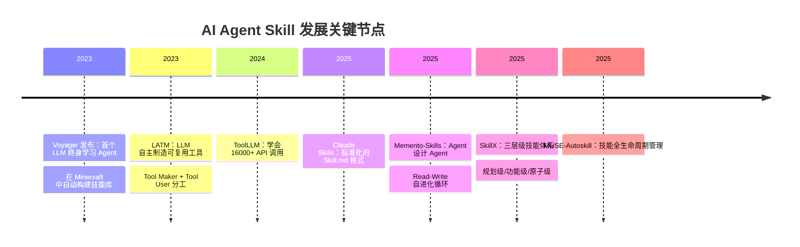
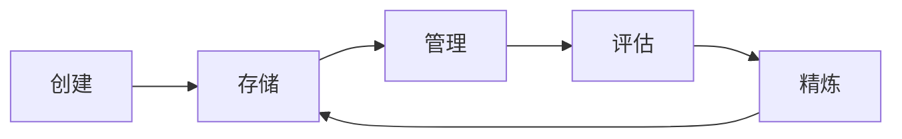

# AI Agent "Skill" 是什么？——给小白的完整科普

> 如果你听说过 AI Agent（智能体），你可能也会好奇：Agent 的 "skill"（技能）到底是什么？它和 ChatGPT 的 "插件" 有什么区别？为什么那么多 AI 论文都在研究 "skill"？
>
> 这份笔记从学术论文和实际框架出发，用最白的话把 Agent Skill 这件事讲清楚。**所有核心观点都有论文或权威资料做支撑**。

---

## 一、什么是 Skill？

### 1.1 核心定义

在 AI Agent 的语境下，**Skill（技能）是一个可复用的、封装好的能力单元，告诉 Agent 怎么做好一件特定的事。**

它可能是一段文字说明，也可能是一段可执行的代码，或者两者的组合。关键是：
- **可复用**——做了一次之后，下次不用从头摸索
- **封装好了**——Agent 只需要知道"用这个 skill 就行"，不需要知道它的内部细节
- **能力单元**——一件事一个 skill，不混杂

> **定义来源**：SkillX 论文（2025）将 skill 定义为 "reusable competencies that directly support task execution"（直接支持任务执行的可复用能力）。[arxiv:2604.04804]

### 1.2 Skill 在 AI 发展中的位置

要理解 skill，需要先理解 Agent 能力的两条进化路线：

```
路线一：改模型本身
  Prompt工程 → Fine-tuning → RLHF → 全参数训练
  （越往后成本越高，越不灵活）

路线二：给模型"外挂"
  Few-shot 示例 → Tool/Plugin → Skill 库 → 自进化的 Skill 系统
  （越往后越自动化，但不需要改模型参数）
```

**Skill 走的是路线二。** 它不修改 AI 模型的权重，而是在模型外面加一个"可读写的能力仓库"。

> Memento-Skills 论文（2025）明确指出："all adaptation is realised through the evolution of externalised skills and prompts"（所有自适应都通过外部化技能和提示的演化实现，而不需要更新 LLM 参数）。[arxiv:2603.18743]

### 1.3 Skill 的三种形态（从简单到复杂）

| 形态 | 是什么 | 例子 | 代表论文/工作 |
|------|--------|------|-------------|
| **描述型** | 文字说明，告诉Agent怎么做 | "搜索 arXiv的步骤：1.构造URL 2.调用API 3.解析结果" | 最早的 Agent 系统 |
| **代码型** | 可执行的函数/程序 | 一个 Python 函数 `search_arxiv(query)` | LATM (2023) [arxiv:2305.17126]、Voyager (2023) [arxiv:2305.16291] |
| **复合型** | 代码+说明+配置+依赖声明 | Skill 文件夹，含 SKILL.md、脚本、参考文档 | Claude Skills (Anthropic, 2025)、Memento-Skills (2025) [arxiv:2603.18743]、Hermes Agent Skills |

### 1.4 Skill 不是……

| 容易混淆的概念 | 区别 |
|--------------|------|
| **Tool（工具）** | Tool 是 Agent 可调用的外部函数（如计算器、搜索 API）。**Skill 可能用到多个 Tool，但 Skill 本身是一个更高层的工作流**。CRAFT 论文（2023）区分了"tool"和"tool creation"——后者就是一种 skill。[arxiv:2309.17428] |
| **Plugin（插件）** | Plugin 通常是深度集成的代码模块，需要注册到系统中。Skill 只是一份文档或脚本，不需要改系统代码。 |
| **Prompt（提示词）** | Prompt 是一次性的指令。Skill 是持久化的、可复用的、可更新的知识。Memp 论文（2025）将 Skill 定位为"procedural memory"（程序性记忆），与一次性提示有本质区别。[arxiv:2508.06433] |
| **Memory（记忆/事实）** | Memory 存的是"某件事是什么"。Skill 存的是"某件事怎么做"。 |

---

## 二、"Skill" 这个想法从哪来？

### 2.1 人类学习的启发

人类掌握技能的过程给了研究者很大启发：

1. **新手期**：需要看着说明书一步步做，费劲但能完成
2. **练习期**：反复做同一件事，越来越熟练
3. **自动化期**：技能变成肌肉记忆，不需要思考就能完成

> Memento-Skills 论文引用生物运动学习的研究："early in skill acquisition, performance depends on deliberate, high-level planning; with repeated practice, neural pathways consolidate and execution becomes increasingly automatic"（技能习得早期，表现依赖有意识的高层规划；随着反复练习，神经通路固化，执行变得自动化）。[arxiv:2603.18743]

**AI Agent 的 Skill 系统想复现这个过程**：Agent 第一次做某件事时很费劲，但它可以把过程存下来，下次直接复用，不断优化。

### 2.2 关键里程碑



---

## 三、怎么设计 Skill？——学术界共识的规范

### 3.1 三层级结构（学术界主流观点）

多个独立研究团队得出了相似的结论：有效的技能系统应该分层组织。

**SkillX 论文（2025）提出的三层模型** [arxiv:2604.04804]：

```
技能库 D = 规划技能 ⊕ 功能技能 ⊕ 原子技能

├── 规划技能（Planning Skills）
│   高层任务组织——先做什么、再做什么、分支怎么走
│   例如："部署 Python 应用到 Fly.io 的完整流程"
│
├── 功能技能（Functional Skills）
│   可复用的子任务——完成一个具体子目标
│   例如："构建 Docker 镜像"、"运行测试"、"推送代码"
│
└── 原子技能（Atomic Skills）
│   单个工具的操作说明——怎么正确使用一个 API
│   例如："`docker build -t <tag> .` 的用法和注意参数"
```

**为什么这样分？**

SkillX 的解释是：三层设计让技能"concise, composable, and robust to distributional shifts"（简洁、可组合、对分布变化鲁棒）。规划级解决"怎么做"的策略，功能级解决"做什么"的子任务，原子级解决"怎么调 API"的技术细节。

> Memp 论文（2025）也发现了类似结论：把完整轨迹抽象为高层脚本（类似规划技能）结合具体轨迹（类似原子技能），即"Proceduralization"策略，在两个基准上都是效果最好的。[arxiv:2508.06433]

### 3.2 Skill 应该长什么样？

从多个实际系统来看，一个完整的 Skill 通常包含以下要素：

```yaml
# 通用的 Skill 结构（综合多个论文和框架）
名称: my-skill
描述: 简短说明什么时候用
适用的平台/环境: [macos, linux]
依赖的工具: [docker, python3]

# 内容部分
步骤:
  1. 检查前置条件
  2. 执行主要操作
  3. 验证结果

坑点:
  - 常见错误及修复方法

验证:
  - 怎么确认操作成功
```

不同的框架对格式有不同的实现（Claude 用 SKILL.md，Voyager 用 Python 函数，Memento-Skills 用结构化 Markdown 文件夹），但**核心结构高度一致**。

### 3.3 Skill 的粒度原则

> 来自经验法则（多个论文共识）：

- **一个 Skill 只做一件具体的事**
  - ✅ "部署 Python 应用到 Fly.io"——够具体
  - ❌ "DevOps 全流程"——太宽泛，不好复用

- **Skill 应该是"教学式的"**
  - 让不同能力的 Agent 照着做都能完成
  - SkillX 验证了：强 Agent 构建的 Skill 迁移给弱 Agent 能带来约 10% 的性能提升

- **Skill 之间应该可组合**
  - 好比乐高积木，一个技能的输出可以作为另一个技能的输入
  - Voyager 论文明确强调其技能是"compositional"（可组合的）

---

## 四、怎么用 Skill？什么场景下用？

### 4.1 四种典型用法（从学术界到工业界）

**方式一：检索→加载→执行（最主流）**

```
新任务 → 检索匹配的 Skill → 加载 Skill 内容 → 按 Skill 执行
```

这是目前最主流的方式。核心机制：
1. **检索**：用语义相似度从技能库中找到最相关的 Skill
2. **加载**：把 Skill 内容注入到 Agent 的上下文
3. **执行**：Agent 按照 Skill 的指引执行

> **来源**：Memento-Skills 论文中，这是在 MDP（马尔可夫决策过程）框架下的标准做法。检索由"behaviour-aligned contrastive router"（行为对齐的对比检索器）完成，相比纯语义检索成功率更高。[arxiv:2603.18743]

**方式二：工具制造→工具使用（两阶段分工）**

```
大模型（强但贵）→ 创建 Skill（一次性的高成本）
小模型（弱但便宜）→ 每次用 Skill 执行任务（多次的低成本）
```

> **来源**：LATM 论文（2023）提出 Tool Maker 和 Tool User 分工。实验显示：GPT-4 作为 Tool Maker + GPT-3.5 作为 Tool User，效果与纯 GPT-4 相当，但成本大幅降低。[arxiv:2305.17126]

**方式三：终身学习循环（Read-Write）**

```
读 Skill → 执行 → 获得反馈 → 优化 Skill 写回 → 下次更好
```

> **来源**：Memento-Skills 的核心创新——Agent 不仅用 Skill，还自己优化 Skill。在 GAIA 基准上从 65.1% 提升到 91.6%，在 HLE 上从 30.8% 提升到 54.5%。[arxiv:2603.18743]

**方式四：自探索→提取新 Skill（技能发现）**

```
在新环境中探索 → 成功后提取为 Skill → 加入库 → 下次复用
```

> **来源**：Voyager（2023）在 Minecraft 中自动探索世界，完成任务后把成功路径提取为 Skill 存入不断增长的技能库。最终获得 3.3 倍的独特物品、2.3 倍的探索距离、15.3 倍的技术树解锁速度提升。[arxiv:2305.16291]

### 4.2 适合用 Skill 的场景

| 场景 | 为什么适合 | 论文/数据支撑 |
|------|-----------|-------------|
| **有固定步骤的工作流** | 步骤稳定，可以精确描述 | 所有 Skill 系统的基础用例 |
| **反复出现的同类任务** | 一次创建，多次复用，成本分摊 | LATM：一次 tool making 成本被多次 tool using 分摊 [arxiv:2305.17126] |
| **需要特定领域知识** | 把领域知识编码进 Skill | SkillX：技能库迁移给弱 Agent 带来 ~10% 提升 [arxiv:2604.04804] |
| **复杂的多步操作** | 单步不难，但步骤一多就容易出错 | Memp：Procedural Memory 减少无效探索，成功率提升 30-40% [arxiv:2508.06433] |
| **团队规范/标准化流程** | 确保每次按统一规范执行 | 工业界常见场景 |
| **工具/API 的新功能** | 无需改 Agent 代码，加个 Skill 就行 | CRAFT：为特定任务创建专用工具集 [arxiv:2309.17428] |

### 4.3 不适合用 Skill 的场景

- **一句话就能解决的事**——写了 Skill 反而增加负担
- **高度动态、每次都不一样的任务**——Skill 的"模板"反而限制了灵活性
- **需要深度系统集成**——应该写 Tool 而不是 Skill

---

## 五、Skill 系统怎么进化？——关键机制

### 5.1 自进化循环（Self-Evolving Loop）

Memento-Skills 提出的 Read-Write 循环是目前最完整的自进化框架：

```
步骤 1: 观察（Observe）→ 接收到新任务
步骤 2: 读取（Read）→ 从技能库检索最相关的 Skill
步骤 3: 执行（Act）→ 按 Skill 执行任务
步骤 4: 反馈（Feedback）→ 判断执行是否成功
步骤 5: 写入（Write）→ 根据反馈更新 Skill
        ├── 成功 → 提高该 Skill 的效用评分
        └── 失败 → 
            ├── 轻微失败 → 原地修补 Skill
            └── 严重失败 → 创建新 Skill 替换
```

> **关键洞察**：这个循环不修改 LLM 权重，所有进化发生在 Skill 层面。论文证明这等价于策略迭代（policy iteration），有收敛保证。[arxiv:2603.18743]

### 5.2 技能库的维护机制

MUSE-Autoskill 论文（2025）提出了技能的全生命周期管理 [arxiv:2605.27366]：



- **创建**：从成功经验提取新技能
- **存储**：存入技能库，做好分类和索引
- **管理**：定期检查技能有没有过时
- **评估**：统计每个技能的成功率
- **精炼**：根据失败反馈优化技能内容

### 5.3 两条进化路线对比

| | Fine-tuning（传统） | Skill 系统（新范式） |
|--|-------------------|-------------------|
| **改什么** | 模型权重（参数） | 外部文档/代码 |
| **成本** | 高（需要 GPU 训练） | 低（只需要推理+文件读写） |
| **速度** | 慢（几小时到几天） | 快（几秒钟到几分钟） |
| **灵活性** | 低（改了就不能随便撤回） | 高（随时可以修改/删除） |
| **可迁移性** | 差（绑定单一模型） | 好（SkillX 验证了跨模型迁移） |
| **灾难性遗忘** | 有（学新任务忘旧任务） | 无（Skill 独立存储） |

> Voyager 论文关键发现：由于技能是独立存储的"可组合、可解释"单元，Agent 可以快速积累能力而不发生灾难性遗忘（catastrophic forgetting）。[arxiv:2305.16291]

---

## 六、Skill ≠ Memory —— 重要的区分

| 维度 | Skill（技能） | Memory / 记忆 |
|------|-------------|-------------|
| **存什么** | **怎么做**一件事 | **某件事是什么** |
| **类比** | 操作手册 | 便利贴 |
| **什么时候用** | 需要执行特定任务时按需加载 | 每轮对话自动注入 |
| **大小** | 可以很大（几百行） | 应该很紧凑 |
| **成本** | 不用的时候零成本 | 持续有小成本 |
| **示例** | "部署 K8s 的步骤" | "用户喜欢暗色模式" |
| **来源** | 你写、Agent 生成、社区安装 | Agent 根据对话自动总结 |

> **口诀**：你会放在参考文档里的 → 写成 Skill。你会贴在便利贴上的 → 存在 Memory。（出自 Hermes Agent 官方文档，这个指引被广泛引用）

---

## 七、Skill 系统的实际效果——论文数据一览

以下数据从论文中提取，展现了 Skill 系统带来的实际提升：

| 系统/论文 | 基准/任务 | 效果 |
|----------|----------|------|
| **Voyager** (2023) | Minecraft | 获得 3.3x 独特物品，15.3x 更快解锁科技树 |
| **LATM** (2023) | Big-Bench 推理任务 | GPT-3.5 + Tool = GPT-4 水平的性能，成本大幅降低 |
| **Memento-Skills** (2025) | GAIA | 自进化后从 65.1% → 91.6%（+26.5%） |
| **Memento-Skills** (2025) | HLE | 自进化后从 30.8% → 54.5%（+23.7%） |
| **SkillX** (2025) | AppWorld, BFCL-v3, τ²-Bench | 弱 Agent（Qwen3-32B）插入 Skill 库后 +~10% |
| **Memp** (2025) | ALFWorld | 加入 Procedural Memory 后测试集提升至 77.86% |
| **ToolLLM** (2024) | 16000+ API 调用 | 使开源 LLM 具备媲美 ChatGPT 的工具使用能力 |

---

## 八、给小白的一句话总结

> **AI Agent 的 Skill，就是让 AI 学会"把做成功过的事记下来，下次照着做"。**
>
> 好比学做饭：第一次照着菜谱做（Prompt/指导），成功了就把菜谱写进自己的笔记本（创建 Skill），下次想吃同样的菜直接翻笔记本（复用 Skill），做得不好吃了就改改笔记（优化 Skill）。
>
> **和传统方法的本质区别：**
> - 传统方法：为了学会新菜，你得把厨师的大脑重新训练一遍（Fine-tuning）
> - Skill 方法：不用动大脑，往他的笔记本里加一页就行（Skill 系统）
>
> **这也是为什么 Skill 成为 2024-2025 年 AI Agent 领域最热的主题之一**——它提供了比 Fine-tuning 更灵活、更便宜、更可持续的能力扩展方式。

---

## 参考文献

| # | 论文 | 链接 | 核心贡献 |
|---|------|------|---------|
| 1 | **Voyager** (Wang et al., 2023) | [arxiv:2305.16291](https://arxiv.org/abs/2305.16291) | 首个终身学习 Agent + 可增长技能库 |
| 2 | **LATM** (Cai et al., 2023) | [arxiv:2305.17126](https://arxiv.org/abs/2305.17126) | Tool Maker + Tool User 分工框架 |
| 3 | **ToolLLM** (Qin et al., 2024) | [arxiv:2307.16789](https://arxiv.org/abs/2307.16789) | 大模型掌握 16000+ API 调用 |
| 4 | **CRAFT** (Lu et al., 2023) | [arxiv:2309.17428](https://arxiv.org/abs/2309.17428) | 为 LLM 创建和检索专用工具集 |
| 5 | **Memo** (Fang et al., 2025) | [arxiv:2508.06433](https://arxiv.org/abs/2508.06433) | 程序性记忆：步骤化+脚本化抽象 |
| 6 | **Memento-Skills** (2025) | [arxiv:2603.18743](https://arxiv.org/abs/2603.18743) | Agent 设计 Agent：Read-Write 自进化循环 |
| 7 | **SkillX** (Wang et al., 2025) | [arxiv:2604.04804](https://arxiv.org/abs/2604.04804) | 自动构建三层级技能知识库 |
| 8 | **MUSE-Autoskill** (2025) | [arxiv:2605.27366](https://arxiv.org/abs/2605.27366) | 技能全生命周期：创建→管理→评估→精炼 |
| 9 | Claude Skills (Anthropic, 2025) | [docs.anthropic.com](https://docs.anthropic.com/en/docs/agents-and-tools/claude-skills) | 标准化 SKILL.md 格式 |
| 10 | Hermes Agent Skills 文档 | [hermes-agent.nousresearch.com](https://hermes-agent.nousresearch.com/docs/user-guide/features/skills) | 开源 Agent 的 Skill 系统实现参考 |
