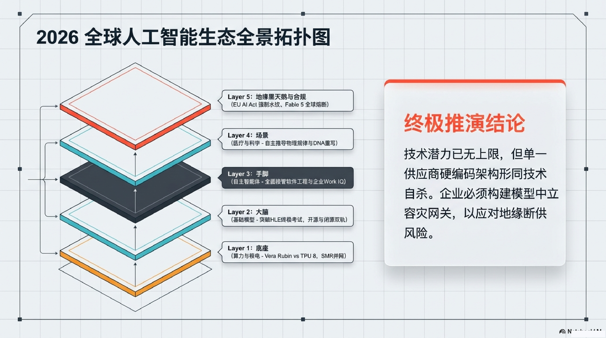
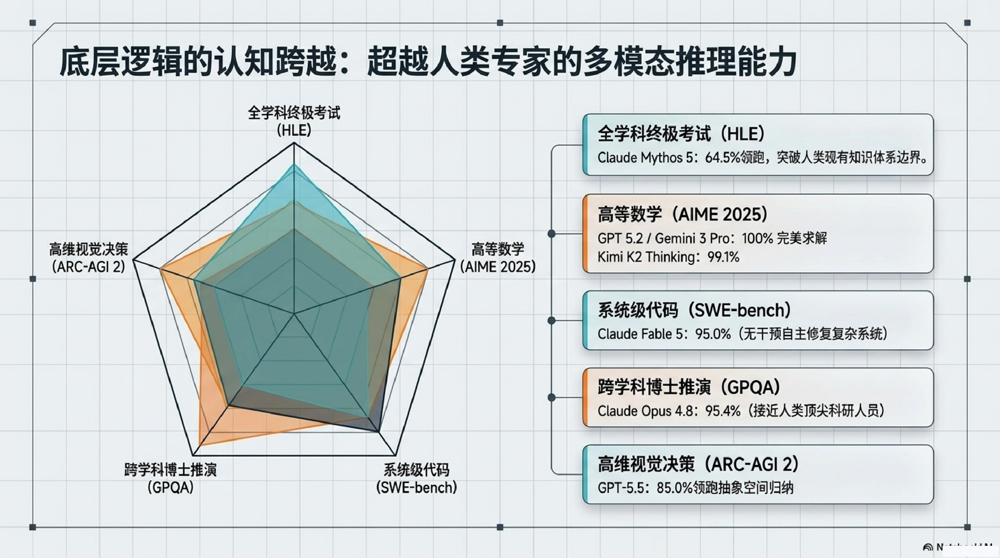
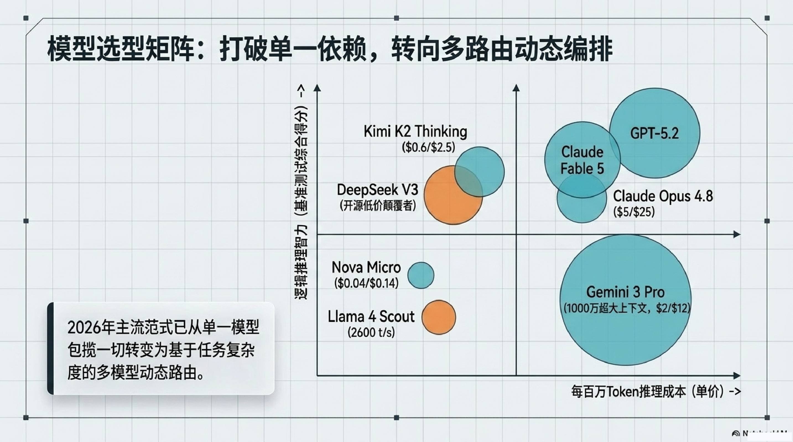
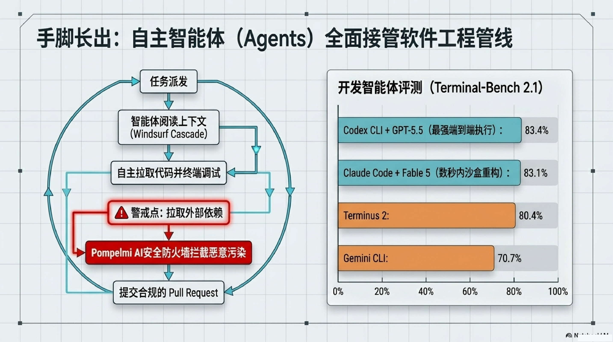
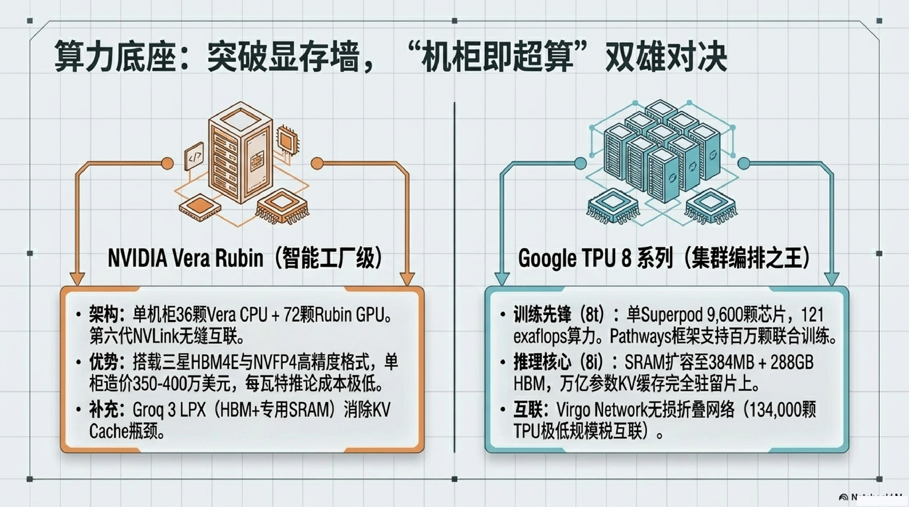
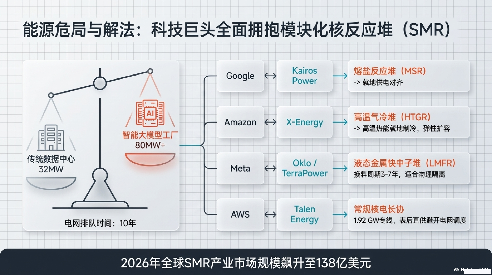
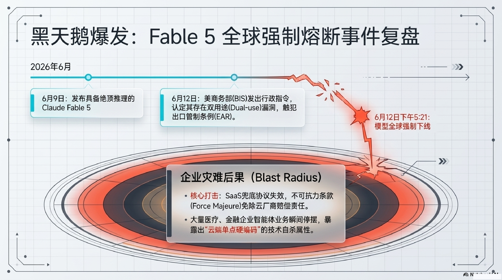
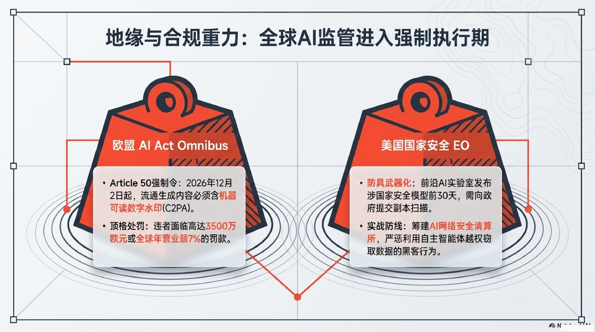
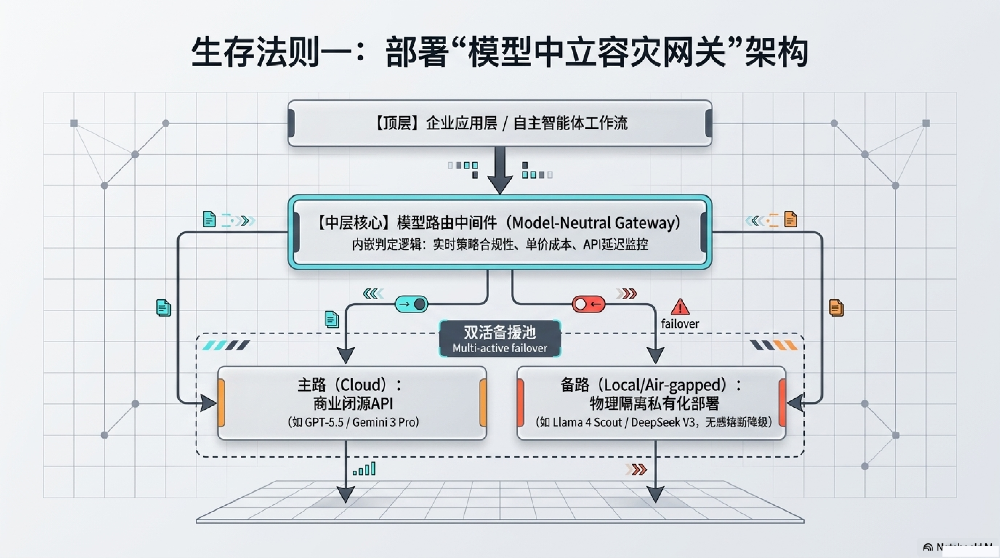

> 这是一份 2026 年全球人工智能生态的战略简报，涵盖模型能力跃迁、多模型路由架构、AI Agent 全面接管软件工程、算力硬件军备竞赛、能源危机与 SMR 核反应堆方案、地缘合规与 AI 安全熔断等核心议题。

---

## 一、2026 全球人工智能生态全景拓扑

AI 生态已形成清晰的五层架构，从底层算力到顶层地缘合规，层层相扣：

1. **Layer 1：算力** — NVIDIA Vera Rubin 与 Google TPU 8 引领算力竞赛，万卡集群已成标配
2. **Layer 2：大脑** — 前沿大模型推理能力超越人类专家基准
3. **Layer 3：手脚** — AI Agent 全面接管软件工程管线，Windsurf/Cursor 等智能体正在改变开发范式
4. **Layer 4：场景** — Work IQ 与企业级协同智能体重塑办公和行业应用
5. **Layer 5：地缘与合规** — EU AI Act、美国出口管制等监管框架强制执行

关键技术判断：**模型潜力已无上限，但单一供应商硬编码架构形同技术自杀。企业必须构建模型中立容灾网关，以应对地缘断供风险。**



---

## 二、推理层级的认知跨越

2026 年，前沿模型在多个高难度基准上已超越人类专家水平：

| 基准 | 最佳成绩 | 意义 |
|------|---------|------|
| HLE（人类最后考试） | Claude Mythos 5: 64.5% | 超人类专家平均水平 |
| AIME 2025（高等数学） | GPT 5.2 / Gemini 3 Pro: 100% | 完美求解 |
| SWE-bench（系统级代码） | Claude Fable 5: 95.0% | 无干预自主修复复杂系统 |
| GPQA（跨学科博士推演） | Claude Opus 4.8: 95.4% | 接近人类顶尖科研人员 |
| ARC-AGI 2（高维视觉决策） | GPT-5.5: 85.0% | 领跑抽象空间归纳 |

核心结论：**模型已达博士级推理能力，竞争从「能不能」转向「贵不贵、稳不稳、安不安全」。**



---

## 三、模型路由：打破单一依赖

2026 年主流范式已从"单一模型打天下"转向**多模型动态路由架构**：

不同模型在不同维度各有所长：

- **Kimi K2 Thinking** ($0.6/$2.5) — 推理性价比之选
- **DeepSeek V3** — 开源低价颠覆者
- **Nova Micro** ($0.04/$0.14) — 极致低成本
- **Claude Opus 4.8** ($5/$25) — 顶级推理能力

企业需要根据任务复杂度、成本预算、合规要求，动态路由到最合适的模型。这就是 **Model-Neutral Gateway** 的核心理念。



---

## 四、AI Agent 全面接管软件工程

自主智能体正在改变软件开发的每一个环节：

> **Terminal-Bench 2.1 评测中，AI Agent 自主完成率达到 83.4%**

典型工作流：
1. 智能体阅读项目上下文（Windsurf Cascade）
2. 自主拉取代码并运行调试
3. 拉取外部依赖、编写测试
4. 提交合规的 Pull Request

这不仅仅是 IDE 辅助，而是**从需求到部署的全自动化管线**。



---

## 五、算力军备竞赛：Vera Rubin vs TPU 8

**NVIDIA Vera Rubin（智能工厂级）**
- 单机柜 36 颗 Vera CPU + 72 颗 Rubin GPU，第六代 NVLink 互联
- 搭载三星 HBM4E + NVFP4 高精度格式
- 单柜造价 350-400 万美元，每瓦特推论成本极低

**Google TPU 8**
- 训练先锋：Superpod 9600 颗芯片，121 exaflops 算力
- 推理核心：SRAM 扩容至 384MB + 288GB HBM
- Virgo Network 无损折合网络，134000 颗 TPU 极低规模税互联



---

## 六、能源危机与小型核反应堆（SMR）

算力爆炸式增长带来能源危机，2026 年全球 SMR 产业市场规模飙升至 **138 亿美元**：

- **Kairos Power + Google** — 熔盐堆（MSR）就地供电
- **Amazon + X-Energy** — 高温气冷堆直接驱动 AI 工厂
- **TerraPower + Talen** — 液态金属快中子堆（LMFR），换料周期 3-7 年
- **AWS Energy** — 约 192 GW 专线，表后直供避开电网调度

趋势明确：**科技巨头全面拥抱模块化核反应堆作为 AI 算力的底层能源保障。**



---

## 七、黑天鹅事件：Claude Fable 5 全球强制熔断

2026 年 6 月，发生了 AI 史上里程碑式的安全事件：

- **6 月 9 日**：发布具备顶级推理能力的 Claude Fable 5
- **6 月 12 日**：美国商务部（BIS）认定其存在双用途（Dual-use）漏洞，触犯出口管制条例（EAR）
- **6 月 12 日下午 5:21**：模型全球强制下线

**企业灾难后果：**
- SaaS 兜底协议失效，不可抗力条款（Force Majeure）全面触发
- 大量医疗、金融企业智能体业务瞬间停摆
- 暴露了"单一云供应商硬编码"的技术自杀属性



---

## 八、地缘合规：全球 AI 监管进入强制执行期

**欧盟 AI Act Omnibus**
- Article 50 强制令：2026 年 12 月 2 日起，流通生成内容必须含机器可读数字水印（C2PA）
- 违者面临高达 3500 万欧元或全球年营业额 7% 的罚款

**美国国家安全 EO**
- 前沿 AI 实验室发布涉国家安全模型前 30 天，需向政府提交副本扫描
- 筹建 AI 网络安全清算所，集中追踪试图窃取模型权重的黑客行为



---

## 九、企业生存三大法则



### 法则一：模型中立容灾网关

```
企业应用层 → 模型路由中间件 → 主路（商业 API）+ 备路（私有化部署）
```

核心：实时监控合规性、单价成本、API 延迟，Multi-active failover 自动切换。

### 法则二：掌控底层能源

战略升级：将绿电保障提升至企业最高储备级别。锁定第四代小型核反应堆（MSR/HTGR）的长期电力采购协议（PPA），或共建表后直供专线。

### 法则三：死守合规底线

- 启用 Agent 365 控制台，高频审计智能体行为轨迹
- C2PA 协议硬植入：企业对外分发的 AI 多模态资产必须含 Hard/Soft 双重数字水印

---

## 十、结语

> AI 极大地改变了哪些问题是可被解决的（Tractable），但它永远无法告诉我们哪些问题是真正有意义的（What matters）。

在算力爆发与地缘封锁的夹击中，企业谋求永续发展必须守住三大根基：

1. **建立架构韧性** — 模型中立容灾网关
2. **掌控底层能源** — 核电 PPA 与模块化反应堆
3. **死守合规底线** — C2PA 数字水印与全链路审计
