> 云端 API 成本正在反弹，本地 NPU 算力日渐充裕，2026 年的算力架构决策已不再是「上云还是本地」的二元选择，而是构建 **智能路由与任务编排的混合架构**。本文深入分析 Token 级经济学、硬件准入门槛、内存供应链危机，以及端云协同的终极答案。

---

## 一、Token 经济学盈亏平衡图

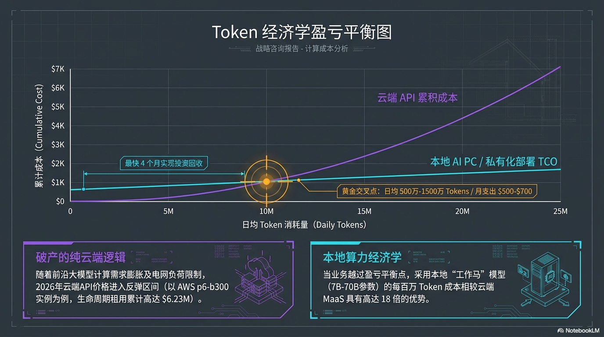

2026 年云端 API 价格进入反弹区间（以 AWS p6-b300 实例为例，生命周期租用累计高达 **$6.23M**），而本地 AI PC 的部署成本正在快速下探。

关键计算结论：

| 指标 | 数据 |
|------|------|
| **盈亏平衡点** | 日均 500 万 - 1500 万 Tokens |
| **月支出阈值** | $5,500 - $15,000 |
| **本地部署成本优势** | 高达 **18 倍**（7B-70B 参数"工作马"模型） |
| **投资回收期** | 约 **3 个月**（越过平衡点后） |

> 当业务 Token 消耗越过盈亏平衡点，采用本地部署的 Token 成本相较云端 MaaS 具备数量级优势。这不是「要不要本地化」的问题，而是「什么时候切换」的问题。

---

## 二、云端 vs 本地 vs 混合架构成本矩阵

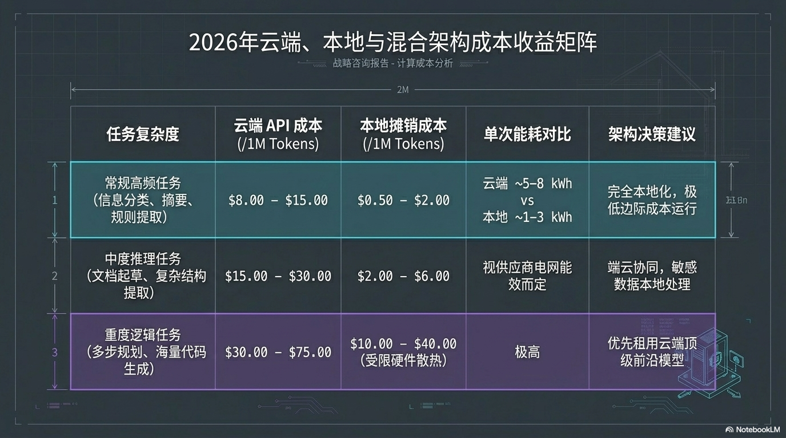

不同任务复杂度对应完全不同的最优架构：

| 任务复杂度 | 云端 API 成本（每千次） | 本地推理成本（每千次） | 架构决策建议 |
|-----------|----------------------|---------------------|------------|
| **常规高频任务**（信息分类、摘要、规则提取） | $8.00 - $15.00 | $0.50 - $2.00 | 完全本地化，极低边际成本运行 |
| **中度推理任务**（内容生成、代码补全、多轮对话） | $15.00 - $30.00 | $2.00 - $6.00 | 端云协同，敏感数据本地处理 |
| **高复杂度推理**（深度分析、长文推理、逻辑推演） | $30.00 - $75.00 | $10.00 - $40.00 | 视供应商与能耗而定，云端备路 |

云端方案还需额外承担网络传输能耗（5-8 kWh），而本地方案仅需 1-3 kWh。**能效差距正在成为架构决策的底层约束。**

---

## 三、AI PC 硬件规格准入标准

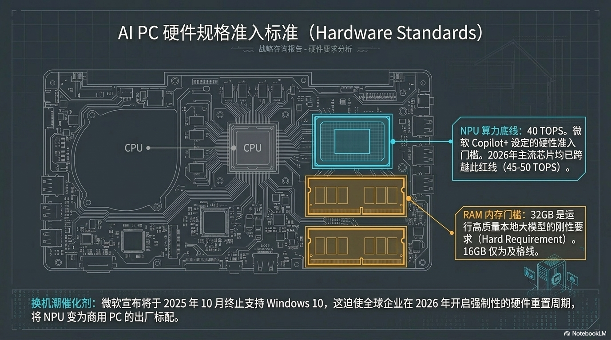

2026 年 AI PC 硬件已形成清晰的准入门槛：

### NPU 算力底线：40 TOPS
微软 Copilot+ 设定的硬性准入门槛，2026 年主流芯片均已跨越此红线（45-50 TOPS）。

### RAM 内存门槛：32GB 是硬性要求
运行高质量本地大模型需要 32GB 起，16GB 仅为及格线，在实际负载中捉襟见肘。

### 换机潮催化剂
微软宣布将于 **2025 年 10 月终止支持 Windows 10**，这迫使全球企业在 2026 年开启强制性的硬件重置周期，将 NPU 变为商用 PC 的出厂标配。

> 这不是可选的升级周期，而是由操作系统 EOL 驱动的强制性架构换代。

---

## 四、NPU vs GPU：硬件特性对比

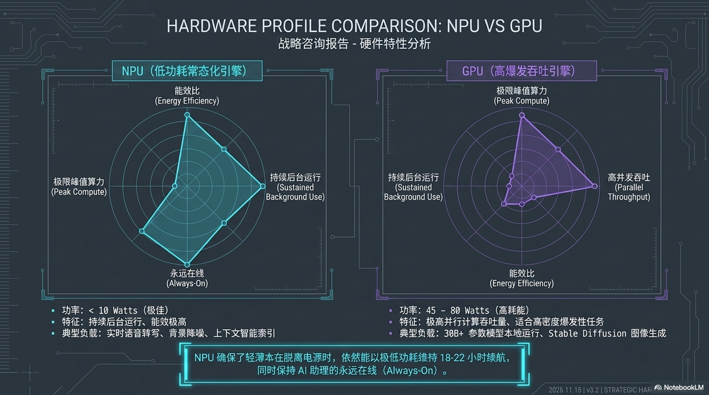

两种计算单元在 AI PC 中扮演截然不同的角色：

| 特性 | NPU（低功耗常态化引擎） | GPU（爆发性并行引擎） |
|------|----------------------|-------------------|
| **功率** | < 10 Watts（极低） | 45 - 80 Watts（高耗能） |
| **核心优势** | 能效比、持续后台运行、Always-On | 极限峰值算力、高并发吞吐 |
| **典型负载** | 语音助手、实时转录、后台推理、静态手势识别 | 30B+ 大模型推理、Stable Diffusion 图像生成 |
| **续航影响** | 以极低功耗维持 18-22 小时续航 | 高负载下显著缩短续航 |

**设计哲学的根本分野**：NPU 追求的是"在你意识到之前已完成推理"，GPU 追求的是"一次完成极高难度的计算"。两者并非替代关系，而是构成完整的端侧算力分层。

---

## 五、端侧模型优化三大路径

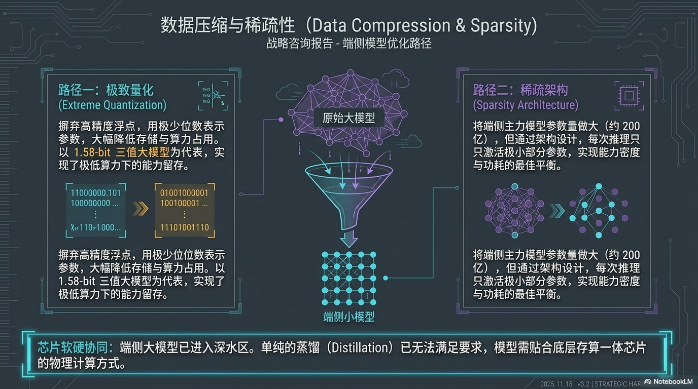

要在有限硬件资源上运行高质量模型，2026 年的优化方向已高度收敛：

### 路径一：极致量化（Extreme Quantization）
抛弃高精度浮点，用极少位数表示参数。**1.58-bit 三值大模型** 为代表，实现了极低算力下的能力留存。

### 路径二：稀疏架构（Sparsity Architecture）
将端侧主力模型参数量做大（4B - 200 亿参数），但通过架构设计，每次推理只激活极小部分参数，实现能力密度与功耗的最佳平衡。

### 路径三：数据压缩与稀疏化（Data Compression & Sparsity）
传统知识蒸馏已无法满足要求，模型需贴合底层**存算一体芯片**的物理计算方式。

> 核心判断：模型架构必须与硬件物理计算方式深度耦合，通用蒸馏的优化天花板已到。

---

## 六、算力虹吸效应：全球内存供应链危机

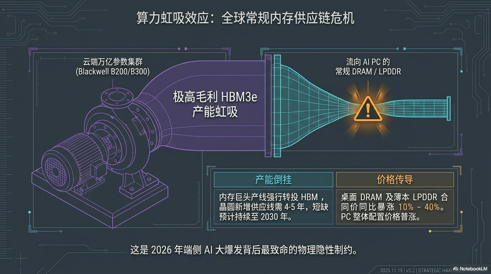

这是 2026 年端侧 AI 大爆发背后**最致命的物理隐性制约**：

### HBM3e 产能虹吸
云端万亿参数集群（Blackwell B200/B300）对 HBM3e 的极高毛利需求，驱动内存巨头将产线强行转投 HBM，晶圆新增供应线需 **4.5 年**，短缺预计持续至 **2030 年**。

### 价格传导链
- 产能倒挂 → 桌面 DRAM 与 LPDDR 供货紧缺
- 合同价同比暴涨 **10% - 40%**
- PC 整体配置价格普涨

> **后果**：AI PC 的 32GB 硬性内存需求与供应链涨价形成完美风暴。内存成本的上涨正在抵消 NPU 带来的单位算力成本下降。

---

## 七、硬件-模型适配矩阵：16GB 内存陷阱

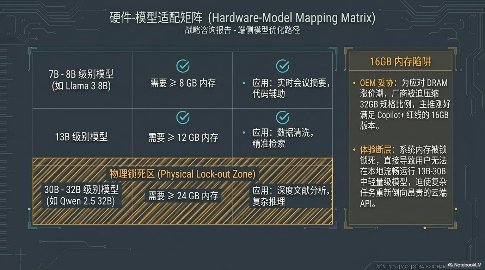

不同参数量级的模型对硬件有截然不同的需求：

| 模型规模 | 最低内存需求 | 典型应用 |
|---------|------------|---------|
| **7B - 8B 级别** | ~8 GB | 实时会议摘要、文档分类、简单问答 |
| **13B 级别** | ~12 GB | 内容生成、代码补全、多轮对话 |
| **30B - 32B 级别** | ~24 GB+ | 复杂推理、深度分析、长文理解 |

### 16GB 内存陷阱
16GB 配置恰好卡在尴尬区间——能运行 13B 模型，但无法流畅使用 30B+ 模型。当端侧模型能力不足以完成任务时，推理任务将**重新倒向昂贵的云端 API**，完全违背了部署 AI PC 的成本初衷。

> **OEM 的妥协策略**：为应对 DRAM 涨价，大量 16GB 配置涌入市场。采购决策时必须规避这一"伪够用"配置。

---

## 八、隐私感知智能路由：端云协同的关键答案

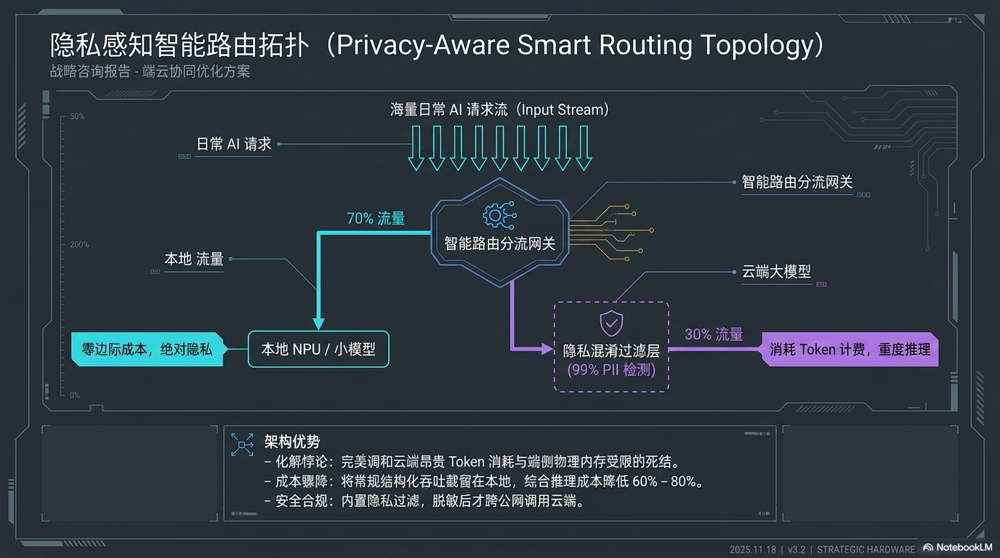

面对端侧内存受限 + 云端成本高昂的两难困境，**智能路由分流架构**成为 2026 年的制胜答案：

### 核心设计
海量 AI 请求流 → **智能路由分流网关** → 分流为两路：
- **本地流量（~70%）**：结构化的常规任务，走本地 NPU/小模型，零边际成本，99% PII 检测保障隐私
- **云端流量（~30%）**：复杂推理任务，经隐私过滤后走向云端 API

### SoC 架构优势
- **调和死结**：完美调和云端昂贵 Token 消耗与端侧物理内存受限的矛盾
- **成本降低**：将常规结构化吞吐留在本地，综合推理成本降低 **60% - 80%**
- **安全合规**：内置隐私过滤，脱敏后才经公网调用云端

> 这是 2026 年最有价值的架构创新——不是更强的芯片，而是更聪明的路由。

---

## 九、Apple Private Cloud Compute：无缝延伸架构

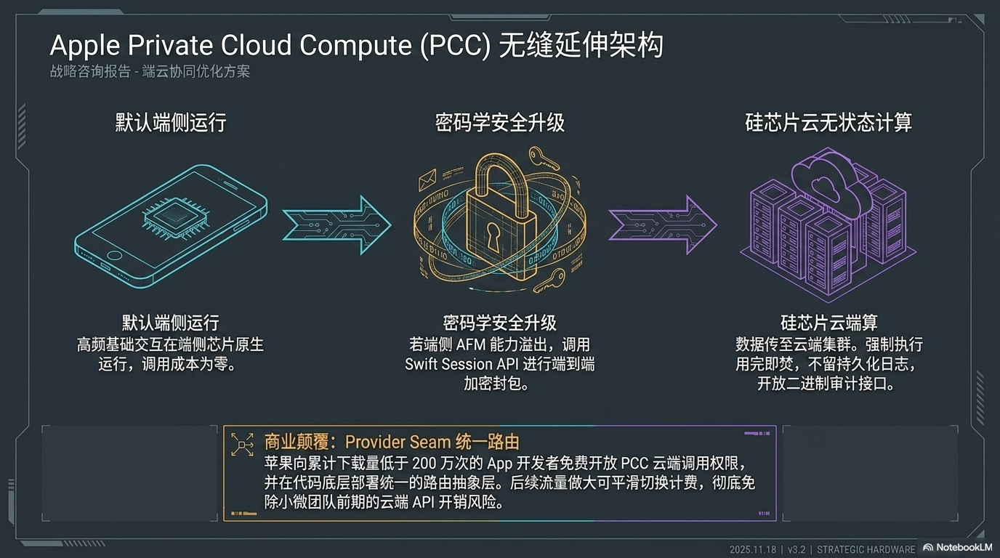

苹果的 PCC 架构为端云协同提供了参考级实现：

| 层级 | 设计 |
|------|------|
| **默认端侧** | 基础交互在端侧芯片原生运行，调用成本为零 |
| **加密升级** | 若端侧 AFM 能力溢出，调用 Swift Session API 进行端到端加密封包 |
| **云端无状态** | 数据传至云端集群，强制执行 FAH、FERALAS，开放二进制审计接口 |

### Provider Seam 统一路由
苹果向 App 开发者免费开放 PCC 云端调用权限，并在代码底层部署统一的**路由抽象层**。后续流量做大可平滑切换计费，彻底免除个人开发团队前期的云端 API 开销风险。

> 对非苹果生态的启示：统一路由抽象 + 免费起用 + 平滑升配 = 端云协同的产品化答案。

---

## 十、非苹果生态混合智能体实战

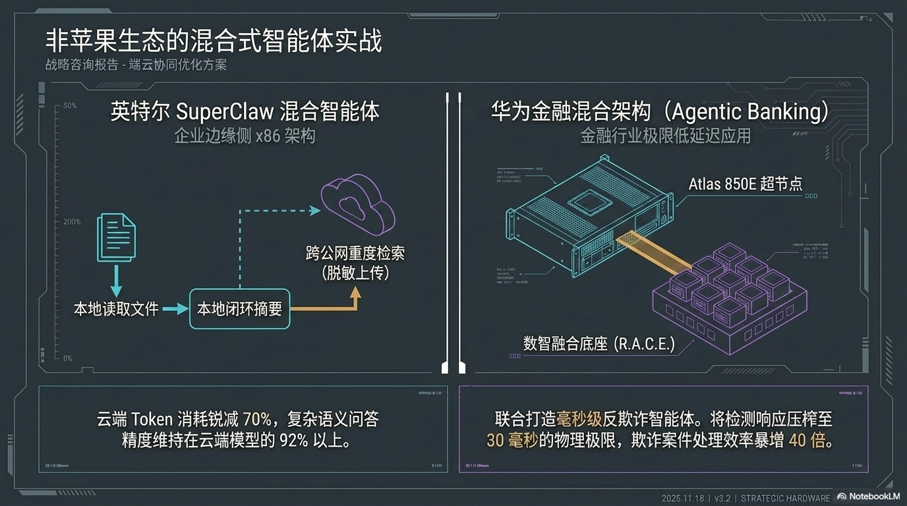

### 英特尔 SuperClaw 混合智能体
- 本地读取文件 + 跨公网重度检索 + Android/x86 架构兼容
- 云端 Token 消耗锐减 **70%**
- 复杂语义问答精度维持在云端模型的 **92%** 以上

### 华为金融混合架构（Agentic Banking）
- 联创打造**超级欺诈防御智能体**
- 检测响应压缩至 **30 毫秒** 物理极限
- 欺诈案件处理效率暴增 **40 倍**

> 验证了混合架构在极端延迟场景下的可行性与巨大价值。

---

## 十一、市场蓝图与终局结论

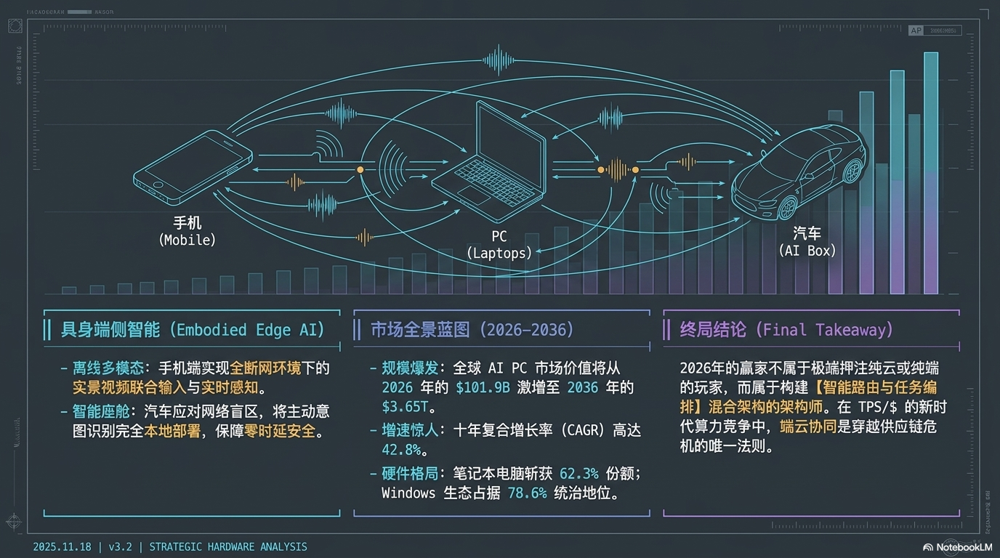

### 具身端侧智能（Embodied Edge AI）
- **离线多模态**：手机端实现全断网环境下的实景视频联合输入与实时感知
- **智能座舱**：汽车应对网络盲区，将主动意图识别完全本地部署，保障零时延安全

### 市场规模爆发（2026 - 2036）

| 指标 | 数据 |
|------|------|
| 2026 年 AI PC 市场价值 | $101.98 |
| 2036 年市场价值 | $3.65T |
| 十年复合增长率（CAGR） | **42.8%** |
| 笔记本份额占比 | 62.3% |
| Windows 生态占比 | 78.6% |

### 最终结论（Final Takeaway）

> **2026 年的赢家不属于极端押注纯云或纯端的玩家，而属于构建「智能路由与任务编排」混合架构的架构师。**
>
> 在 TPS/$（每美元每 Token）的新计算经济学时代，算力的价值不在于峰值 FLOPS，而在于**每一分钱是否被路由到了最合适的位置**。

---

## 关键决策清单

- [ ] **评估 Token 消耗量**：日均是否超过 500 万？考虑本地部署回收成本
- [ ] **避免 16GB 陷阱**：AI PC 最低配置 32GB 内存
- [ ] **构建智能路由**：70% 常规任务本地承载，仅 30% 复杂任务走云端
- [ ] **关注内存供应链**：DRAM 涨价周期可能持续至 2030 年，提前锁定采购
- [ ] **优先 NPU 架构**：能效比远优于 GPU 承担常驻负载
