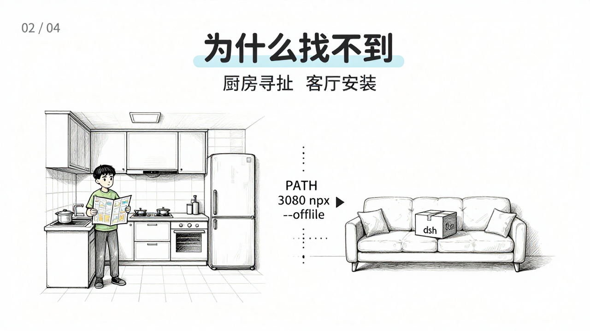
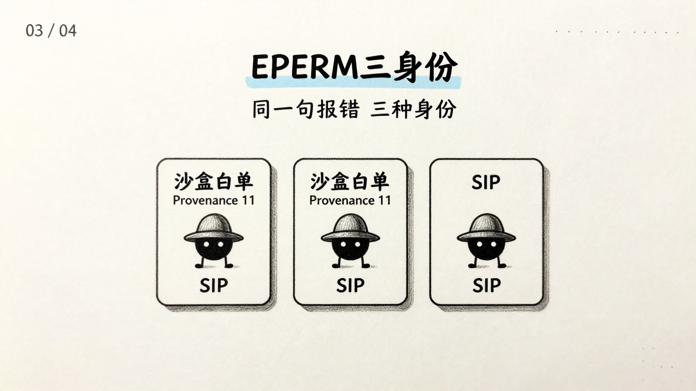
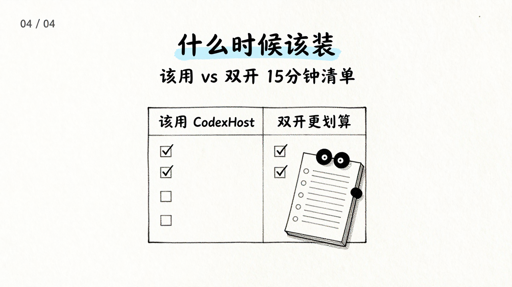

如果把 `Codex Desktop` 比作播放器，`Harness` 就是解码器。`Claude Code`、`Pi`、`DeepSeek` 是三台解码器，都能放同一首歌，但按键逻辑不同。`ACP` 的做法是统一遥控器——好按，但丢细节；`CodexHost` 是保真——保留每个按键，但每次播放器升级，遥控器都得重配。本文就是那份重配账单。

## 三个按键在哪：播放器的三层

**第一层在桌面。** `CodexHost` 不替你重做一个播放器，它用 `CDP` 直接给官方的 `Codex Desktop` 加一个“解码器选择器”。不改安装包，好处是体验原汁原味，代价是播放器每次升级，这个外挂的选择器都得重新对一次缝——`26.831.20005` 的 `sha256` 一变，探针就得跑一次。

**第二层在链路。** 中间有个 `Shim`，像一根透明转接线。`Codex` 自己的流量原样过，`Claude Code` 或 `DeepSeek` 的流量才被截住翻译。这样官方的 `Diff`、`审批`、`提问` 才能原样保留，而不是被猜出来的假按钮。

**第三层在解码器。** 每个 `Harness` 用自己的方言接入：`Pi` 走 `RPC`，`Claude Code` 走 `Agent SDK`，`DeepSeek` 走 `http://127.0.0.1:3080`。`CodexHost` 只做投影——把它们的“按键”翻译成播放器已有的 `Item / Turn / 问答`，让老界面直接可用。

三层分完，后文的两次卡住才有地方落：一次卡在桌面层的锁，一次卡在解码器层的寻址。


## 为什么装了却不显示：解码器在厨房，宿主在客厅

小白最困惑的不是“没装”，是“装了也找不到”。

装完 `DeepSeek` 后，`which dsh` 空，`lsof -i :3080` 空，`curl 3080` 无响应。宿主的寻址逻辑是这样写的（`host-client.ts:resolveDeepSeekCommand`）：

```ts
// 1. 若你写了 CODEXHOST_DEEPSEEK_HARNESS_COMMAND → 只按该值找
// 2. 否则在当前 PATH 找 dsh
// 3. 再回退 npx --offline --no-install @deepseek-ai/dsh（仅缓存命中才成，不联网）
```

而 `CodexHost` 的公共寻址（给 `Claude / Pi` 用的 `harness-discovery`）会补齐 `~/.npm / Homebrew / 多版本 Node` 的路径，**DeepSeek 没接入这套公共寻址**，仍用私有逻辑。结果就是：你把 `dsh` 装在了 `node 25.9` 的客厅，宿主拿着 `node 24` 的地图在厨房找。

更反直觉的是第 3 步的 `--offline`——它是**故意不联网**。避免在沙盒中偷偷拉包，代价是首次必须手动装过，有缓存才成。`ENOTCACHED` 不是 bug，是设计。

15 秒决策，三选一：

```bash
# A. 最稳：装到宿主用的 Node 24
/opt/homebrew/opt/node@24/bin/npm install -g @deepseek-ai/dsh

# B. 告诉宿主去哪找
launchctl setenv CODEXHOST_DEEPSEEK_HARNESS_COMMAND "/opt/homebrew/bin/dsh"

# C. 告诉宿主端口在哪
launchctl setenv CODEXHOST_DEEPSEEK_HARNESS_ENDPOINT "http://127.0.0.1:3080"
```

一句话记忆：`--offline 的回退，故意不联网，所以首次必手动。`

> [!NOTE]
> `pip install deepseek` 与 `npm i @deepseek-ai/dsh` 是两套体系，前者再全，宿主也不认。`which deepseek-harness` 的空，与 `which dsh` 的空是两回事。




## 补：那句 `Operation not permitted` 其实是三个身份

同一句 `EPERM`，在桩里出现三次，却是三种身份。修错层，命令对、结果错。

*   **`codexhost launch → EPERM`** — 沙盒白名单。`~/Library/Application Support/codexhost` 不在 `workspace-write`，沙盒内无权建锁。
*   **`rm launcher-v1.lock → EPERM`** — `com.apple.provenance 11`。macOS 15 对 `Application Support` 的新锁，`xattr -l` 可见。
*   **`xattr -d → EPERM`** — `SIP` 叠加（`csrutil status → enabled`），沙盒内无权剥离。

三行诊断：

```bash
ls -la@ ~/Library/Application\ Support/codexhost/launcher-v1.lock
xattr -l ~/Library/Application\ Support/codexhost/launcher-v1.lock
csrutil status
```

修一键（换原生 Terminal，非 Codex 内）：

```bash
rm -f ~/Library/Application\ Support/codexhost/launcher-v1.lock
xattr -dr com.apple.quarantine /Applications/codexhost.app
```

> 小白记忆：先问“是谁在报 EPERM”，再问“怎么修”。



## 什么时候该装，什么时候双开更划算

|  | 该用 CodexHost | 双开更划算 |
|---|---|---|
| **场景** | 重度依赖 `Diff / 审批 / 提问` 的原生语义，且 `Claude / Pi` 有长期分工 | 偶尔让 `Claude` 审一次 `slug.ts` 中文转拼音 |
| **成本** | 每次 `Codex Desktop` 升级，跟随 30 分钟探针 | 零跟随，多一个窗口 |
| **收益** | `让 claude-code 审查这次修改` 会新建可审计的 `Native Session` | 省一次 `Provenance` 清理 |

一句话决策：`需要保真 → 选 CodexHost；不需要 → 双开。`

### 15 分钟闭环清单（带走即用）

**前置**
- [ ] `node -v` 为 `24.x`（`brew reinstall node@24 && export PATH="/opt/homebrew/opt/node@24/bin:$PATH"`）
- [ ] `codex --version` / `claude --version` 正常

**安装（二选一）**
- [ ] `npm install -g @codexhost/cli`（原生 Terminal，非 Codex 内）
- [ ] 或 `gh release download v0.4.1 --pattern *-arm64.dmg → hdiutil verify → Finder 拖到 /Applications → xattr -dr com.apple.quarantine`

**拉起**
- [ ] `open /Applications/codexhost.app`，看输入框是否出现多 `Agent` 选择器

> [!TIP]
> 若在 `Codex` 内卡 `Operation not permitted`，换原生 Terminal 重试——那是身份问题，不是权限问题。



