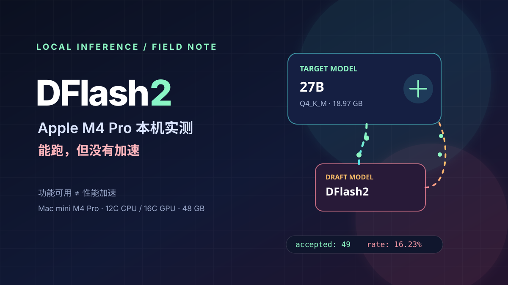
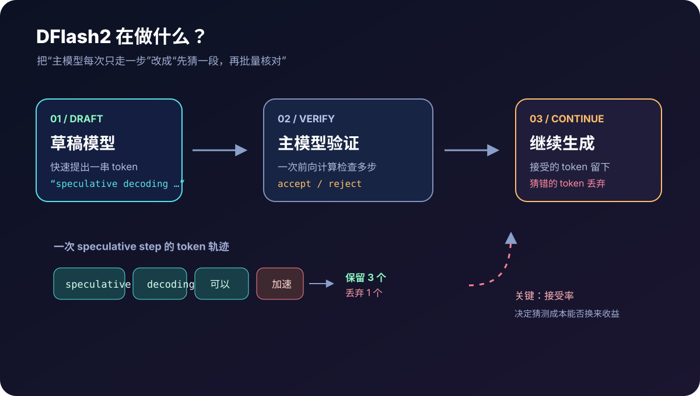
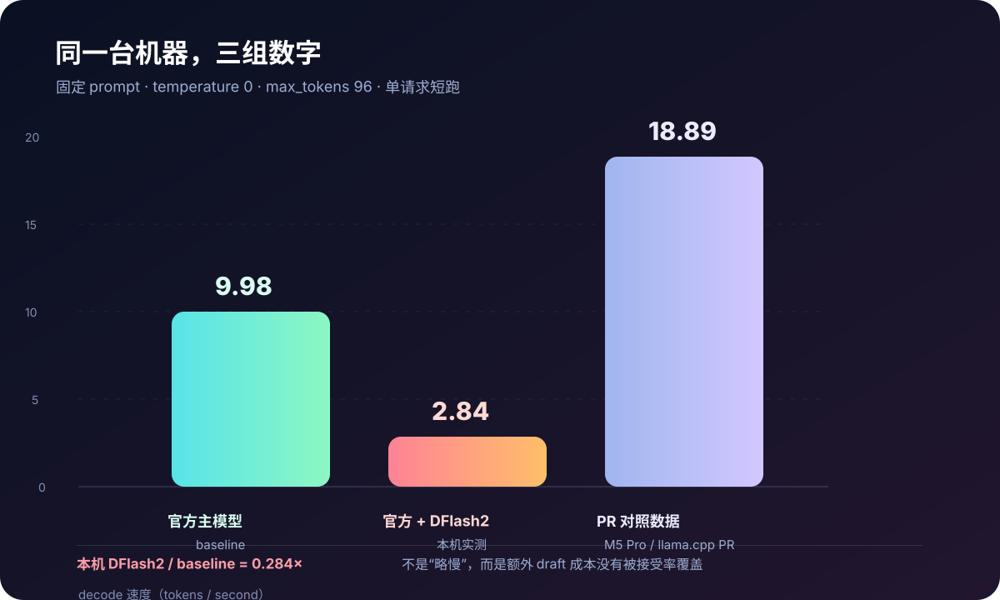
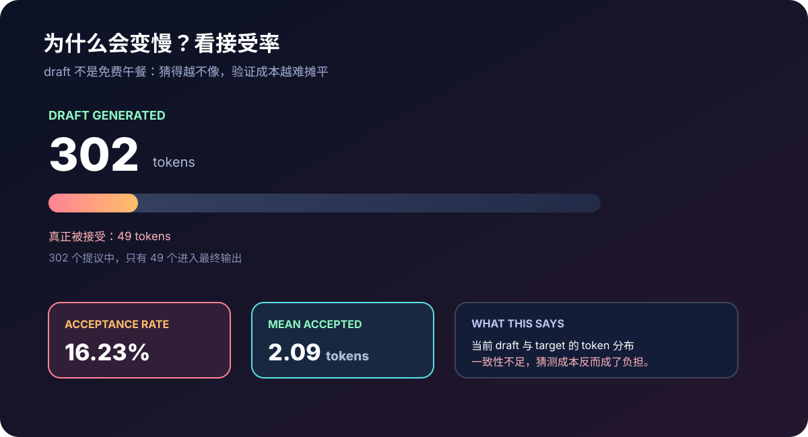
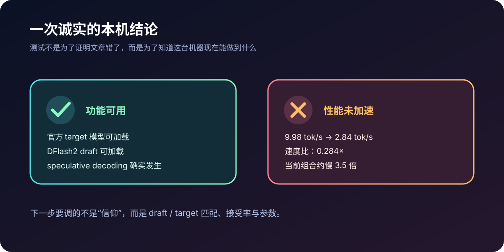

最近看到一篇关于 llama.cpp DFlash2 的文章：通过 draft model 先猜一段 token，再让主模型批量验证，Qwen3.8-27B 理论上可能获得 3～4 倍的解码加速。

这类消息最适合做一次本机复盘。于是我在 Mac mini M4 Pro 上下载官方模型，编译带 DFlash2 支持的 llama.cpp，并用同一个中文 prompt 做 baseline 和 speculative decoding 对照。

先把结论放在最前面：**本机可以使用 DFlash2，官方模型也能正常加载并发生 speculative decoding；但在这次固定条件的短跑测试里没有获得加速，反而从 9.98 tok/s 降到了 2.84 tok/s。**



## 一句话结论

| 检查项 | 结果 |
| --- | --- |
| Mac mini M4 Pro 是否能运行 DFlash2 | 是 |
| 官方 Qwen3.8-27B 是否能加载 | 是 |
| DFlash2 draft 是否能加载 | 是 |
| 是否发生 speculative decoding | 是 |
| 本次测试是否获得加速 | 否 |
| 是否复现文章中的 1.81 倍或 3～4 倍 | 否 |

这几个“是”和“否”并不矛盾。**功能链路已经打通，不代表当前模型、draft、llama.cpp 版本和参数组合就一定有性能收益。**

## DFlash2 到底在做什么

普通自回归解码通常是这样的：主模型生成一个 token，再把它放回上下文，继续生成下一个 token。每一步都要调用一次大模型的解码路径，27B 这种规模的模型，时间很容易花在重复的前向计算上。

Speculative decoding 把过程拆成两个角色：

1. **draft model** 先快速提出一小段 token；
2. **target model**（主模型）一次性验证这段猜测；
3. 猜对的 token 被接受，猜错的分支被丢弃，然后进入下一轮。



它能否加速，核心不只是 draft 有多快，而是 draft 提出的 token 有多少能被主模型接受。假设草稿模型猜得很准，一次验证就能留下多个 token，验证成本可以被摊薄；如果猜测大多不一致，草稿模型的计算就变成了额外负担。

因此，文章里的“3～4 倍”应该理解为特定模型、特定 draft、特定硬件和实现版本下的性能预期，而不是打开一个开关就自动得到的倍率。

## 测试环境

本机硬件与系统（`system_profiler` 实测）：

- Mac mini（Mac16,11）
- Apple M4 Pro，12 核（8 性能核 + 4 能效核）
- 48 GB 统一内存
- GPU：Apple M4 Pro，16 核，支持 Metal
- arm64
- macOS 26.5.2（系统固件 18000.121.3）

软件：

- llama.cpp 源码目录：`/tmp/llama-dflash2`
- 分支：`dflash2`
- commit：`5ecbe1ac17ec0484c5b44af0bd580cdc9c428ed4`
- 版本：`0.1.2-dev`
- 可执行文件：`llama-cli`、`llama-server`

模型：

| 角色 | 文件 | 大小 | SHA256 |
| --- | --- | ---: | --- |
| target | `Qwen3.8-27B-Q4_K_M.gguf` | 18,973,870,432 bytes | `31629f53165ab6a7dad8c9847dcfd1fdf55829dac1e6e748f4a68581b0033d34` |
| draft | `Qwen3.8-27B-DFlash2-Q4_K_M.gguf` | 1,143,006,752 bytes | `18a380efc9b7ed8d88677fc895f5c11ae170653434ee378f7348f715c14d0594` |

两个官方文件都通过了大小、SHA256 和 GGUF metadata 检查。target 的 tensor 数量为 851，`qwen35.block_count` 等关键 metadata 正常。

## 先检查：本地文件是否匹配

这一步很重要。DFlash2 不是“任意一个 27B 模型加任意一个 draft”都可以直接拼起来。主模型与 draft 的架构、层数、词表、张量形状和实现约定都可能影响兼容性与接受率。

官方 target 与官方 DFlash2 draft 是同一套发布组合，因此先用它们做正式测试。此前本地已有的 Uncensored 模型则只作为补充兼容性实验，不拿来替代官方对照。

本地 Uncensored 文件的 tensor 数量为 866，而官方 target 为 851，并且存在多个 tensor shape 差异。它可以被 server 启动并跑出结果，但这不足以证明它是适合该 draft 的严格匹配模型。

换句话说：**能加载是运行时兼容，匹配是性能实验的前提。**

## 正式对照：官方主模型 baseline

测试使用固定中文 prompt：

```text
用中文解释什么是 speculative decoding，并说明它为什么可能加速大语言模型。
```

固定条件：

- `temperature: 0`
- `max_tokens: 96`
- context：2048
- `-ngl all`
- 使用固定端口的本地 `llama-server`
- 通过 `127.0.0.1:8091` API 发起请求

先只加载官方 Qwen3.8-27B target：

| 指标 | baseline |
| --- | ---: |
| 生成速度 | **9.98 tok/s** |
| prompt 速度 | 48.76 tok/s |
| 总耗时 | 10.93 秒 |

这组数字是后面判断 DFlash2 是否有收益的基线。没有同 prompt、同参数、同 server 条件的 baseline，单独报告一个“DFlash2 速度”没有太大意义。

## 正式对照：官方模型 + DFlash2

然后使用同一个 target 和官方 DFlash2 draft。DFlash2 模式额外使用 `-ngld all`，让 draft 模型也尽可能放到 Metal 上运行。

| 指标 | 官方 target + DFlash2 |
| --- | ---: |
| 生成速度 | **2.84 tok/s** |
| prompt 速度 | 45.00 tok/s |
| 总耗时 | 34.98 秒 |
| draft generated | 302 tokens |
| draft accepted | 49 tokens |
| acceptance rate | **16.23%** |
| mean accepted length | 2.09 |



用生成速度直接计算：

```text
2.84 / 9.98 = 0.284×
```

也就是 DFlash2 版本只有 baseline 的 28.4%，当前组合大约慢了 3.5 倍。这不是文章所说的 1.81 倍，也不是更乐观的 3～4 倍加速。

## 接受率是这次结果的关键

这次测试里，draft 一共提出 302 个 token，主模型最终接受了 49 个，接受率为 16.23%，平均每轮接受长度为 2.09。



这个结果说明，在当前组合下，draft 提出的 token 与 target 的分布一致性不够高。每一轮 speculative decoding 都需要付出 draft 的计算成本，但真正能留下来的 token 很少，于是“先猜一段”的收益无法覆盖额外成本。

这里需要保持一点克制：低接受率是**这组测试条件**的现象，不足以单独证明 DFlash2 算法无效，也不能推出所有 Apple Silicon 都会变慢。它更准确的含义是：当前 M4 Pro、当前 llama.cpp commit、当前官方 target/draft 文件和当前参数组合，没有形成有效的加速闭环。

## 与文章数据对照

文章来自 X 上的 DFlash2 介绍，相关实现对应 llama.cpp 的 [DFlash2 PR #27342](https://github.com/ggml-org/llama.cpp/pull/27342)。PR 中较保守的一组对照是在 Apple M5 Pro 64GB、Q4_K_M 条件下：

| 来源 | decode 速度 |
| --- | ---: |
| PR / 文章中的普通解码 | 约 10.42 tok/s |
| PR / 文章中的 DFlash2 | 约 18.89 tok/s |
| PR / 文章中的倍率 | 约 1.81× |
| 本机普通解码 | 9.98 tok/s |
| 本机 DFlash2 | 2.84 tok/s |

这不是严格的同机复现：文章是 M5 Pro，本次是 M4 Pro；文章和本次测试的运行时细节也不可能完全相同。因此，表格的用途是展示差异，而不是声称两组结果可以直接做实验室级横向比较。

本次更有价值的结论是：即使官方 target 和官方 draft 都已经拿到本机运行，接受率仍然可能成为决定结果的瓶颈。

## 本地 Uncensored 模型：能跑，但不能当正式结论

我还用本地已有的模型做了一次补充实验：

```text
/Users/loong/models/Qwen3.8-27B-Uncensored/Qwen3.8-27B-Uncensored-Q4_K_M.gguf
```

同一套 server 测试得到：

| 组合 | 生成速度 | 接受率 |
| --- | ---: | ---: |
| 本地 Uncensored baseline | 10.30 tok/s | — |
| 本地 Uncensored + DFlash2 | 2.63 tok/s | 16.50% |

但这个模型与官方 target 的结构并不完全一致：本地文件有 866 个 tensors，官方 target 有 851 个，多个 tensor shape 也不同。因此，这组数字只能说明“在当前实现中可以启动并产生 speculative 统计”，不能说明该 Uncensored 模型与官方 DFlash2 draft 完成了理想匹配，更不能拿来证明 DFlash2 在所有 Qwen3.8 变体上都慢。

## 几个容易误判的细节

### `dflash requires ctx_other to be set` 不等于失败

在内存 fitting 阶段曾出现：

```text
dflash requires ctx_other to be set
```

这是 DFlash2 需要额外 context 配置时的 warning。后续通过 server 正确设置 target/draft 上下文后，功能可以继续运行，不能把这条 warning 当成整个实验失败。

### CLI 的随机端口探测不是正式结果

早期直接使用 CLI 做端到端测试时遇到内部随机端口探测问题。为了让 baseline 和 DFlash2 使用完全可控的服务生命周期，正式结果改为启动固定端口 `llama-server`，再通过本地 API 请求。

这样做的好处是：模型加载、端口、请求参数和日志都能分开确认，也更容易复跑。

### 短跑不等于完整 benchmark

本文结果来自一次固定 prompt、96 token、单请求、单轮测试。它适合回答“这套本机组合有没有明显加速”，不适合作为跨机器、跨 prompt、跨量化格式的完整性能排名。

如果要继续定位，需要至少增加：多组 prompt、不同输出长度、不同 draft 参数、warm-up、多轮重复，以及更严格的 target/draft 架构匹配检查。

## 可复现实验命令

下面是本次实验使用的关键启动方式。路径按本机测试目录保留，换机器时请替换为自己的 llama.cpp 和 GGUF 路径。

普通 baseline：

```bash
/tmp/llama-dflash2/build/bin/llama-server \
  -m /tmp/qwen-dflash2/Qwen3.8-27B-Q4_K_M.gguf \
  --host 127.0.0.1 --port 8091 \
  -c 2048 -ngl all
```

DFlash2：

```bash
/tmp/llama-dflash2/build/bin/llama-server \
  -m /tmp/qwen-dflash2/Qwen3.8-27B-Q4_K_M.gguf \
  --model-draft /tmp/qwen-dflash2/Qwen3.8-27B-DFlash2-Q4_K_M.gguf \
  --host 127.0.0.1 --port 8091 \
  -c 2048 -ngl all -ngld all
```

再向两个 server 发送相同的 OpenAI-compatible 请求：

```bash
curl http://127.0.0.1:8091/v1/chat/completions \
  -H 'Content-Type: application/json' \
  -d '{
    "messages": [{
      "role": "user",
      "content": "用中文解释什么是 speculative decoding，并说明它为什么可能加速大语言模型。"
    }],
    "temperature": 0,
    "max_tokens": 96,
    "stream": false
  }'
```

不同版本的 llama.cpp 参数名可能会变化，启动前请以本地 `llama-server --help` 为准。测试日志和响应分别保存为：

```text
/tmp/qwen-dflash2/official-baseline-server.log
/tmp/qwen-dflash2/official-baseline-response.json
/tmp/qwen-dflash2/official-dflash-server.log
/tmp/qwen-dflash2/official-dflash-response.json
```

## 最终结论



这次实验确认了三件事：

1. **本机支持 DFlash2。** Mac mini M4 Pro、Metal、llama.cpp 的 DFlash2 分支和官方 Qwen3.8-27B 文件能够组成可运行链路。
2. **DFlash2 确实被调用了。** 日志里出现了 draft generated、draft accepted、acceptance rate 等 speculative decoding 统计。
3. **当前组合没有加速。** 9.98 tok/s 降到 2.84 tok/s，接受率只有 16.23%，额外 draft 成本超过了收益。

所以这次的答案不是简单的“能”或“不能”，而是：

> **能用，但目前没有用快。**

文章给出了一个值得验证的方向，本机测试则补上了工程现实：模型匹配、接受率、硬件代际、实现 commit 和参数设置，任何一环不同，都可能让理论加速变成实际减速。

## 出处与限制

- 原始文章：[X / ai_hakase_](https://x.com/ai_hakase_/status/2090379821985501358)
- 实现参考：[llama.cpp DFlash2 PR #27342](https://github.com/ggml-org/llama.cpp/pull/27342)
- 本文实测环境：Mac mini M4 Pro（Mac16,11）、12 核 CPU（8P+4E）、16 核 GPU、48GB 统一内存、macOS 26.5.2、llama.cpp `5ecbe1ac17ec0484c5b44af0bd580cdc9c428ed4`
- 本文不是完整 benchmark；速度数据来自固定 prompt、固定生成长度、单请求短跑，主要用于确认当前本机组合的可用性与方向性性能。
