> 一份浓缩的后端开发速成蓝图，从核心概念到技术栈选择，从 HTTP 协议到架构模式，30 分钟带你建立后端开发的完整知识框架。

---

## 一、后端开发核心概念

后端开发是构建 Web 应用程序的服务器端逻辑，负责处理客户端请求、执行业务逻辑、管理数据存储与安全认证。与前端关注用户界面不同，后端关注的是**数据流转、业务规则和系统稳定性**。

核心职责包括：
- **API 开发** — 为前端和第三方提供数据接口
- **数据库管理** — 数据的存储、查询与一致性保障
- **认证与授权** — 用户身份验证与权限控制
- **业务逻辑实现** — 核心算法的编码与执行
- **系统安全** — 防护网络攻击与数据泄露

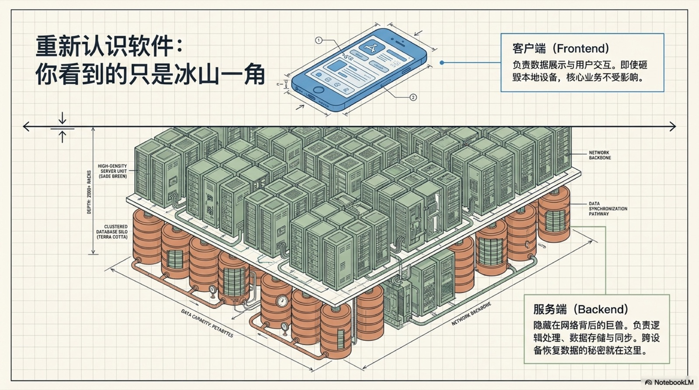

---

## 二、核心技术栈概览

后端技术栈涉及多个层次，选择合适的技术组合是项目成功的基石：

| 层次 | 技术选项 |
|------|---------|
| **编程语言** | Python、JavaScript/TypeScript、Go、Java、Ruby、PHP |
| **Web 框架** | FastAPI/Django、Express/NestJS、Gin/Echo、Spring Boot |
| **数据库** | PostgreSQL、MySQL、MongoDB、Redis、SQLite |
| **服务器与部署** | Nginx、Docker、AWS/GCP、Vercel、Railway |
| **版本控制** | Git + GitHub/GitLab |
| **API 协议** | REST、GraphQL、WebSocket、gRPC |

语言与框架的选择取决于项目需求、团队经验和生态成熟度，没有绝对的"最佳"方案。

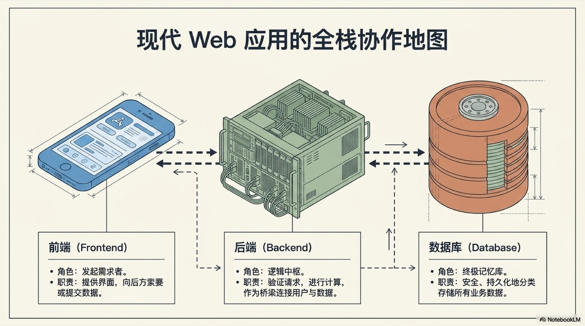

---

## 三、编程语言选择

各语言在后端领域各有优势：

- **Python** — FastAPI（高性能异步）、Django（全栈大而全）。语法简洁，AI/ML 生态极强，适合快速原型和数据处理型后端。
- **JavaScript/TypeScript** — Node.js + Express（轻量灵活）、NestJS（企业级结构化）。前后端统一语言，NPM 生态最丰富。
- **Go** — Gin / Echo。极致的并发性能与编译速度，适合微服务和中间件场景，部署极简（单二进制）。
- **Java** — Spring Boot。企业级标配，类型安全、生态成熟、性能稳定，适合大型团队和复杂业务系统。
- **Ruby** — Rails。约定优于配置，开发效率极高，适合创业阶段快速验证。
- **PHP** — Laravel。Web 原生语言，入门门槛低，中小型项目开发速度快。

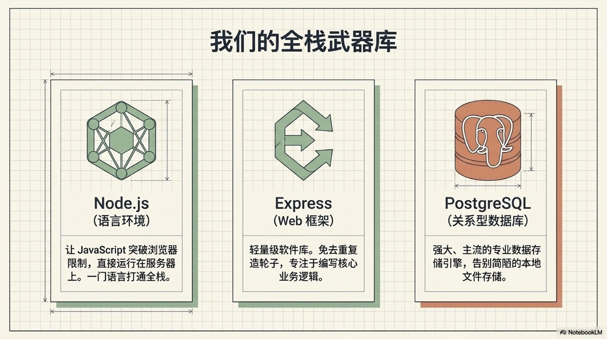

---

## 四、开发环境搭建

一套高效的开发环境能显著提升开发体验：

1. **代码编辑器/IDE** — VS Code（全能）、JetBrains 系（语言专精）
2. **包管理器** — pip、npm、go mod、maven/gradle
3. **版本控制** — Git 是必修课，配合 GitHub/GitLab 进行协作
4. **终端工具** — iTerm2 + oh-my-zsh，熟练使用命令行的开发效率翻倍
5. **Docker** — 容器化开发环境，告别"在我机器上能跑"
6. **数据库客户端** — TablePlus、DBeaver、pgAdmin

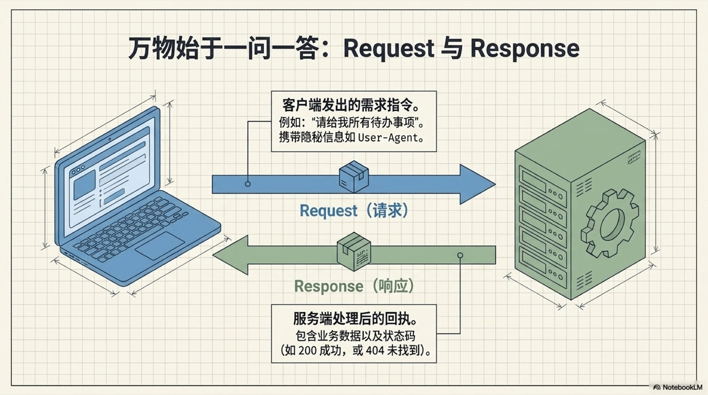

---

## 五、HTTP 协议基础

HTTP 是后端开发的核心协议。请求-响应模型是后端与客户端通信的基础：

**HTTP 方法**：
- `GET` — 获取资源
- `POST` — 创建资源
- `PUT` — 完整更新资源
- `PATCH` — 部分更新资源
- `DELETE` — 删除资源

**状态码分类**：
- `2xx` — 成功（200 OK、201 Created）
- `3xx` — 重定向（301 Moved、304 Not Modified）
- `4xx` — 客户端错误（400 Bad Request、401 Unauthorized、404 Not Found）
- `5xx` — 服务端错误（500 Internal Server Error、502 Bad Gateway）

**关键要点**：HTTP 是无状态协议，每次请求独立——身份状态需通过 Token/Session 机制额外维护。

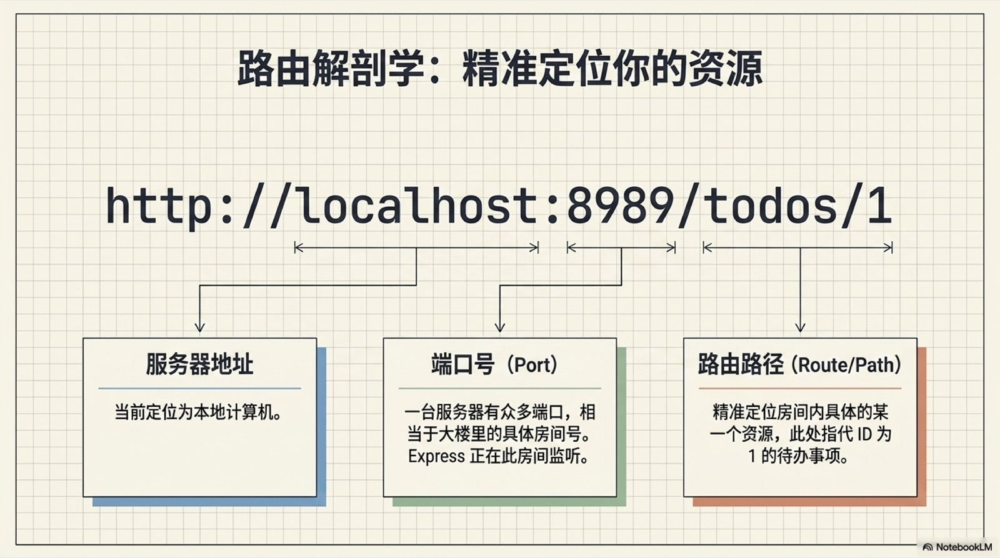

---

## 六、RESTful API 设计

RESTful 是目前最主流的 API 设计范式，核心原则是将业务能力抽象为资源：

- **面向资源** — URL 表示资源，而非操作（`/users` 而不是 `/getUsers`）
- **名词复数** — `/users`、`/orders`、`/articles`
- **HTTP 方法映射 CRUD** — GET 查、POST 增、PUT/PATCH 改、DELETE 删
- **版本控制** — 通过 URL 前缀管理版本（`/v1/users`、`/v2/users`）
- **统一响应格式** — 始终返回结构化的 JSON

设计良好的 API 就像一份清晰的服务合同，前端与移动端都能稳定消费。

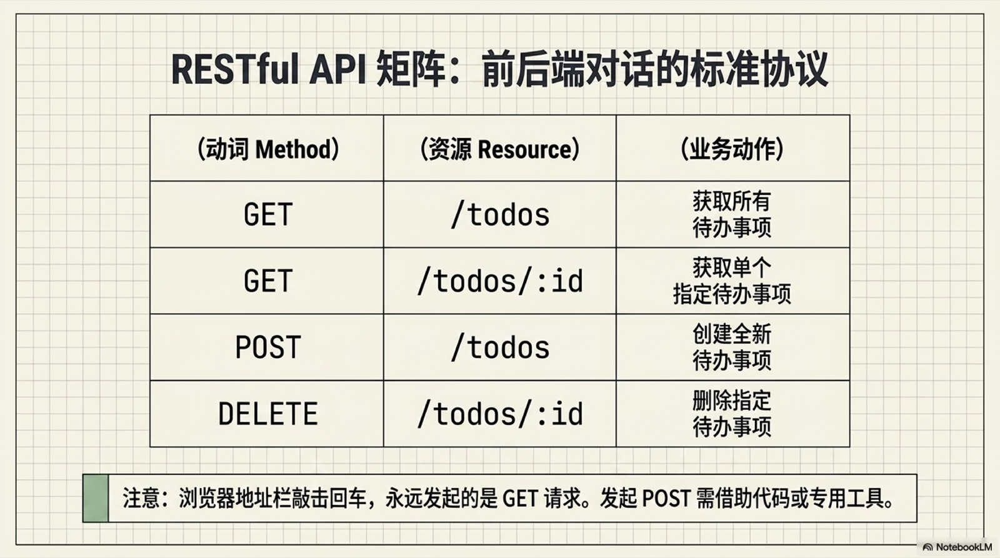

---

## 七、数据库基础与选择

数据库是后端系统的持久化基石，按类型可分为两大类：

**关系型数据库（SQL）**：
- PostgreSQL — 功能最完善的开源数据库，支持 JSON、全文搜索
- MySQL — 生态成熟，性能稳定，社区广泛
- SQLite — 嵌入式零配置，适合轻量应用和开发测试
- **ACID 特性**保证事务可靠性，适合金融、电商等强一致场景

**非关系型数据库（NoSQL）**：
- MongoDB — 文档型，灵活 Schema，适合快速迭代
- Redis — 内存型 KV 存储，极快读写，适合缓存/会话管理

**选择建议**：关系型数据库是大多数应用的主力，NoSQL 作为补充解决特定场景（缓存、非结构化数据、高吞吐日志）。

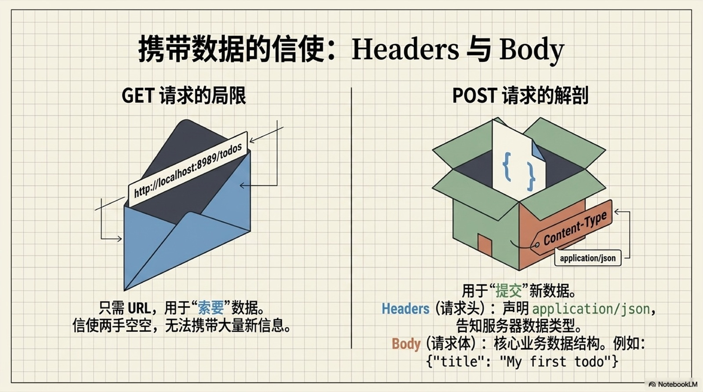

---

## 八、ORM 与数据库操作

ORM（Object-Relational Mapping）将数据库表映射为编程语言中的对象，大幅减少手写 SQL：

**主流 ORM 工具**：
- **Python**：SQLAlchemy（企业级）、Django ORM（集成度高）
- **JS/TS**：Prisma（类型安全）、TypeORM、Sequelize
- **Go**：GORM、sqlx
- **Java**：Hibernate / JPA

**核心能力**：
- **数据迁移** — 代码化管理数据库 Schema 变更
- **关联管理** — 一对多、多对多等关系通过对象属性直接操作
- **查询构建器** — 链式调用组合查询条件，避免 SQL 注入

ORM 不是万能的——复杂查询仍需原生 SQL，合理混合使用效果最佳。

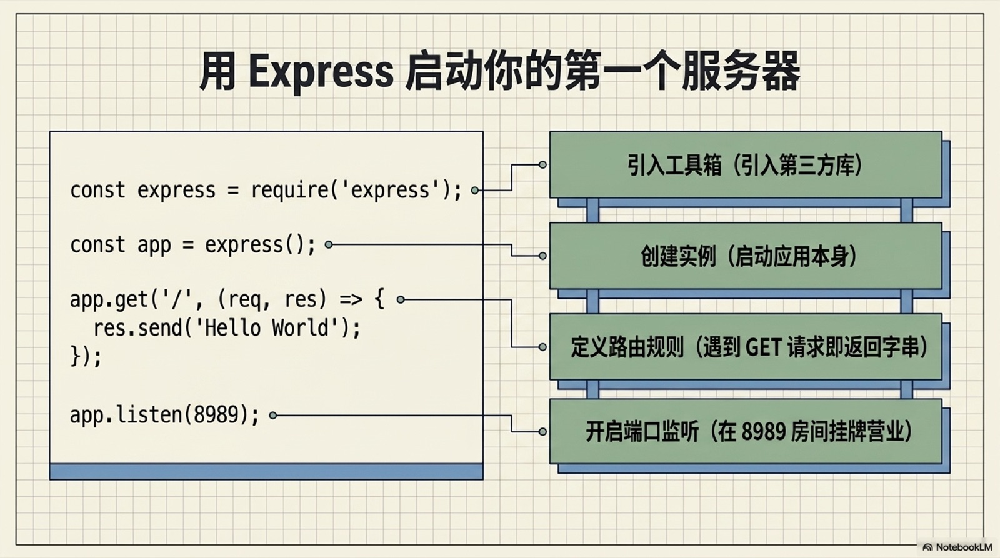

---

## 九、认证与授权

认证与授权是后端安全的第一道防线：

**认证方式**：

| 方式 | 原理 | 适用场景 |
|------|------|---------|
| **JWT** | 自包含 Token，无状态 | 分布式系统、移动端 |
| **Session** | 服务端存储，Cookie 传输 | 传统 Web 应用 |
| **OAuth 2.0** | 第三方授权协议 | 社交登录、开放平台 |

**授权模型**：
- **RBAC（基于角色的访问控制）** — 用户 → 角色 → 权限，最通用的模型
- **ABAC（基于属性的访问控制）** — 根据用户属性、环境等动态判断

**密码安全**：永远不要明文存储密码！使用 bcrypt/argon2 哈希加密。

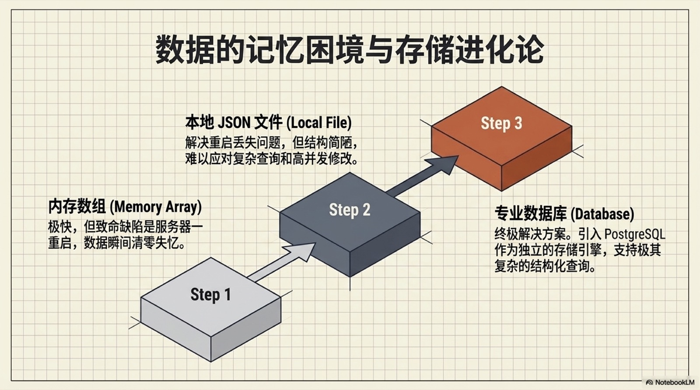

---

## 十、API 安全最佳实践

保护 API 免受攻击是后端工程师的核心素养：

- **速率限制（Rate Limiting）** — 防止暴力破解与 DDoS
- **输入验证** — 永远不信任用户输入，严格校验格式与类型
- **防 SQL 注入** — 使用参数化查询或 ORM，绝不拼接 SQL
- **防 XSS** — 输出编码，过滤危险 HTML 标签
- **CORS 白名单** — 只允许受信任的前端域名跨域访问
- **HTTPS 强制** — 全站 TLS 加密，杜绝中间人攻击
- **安全 Headers** — Content-Security-Policy、X-Frame-Options 等

安全不是最后加的调料，而是从第一天就嵌入架构的基础设施。

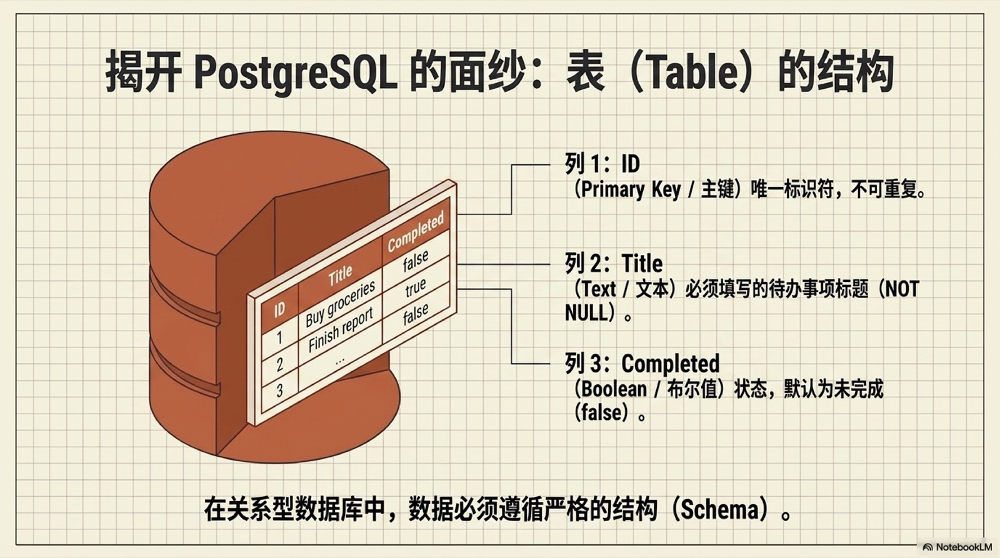

---

## 十一、部署与运维

将代码变为可访问的服务，部署管线是后端工程的最后一公里：

**容器化** — Docker 确保开发与生产环境一致，Docker Compose 编排多服务依赖。

**CI/CD** — GitHub Actions、GitLab CI 等工具实现自动化测试 + 构建 + 部署，每次提交都能安全上线。

**云平台** — 从云服务器（AWS EC2、GCP Compute）到平台即服务（Railway、Vercel），再到 Serverless，选择取决于团队运维能力。

**环境管理**：
- `.env` 文件管理环境变量，敏感配置不提交到 Git
- PM2 / systemd 管理进程守护与自动重启

**关键原则**：部署流程越自动化越好，人工操作越少越好。

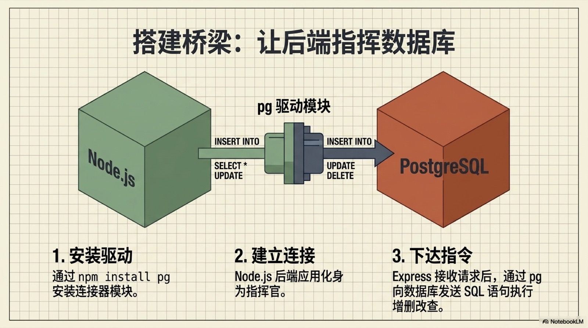

---

## 十二、监控与日志

系统上线只是开始，可观测性决定了能不能睡个好觉：

- **结构化日志** — JSON 格式记录，搭配 ELK/Loki 集中查询，替代 print 调试
- **错误追踪** — Sentry 自动捕获未处理异常，附带调用栈和上下文
- **性能监控** — 接口响应时间、数据库慢查询、CPU/内存水位追踪
- **健康检查** — `/health` 端点定期探活，负载均衡器据此剔除异常节点
- **告警** — 阈值触发后通过飞书/钉钉/Slack 实时通知，先于用户发现问题

一个原则：**没有监控的系统等于黑箱运行**。

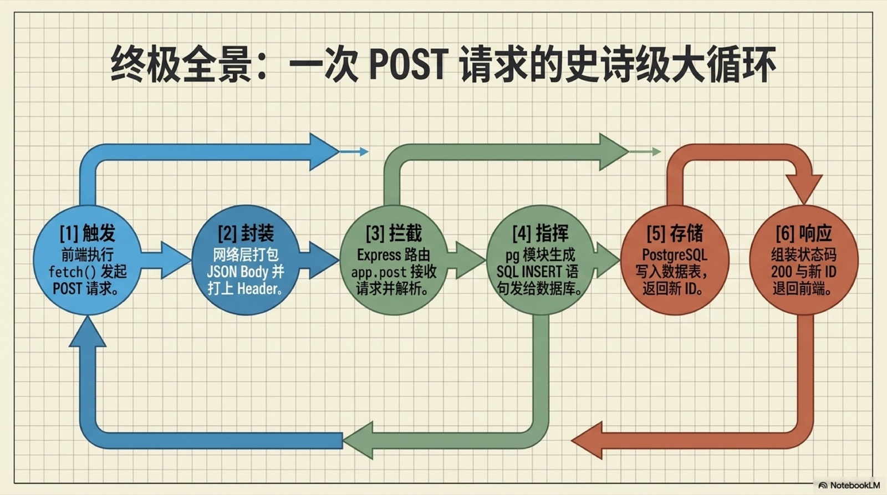

---

## 十三、架构模式

随着系统演进，合理的架构设计决定了能走多远：

**单体 vs 微服务**：
- **单体架构** — 初期开发快，部署简单，适合小型团队和 MVP
- **微服务** — 独立部署、独立扩展，适合大型系统，但引入分布式复杂性

**核心组件**：
- **消息队列**（RabbitMQ、Kafka）— 解耦服务，削峰填谷，异步处理
- **缓存层**（Redis）— 加速热点数据访问，大幅降低数据库压力
- **负载均衡**（Nginx、HAProxy）— 请求分发，水平扩展的基石
- **数据库复制** — 读写分离，主从架构提升读性能与容灾能力

**架构演进建议**：先单体验证业务，再按瓶颈逐步拆分，永远不要过度设计。

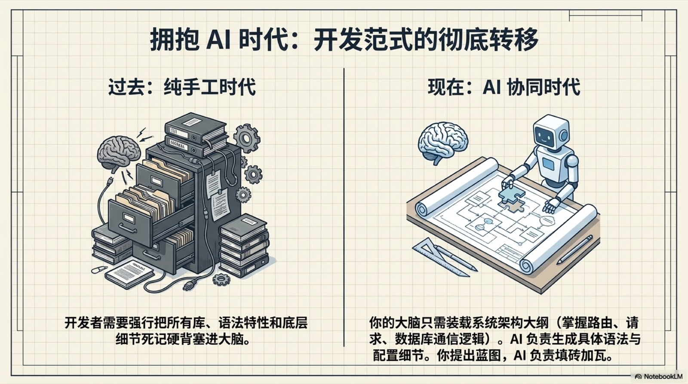

---

## 十四、开发者成长路径

后端开发是一条持续学习的路：

1. **新手期** — 掌握一门语言 + 基础框架 + 简单 CRUD
2. **进阶期** — 深入数据库原理、缓存策略、安全实践
3. **熟练期** — 掌握部署运维、CI/CD、性能优化
4. **资深期** — 系统架构设计、分布式系统、团队技术决策

**推荐学习方式**：
- 动手做项目比看教程有效 10 倍
- 阅读优秀开源项目的源码
- 写技术博客巩固知识体系
- 参与社区讨论与技术交流

后端开发的魅力在于——你写的每一行代码，都在支撑着成百上千用户的每一次操作。

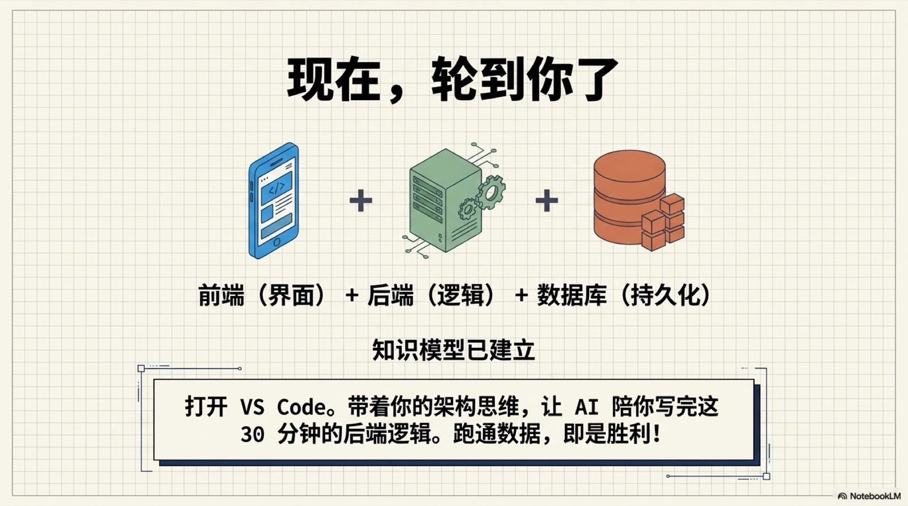

---

> 30 分钟只是一个起点。后端开发的世界远比这更广阔——协议、并发、事务、分布式、安全……每一个主题都值得深度钻研。但有了这张蓝图，你就不会再迷失在技术的森林里。
