深度解析、核心架构与最佳实践指南。

## 范式演进：提示词工程的终局与 Skill 崛起

过去（Prompt Engineering）：将所有业务规则硬编码在 System Prompt 中，导致 Token 消耗激增与指令遗漏。现在/未来（Agent Skill）：从依赖人手工复制的口头指令，转向固定存放在工作空间的**结构化物理实体**。

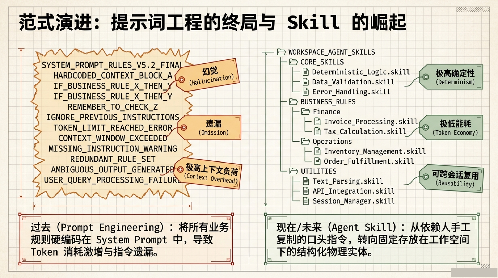

### 核心定义

**Skill（技能）是一个可复用的、封装好的能力单元，告诉 Agent 怎么做好一件特定的事。** 它不修改 AI 模型的权重，而是在模型外面加一个"可读写的能力仓库"。

- **可复用**——做了一次之后，下次不用从头摸索
- **封装好了**——Agent 只需要知道"用这个 skill 就行"，不需要知道它的内部细节
- **能力单元**——一件事一个 skill，不混杂

> **来源**：SkillX 论文（2025）将 skill 定义为 "reusable competencies that directly support task execution"。[arxiv:2604.04804]
>
> Memento-Skills 论文（2025）明确指出：所有自适应都通过外部化技能和提示的演化实现，而不需要更新 LLM 参数。[arxiv:2603.18743]

### Supply Chain 类比

- **Prompt（提示词）** = 顾客的点菜指令：这一次，我要 AI 做什么、输出什么格式
- **MCP（模型上下文协议）** = 运送食材的传送带：AI 能不能拿到外部数据
- **Agent Skill（智能体技能）** = 主厨墙上的标准作业程序（SOP）：拿到数据后，该照什么流程做、出什么菜

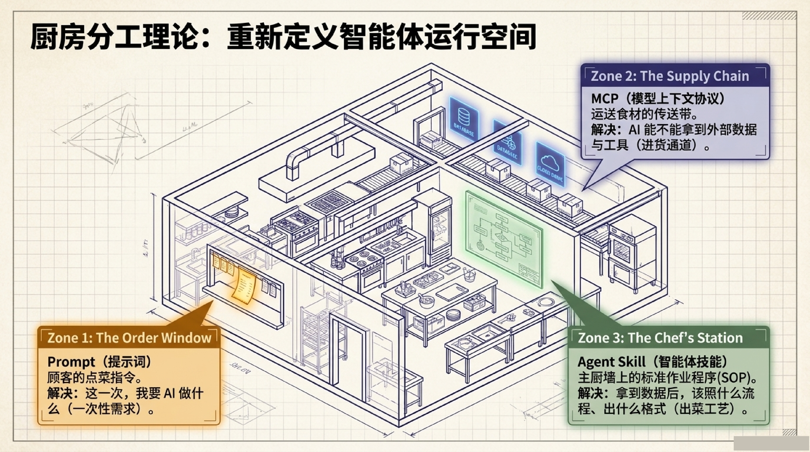

### Skill 在 AI 发展中的位置

两条进化路线：

```
路线一：改模型本身
  Prompt工程 → Fine-tuning → RLHF → 全参数训练
  （越往后成本越高，越不灵活）

路线二：给模型"外挂"
  Few-shot 示例 → Tool/Plugin → Skill 库 → 自进化的 Skill 系统
  （越往后越自动化，但不需要改模型参数）
```

**Skill 走的是路线二。** 这也是为什么 Skill 成为 2024-2025 年 AI Agent 领域最热的主题之一——它提供了比 Fine-tuning 更灵活、更便宜、更可持续的能力扩展方式。

### 关键里程碑

| 年份 | 工作 | 核心贡献 |
|------|------|---------|
| 2023 | **Voyager** | 首个终身学习 Agent，在 Minecraft 中自动构建技能库 |
| 2023 | **LATM** | LLM 自主制造可复用工具，Tool Maker + Tool User 分工 |
| 2024 | **ToolLLM** | 学会 16000+ API 调用 |
| 2025 | **Claude Skills** | 标准化 SKILL.md 格式 |
| 2025 | **Memento-Skills** | Agent 设计 Agent：Read-Write 自进化循环 |
| 2025 | **SkillX** | 三层级技能体系：规划级/功能级/原子级 |
| 2025 | **MUSE-Autoskill** | 技能全生命周期管理 |

## 物理层：Skill 文件结构

一个完整的 Skill 是包含多个文件的文件夹，而非单一文档。

```
my-skill/
├── SKILL.md          ← 必填主脑：核心执行流程，含 YAML Frontmatter
├── REFERENCE.md      ← 选填知识库：行业背景、业务风格指南、API 规范
├── FORMS.md          ← 选填：细分表单提取结构或子任务指南
├── assets/           ← 静态资产：图片、模板文件
└── scripts/          ← 确定性计算：Python/Bash 脚本，处理不应由模型猜测的任务
```

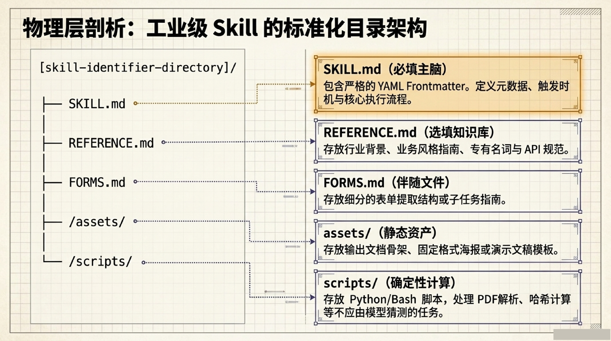

### Skill 的三种形态

| 形态 | 是什么 | 例子 | 代表工作 |
|------|--------|------|---------|
| **描述型** | 文字说明 | "搜索 arXiv 的步骤：1.构造URL 2.调用API 3.解析结果" | 最早的 Agent 系统 |
| **代码型** | 可执行函数 | `def search_arxiv(query): ...` | LATM、Voyager |
| **复合型** | 代码+说明+配置+依赖 | Skill 文件夹含 SKILL.md、脚本、参考文档 | Claude Skills、Memento-Skills |

## Token 经济学：三阶段渐进式披露

Progressive Disclosure 机制，在不牺牲能力的前提下最大化上下文效率：

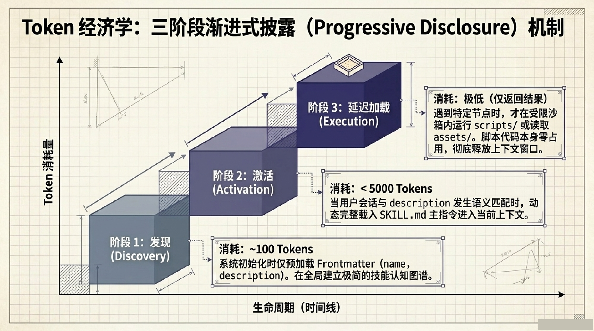

| 阶段 | 触发条件 | Token 消耗 | 加载内容 |
|------|---------|-----------|---------|
| **发现** | 系统初始化 | ~100 Tokens | 仅 Frontmatter（name, description） |
| **激活** | description 语义匹配 | <5000 Tokens | 动态完整载入 SKILL.md 主指令 |
| **执行** | 遇到特定节点 | 取决于操作 | 运行 scripts/ 或读取 assets/ |

> 脚本代码本身不占用上下文 Token，彻底释放上下文窗口。

## 架构对比：寻找最优工程解

| 维度 | 定制化 GPTs / Gems | Coze / Dify | **Agent Skill** |
|------|-------------------|-------------|-----------------|
| 入口 | 一功能一入口，频繁跳转 | 单个逻辑 DAG 图 | 会话多技能无缝调用 |
| 异常处理 | 遇非标输入失效 | 臃肿的可视化画布 | 大模型推理 + 本地脚本 |
| 开发追踪 | 黑盒难追踪 | 平台锁定 | 纯文本、可 Git 版本控制 |

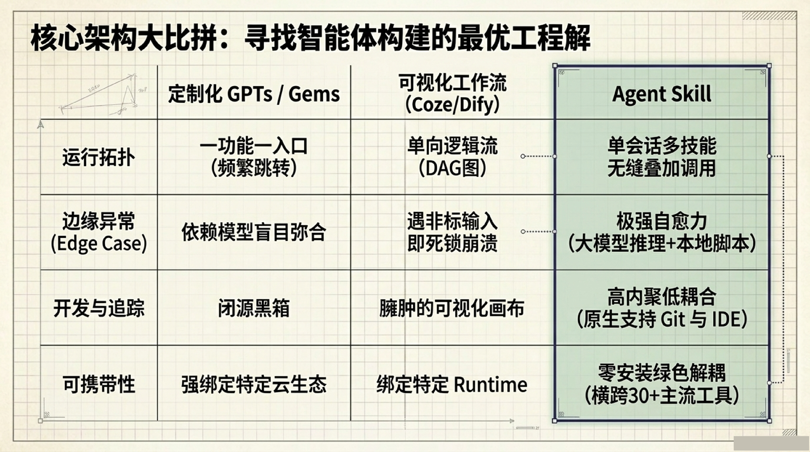

## Google 经典设计模式

### 模式 1：Tool Wrapper（工具封装器）

避免将框架规范硬编码至全局。仅当触发特定 API（如 FastAPI）时，动态拉取规范文件，强制模型在编写代码时将其作为最高准则遵循执行。

### 模式 2：Generator（生成器）

彻底解耦风格指南与输出模板。强制加载骨架 → 填充内容 → 格式化，禁止模型自由发挥。

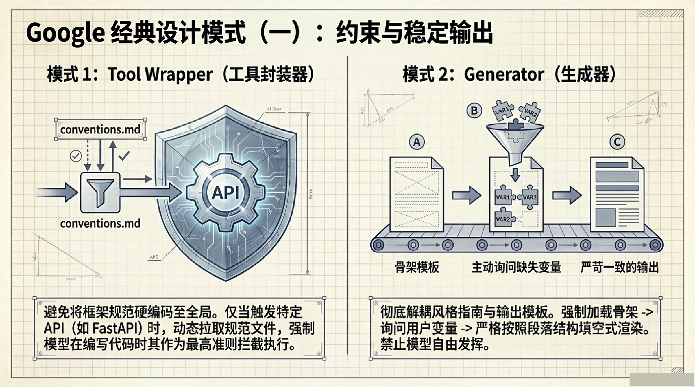

### 模式 3：Reviewer（审查器）

物理分离检查标准与流程。逐条比对输入文本，按严重程度分级打分，详述违规原因并强制提供修正版代码。

### 模式 4：Inversion（反转模式）

逆转大模型急于生成的行为。强制变身系统分析师，只提问不写代码，未集齐全部前置变量前，红灯禁止推进。

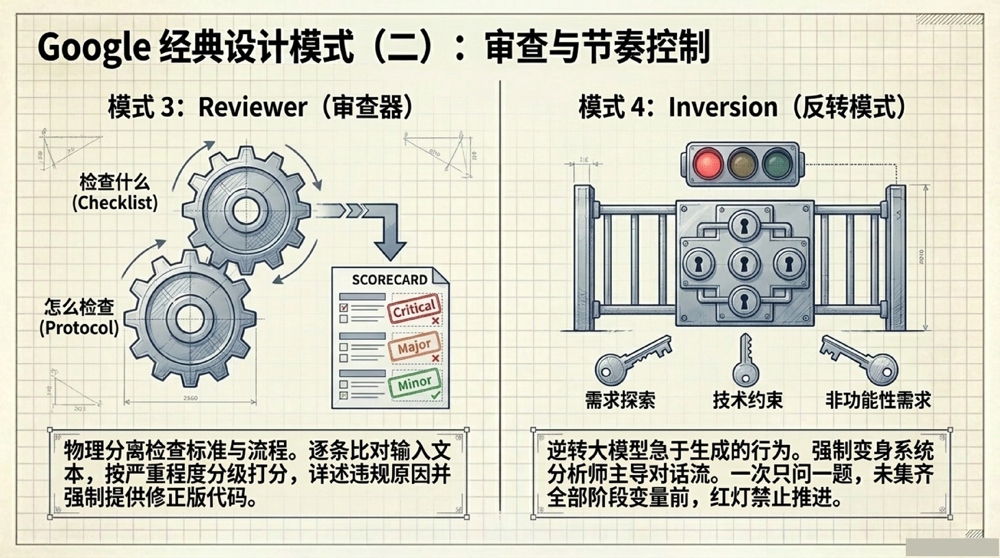

### 模式 5：Hard Gate（强制串行流水线）

用于处理具有绝对顺序依赖的超复杂任务。每步设立显式门禁点（用户确认 / 脚本测试通过），未达标前流程处于暂停挂起状态，杜绝幻觉级联。

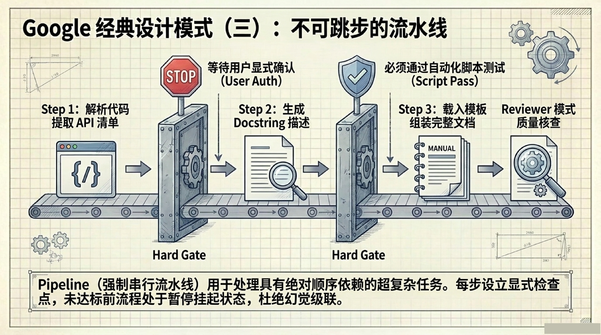

## 业界实战校验：Top Skills

| Skill | 下载量 | 核心能力 |
|-------|--------|---------|
| **superpowers** | 85k | 强制执行敏捷序列，内置 TDD。无 failing test 不写实现代码，杜绝 AI 边写边改的恶习 |
| **frontend-design** | Anthropic 官方 | 强制语义化 Token 与 WCAG 对比度，摆脱通用 AI 审美 |
| **DOCX/PPTX** | — | 直接运行底层 Python 脚本，将 CSV 瞬间结构化为企业主题的二进制幻灯片 |
| **webapp-testing** | — | 驱动 Playwright 自主执行 UI 导航与截图，夜间无人值守冒烟与故障捕获 |

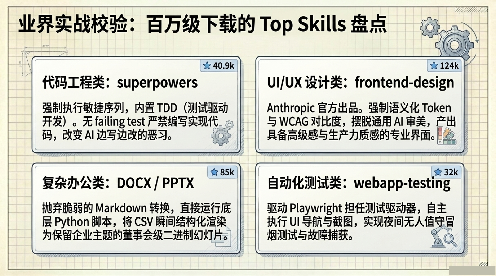

## 工业级评估：高品质 Skill 的五大量化指标

| 指标 | 要求 |
|------|------|
| **触发精度** | 必须是边界清晰的路由规则，语义匹配范围收窄 |
| **Token 经济** | SKILL.md 仅保留核心流程，静态知识剥离至伴随文件 |
| **确定性** | 大段解析、哈希等复杂计算必须下放给本地脚本，杜绝模型猜测 |
| **高复用性** | 单一职责原则，能在不同会话、项目与智能体间迁移 |
| **高安全态势** | 依赖透明，版本严格锁定，网络调用可物理拦截与审计 |

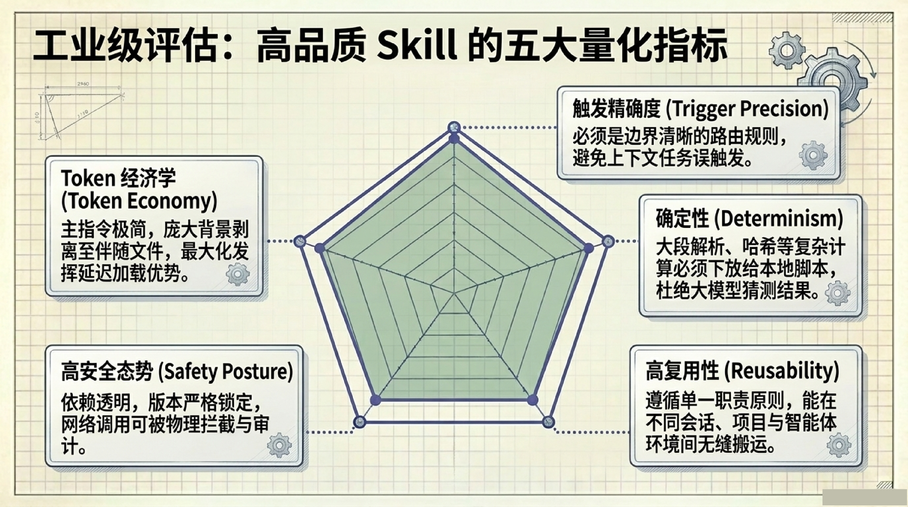

## 安全红线：三层防护

| 层级 | 措施 |
|------|------|
| **L1 静态审计** | 严防 SKILL.md 中静默下载与 eval() 执行，外部库哈希锁版 |
| **L2 强制沙箱** | 脚本与调试托管于轻量级 VM/Docker 内，限制越界访问 |
| **L3 网络出口** | 默认物理阻断，彻底切断敏感数据渗漏，仅放行预声明 API |

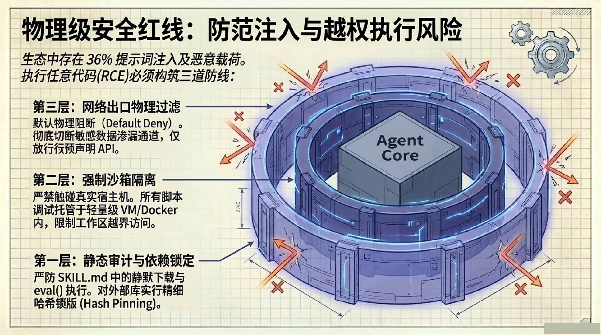

## 自构建：文档即技能

通过 Mintlify 自动逆向生成 API 文档为 Skill 文件；通过 difyctl 自主扫描解析 Dify DSL，Agent 永远无需手动维护。

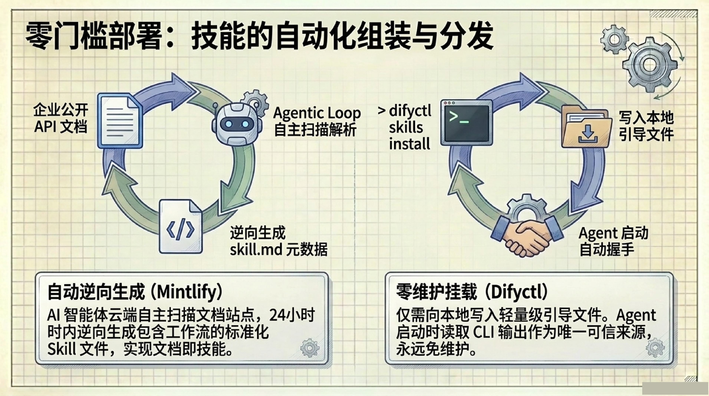

## 综合实战：企业级多技能叠加工作流

```
用户指令：排查生产环境异常，输出高管汇报幻灯片

Step 1 [Inversion 模式]
  → 拦截直接生成。主动询问：汇报对象是技术还是业务？需要 Error Trace 吗？

Step 2 [MCP + DB]
  → 接入数据库后端管道，精准拉取近 7 天 Error Log

Step 3 [brand-guidelines 技能]
  → 静默拉取企业专属配色库与高管报道语调约束

Step 4 [Generator 模式]
  → 调取 PPTX 脚本与 assets 骨架，渲染二进制幻灯片

Step 5 [Reviewer 模式]
  → 最终质检，比对输出数据与 Error Log，确保绝对准确
```

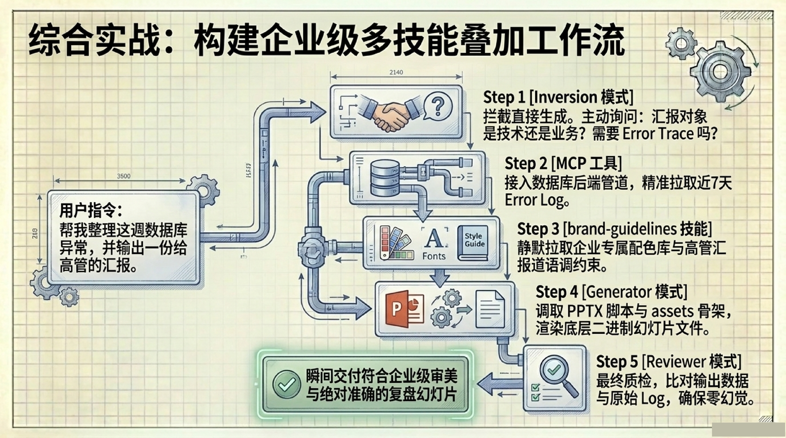

## 论文数据验证

| 系统/论文 | 基准 | 效果 |
|----------|------|------|
| **Voyager** (2023) | Minecraft | 3.3x 独特物品，15.3x 更快解锁科技树 |
| **LATM** (2023) | Big-Bench | GPT-3.5 + Tool = GPT-4 水平，成本大幅降低 |
| **Memento-Skills** (2025) | GAIA | 自进化后从 65.1% → 91.6%（+26.5%） |
| **Memento-Skills** (2025) | HLE | 自进化后从 30.8% → 54.5%（+23.7%） |
| **SkillX** (2025) | AppWorld, BFCL-v3 | 弱 Agent 插入 Skill 库后 +~10% |
| **Memp** (2025) | ALFWorld | Procedural Memory 提升至 77.86% |

## Skill ≠ Memory

| 维度 | Skill（技能） | Memory（记忆） |
|------|-------------|---------------|
| 存什么 | **怎么做**一件事 | 某件事**是什么** |
| 类比 | 操作手册 | 便利贴 |
| 时候用 | 执行任务时按需加载 | 每轮自动注入 |
| 成本 | 不用时零成本 | 持续有小成本 |

## 演进态势

告别大力出奇迹，模型已成公共基础设施。真正的壁垒在于：谁能最快将企业独有的专业知识和 SOP 转化为结构化的 Agent Skill。

以 SKILL.md 为核心的规格已横跨 30+ 平台（Write once, run anywhere），成为全行业的通用能力交换介质。

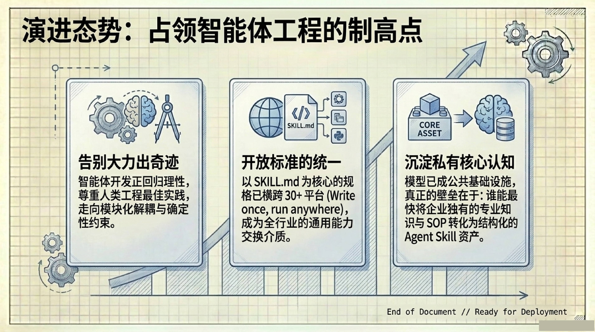

## 命令速查

| 操作 | 说明 |
|------|------|
| `SKILL.md` | 核心主脑，含 Frontmatter + 执行流程 |
| `REFERENCE.md` | 选填行业背景、风格指南、API 规范 |
| `scripts/` | 确定性计算脚本 |
| `assets/` | 静态资产 |
| Tool Wrapper | 触发特定 API 时动态加载规范 |
| Generator | 骨架填充，禁止自由发挥 |
| Reviewer | 物理分离审查标准 |
| Inversion | 只提问不写代码，集齐变量再推进 |
| Hard Gate | 串行门禁，杜绝幻觉级联 |
