刚入行运维那会儿，我最怕凌晨三点手机响。

不是因为夜班苦——做这行的谁没熬过几个大夜。是因为你接起电话，对面永远是同一句话："系统又挂了，你看看怎么回事。"然后你爬起来，打开满屏的红色仪表盘，在一万多条报警里找那一条真正有用的。等找到的时候，老板已经在群里@你三次了。

后来我做 SRE，开始接触 AIOps。第一次真正理解它不是在技术上，而是在一次痛彻心扉的故障复盘之后。那一夜彻骨的真实感受，比任何技术文档都直接。

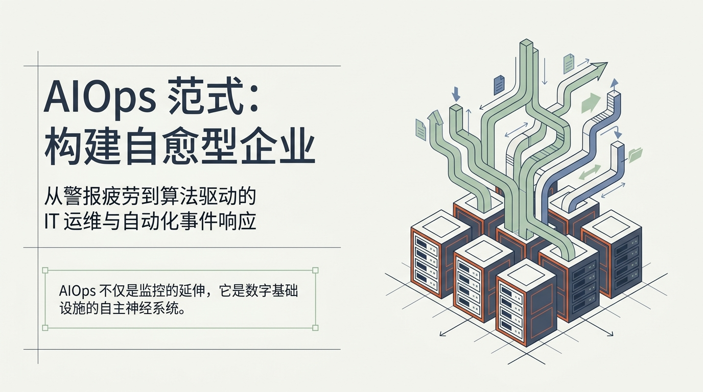

AIOps 这个概念的核心里有一个很多人没看到的隐喻——它不单单是"给监控加个 AI"；它是想给数字基础设施装一个**自主神经系统**。

你想想自己的身体：心跳不用你指挥，呼吸不用你惦记，体温自己会调节。这些事如果都得靠你有意识地去控制，你什么都干不了。企业 IT 系统也是一样——当你的服务器、数据库、网络、应用膨胀到一定规模后，靠人肉去盯每一个指标，就是在用自己的意识去控制心跳。

这篇文章不讲概念堆砌，我想用这些年摸爬滚打的真实体感，把 AIOps 这件事说透。

---

## 99% 的报警都是废话，这才是 AIOps 要解决的第一件事

先给你一个真实的数字：在一家中等规模的互联网公司，每天产生的遥测数据是多少？

几百万条。

其中多少是有用的？不到 1%。

剩下的 99%，要么是重复报错，要么是良性噪音，要么是某个实习生配错了阈值。但工程师的时间和精力有限，你花了 20 分钟翻了几百条报警，发现全是"CPU 超过 80% 持续了 3 秒"这种——然后真正的那条致命告警就在这一堆废话里，过了四十分钟才有人看到。

这就是"警报疲劳"。

这不是人的问题，是规模的问题。

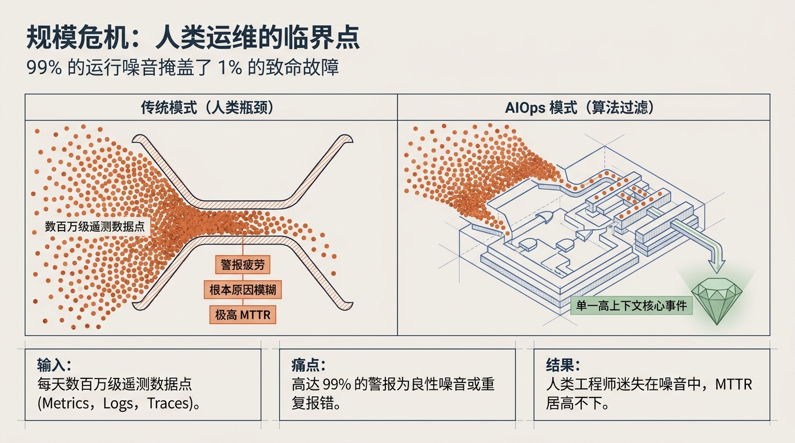

我见过最夸张的一次：某个电商大促夜，监控系统每秒钟往外崩 200 条报警，值班群的消息震动把手机震到自动关机。工程师们后来直接放弃了看报警，靠经验猜哪里出了问题——结果当然是猜错了。

AIOps 做的第一件事，不是"更聪明地分析"，而是**先闭嘴**。用算法把几百万条数据过滤、聚类、降噪，最后只给你吐出一条信息："今晚 23:14 的支付超时，根因在订单中心的数据库连接池，影响范围约 2% 的用户。"

也就是从"你要在这堆垃圾里翻出宝藏"变成了"宝藏在这里，已标注，附带挖掘日志"。

那 99% 的废话去哪了？算法吃掉了。这才是 AIOps 能救人命的第一个原因：它让工程师的注意力回到了该去的地方。

---

## 我做了十年运维才明白的事：可观测性不是监控

这个词现在被用烂了，但它在工程实践里和其他那些"同行"有本质区别。

监控是"这个指标超出阈值了"，可观测性是你**不需要提前知道该看什么指标**，就能问出"现在系统出了什么异常"。

我把这段进化过程画成了下面这张图——每一次跃迁，本质上都是工具的进步把人的认知边界又推开了一些。

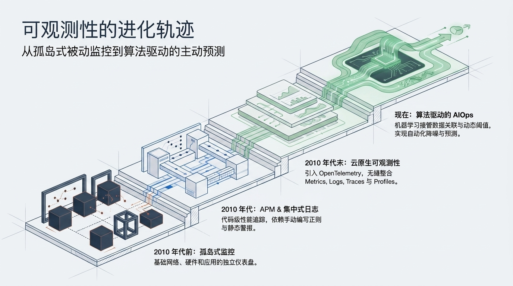

2010 年以前，我入行那阵子，每家公司的 infra 团队各自管一套监控工具。网络看 Nagios，服务器看 Zabbix，应用看自家的打点系统。出了故障三拨人在三个群里吵，互相说"不是我这边的问题"。

到了 2010 年代，APM 工具进来了，终于能追踪到代码级的性能问题。但那时候你设一条报警规则，得手写正则表达式去匹配日志里的关键字。写了一堆规则，结果日志格式一改，全崩了。

再后来 OpenTelemetry 统一了标准，把指标、日志、链路追踪三个维度打通了。但那时候你还是得人工设阈值——"CPU 超过 80% 就报警"这种静态规则。

直到 AIOps 进来，机器开始自己干这件事了：**它替你设阈值，替你找关联，而且比你准。**

这个转变听起来不大，但在运维实战里是质变。我见过太多 case：某条业务线的 CPU 平时 70%，双十一冲到 90% 其实是正常的，但静态阈值 80% 一下就打到了。工程师为了不被误报骚扰，把阈值调到 95%，结果真正出问题的时候，95% 又漏报了。

这是死胡同。

AIOps 的动态阈值不走这条路。它记住你系统每天的"行为习惯"——周一的早高峰、月底的结算峰值、节假日的流量塌陷——然后在这个基础上判断"现在这个状态正常吗"。它就像一个陪你值班了三年的老师傅，不用你告诉它"这样算异常"，它闻都闻出来了。

---

## AIOps 平台的骨架：四层引擎叠起来

我用一个很简单的比方来理解 AIOps 平台的架构：

它就是个智能急诊中心。

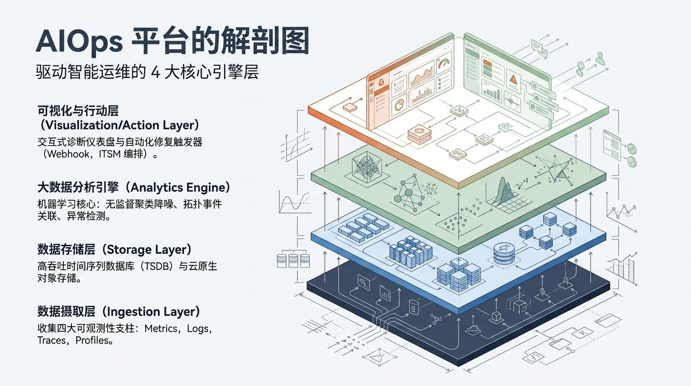

最底层是一排救护车——**数据摄取层**。它们把 Metrics（指标）、Logs（日志）、Traces（链路追踪）、Profiles（性能分析）这些"病人"全部接到急诊大厅来。不管什么格式，先收进来再说。

往上一层是**数据存储层**，好比病历档案室。用的是 TSDB（时间序列数据库）和云原生对象存储。吞吐量要大到能扛住每天几百万条数据的写入，查询还要快——因为分析引擎随时要调病历。

再往上是最核心的一层：**大数据分析引擎**。这是急诊中心的智能分诊系统。它不看单个数据，而是把所有数据融合起来做三件事：
- **降噪**——把那些"废话报警"自动过滤掉
- **拓扑关联**——A 服务报错不一定 A 出问题，可能是 B 慢导致 A 超时。引擎要认得这个关系网
- **异常检测**——发现那些"不太对劲"的模式

最上面是**可视化与行动层**，就是医生和护士拿到诊断结果后的执行环节。关键是一句：**不只是给你看，还能自动干**。通过 Webhook 或者 ITSM 系统，诊断结果可以直接触发自动化修复。

---

## 我见过最聪明的排障系统，是能把三个维度的数据连起来看的

单看 CPU 你会被坑。

这是我在实践中撞过无数次的南墙。有一次线上故障，所有指标都指向 CPU 打满。团队扩容了三台服务器，CPU 降了，但错误率不降反升。

后来花了两小时才定位到：CPU 高是因为磁盘 I/O 慢了，请求在排队，队列占满了 CPU cache。扩机器没用，得换 SSD。

这是一个经典的单维度陷阱。

AIOps 的 RCA（根本原因分析）之所以是多模态的，就是为了对付这种问题。

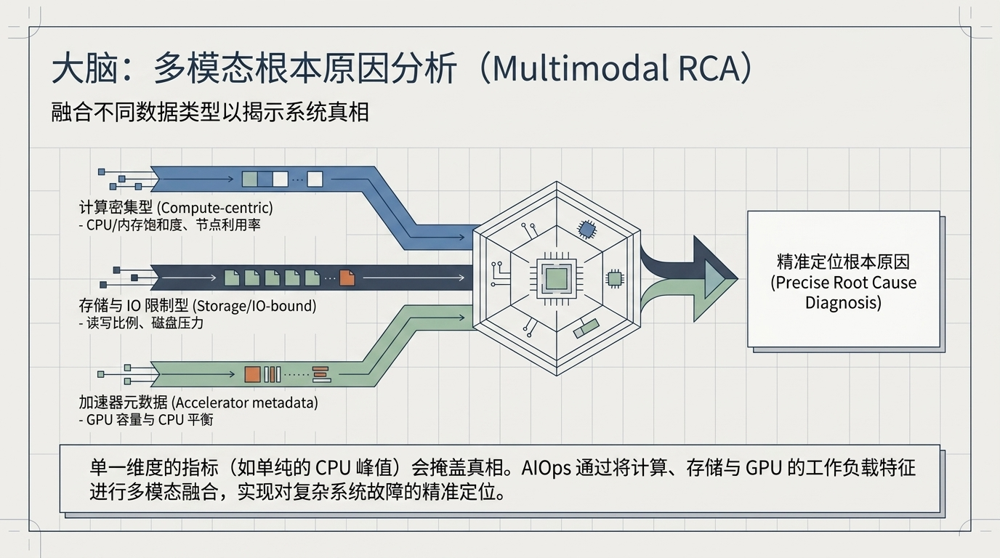

它同时看三路数据：**计算密集型指标**看的是 CPU 和内存饱和度和节点利用率；**存储与 IO 限制型指标**看读写比例和磁盘压力；**加速器元数据**看 GPU 容量与 CPU 负载的均衡。

三条数据流汇聚到一个引擎里，融合分析后吐出一个结论——不是"CPU 高"，而是"磁盘 I/O 导致 CPU 等待队列溢出"。

这才是"根因"。

单一维度的指标会骗人。多模态融合不会。这个"全科医生"的诊疗方式，是我认为 AIOps 最有价值的能力之一。

---

## 有一个模型把另外两个打趴下了

说个算法选型的故事。

我们当时要在几十种工作负载里做自动分类——判断一条工单对应的是计算密集型、IO 密集型还是混合型负载。备选方案有三个：

- **随机森林**：准确率 78%，可解释性强。你要它说为什么，它能给出每棵树的投票权重。但重叠模式它分不清楚。
- **神经网络**：准确率 92%，很高。但它是黑盒——它知道答案，说不清理由。在运维场景里这很致命：你会不会相信一个说不清原因的诊断？
- **LightGBM**：准确率 95%，而且保留了特征的可解释性。

答案没有悬念。

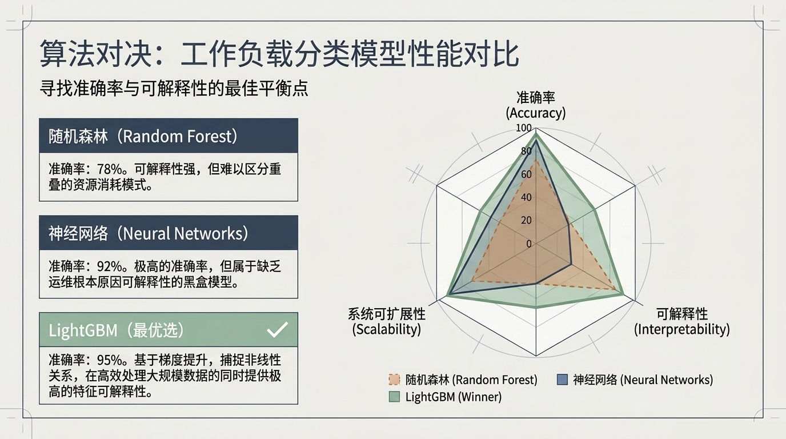

这个对比其实说出了运维领域一个很重要的原则：**最高准确率不一定是最好选择。** 如果模型不能解释自己为什么做出某个判断，SRE 团队在实践中不会真正信任它。LightGBM 赢在了"又能打，又肯说"。

---

## 报警的正确姿势：别再盯着 CPU 了

我一直觉得很多运维团队搞错了一件事：他们认为报警的目的是"通知"。不对。报警的目的是"判断需不需要响应"。

绝大多数传统报警规则都是基础设施视角的——"CPU > 90%"——但它没告诉你这个 CPU 峰值是否影响了用户。CPU 高 3 秒然后降了，用户没感觉，你把值班工程师叫醒了。这种虚假的紧迫感是最消耗团队信任的。

AIOps 引入了一个来自 SRE 的方法论，我认为它是整个体系里最聪明的设计：**SLO 和错误预算。**

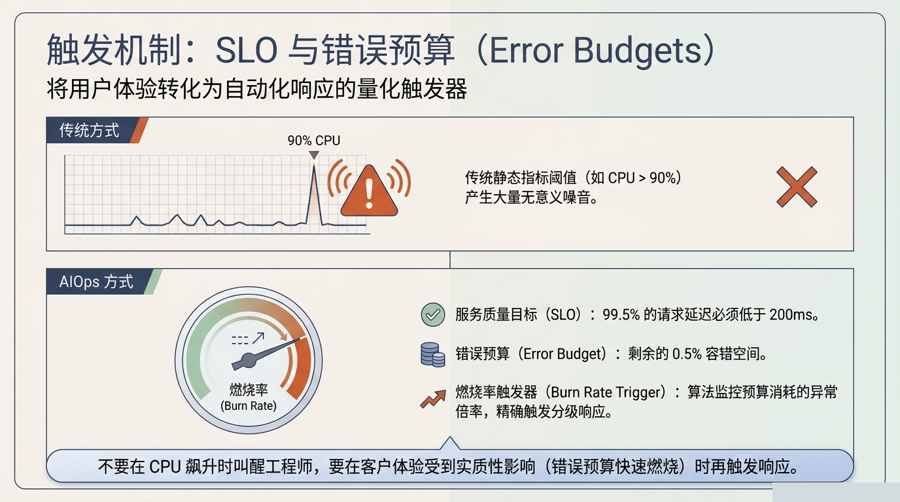

你不需要给每一项基础设施指标设阈值。你只需要做一件事：定义一个**用户体验维度的质量标准**——比如"99.5% 的请求延迟必须低于 200ms"。

99.5% 是你的**SLO（服务质量目标）**。剩下的 0.5% 就是你的**错误预算（Error Budget）**——你可以"犯错"的额度。

然后系统只盯着一个指标：**错误预算的消耗速度**，也叫燃烧率。

你不需要在 CPU 飙升的时候叫醒任何人。只有错误预算正在快速燃烧——也就是用户真正受到实质性影响——的时候，才触发响应。

"不要在 CPU 飙升时叫醒工程师，要在客户体验受到实质性影响时再触发响应。" 这句话我贴在工位上很多年了。

---

## 自动化这件事，不是一步到位的

我见过太多团队在"自动化"上栽跟头——一上来就想搞全自动自愈，搞了三个月没跑通，最后回到全人工。自动化是有成熟度的，我把它分成三个阶段：

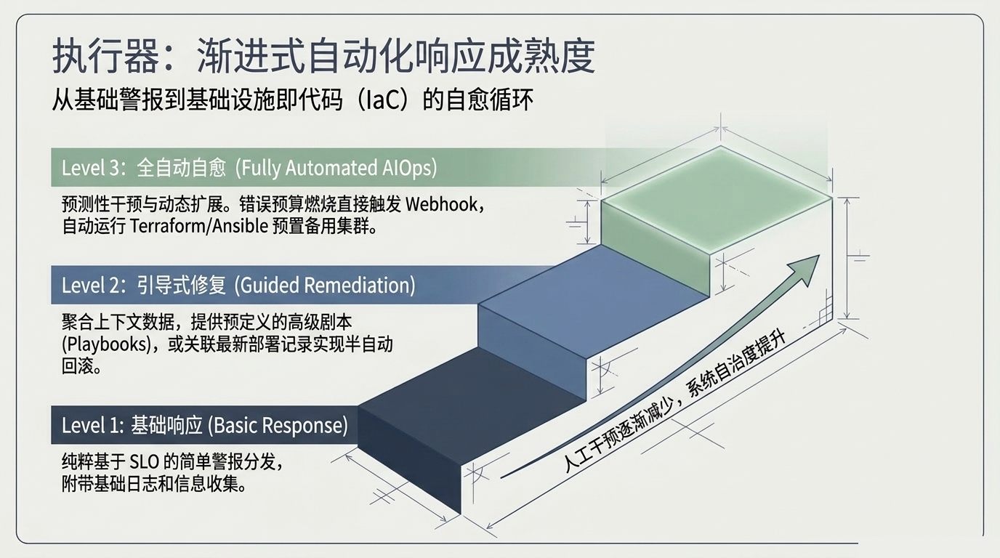

**Level 1 基础响应**：SLO 触警了，发通知，附带一点上下文日志。人是执行主体。这是大多数团队的现状——不是不够好，是还在路上。

**Level 2 引导式修复**：系统不仅告诉你"出事了"，还告诉你"按照这个剧本走，大概率能修好"。还能关联你的部署记录，帮你做半自动回滚。人还是最后拍板的，但剧本已经给你铺好了。

**Level 3 全自动自愈**：错误预算快速燃烧 → 自动触发 Webhook → 自动跑 Terraform/Ansible 去预置备用集群。整个过程没有一个工程师按过按钮。

我跟过好几个团队走过这个路径。一个很真实的体感是：**在 Level 2 待久一点没关系。** 先跑通"有剧本的辅助修复"，让团队积累对自动化的信任，比强推 Level 3 要可持续得多。

---

## 最被低估的能力：预测

很多人以为 AIOps 的核心是"出事时快速止损"。这个没错，但我个人认为，它最被低估的能力是**在出事之前就发现苗头**。

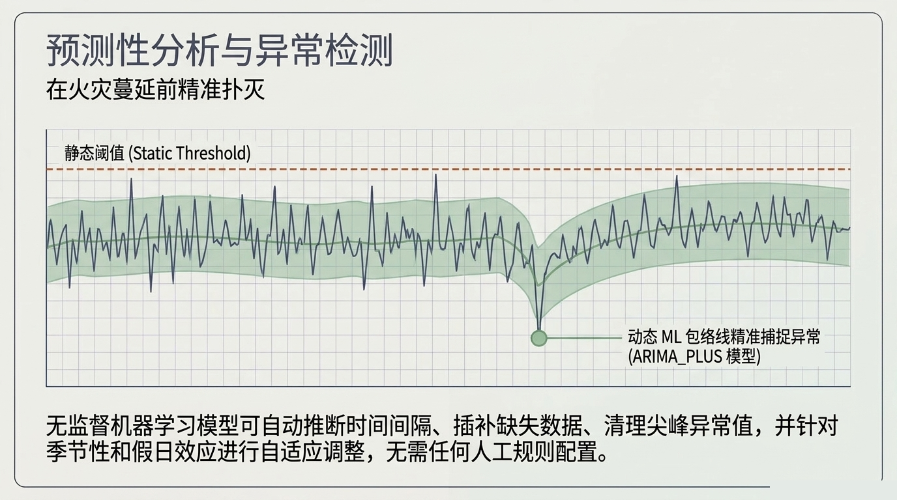

静态阈值是一条死线。你设好了，它不懂上下文——凌晨 3 点的流量塌陷是正常的，但它不认。你设松了漏报，设紧了虚报。

动态 ML 包络线不一样。它通过学习你系统的历史行为，自动建一个"预期范围"——不是一条线，而是一个管道。这个管道会跟着季节、趋势、特殊日期自适应地收窄或扩宽。

打个比方：你每天通勤走同样的路。有个同事坐在副驾，跟了你三个月。有一天你刚出小区他就说"今天不对，前面可能堵"。他不是看到了拥堵，他是发现今天右转灯亮的时间比平时早了 4 秒。

这就是动态 ML 包络线的思路——**它不看全局阈值，它看局部行为与预期的偏差。**

最妙的是，这一切不需要工程师自己配规则。模型会自动推断时间间隔、插补缺失数据、清理异常峰值、对节假日做自适应调整。

你说它是会学习的监控，还是被训练的助手？我觉得都不是——它更像是你系统的一个"体感"，一种它自己长出来的直觉。

---

## 你真的放心让 AI 自己修机器吗？

这是我在每个团队推广 AIOps 时都会被问到的问题。

我的回答是：我也不放心。

所以我不会让 AI 直接操作生产环境。

我会在它和操作之间，插一堵墙。

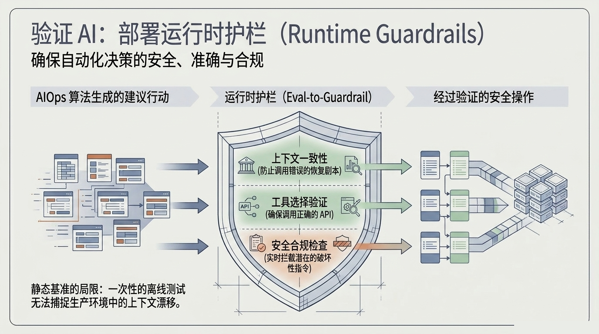

这堵墙叫**运行时护栏（Runtime Guardrails）**。AI 给出建议→护栏检查→通过才执行。检查三层：

1. **上下文一致性**——你要重启的服务器是正确的那台吗？有没有误伤生产环境？
2. **工具选择验证**——你调用的是"重启"接口，不是"关停"接口吧？
3. **安全合规检查**——这条指令有没有违反合规要求？

这三层检查是实时的、不跳过的。AI 通过了才能执行。

很多人问我：那离线测试不行吗？不够。生产环境时时刻刻在变——上周的配置这周可能就改了，这个所谓的"上下文漂移"，是一次性离线测试永远抓不住的。**必须在线、实时、不解耦。**

---

## 工具怎么选

过去几年我帮几个团队做过 AIOps 平台的选型。市面上主流工具走了一圈，感受如下：

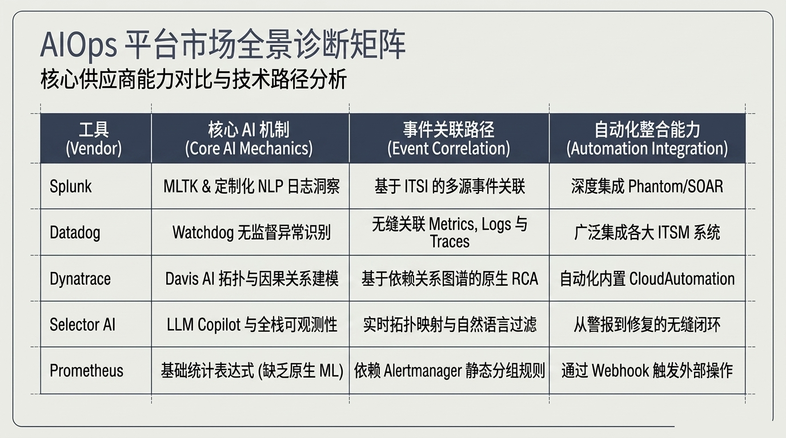

**Splunk** 是老牌巨舰，日志分析起家，MLTK + 定制化 NLP 的组合很强，深度集成 Phantom/SOAR。适合已经有 Splunk 投资的大型企业。

**Datadog** 的 Watchdog 引擎做无监督异常识别，把 Metrics/Logs/Traces 三条线的关联做得最顺滑。适合云原生团队。

**Dynatrace** 的 Davis AI 是目前拓扑与因果关系建模做的最好的。它的 RCA 能力是"原生"的——不是后加的插件，而是从一开始就在架构里的。如果你很在意自动根因分析，它值得认真看。

**Selector AI** 是比较新的面孔，亮点是 LLM Copilot。你可以在聊天框里直接问它"为什么支付超时了"，它用自然语言回答。用户体验层最大的突破。

**Prometheus** 是开源标配，适合自建。但它本身没有原生 ML 能力，需要你自己搭一套外部工具来补齐。

选型的经验是：**没有最好的工具，只有最适合你团队现状的。** 如果你们连可观测性的数据基座都还没建好，再好的 AI 引擎来了也是白搭。

---

## 运维工程师这个角色，终于被重新定义了

我入行的时候，运维叫 NOC（网络运维中心）。那是"戴着耳机的守夜人"——盯屏、看仪表盘、等电话。出了故障靠经验猜，猜对了是老炮儿，猜错了背锅。

现在的运维叫 SRE，或者 AIOps 工程师。他们的日常已经完全不同了：

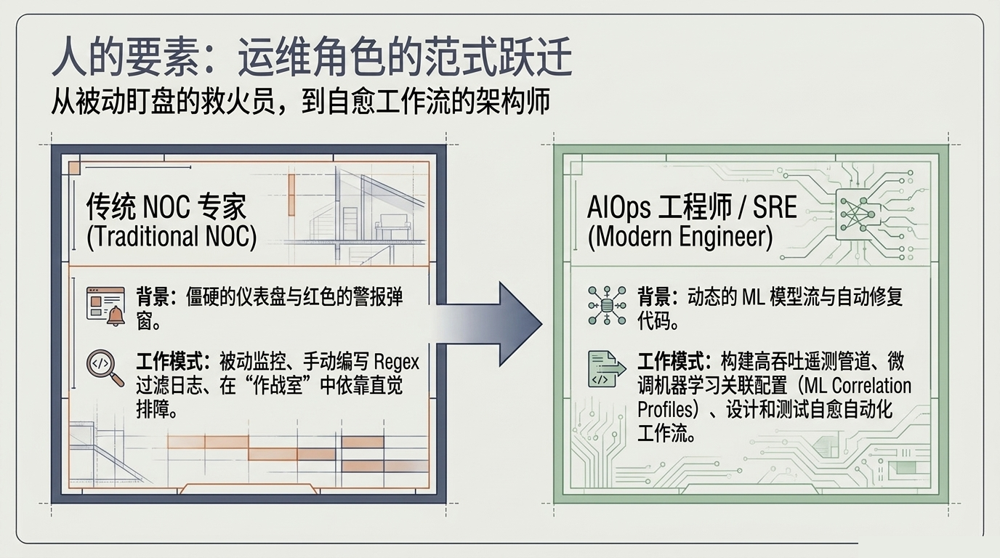

传统 NOC 工程师面对的是僵硬的仪表盘和满屏红色报警。他们在"作战室"里靠直觉排障，手动写 Regex 过滤日志。

而今天的 AIOps 工程师，在构建高吞吐的遥测管道。他们在微调 ML 关联配置——不是写规则，是"教模型"。他们在设计和测试自愈自动化工作流——不是修机器，是"编剧本"。

从"救火员"到"架构师"——这个转变不只是 title 的变化，是工具把人解放出来去做更有价值的事。

---

## 企业落地 AIOps，别只盯着技术

我见过最惨的 AIOps 项目长什么样？CTO 拍板买了一套 SaaS，运维团队被迫从零开始搭数据管道。三个月后，因为数据质量和组织协作的问题，项目凉了。

AIOps 的落地，从来不是技术问题。它是组织问题。

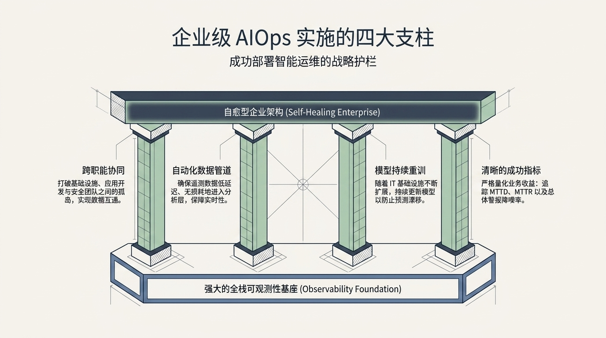

我把企业级 AIOps 实施的框架总结为四根柱子：

**基座：全栈可观测性。** 没有高质量的数据，AI 就是瞎子。这是所有上层建筑的入场券，通不过这一关就什么都别谈。

**支柱 1：跨职能协同。** 基础设施、应用开发和安全团队之间的信息孤岛不打通，AI 再强也拼不出全局图。不是技术问题，是人的问题。

**支柱 2：自动化数据管道。** 数据丢了晚了脏了，AI 的判断就会跟着错。这个看起来基础的事，其实是最容易出问题的环节。

**支柱 3：模型持续重训。** IT 基础设施在变，业务模式在变，去年训练好的模型今年可能就不准了。持续重训不是可选项，是必选项。

**支柱 4：清晰的成功指标。** MTTD（平均检测时间）、MTTR（平均修复时间）、警报降噪率——每项都要量化追踪。没有数据就谈不上优化。

这四根柱子少一根都盖不起"自愈型企业"那座房子。

---

## 终极形态：闭环

前面说了隔离、预警、分析、修复——这些单点能力。它们的终极组合形态是一个闭环。

说"闭环"可能有点抽象，我换个说法：**系统自己看病、自己开药、吃完药自己量体温。然后记下来这次的经验，下次病得更快。**

这就是 AIOps 想要达到的状态。

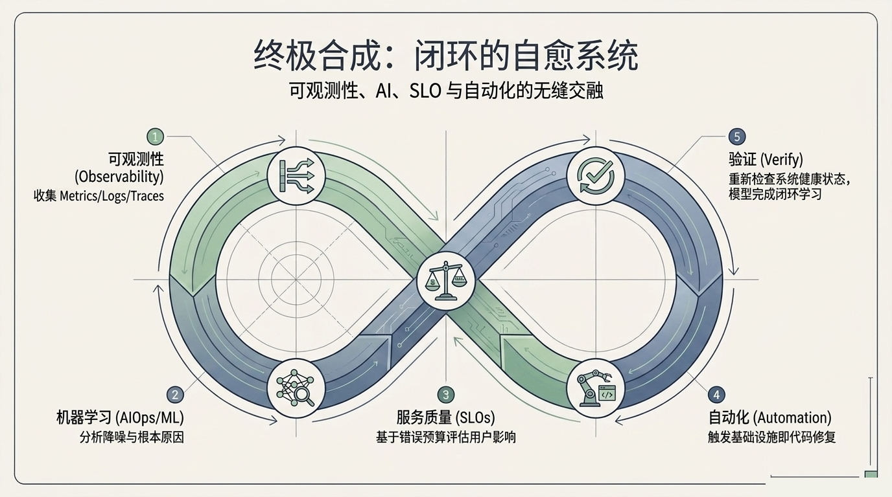

这个∞字形循环有五个节点：

**① 可观测性** —— 先"看"。收集 Metrics、Logs、Traces，全面感知系统状态。

**② 机器学习分析** —— 再"想"。降噪、关联分析、找出根因。

**③ SLO 评估** —— 后"判"。基于错误预算判断这个故障值不值得响应的——不是所有异常都要拉人。

**④ 自动化修复** —— 然后"做"。触发 IaC 修复——扩容、回滚、重启。

**⑤ 验证** —— 最后"查"。确认修复结果，把反馈喂给模型，下次会更好。

五个节点不是一次性走完就结束的。它是∞——持续运转、持续学习。

> "AIOps 并不是要取代工程师；它清除了数字世界的噪音，让工程师得以腾出手来，去架构企业的未来。"

这是我见过对 AIOps 最好的定义。它不是来抢饭碗的。它是来拔掉那些凌晨三点的骚扰电话，让真正懂系统的人，可以把精力放在真正值得做的事上。

---

## 术语备忘

如果你刚接触 AIOps，这些词可以当速查用：

| 术语 | 一句话解释 |
|------|-----------|
| AIOps | AI for IT Operations，用机器学习做运维 |
| Alert Fatigue | 假警报太多导致的"狼来了"综合征 |
| APM | 应用性能监控，盯你的代码跑得慢不慢 |
| Burn Rate | 错误预算的消耗速度，越快越要重视 |
| Error Budget | SLO 里你被允许"犯错"的那部分空间 |
| IaC | 基础设施即代码，用代码管服务器配置 |
| MTTD / MTTR | 平均检测时间 / 平均修复时间 |
| Observability | 可观测性，不问也知道系统出了什么问题的能力 |
| OpenTelemetry | 统一收 Metrics/Logs/Traces 的开源标准 |
| RCA | 根本原因分析，找到"到底为什么" |
| Runtime Guardrails | 运行时护栏，防止 AI 做出危险操作的实时拦截器 |
| SLO / SLI / SLA | 服务质量目标 / 指标 / 协议 |
| SRE | 站点可靠性工程，Google 提出的运维方法论 |
| TSDB | 时间序列数据库，专门存时序数据的数据库 |
