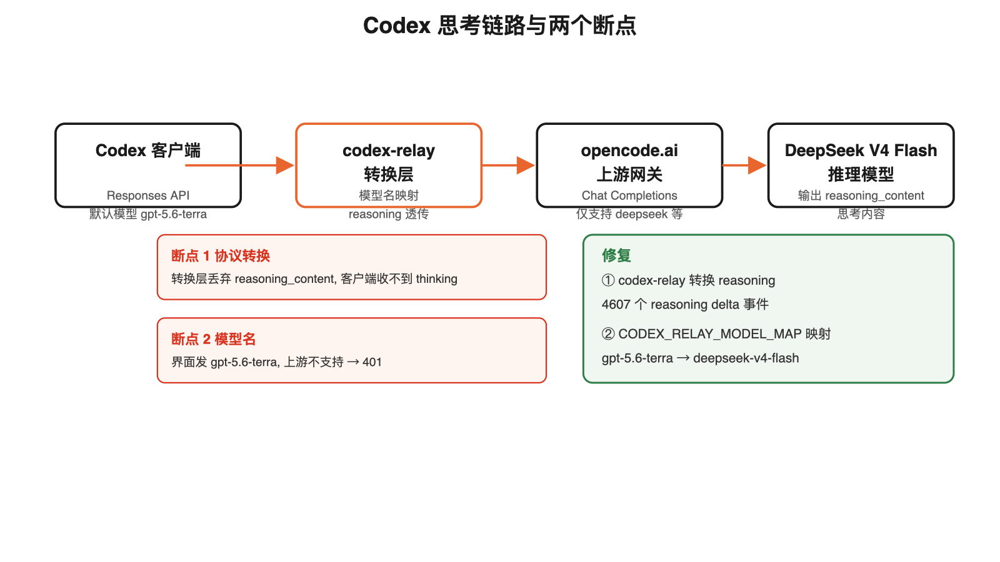
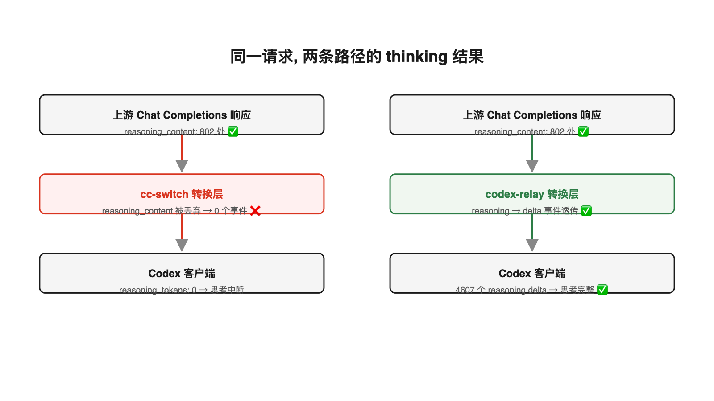

推理模型（DeepSeek V4 Flash、Kimi K2 等）在生成正式回答前会先输出一段思考内容。这段内容在 API 层有专门的字段承载：OpenAI 风格接口叫 `reasoning_content`，Responses API 里以 `response.reasoning_summary_text.delta` 事件流式下发。当客户端与上游服务使用不同协议时，思考内容的跨协议透传就成了一个隐蔽的断点。



## 现象

Codex 客户端（ChatGPT.app 内置版，0.146.0-alpha.9.2）通过 cc-switch 本地代理接入 opencode.ai 的 DeepSeek V4 Flash 时，模型思考内容输出到一半会突然停止，界面无报错。请求状态码是 200，但内容不完整。

## 排查路径

### 第一步：确认上游有 thinking

直连 opencode.ai 的 Chat Completions 端点（`/zen/go/v1/chat/completions`），请求带 `stream: true`：

- 响应含 **802 处 `reasoning_content`** 字段
- `completion_tokens_details.reasoning_tokens` 正常计数

上游模型本身完整输出思考内容，问题不在模型。

### 第二步：定位到协议转换层

Codex 客户端只发送 Responses API 格式（新版 Codex 已移除 `wire_api = "chat"` 选项，二进制内明确报错 "wire_api = chat is no longer supported"）。cc-switch 代理负责把 Responses 请求转成 Chat Completions 发给上游，再把响应转回。

走代理请求后对比：

| 路径 | thinking 结果 |
|------|--------------|
| 直连 `/zen/go/v1/chat/completions` | 802 处 `reasoning_content` ✅ |
| 走 cc-switch 代理 + Responses API | `reasoning_tokens: 0`，0 个 reasoning 事件 ❌ |
| 直连 `/zen/go/v1/responses` | 流式请求返回 400 "Empty input messages" ❌ |

直连 responses 端点本身不可用（opencode.ai 的 `/zen/go/v1/responses` 实现把 `input` 字段解析失败，非流式请求返回的 `input_tokens` 仅 1，内容为无关输出），所以必须经过中间层转换。cc-switch 转换时把上游返回的 `reasoning_content` 丢弃了，客户端收不到 thinking 事件，表现为"思考到一半中断"。



另一个现象佐证转换层丢失：cc-switch 请求日志里同一会话的请求 98% 返回 200，但 `reasoning_tokens` 始终为 0——状态码正常不代表内容完整，流式内容在转换层被静默截断时客户端无从得知。

### 第三步：验证修复方案

`codex-relay`（Rust 写的 Responses ↔ Chat Completions 转换桥，crates.io 0.5.5）专门处理 reasoning 透传。本地启动后实测：

- 流式思考任务：收到 **4607 个 `response.reasoning_summary_text.delta`** 事件
- 工具调用 + 思考：18 个 reasoning delta + `response.function_call_arguments.delta`
- 响应完整：`response.created` → `response.completed` 正常结束

Debug 日志确认转换过程：
```
← upstream stream reasoning chunks=18 bytes=71
← upstream stream function_calls=list_dir
```

## 模型名不匹配的第二个断点

接入后仍会偶发报错 `Model gpt-5.6-terra is not supported`。排查发现 ChatGPT.app 图形界面的 Codex 会话模型选择器只提供 GPT-5.6 系列（sol/luna/terra/pro），界面默认模型 `gpt-5.6-terra` 会覆盖 CLI 配置，而 opencode.ai 上游不支持该模型名。cc-switch 数据库的会话记录里，CLI 来源的会话模型为 `deepseek-v4-flash`，界面来源的会话模型为 `gpt-5.6-terra`，两类请求混在同一日志中，失败请求全部来自后者。

解决：在转换层做模型名映射，把界面会发的模型名统一映射到上游支持的模型：

```
gpt-5.6-terra → deepseek-v4-flash
gpt-5.6-luna  → deepseek-v4-flash
gpt-5.6-sol   → deepseek-v4-flash
```

codex-relay 通过环境变量 `CODEX_RELAY_MODEL_MAP` 配置映射，格式为 `源:目标,源2:目标2`，精确匹配后替换。映射后发送 `gpt-5.6-terra` 请求实测返回 200，思考事件 140 个正常透传。客户端侧响应中的模型名仍显示为请求时的原名，映射对调用方透明。

## 结构总结

```
Codex 客户端 (Responses API)
        │
        ▼
转换层 (codex-relay)
        │  ① 模型名映射 ② reasoning_content → reasoning delta 事件
        ▼
opencode.ai 上游 (Chat Completions)
        │
        ▼
DeepSeek V4 Flash
```

两条独立断点，缺一不可：协议转换层必须透传 reasoning 字段，模型名必须映射到上游支持的集合。

## 已知局限

- `codex-relay` 的模型映射通过环境变量 `CODEX_RELAY_MODEL_MAP` 配置，格式 `源:目标,源2:目标2`，精确匹配
- 上游 `gpt-5.6-terra` 等模型名在 opencode.ai 不支持，映射是绕行而非上游新增支持
- 思考过长的请求会消耗全部 `max_output_tokens` 配额，正文可能被截断，需要合理设置上限

## 出处

- codex-relay crates.io: https://crates.io/crates/codex-relay
- codex-relay 源码: https://github.com/MetaFARS/codex-relay
- OpenAI Responses API 文档: https://developers.openai.com/api/docs/guides/reasoning
- OpenCode Zen 模型列表: https://opencode.ai/docs/zen
- cc-switch 发布记录: https://github.com/farion1231/cc-switch/releases
