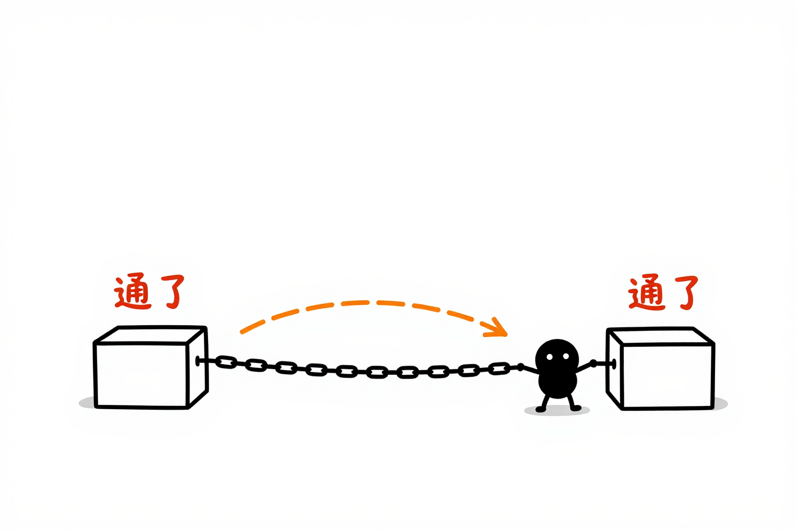
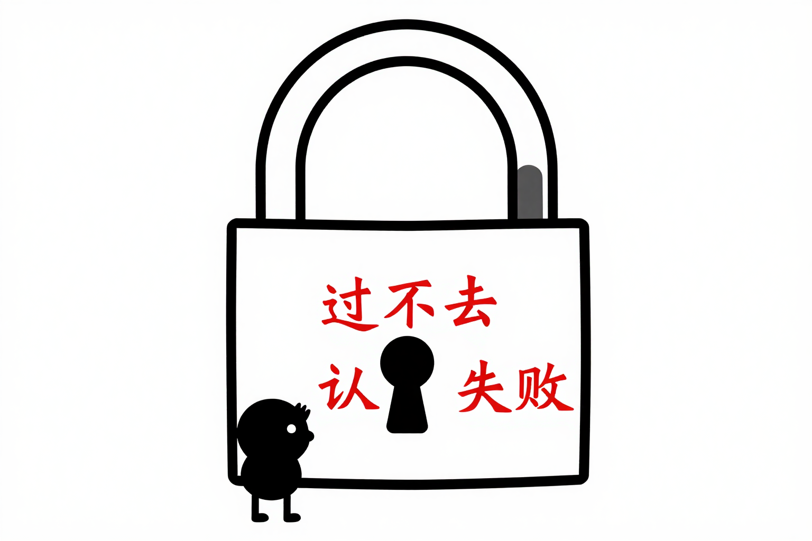
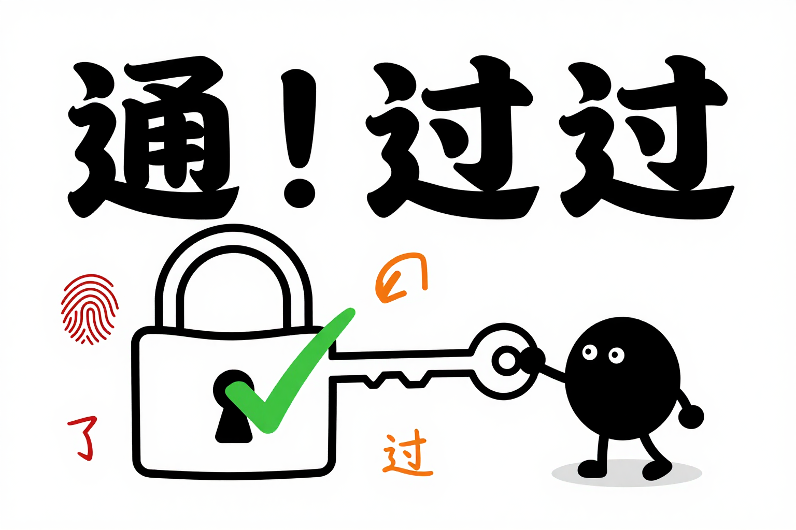
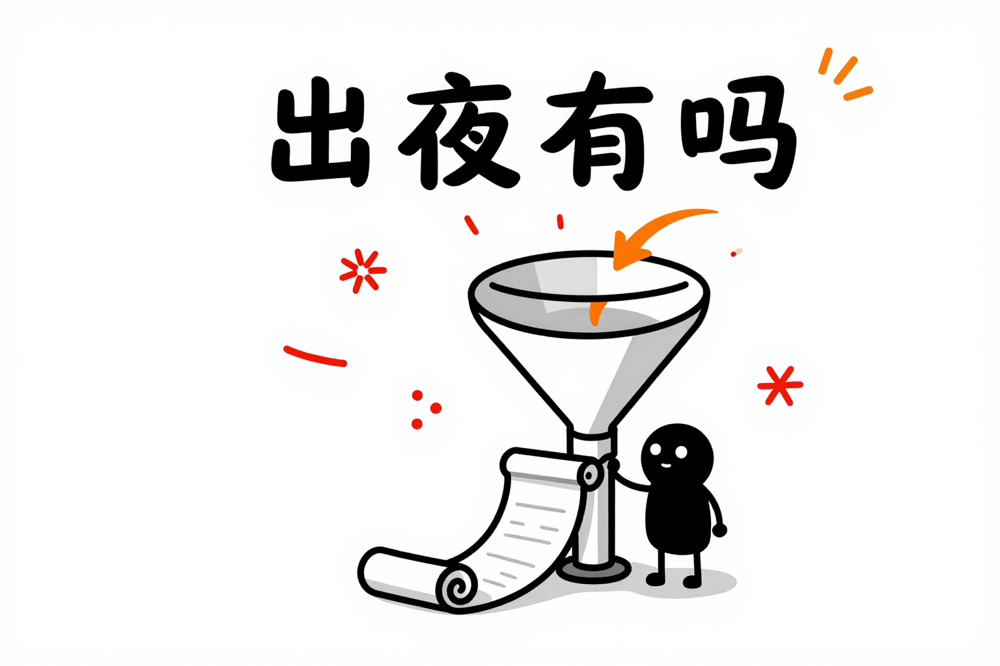

Hermes Agent 和 NotebookLM 的集成在社区里讨论了一段时间。核心工具是 `notebooklm-py`，一个非官方的 NotebookLM Python API 和 CLI。网上有不少教程，但实际走一遍会发现认证环节有几个坑需要绕过去。

本文记录从安装到可用的全过程，包含各条路径的尝试结果、踩到的坑和最终的解决方案。



## 安装路径

`notebooklm-py` 有两个主要分支：

- **上游** `teng-lin/notebooklm-py` — 原版，更新频繁，功能最全
- **Fork** `win4r/notebooklm-py` — 针对 Hermes Agent 做了适配，但版本滞后

两条路径的对比：

| 项目 | win4r fork (v0.3.4) | upstream (v0.7.3) |
|------|---------------------|-------------------|
| Hermes Skill | 有现成 SKILL.md | 需手动安装 |
| `auth refresh` 命令 | 无 | 有 |
| `NOTEBOOKLM_TRANSPORT` | 无 | 支持 |
| SIDTS 刷新 | 无 | 内置 |
| 安装方式 | `hermes skills install` | `pip install notebooklm-py` |

最终采用的是：走 Hermes 注册 skill，但 Python 包升级到 upstream v0.7.3。

## 认证流程的三次尝试

### 第一次：rookiepy 提取 Cookie

`notebooklm-py` 的 `[cookies]` 扩展使用 `rookiepy` 从 Chrome 的 cookie 数据库读取 Google 登录态。

```bash
pip install "notebooklm-py[cookies]"
notebooklm login --browser-cookies chrome
```

结果：
```
Extracted cookies: 92 cookies
Token fetch: ✗ fail  →  Authentication expired
```

`rookiepy` 成功读到了 Chrome 的 cookie 文件，提取了 92 个 Google 相关 cookie。`notebooklm doctor` 也显示 SID cookie 存在。但实际的 API 请求（`notebooklm list`）始终返回 Google 登录页重定向。

### 第二次：Kimi WebBridge CDP 提取

本机的 Kimi WebBridge daemon 已经运行（v1.11.3），通过它直接调用 Chrome DevTools Protocol 的 `Network.getAllCookies`，获取实时浏览器会话中的 cookies。

```
CDP Network.getAllCookies → 927 cookies
关键认证 cookie 全部存在: SID, __Secure-1PSID, __Secure-1PSIDTS, SIDCC
```

但即使是从**正在运行的 Chrome 实时会话**中提取的 cookies，`notebooklm list` 仍然报认证失败。这排除了"cookie 过期"的可能——问题不在 cookie 本身。



### 第三次：升级版本 + auth refresh

NotebookLM 的服务端使用了额外的反自动化检测，核心是 TLS 指纹识别。`notebooklm-py` 默认使用 Python 的 `httpx` 库发送 HTTP 请求，其 TLS 指纹与 Chrome 不同，被 Google 的 auth 系统识别为非浏览器流量并拦截。

解决方案来自 upstream 的 troubleshooting 文档：

> When the trigger is the non-browser fingerprint (a raw HTTP client) rather than the IP, the opt-in browser-TLS-impersonation transport can help.

具体操作：

```bash
# 1. 升级到最新版
pip install notebooklm-py --upgrade

# 2. 安装浏览器 TLS 指纹模拟库
pip install curl_cffi

# 3. 启用浏览器指纹传输层
export NOTEBOOKLM_TRANSPORT=curl_cffi

# 4. 刷新 SIDTS 令牌
notebooklm auth refresh
```

`auth refresh` 会对 NotebookLM 的 SIDTS cookie（Secure ID Timestamp Sync，Google 用于会话续期的内部 token）进行服务端刷新。刷新后：

```
notebooklm list → ✅ 成功列出 73 个笔记本
```

`NOTEBOOKLM_TRANSPORT=curl_cffi` 作为持久的 TLS 指纹模拟层，加入 `~/.hermes/.env` 使其在所有会话中生效。



## 最终架构

```
用户输入 / 自然语言
        │
        ▼
Hermes Agent (笔记本LM Skill)
        │
        ▼
notebooklm-py CLI (v0.7.3)
        │
        ├── 传输层: NOTEBOOKLM_TRANSPORT=curl_cffi (TLS 指纹模拟)
        │
        ▼
NotebookLM / Gemini Notebook API
        │
        ├── Notebook 管理 (create/list/delete)
        ├── Source 导入 (URL/PDF/YouTube)
        ├── Artifact 生成 (播客/幻灯片/视频/思维导图/博客)
        └── Chat/Ask 问答
```

## 笔记生成测试

用"Graph Intelligence and Ontology Development for Generative AI"笔记本（96个来源）做了一次完整的笔记生成测试：

```bash
notebooklm use "07ae76dd"
notebooklm generate report --format blog-post --language zh_Hans --wait
```

NotebookLM 基于 96 个来源自动生成了一篇 8 章节的中文博客文章，包含技术参数对比、工具清单和行动建议。整个过程不需要离开终端。



## 已知限制

- Cookie 有过期时间，需要定期用 `auth refresh` 续期
- `curl_cffi` 不可用时需回退到 `notebooklm login` 交互式登录
- Hermes Agent 的内置 skill win4r 分支停留在 v0.3.4，需手动升级 Python 包
- 非浏览器 HTTP 客户端被 Google 反滥用系统拦截是普遍现象，`notebooklm-py` 的 issue 区有大量同类报告

## 出处

- notebooklm-py GitHub: https://github.com/teng-lin/notebooklm-py
- Kimi WebBridge: https://kimi.com/features/webbridge
- troubleshooting 文档（认证错误章节）: https://github.com/teng-lin/notebooklm-py/blob/main/docs/troubleshooting.md
- Hermes Agent 官方文档（Skills 系统）: https://hermes-agent.nousresearch.com/docs/user-guide/features/skills
