> 这是一份面向 CTO / AI 架构师 / 高级开发者的 2026 AI Agent 工程化蓝皮书，系统解构 Agent 架构的核心范式、框架选型与生产治理策略。

---

## 一、自治力光谱：从 LLM 调用到完全自治

AI Agent 的自治程度从单次 LLM 调用到完全自主系统，横跨五个等级。Level 1 是确定性编码，Level 5 代表系统完全自主决策与执行。

核心判据：**传统的硬编码治理模型在 Agent 时代彻底失效**，企业需要建立新的观测、评估与干预体系。

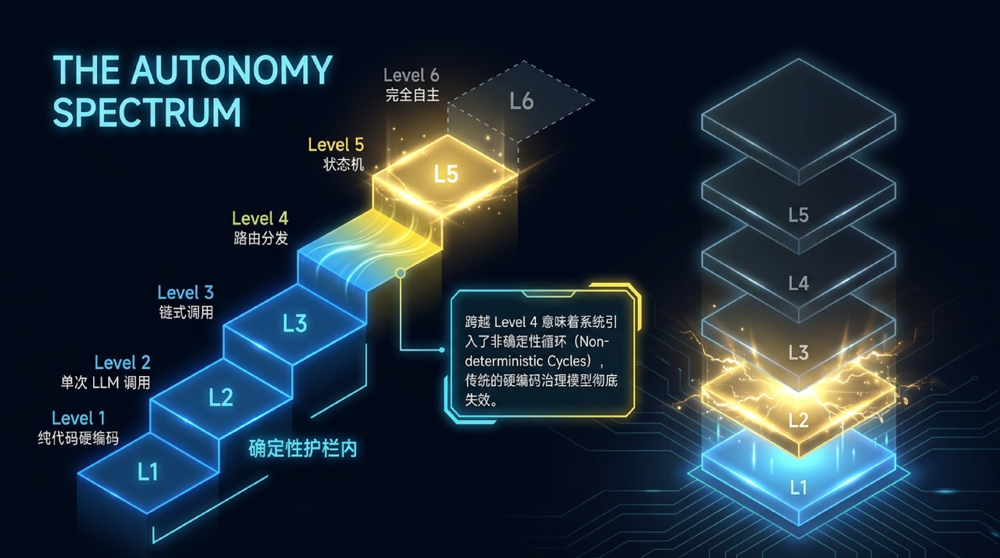

---

## 二、智能体系统解构

现代 Agent 由五大核心模块构成：

1. **LLM 认知引擎** — 大模型作为推理与决策的核心
2. **规划模块 (Planning)** — 任务分解与路径规划
3. **感知模块 (Perception)** — 接收外部环境信号
4. **记忆模块 (Memory)** — 短期上下文与长期向量存储
5. **工具执行模块 (Tool Execution)** — 连接外部物理世界

> 大模型无法直接操作物理世界。它负责输出结构化的参数提案（Schema Proposals），宿主程序负责拦截、校验并执行真正的系统调用。

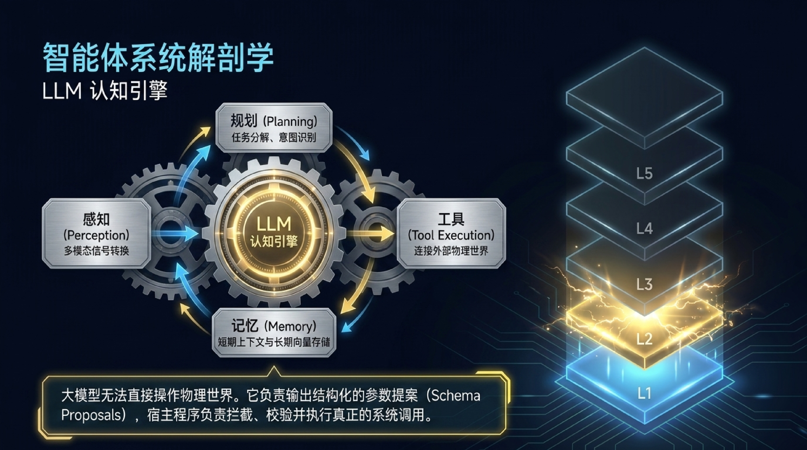

---

## 三、框架对决：ReAct vs Plan-and-Execute

两种主流的 Agent 推理模式各有适用场景：

| 模式 | 适用场景 | 特点 |
|------|---------|------|
| **ReAct**（思考-行动闭环） | 动态未知环境 | 边想边做，灵活应对变化 |
| **Plan-and-Execute**（预先规划） | 静态可分解任务 | 先规划后执行，路径可预期 |

选择的关键在于环境的**确定性程度**和任务的**可分解性**。

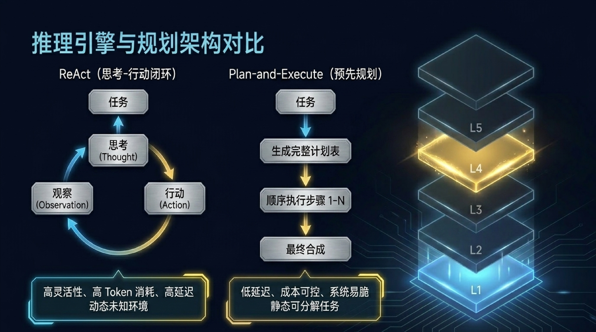

---

## 四、记忆架构：短期与长期记忆体系

记忆是 Agent 智能的基石，分为三个层次：

- **短期记忆** — 上下文窗口（Context Window），面临上下文腐败（Context Rot）风险
- **长期记忆** — 三大类型：
  - **情景记忆 (Episodic)**：历史交互事件序列
  - **语义记忆 (Semantic)**：结构化事实与知识
  - **程序记忆 (Procedural)**：沉淀的技能与操作流程

**Redis Iris** 亚毫秒级实时上下文引擎，将向量检索与高速缓存结合，突破 Agent 记忆瓶颈。

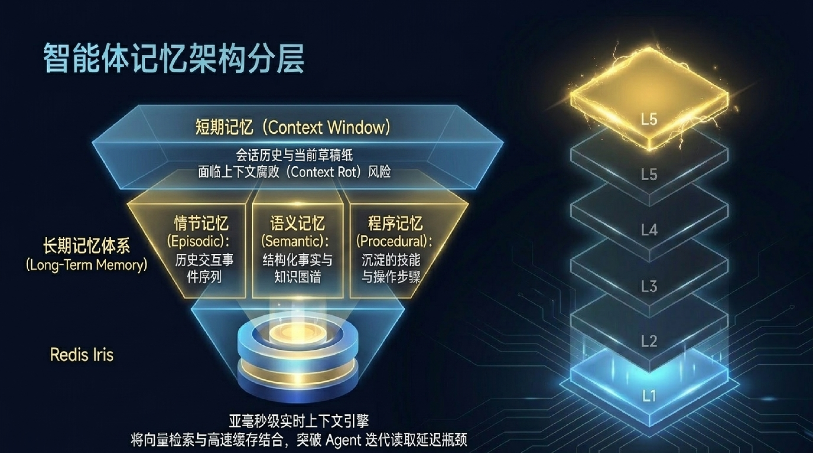

---

## 五、工具集成与 MCP 协议

MCP（Model Context Protocol）被誉为 AI 界的 USB-C——统一了 Prompts、Resources、Tools 三大原语，让 Agent 与外部工具解耦。

关键设计模式：
- **渐进式公开 (Progressive Disclosure)** — Agent 动态请求工具说明，不再将万行表格强塞上下文
- **沙箱执行 (Sandboxed Execution)** — 在隔离环境中执行 Python 数据处理

> 工具定义的边界，决定了 Agent 智商的上限。

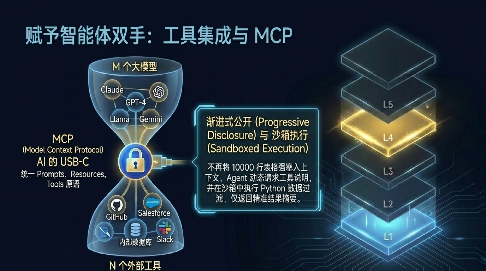

---

## 六、从单体到多智能体微服务生态

单一全能智能体已被淘汰，2026 年的突破在于多智能体协作：

**拓扑 A：层级编排 (Hierarchical Orchestration)**
- 主控节点（Orchestrator）分配任务给执行节点
- 问责制清晰，适合明确的步骤分解

**拓扑 B：扁平协作 (Collaborative / Peer-to-Peer)**
- 专家节点通过事件队列环状连接
- 灵活性高，适合辩论、代码审查等发散性任务
- 需严控 Token 消耗

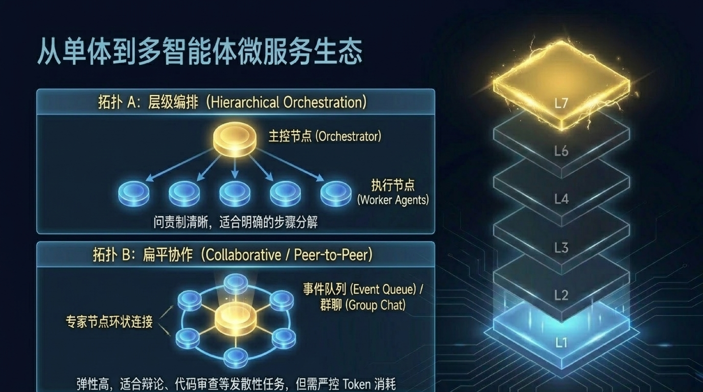

---

## 七、2026 Agent 框架选型对比

| 框架 | 核心模式 | 优势 | 挑战 |
|------|---------|------|------|
| **LangGraph** | 状态图（State Graph） | 原生 Checkpoint、时间旅行调试、显式控制 | 学习曲线最陡峭 |
| **CrewAI** | 角色扮演团队协作 | 快速搭建多智能体原型 | Token 消耗极高、黑盒调试难 |
| **LlamaIndex** | 事件监听驱动 Workflows | 文档分类与路由最佳选择 | 专注检索场景 |
| **Pydantic AI** | 原生类型验证 | 无需框架抽象税 | 需要较强的类型系统功底 |
| **Vercel AI SDK** | React 状态无缝绑定 | Agent 前端应用利器 | 局限 JS 生态 |

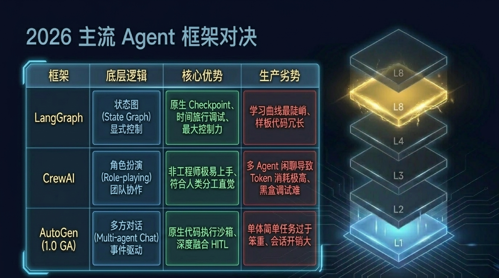

---

## 八、企业级自主智能体参考架构

企业级 Agent 系统采用六层架构，层层解耦：

- **Layer 6：治理与可观测性** — Agent Registry、IAM 权限、审计日志
- **Layer 5：工具集成层** — MCP Server、企业系统 API
- **Layer 4：记忆层** — Redis Session、向量数据库/知识图谱
- **Layer 3：执行层** — Agent 运行时与编排引擎
- **Layer 2：认知层** — LLM 推理与规划
- **Layer 1：基础设施层** — 算力、网络与存储

> 没有坚实的工具集成与治理层，Agent 必然在生产中崩溃。

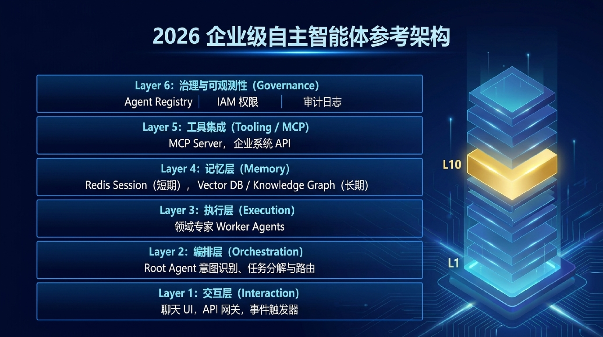

---

## 九、生产环境可观测性与自动化评估

如果你无法观测它，就不要部署它。生产环境的 Agent 必须具备：

**链路追踪 (Tracing / Spans)**
- 可视化节点耗时、Token 消耗与工具内部报错

**自动化评估漏斗 (LLM-as-a-Judge)**
- **忠实度 (Faithfulness)**：回答是否严格基于检索到的上下文
- **相关性 (Relevance)**：动作是否精准对应用户意图
- **工具精确度 (Tool Accuracy)**：Schema 参数是否 100% 匹配

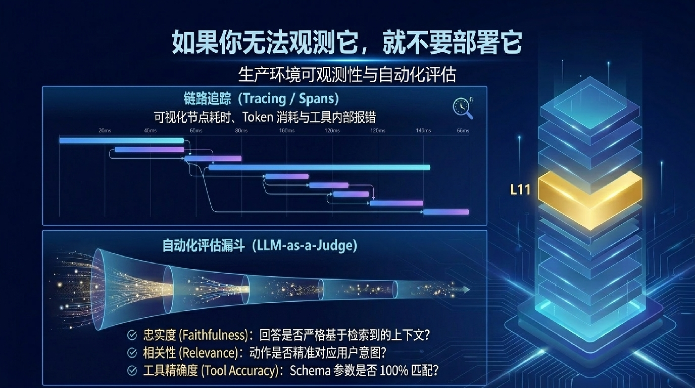

---

## 十、生产部署的红线守护机制

| 机制 | 说明 |
|------|------|
| **预算超载阻断** | 强制设定最大迭代次数与 Token 上限，遇无限循环自动触发 Kill Switch |
| **隔离执行** | Docker 隔离环境，防止恶意工具调用影响宿主 |
| **密码学防篡改审计** | 针对金融级合规，记录不可变哈希链 |

> 先搭建 Tracing 与 Evals 漏斗，再编写第一行核心业务逻辑。

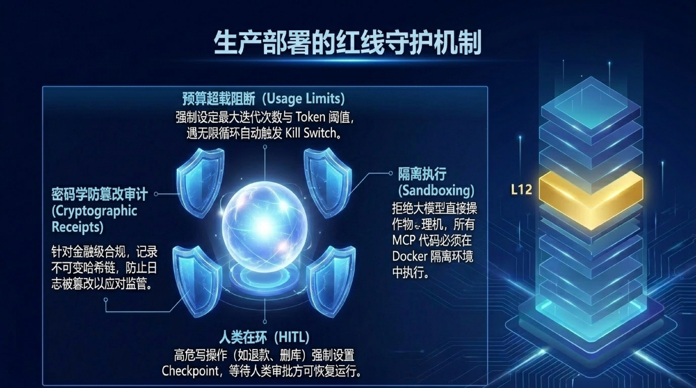

---

## 十一、下一步行动：三大原则

### 原则一：克制复杂性
不要为了多智能体而多智能体。**80% 的真实业务需求**，单 Agent 配合优质 Tool 与强 Prompt 即可解决。

### 原则二：关注控制流与数据
框架只是外衣，决定 Agent 智商上限的是**工具定义的边界**，以及底层传递给模型的上下文纯净度。

### 原则三：可观测性优先
先搭建 Tracing 与 Evals 漏斗，再编写第一行核心业务逻辑。**生产验证先行，功能开发在后。**

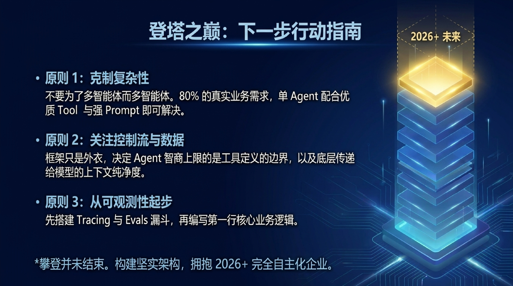

---

## 结语

2026 年的 AI Agent 工程化已从"提示词工程"进入"系统工程"时代。企业成功的关键不在于选择最强大的模型或最流行的框架，而在于建立**可观测、可治理、可演进**的 Agent 基础设施。

> Agent 时代的架构，已从单纯的提示词工程，转向系统性的架构工程。
