将野生的 AI 驯化为企业级开发团队。告别"许愿式"对话编程，搭建属于你的数字化流水线。

无约束的 AI 就像脱缰的野马，代码越多，智商越低。终端上下文占用率持续攀升，最终导致 AI 输出退化。

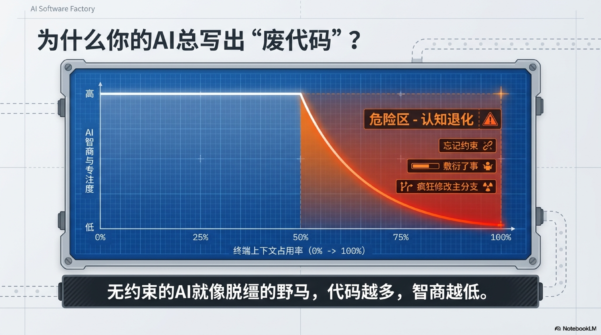

## 数字化开发团队

Comet（项目经理）决定流程控制（WHEN），OpenSpec 决定"做什么"（WHAT），Superpowers 决定"怎么做"（HOW）。三者各司其职，构成完整的工业化开发流水线。

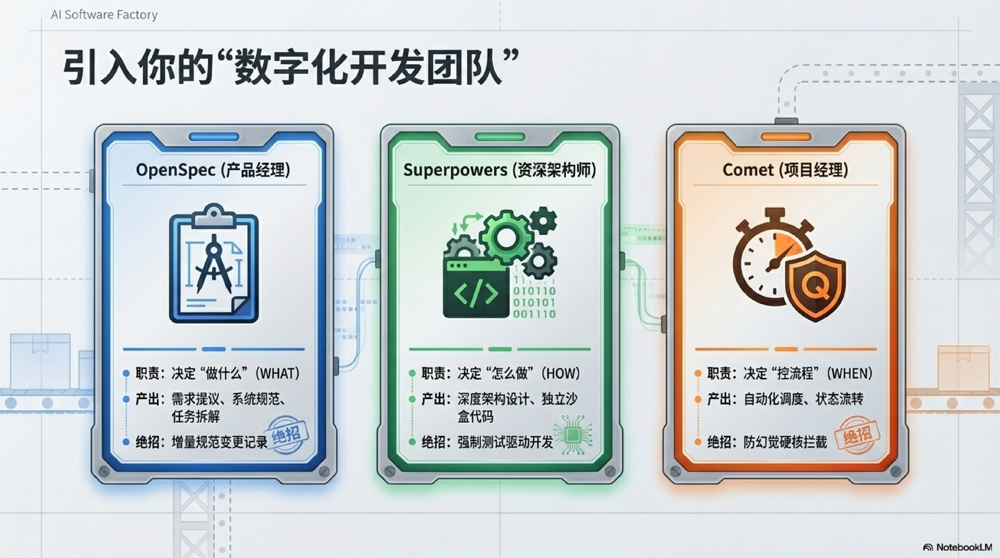

## 从许愿式编程到工业化

| 维度 | 许愿式编程 | AI Software Factory |
|------|-----------|-------------------|
| **开发起点** | 直接写代码，边写边猜 | 强制深度设计，共识先行 |
| **代码隔离** | 直接污染主干分支 | Git Worktree 独立安全沙盒 |
| **测试与质量** | 几乎没有测试，随缘跑通 | 强制 TDD |
| **错误排查** | 越改越乱，陷入死循环 | 结构化可追溯，知识可沉淀 |

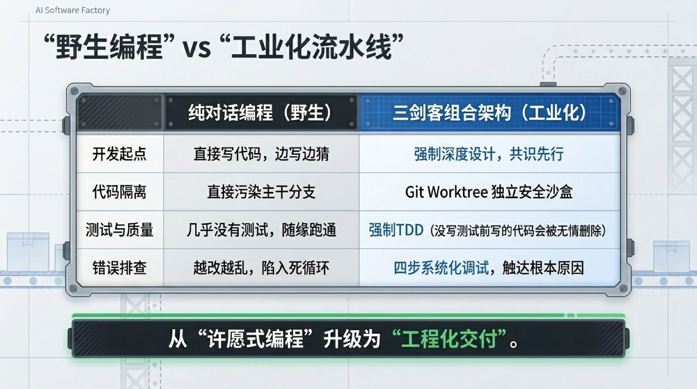

## Phase Guard：阶段守卫

Comet 内置阶段守卫机制，在关键入口扫描 `.comet.yaml` 状态文件、校验产物完整性、检查 Git 分支，拒绝违规通行。

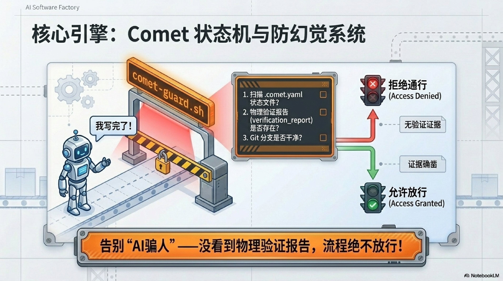

## 环境搭建

```bash
npm install -g @rpamis/comet
```

`comet init` 一键初始化工厂环境，自动扫描并激活 OpenSpec 与 Superpowers 插件，几分钟即可完成数字化工厂装配。

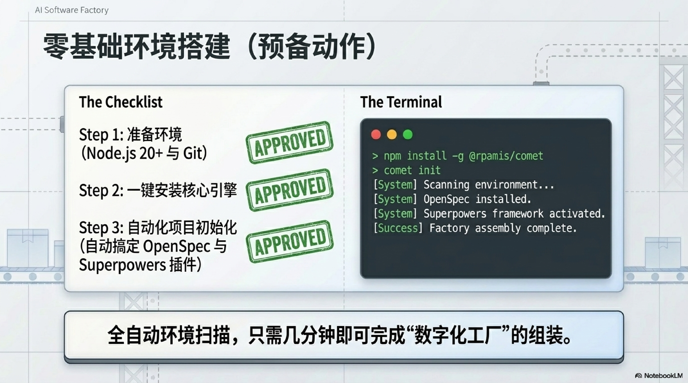

## 5 站式 SOP

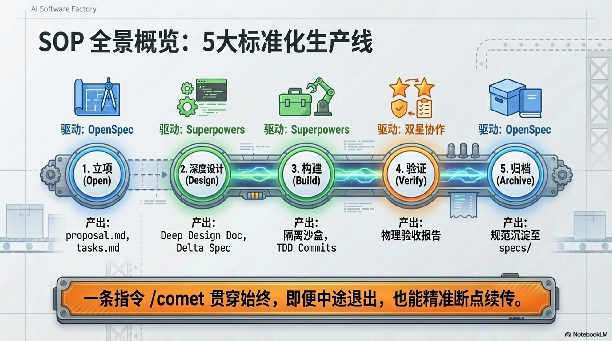

### 第 1 站：Open · 立项

明确需求边界，定义 In / Out of Scope。产出 proposal.md、design.md、tasks.md。

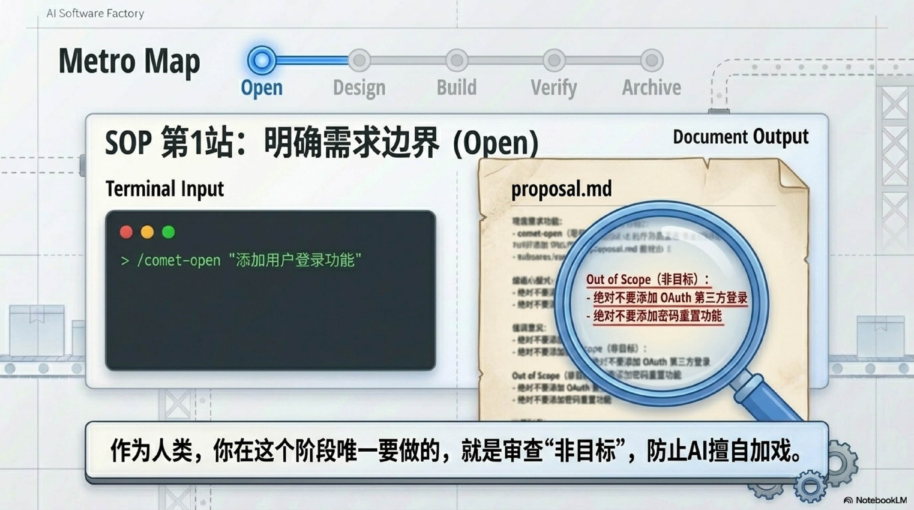

### 第 2 站：Design · 深度设计

苏格拉底式深度设计，在写代码前充分论证方案。JWT 还是 Session？是否需要分页？产出 Design Doc 和 Delta Spec。

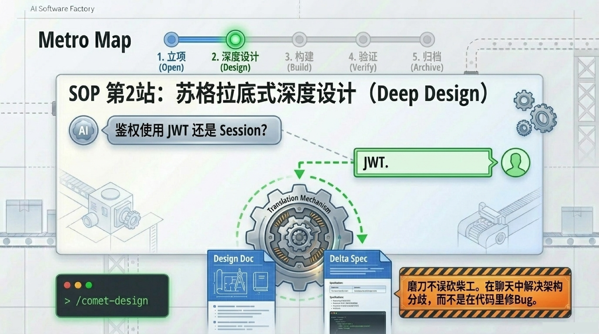

### 第 3 站：Build · 沙盒构建

将大需求拆解为 2-5 分钟的微任务，在 Git Worktree 隔离沙盒中 TDD 驱动。每个 task 强制红-绿-重构循环。

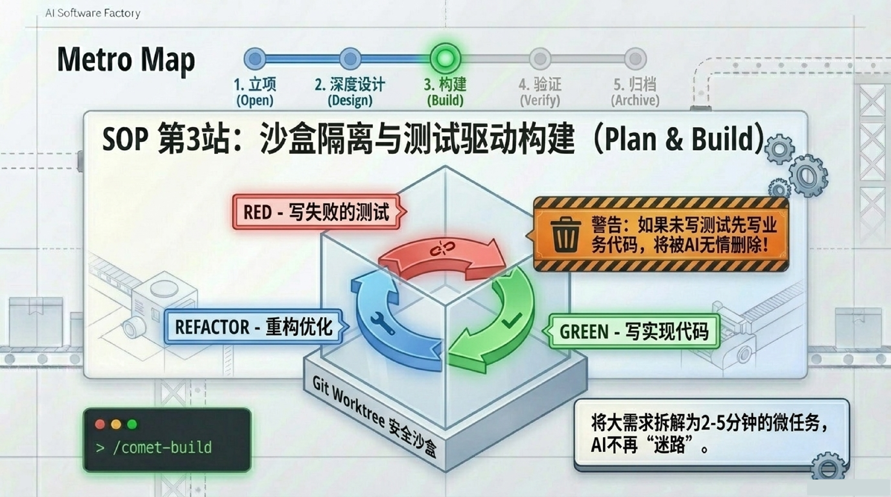

### 第 4 站：Verify · 验证

物理验收确保实现符合设计。双重 Code Review + Spec Compliance 检查，防止过度设计和性能浪费。

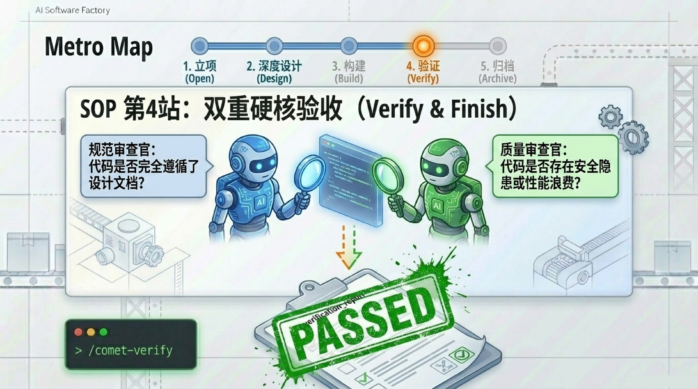

### 第 5 站：Archive · 归档

增量规范合并至主 Spec，变更永久可追溯。你的代码不再是一次性消耗品，未来的 AI 随时能看懂代码的前世今生。

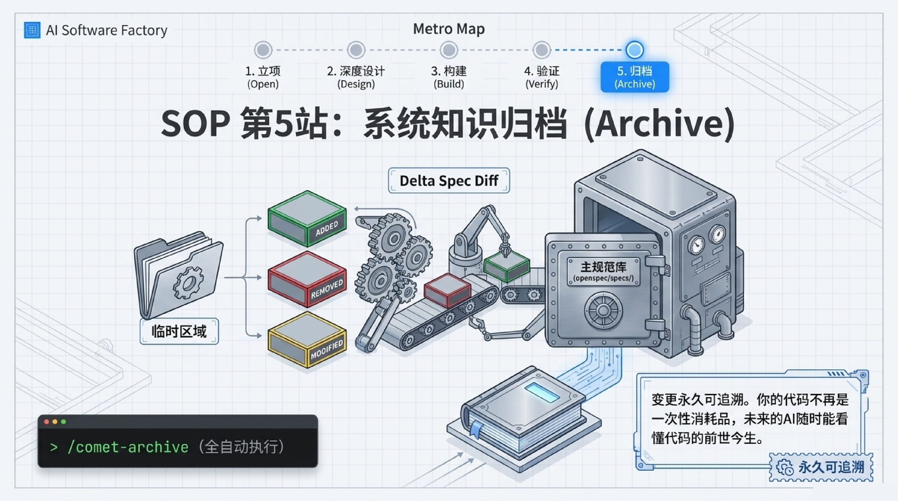

## 实战演练

划定明确边界（绝不触碰原有主干逻辑）→ TDD + 幂等性测试确保防刷单 → 前后端 API 毫秒级差异通过 Delta Spec 完整记录 → 高并发瓶颈（Redis 缺失）标注归档。

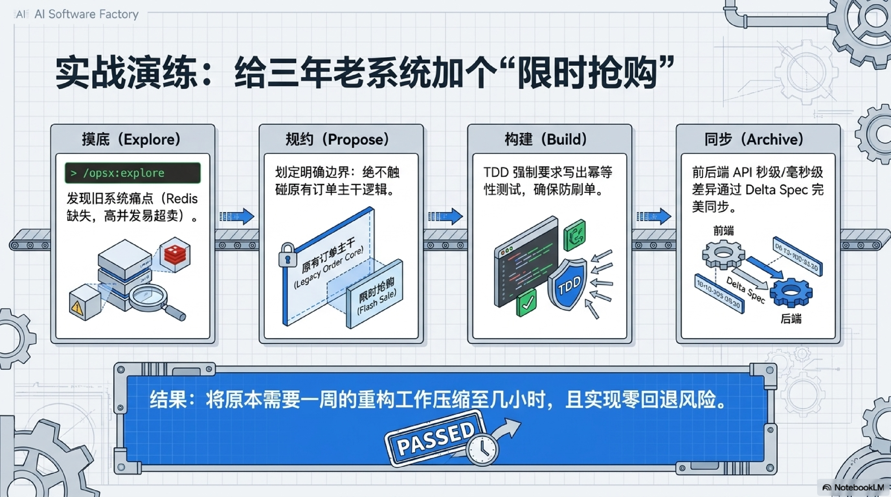

## 新手厂长避坑指南

- **控制任务粒度**：确保 tasks.md 中每个任务在 2-5 分钟内完成。任务越小，AI 失控概率越低
- **管理 Token 预算**：强烈建议使用高推理模型（如 Claude Opus 4.7），为企业级交付准备充足预算
- **保持上下文卫生**：定期清理终端历史，不要在一个会话中无限积累无用对话，防止 AI 认知退化

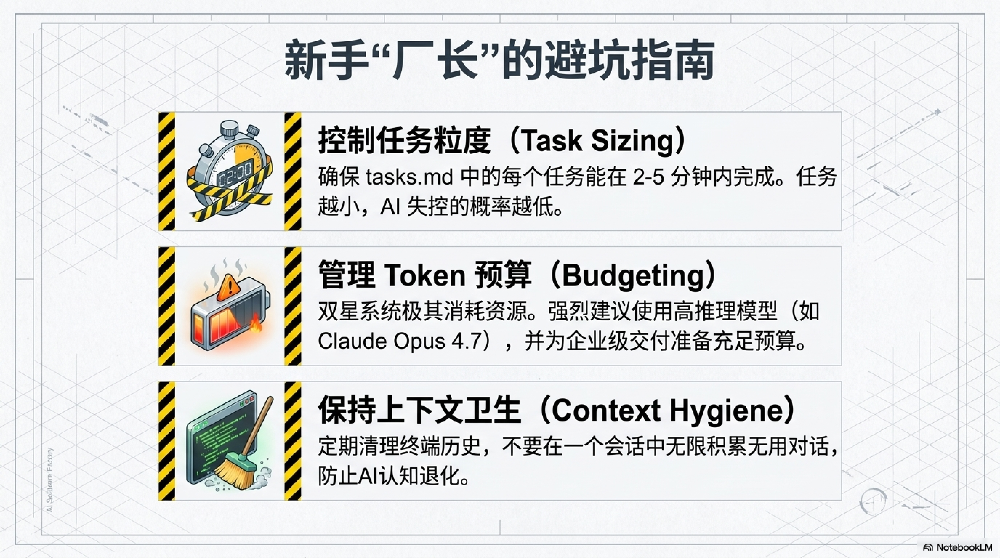

## 命令速查

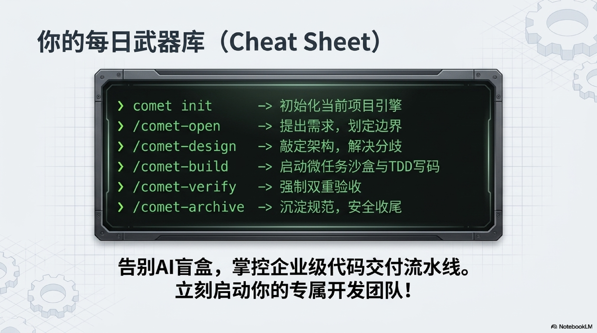

| 命令 | 功能 |
|------|------|
| `comet init` | 初始化工厂环境 |
| `/comet-open` | 立项 |
| `/comet-design` | 深度设计 |
| `/comet-build` | 沙盒构建 + TDD |
| `/comet-verify` | 验证与收尾 |
| `/comet-archive` | 归档沉淀 |
