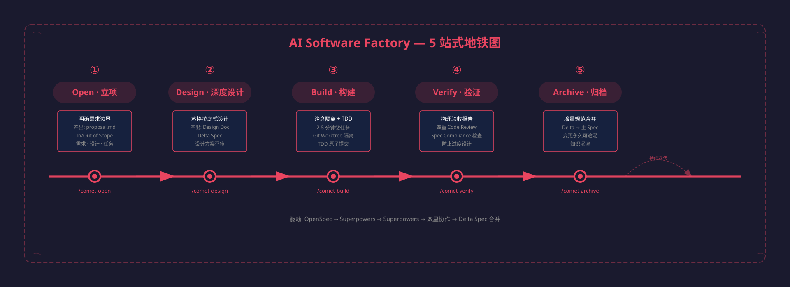
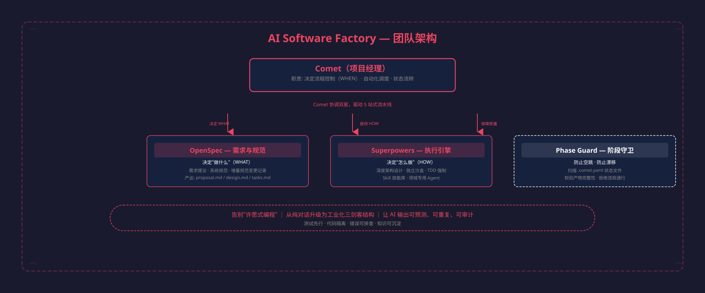

## 概述

将野生的 AI 驯化为企业级开发团队。告别"许愿式"对话编程，搭建属于你的数字化流水线。

核心问题：无约束的 AI 就像脱缰的野马，代码越多，智商越低。终端上下文占用率持续攀升，最终导致 AI 输出退化。



## 数字化开发团队



## 从许愿式编程到工业化

| 维度 | 许愿式编程 | AI Software Factory |
|------|-----------|-------------------|
| **开发起点** | 直接写代码，边写边猜 | 强制深度设计，共识先行 |
| **代码隔离** | 直接污染主干分支 | Git Worktree 独立安全沙盒 |
| **测试与质量** | 几乎没有测试，随缘跑通 | 强制 TDD（没写测试前写的代码会被删除） |
| **错误排查** | 越改越乱，陷入死循环 | 结构化可追溯，知识可沉淀 |

## 5 站式 SOP 详解

### 第 1 站：Open · 立项

明确需求边界，产出需求提案。

```
驱动: OpenSpec
产出: proposal.md, design.md, tasks.md
命令: /comet-open
```

关键动作：定义 In Scope / Out of Scope，防止需求漫延。

### 第 2 站：Design · 深度设计

苏格拉底式深度设计，在写代码前充分论证方案。

```
驱动: Superpowers
产出: Deep Design Doc, Delta Spec
命令: /comet-design
```

关键问题：JWT 还是 Session？是否需要分页？并发控制怎么做？

### 第 3 站：Build · 沙盒构建

将大需求拆解为 2-5 分钟的微任务，在隔离沙盒中 TDD 驱动。

```
驱动: Superpowers
产出: 隔离沙盒, TDD 原子提交
命令: /comet-build
```

- Git Worktree 隔离，绝不污染主干
- 每个 task 强制 TDD（红 → 绿 → 重构）
- 双重验收：Spec Compliance + Code Quality

### 第 4 站：Verify · 验证

物理验收，确保实现符合设计，防止过度设计和性能浪费。

```
驱动: 双星协作
产出: 物理验收报告
命令: /comet-verify
```

- Spec Compliance 检查
- Code Review 双重审查
- 连续 3 次失败需用户确认策略

### 第 5 站：Archive · 归档

增量规范合并至主 Spec，变更永久可追溯。你的代码不再是一次性消耗品。

```
驱动: Delta Spec 合并
产出: 规范沉淀至 specs/
命令: /comet-archive
```

## 新手厂长避坑指南

### 控制任务粒度

确保 tasks.md 中的每个任务能在 2-5 分钟内完成。任务越小，AI 失控的概率越低。

### 管理 Token 预算

双星系统极其消耗资源。建议使用高推理模型（如 Claude Opus 4.7），并为企业级交付准备充足预算。

### 保持上下文卫生

定期清理终端历史，不要在一个会话中无限积累无用对话，防止 AI 认知退化。

## 命令速查

| 命令 | 功能 |
|------|------|
| `comet init` | 初始化工厂环境 |
| `/comet-open` | 立项，产出 proposal |
| `/comet-design` | 深度设计，产出 Design Doc |
| `/comet-build` | 沙盒构建 + TDD |
| `/comet-verify` | 验证与收尾 |
| `/comet-archive` | 归档，规范沉淀 |
| `comet-state check` | 上下文压缩恢复 |
| `comet-guard` | 阶段守卫校验 |
