基于 Claude Code `/loop` 与 Comet 框架的自动化架构设计与实战指南。

## 重复劳动的痛点

确定性、周期性、但耗费人类精力的任务——每小时检查 PR 评论、持续轮询部署状态、监控 CI 结果——这些工作在传统工具链下存在认知壁垒：缺少代码推理层面的判断、无法在异常时动态决策、与开发环境上下文割裂。

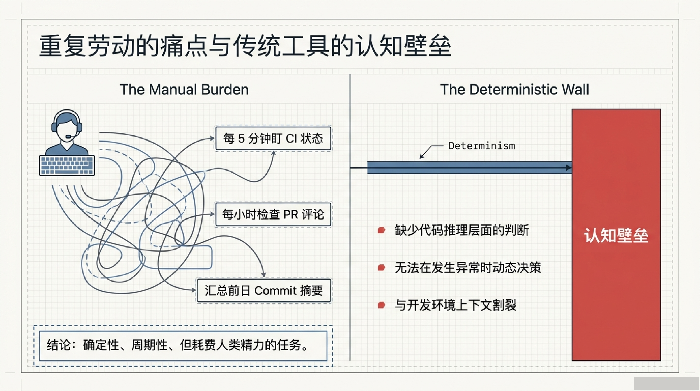

## 为什么需要 `/loop`

| 方案 | 问题 |
|------|------|
| Shell 死循环 | 没有智能决策，每次跑一样的东西 |
| CI 定时触发 | 仅限 CI 环境任务，缺少完整 AI 推理 |
| 系统 cron + `claude -p` | 需要管理认证状态、日志、错误处理 |

`/loop` 填补的是"有人值守的长期任务自动推进"这个空隙——具备智能决策能力、上下文感知、低部署摩擦力。

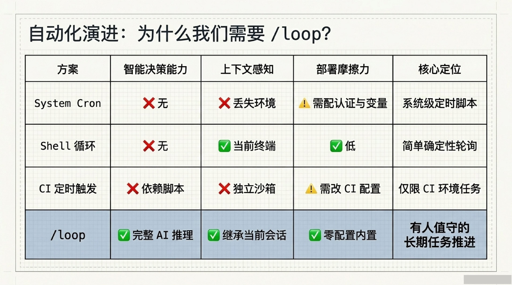

## `/loop` 核心机制

`/loop` 是 Claude Code 内置的会话级定时调度命令。本质是**会话级定时器**（Session-Scoped Cron），每次迭代执行完整的 Prompt → 工具调用 → 响应反馈流程。

- **生命周期绑定**：随 Claude Code 进程启动与退出
- **并发限制**：一个会话最多共存 50 个独立定时任务
- **TTL**：7 天后自动终止过期
- **上下文保持**：迭代之间保持完整对话上下文

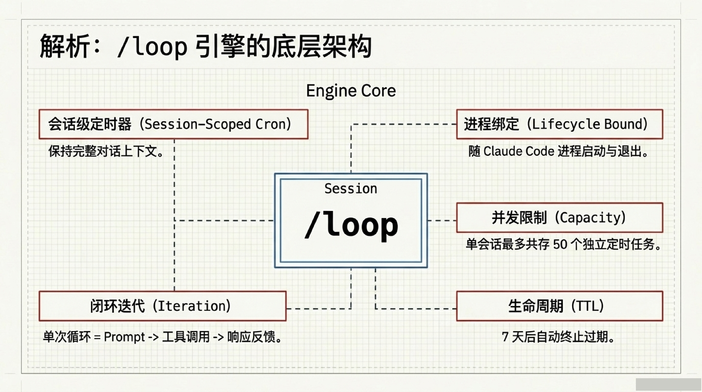

### 三种调用形式

| 参数形式 | 示例 | 行为 |
|---------|------|------|
| 间隔 + prompt | `/loop 5m check deploy` | 按固定间隔重复 |
| 仅 prompt | `/loop check deploy` | 动态间隔（1 分钟 ~ 1 小时） |
| 仅间隔 / 无参数 | `/loop` 或 `/loop 15m` | 执行内置维护 prompt |

三种运行模式：

> 动态间隔模式下 Claude 可能直接使用 Monitor 工具（后台脚本 + 流式输出），比轮询更高效。

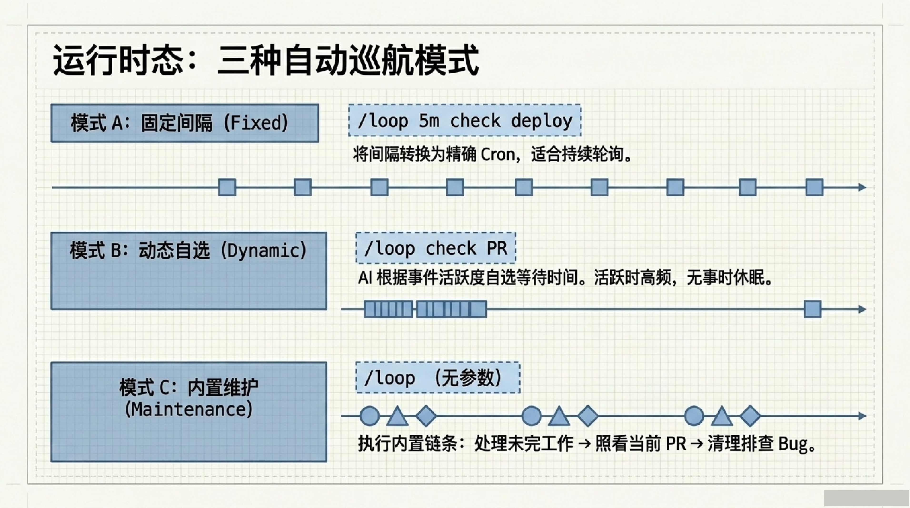

### 自定义 `.claude/loop.md`

用 `loop.md` 替换内置维护 prompt，定义你想要的自动化规则。

| 路径 | 优先级 | 作用域 |
|------|--------|--------|
| `.claude/loop.md` | 最高 | 项目级 |
| `~/.claude/loop.md` | 备选 | 用户级全局 |

特点：纯 Markdown 定义，无固定语法；支持热重载（保存修改后下次迭代立即生效）；大小限制 < 25KB。

```markdown
# 我的项目 loop

检查所有未提交的 Git 分支。
运行 npm run test 确保没有破坏性修改。
汇总结果并提醒我。
```

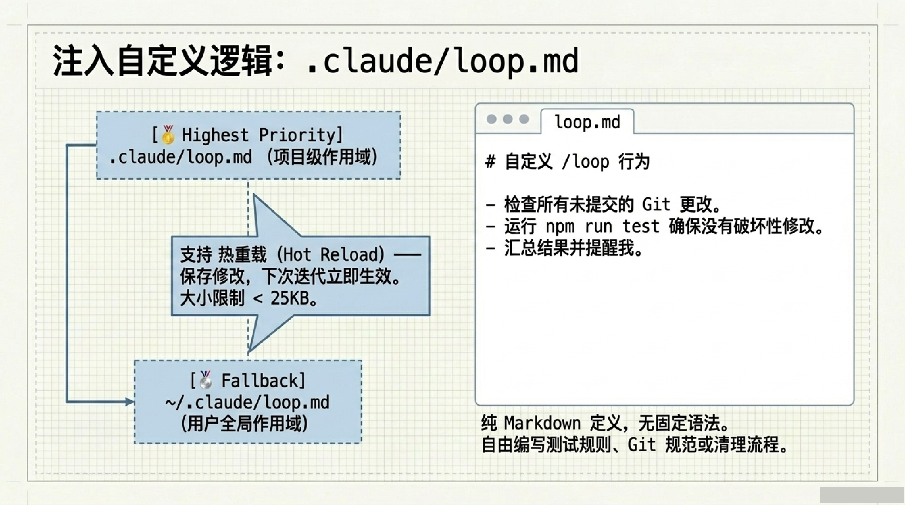

## 权限拦截矩阵

实现真正的无人值守，必须配置权限模式。

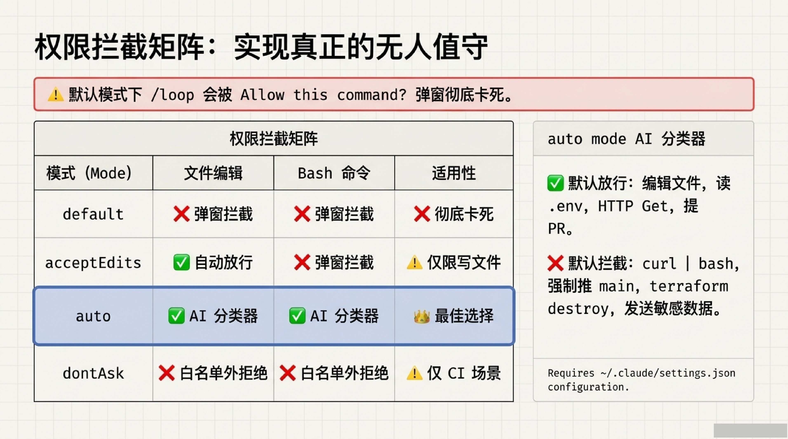

| 模式 | 文件编辑 | Bash 命令 | 适合 loop？ |
|------|---------|----------|-----------|
| `default` | 弹框 | 弹框 | ❌ 会卡死 |
| `acceptEdits` | 自动放行 | 弹框 | ⚠️ 仅限写文件 |
| `auto` | AI 分类器判断 | AI 分类器判断 | ✅ **最佳选择** |
| `dontAsk` | 白名单外拒绝 | 白名单外拒绝 | ⚠️ 仅 CI 场景 |

### auto mode

自动放行：文件编辑、工作目录内操作、安装 lockfile 已声明的依赖、读取 `.env`、只读 HTTP、推送到已启动的分支。

默认拦截：`curl \| bash`、向外部发送敏感数据、生产部署、强制推 main、`git reset --hard`、`terraform destroy`。

```json
// ~/.claude/settings.json
{
  "permissions": {
    "defaultMode": "auto"
  }
}
```

> `defaultMode: "auto"` 只能放在 `~/.claude/settings.json`（用户级），防止仓库给自己授权。

## 引入 Comet：5 站式 AI 软件工厂编排系统

Comet 以 `.comet.yaml` 为状态机，定义变更的完整生命周期。

```bash
npm install -g @rpamis/comet
```

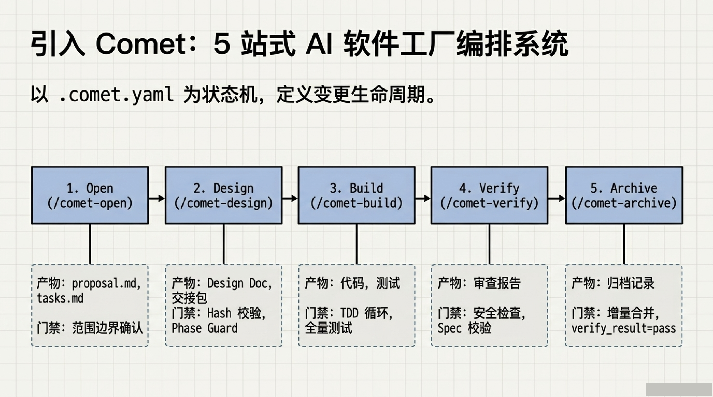

| 阶段 | 命令 | 产物 | 质量门禁 |
|------|------|------|---------|
| **Open** | `/comet-open` | proposal.md, design.md, tasks.md | 产物完整性、范围边界确认 |
| **Design** | `/comet-design` | Design Doc, Delta Spec | Handoff hash 校验、Phase Guard |
| **Build** | `/comet-build` | 代码、测试、提交记录 | TDD 循环、全量测试 |
| **Verify** | `/comet-verify` | 审查报告 | Spec compliance、Code Review、安全检查 |
| **Archive** | `/comet-archive` | 归档记录 | 增量规范合并、verify_result=pass |

## 协作模型：轨道与引擎

Comet 定义"做什么"和"何时算做完"（制定边界与产物标准）；`/loop` 提供持续的执行力，在每个阶段内进行无人值守的打磨。Phase Guard 确保产物完整性。

**核心认知：`/loop` 不是盲目的死循环，而是被 Comet 赋予了确定性方向的自动装配线。**

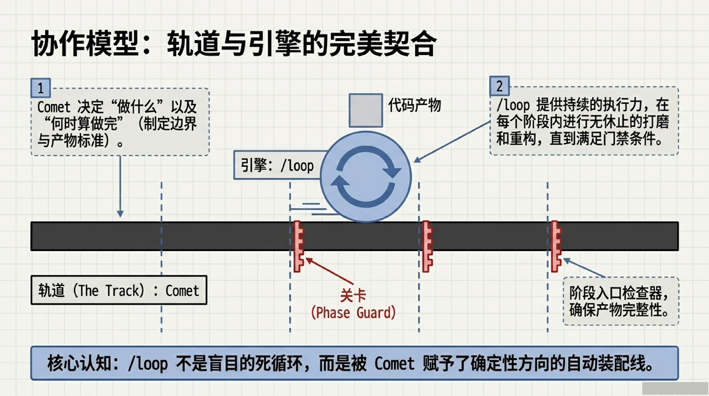

## 实战案例

### 案例 1：夜间无人 TDD 推进

Design 阶段已完成，夜间自动完成 Build 阶段的 TDD 循环。

```bash
claude -w auth-module --permission-mode auto
/comet-open    # 已完成
/comet-design  # 已完成 → .comet.yaml phase=build
/loop 10m
# Ctrl+B, D 断开 tmux
```

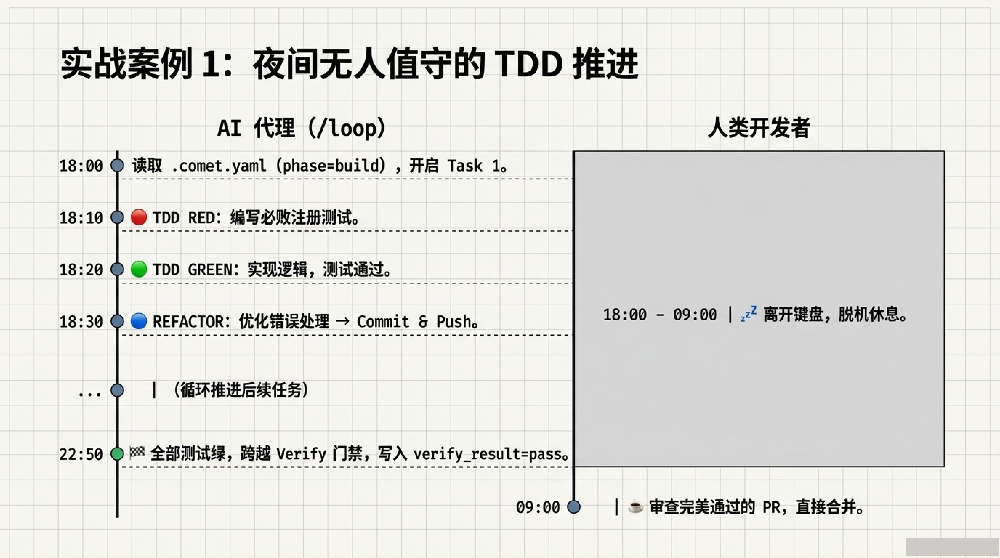

| 时间 | 迭代 | 进展 |
|------|------|------|
| 18:00 | 1 | 读取 `.comet.yaml` → phase=build |
| 18:10 | 2 | TDD RED：写会失败的测试 |
| 18:20 | 3 | TDD GREEN：实现逻辑，测试通过 |
| 18:30 | 4 | REFACTOR：优化错误处理 |
| 18:40 | 5 | commit + push，开始下一 task |
| 22:00 | ~24 | 全部 task 完成，全量测试绿 |
| 22:10 | 25 | 自动进入 Verify 阶段 |
| 22:50 | 29 | 全部门禁通过 → phase=archive |

### 案例 2：自动驾驶与自动修复

CI 变红时自动诊断修复，Phase Guard 失败时自动重新生成交接包。

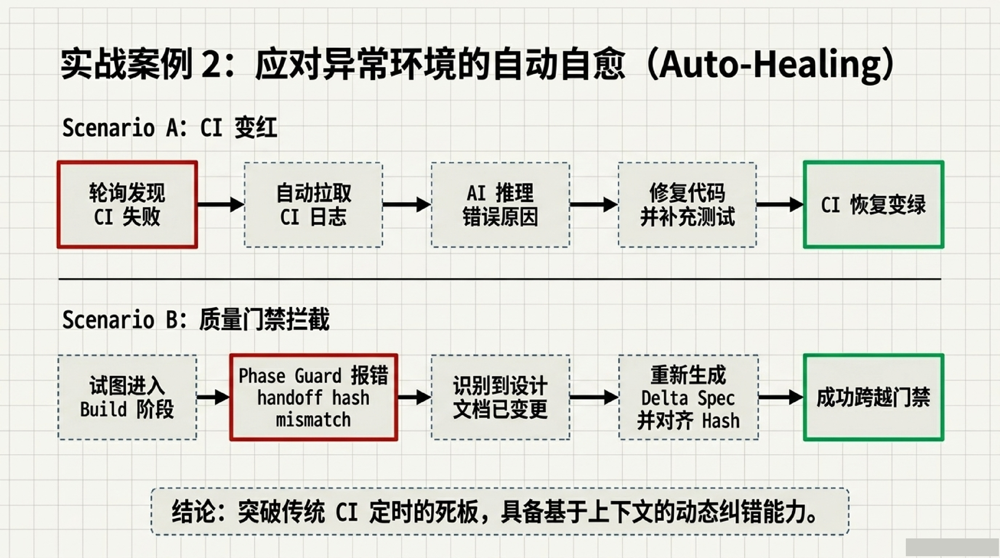

**CI 变红：**
```
loop 迭代 → 发现 CI 红色 → 读取 CI 日志
→ 诊断：测试环境缺环境变量 → 修复 → push → 确认变绿 → 继续 TDD
```

**Phase Guard 失败：**
```
loop 迭代 → Phase Guard handoff hash 不匹配
→ 自动重新生成交接包 → 再次校验 → 通过 → 进入下一阶段
```

### 案例 3：多工作树并行开发

三个独立 Feature 同时在 git worktree 中由各自的 `/loop` 推进。

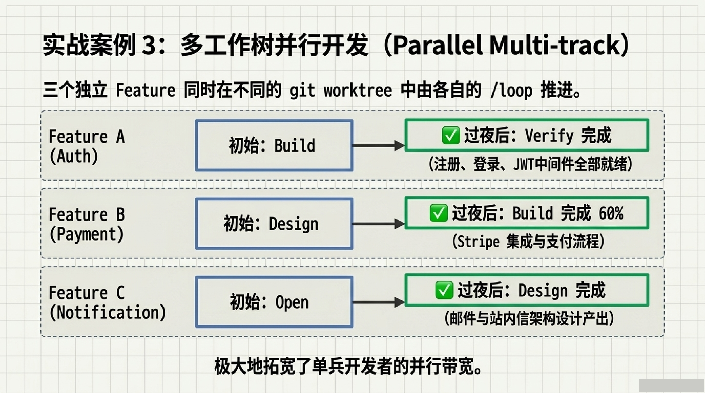

```bash
tmux new -s comet-auth;      claude -w change-auth      --permission-mode auto
tmux new -s comet-payment;   claude -w change-payment   --permission-mode auto
tmux new -s comet-notif;     claude -w change-notification --permission-mode auto
```

| Change | 初始 | 过夜后 | 推进内容 |
|--------|------|--------|---------|
| auth | Build | Verify 完成 | 用户认证体系 |
| payment | Design | Build 完成 60% | Stripe 集成 |
| notification | Open | Design 完成 | 通知架构设计 |

## 经济学视角：轮询间隔与成本估算

基于单次运行约 $0.03-$0.10（取决于模型与上下文长度）。

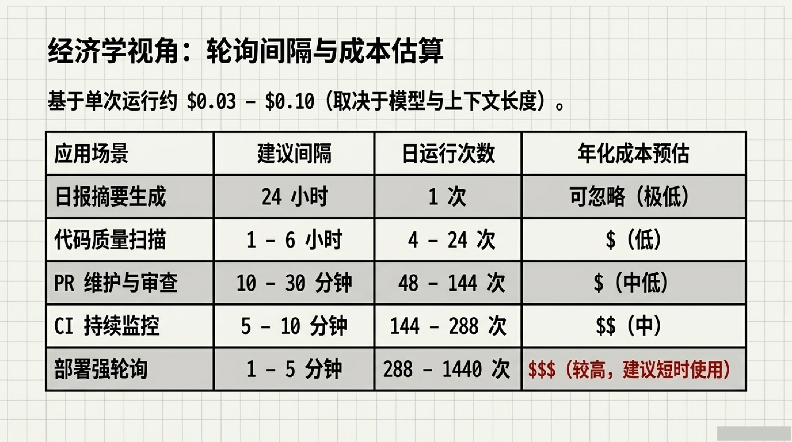

| 场景 | 建议间隔 | 每日约跑次数 |
|------|---------|------------|
| 部署轮询 | 1-5 分钟 | 288-1440 |
| CI 监控 | 5-10 分钟 | 144-288 |
| PR 维护 | 10-30 分钟 | 48-144 |
| 代码质量扫描 | 1-6 小时 | 4-24 |
| 日报摘要 | 24 小时 | 1 |

## 系统边界与工程绕过方案

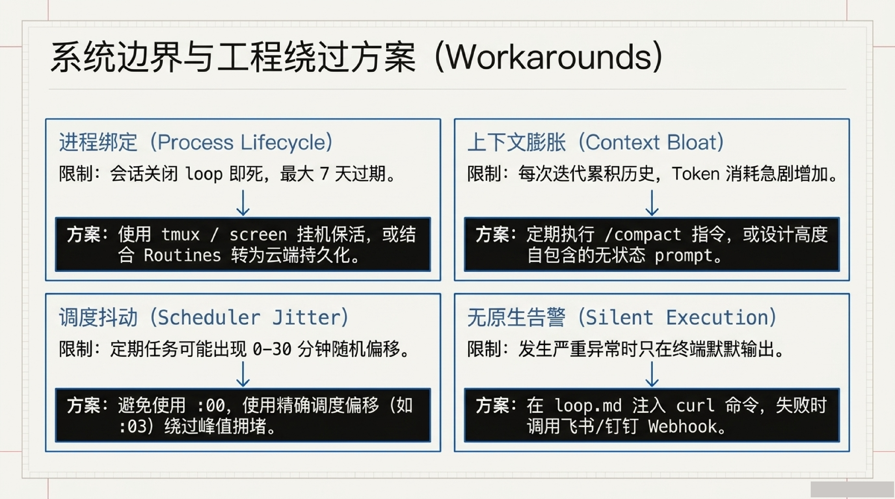

| 限制 | 说明 | 应对方案 |
|------|------|---------|
| 进程绑定 | 会话关闭 loop 即死 | tmux/screen 保活，或 Routines 云端持久化 |
| 7 天过期 | 定时任务自动终止 | 续期重建，或用 Routines（云端） |
| 调度抖动 | 0-30 分钟随机偏移 | 避免 `:00`，使用 `:03` 绕过峰值拥堵 |
| 上下文膨胀 | Token 消耗随迭代增加 | 定期 `/compact`，或设计自包含 prompt |
| 无原生告警 | 只在终端默默输出 | 在 loop.md 注入 curl 调用 Webhook |

## 架构全景：4 层模型

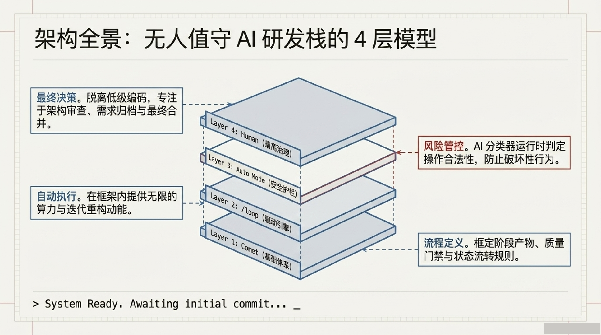

| 层次 | 组件 | 职责 |
|------|------|------|
| **流程定义** | **Comet** | 框定阶段产物、质量门禁与状态流转规则 |
| **自动执行** | **`/loop`** | 在框架内提供无人值守的持续推进力 |
| **风险管控** | **auto mode** | AI 分类器运行时判定操作合法性 |
| **最终决策** | **人类** | 审查归档、合并 PR |

## 命令速查

| 命令 | 功能 |
|------|------|
| `comet init` | 初始化 Comet 环境 |
| `/loop 5m <prompt>` | 固定间隔循环 |
| `/loop <prompt>` | 动态间隔循环 |
| `/loop` | 内置维护模式 |
| `/comet-open` | 立项 |
| `/comet-design` | 深度设计 |
| `/comet-build` | 沙盒构建 + TDD |
| `/comet-verify` | 验证与收尾 |
| `/comet-archive` | 归档沉淀 |
| `/compact` | 压缩上下文 |
| `what scheduled tasks do I have?` | 列出定时任务 |
