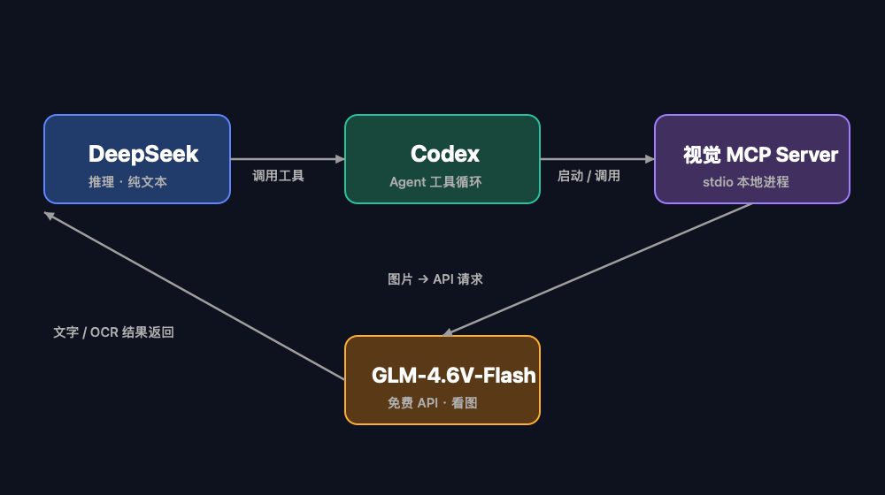

DeepSeek 擅长写代码，看不见图。Codex 拿它当推理模型时，截图、UI、报错弹窗都只能靠猜。解决办法是 MCP：把 GLM-4.6V-Flash 包装成工具，DeepSeek 调用它看图，拿回文字再推理。整套链路免费。

## GLM-4.6V-Flash 是什么

智谱 2025 年 12 月开源的视觉模型，9B 参数，MIT 许可，API 免费。128K 上下文，支持图片、视频、文件输入，原生多模态工具调用。官方口径：9B 版本在 34 项测试中 22 项超过 Qwen3-VL-8B。这些数字来自厂商自报，独立复现还少。

它解决「模型看不到图」这一类问题：OCR、表格解析、截图转代码、视觉 Agent。

## 桥接原理

DeepSeek 不需要视觉输入。Codex 把工具定义交给它，它决定何时调用，GLM 负责看，文字结果回来它再分析。



```
DeepSeek（推理，纯文本）
   │ 调用 MCP 工具
   ▼
Codex（Agent，管理工具调用循环）
   │
   ▼
视觉 MCP Server（本地 stdio 进程）
   │ 请求 GLM-4.6V-Flash API（免费）
   ▼
返回文字 / OCR JSON → DeepSeek 继续推理
```

## 集成步骤

第一步，在智谱开放平台（open.bigmodel.cn）注册，创建 API Key。`glm-4.6v-flash` 是免费模型。

第二步，注册 MCP 服务器。我推荐 `multi-modal-mcp`，它明确基于 GLM-4.6V-Flash，还附带 Cogview-3-Flash 生图、CogVideoX-Flash 生视频，全是免费模型：

```bash
codex mcp add multi-modal --env KEY=你的Key -- npx -y multi-modal-mcp@latest
```

想要更强的图片预处理（大图自动裁剪、OCR/UI/报错截图专用模式），用 `luma-mcp`，把默认模型覆盖成免费的 Flash：

```bash
codex mcp add luma \
  --env MODEL_PROVIDER=zhipu \
  --env ZHIPU_API_KEY=你的Key \
  --env MODEL_NAME=glm-4.6v-flash \
  -- npx -y luma-mcp
```

等价写法是直接改 `~/.codex/config.toml`：

```toml
[mcp_servers.multi-modal]
command = "npx"
args = ["-y", "multi-modal-mcp@latest"]

[mcp_servers.multi-modal.env]
KEY = "你的Key"
```

第三步，新开线程，把图片路径交给 DeepSeek：

> 用 multi_modal_understanding 分析 /Users/loong/Desktop/截图.png

## 两条路径

- 社区免费 MCP（multi-modal-mcp、luma-mcp、glm-vision-mcp-server、vision-bridge-mcp）：普通免费 Key 就能跑，本文走这条。
- 智谱官方视觉理解 MCP（@z_ai/mcp-server）：OCR、UI 转代码、视频理解共 8 个工具，但要 GLM Coding Plan 套餐，付费。

## 三个坑

1. 别把图片粘贴进对话框。DeepSeek 没有视觉输入，图片到不了 MCP 工具。存成本地路径，对话里写清楚。
2. 免费 API 有速率限制。生产环境先看智谱控制台的额度。
3. 改了配置要新开线程。已有线程不会自动加载新 MCP。

## 出处

- 智谱开放文档 - GLM-4.6V-Flash：https://docs.bigmodel.cn/cn/guide/models/free/glm-4.6v-flash
- Codex MCP 官方文档：https://developers.openai.com/codex/mcp
- multi-modal-mcp：https://www.npmjs.com/package/multi-modal-mcp
- luma-mcp：https://github.com/jochenyang/luma-mcp
- 智谱视觉理解 MCP 官方文档：https://docs.bigmodel.cn/cn/coding-plan/mcp/vision-mcp-server
