> 这是一份面向企业领导层的机密级战略简报，系统阐述了 2026 年企业级智能体（Agentic AI）从概念到落地的完整架构蓝图。

---

## 一、核心困境：突破 Copilot 天花板

2026 年，企业 AI 应用正站在一个关键的转折点上：

**Copilot 的局限**：Copilot 生成建议供人类采取行动，本质上仍是辅助工具。真正的生产力杠杆在于**闭环执行**——让 AI 从建议者变为执行者。

**增长拐点**：根据 Gartner 预测，到 2026 年底，将有 **40% 的企业应用程序嵌入智能体功能**（2025 年不足 5%）。

大语言模型（LLM）是用于预测下一个 token 和语言推理的引擎，而非目标驱动的执行者。跨越 Copilot 的关键在于从"建议"到"执行"的范式转变。

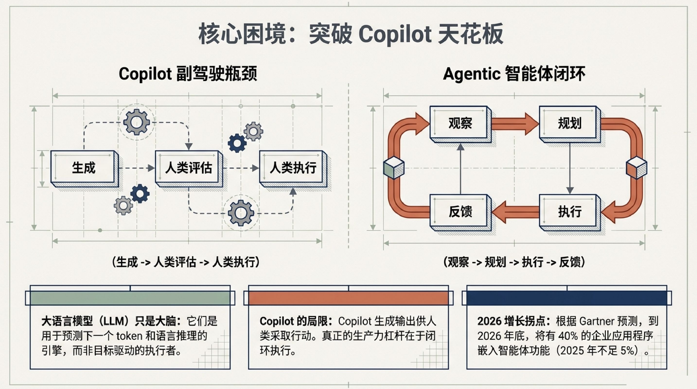

---

## 二、AI 自治力阶梯：从 Chatbot 到 Autonomous System

如何区分营销炒作与技术实质？按自治能力分为四个层级：

| 层级 | 名称 | 触发方式 | 记忆 | 工具访问 |
|------|------|---------|------|---------|
| L1 | 聊天机器人（Chatbot） | 提示词 | 仅限会话记忆 | 无 |
| L2 | 辅助副驾驶（Copilot） | 人类主导 | 局限于特定应用 | 建议由人类拒绝或接受 |
| L3 | 智能体（Agent） | 目标驱动 | 持久化跨会话记忆 | 编排自身工具集 |
| L4 | 自治系统（Autonomous System） | 自我规划 | 自我更新知识库 | 广泛调用 API，自我纠错 |

> 智能体与传统自动化的本质区别：传统 RPA 是确定性规则，而智能体是目标驱动的动态适应。

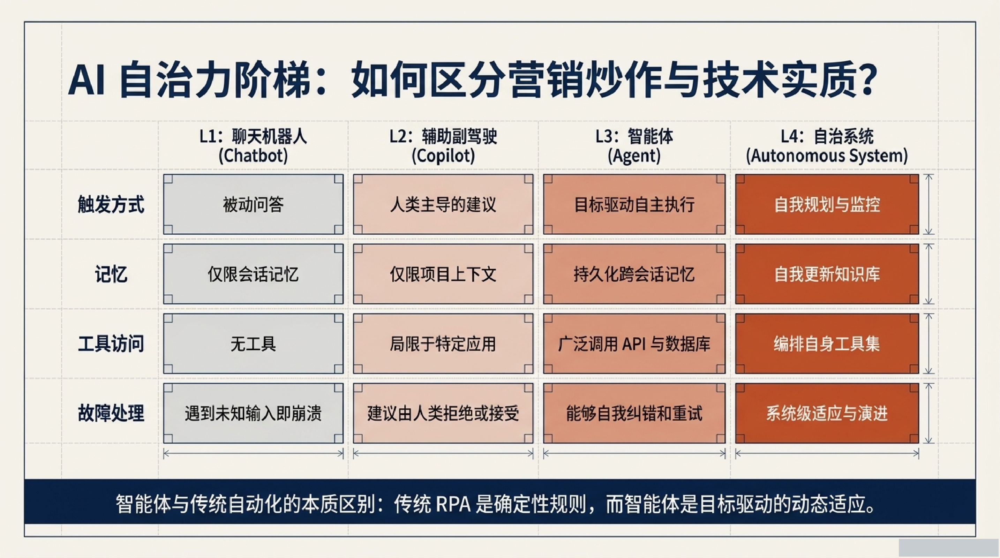

---

## 三、LLM vs Agent：从语言推理到系统工程

| 维度 | LLM（语言模型） | Agent（智能体） |
|------|----------------|----------------|
| 输入 | 提示词（Prompt） | 目标与工作流触发器 |
| 输出 | 文本 | 行动 |
| 风险 | 幻觉 | 幻觉 + 破坏性行动 |

**黄金法则**：
- 如果路径是固定的 → 构建传统工作流
- 如果需要语言理解 → 插入 LLM
- 如果系统必须自主选择行动并调用工具 → **构建智能体**

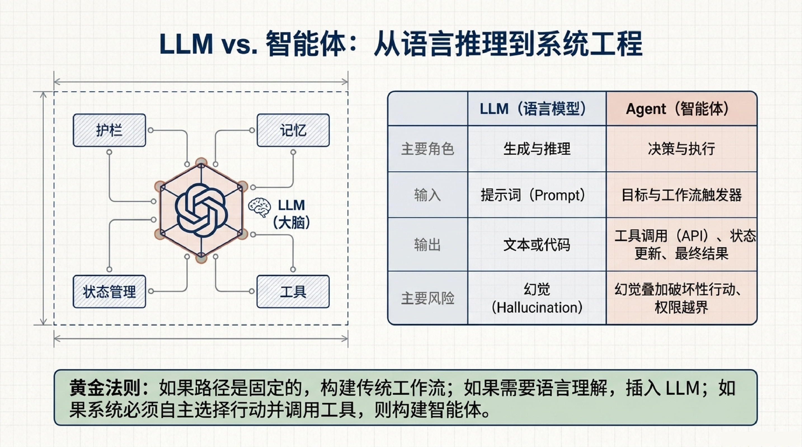

---

## 四、企业级智能体价值全景

智能体正在渗透企业各个职能部门，带来可量化的商业回报：

**IT & 研发**
- 软件工程智能体（SWE）提效开发
- IT Helpdesk 自动化（中位数 3.4 个月回本）

**财务 & 运营**
- 实时物联网信号分析与预测
- 财务运营自动化，降低 30-50% OpEx

**HR & 法务**
- 智能合同审查
- 自动合规报告

**销售 & 市场**
- 客户挖掘与线索评分
- 个性化营销自动化

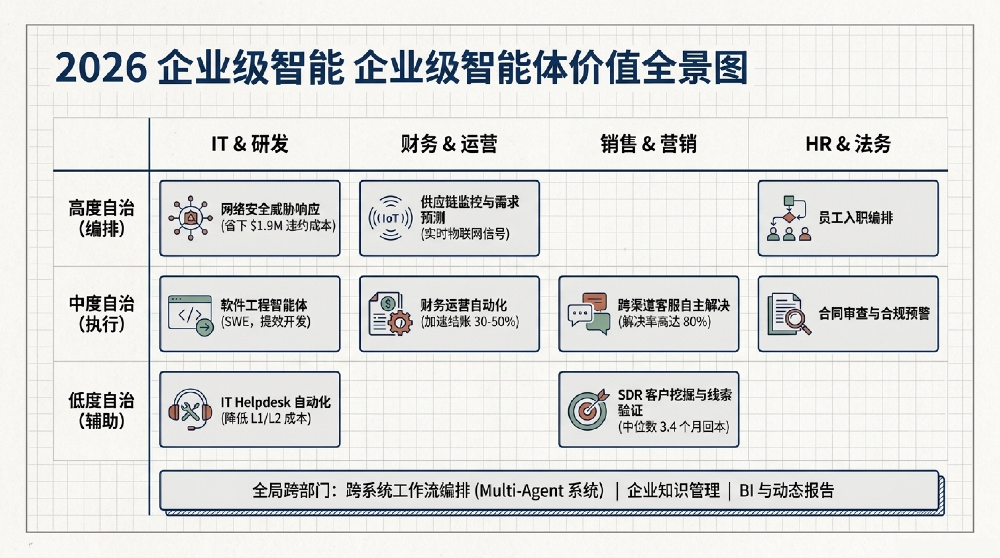

---

## 五、四大核心设计模式

### 1. 反思（Reflection）
智能体批判并迭代自身输出，扮演虚拟的高级审查员，通过自我批评提升质量。

### 2. 工具调用（Tool Use）
超越文本生成，通过 API、数据库和终端执行外部操作。

### 3. 多智能体协作（Multi-Agent）
多个专用智能体并行工作，各自处理问题的不同方面，通过标准化通信协议（如 MCP）协同。

### 4. 规划（Planning）
将复杂目标分解为可执行的子步骤，动态调整执行策略。

> **关键突破**：将 GPT-3.5 级别的基础模型通过 ReAct 模式封装，任务成功率从 48% 跃升至 95.1%，超越了单纯依靠最先进基础模型的零样本表现。

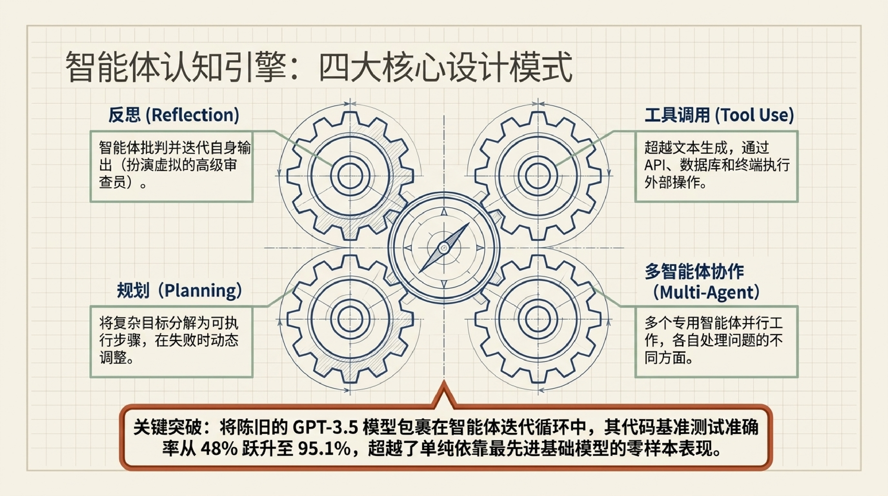

---

## 六、ReAct 认知循环

智能体不是一次性生成答案，而是维持一个**状态机**，在推理与行动之间不断循环：

```
观察（Observe）→ 推理（Reason）→ 行动（Act）→ 观察 → 推理 → 行动 → ...
```

1. **观察**：获取系统当前状态、用户输入或上一步工具执行的结果
2. **推理**：LLM 评估当前情况，决定下一步需要做什么
3. **行动**：输出结构化指令，实际调用外部工具、API 或运行代码

直至触发终止条件或成功解决问题。

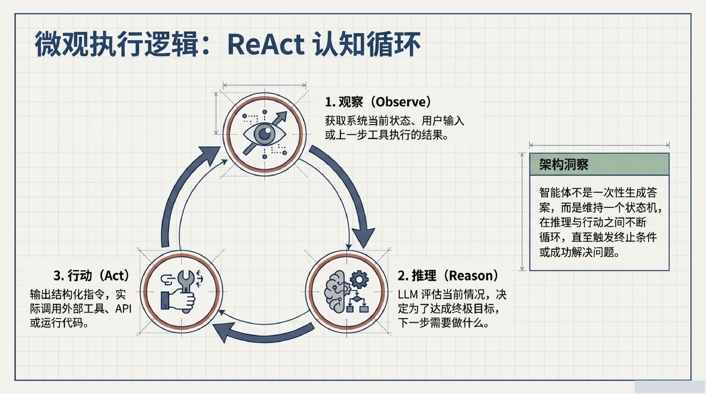

---

## 七、智能体适用性测试

不是所有场景都适合用智能体：

- **确定性组件（固定规则）** → 不需要智能体，传统代码更稳定
- **复杂逻辑推理** → 需要 LLM 的上下文理解
- **非结构化数据推理** → 智能体的核心优势区

> 最佳的架构设计不是全盘智能体化，而是精准剥离出需要逻辑推理的节点交给智能体处理，其余部分仍由确定性规则主导。

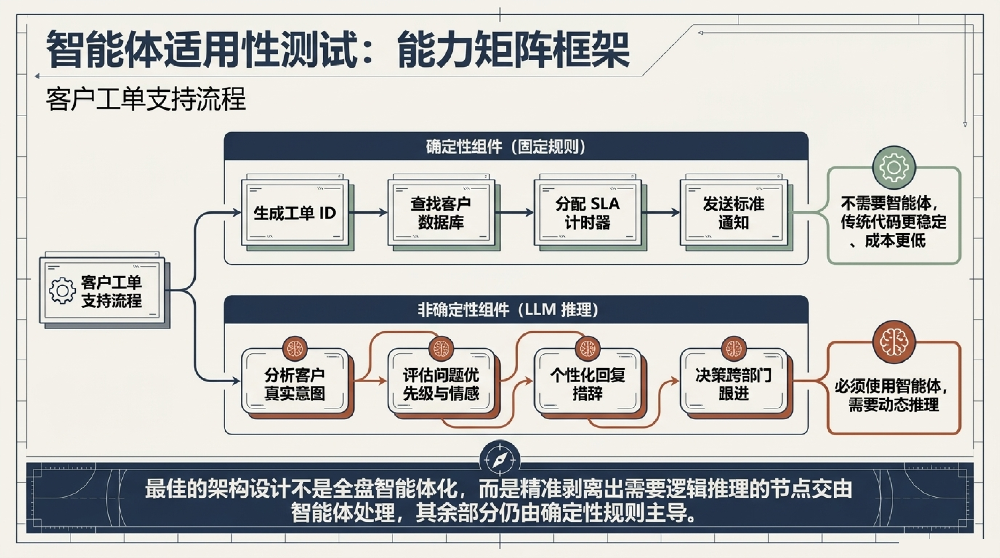

---

## 八、Agent-Ready 架构栈

麦肯锡洞察：**80% 的企业在扩展智能体时受阻，根源在于数据碎片化和治理不一致。**

四层架构：

**Layer 1: 数据源层**
持续摄取结构化与非结构化数据，嵌入自动化数据质量检查。

**Layer 2: 数据平台与语义层**
引入知识图谱和向量存储，为数据赋予业务语义，确保智能体理解数据的含义。

**Layer 3: 编排层**
多智能体协调、模型上下文协议（MCP）、安全网关与访问控制。

**Layer 4: 执行与消费层**
动态检索引擎、API 网关、与 CRM/ERP 等系统的实时交互。

> 没有坚实的数据基座，智能体必然崩溃。

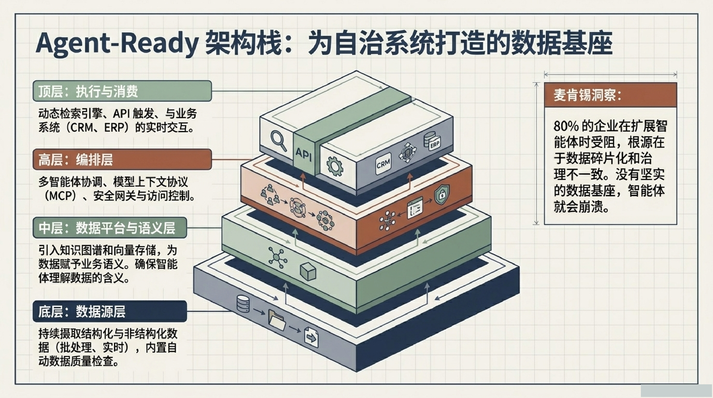

---

## 九、多智能体协同模式

单一全能智能体已被淘汰。2026 年的突破在于让专职专责的智能体像人类团队一样协同工作。

**主管模式（Supervisor Pattern）**
一个核心规划智能体位于中心，将子任务分发给周围的专门节点（如 CRM、财务、邮件智能体）。

**层级模式（Hierarchical Pattern）**
类似企业组织架构图，总管智能体下辖各区域/部门主管智能体，再向下细分。

> 这种架构被誉为 AI 界的 Kubernetes——通过标准化的通信协议（MCP）实现动态编排。

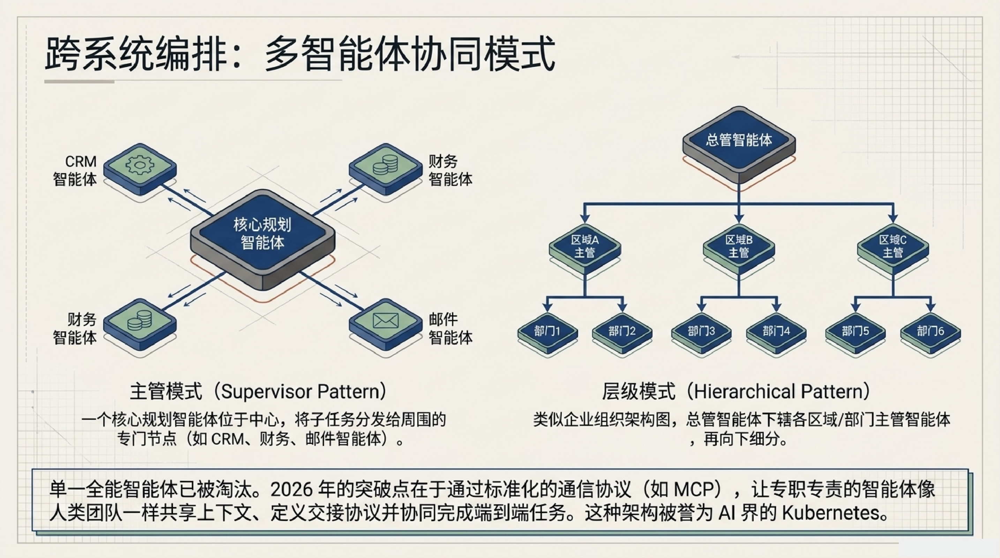

---

## 十、从 SDLC 到 ASDLC

传统软件开发生命周期（SDLC）验证基于确定的输入输出。而智能体开发生命周期（ASDLC）带来了根本性变革：

**提示词即基础设施（IaC）**
将 Prompt、工具配置和记忆模式作为代码进行版本控制和语义审查。

**黄金轨迹作为回归测试**
不仅捕获最终输出，还要追踪完整的推理链条和工具调用历史，以便在修改 Prompt 时进行对比。

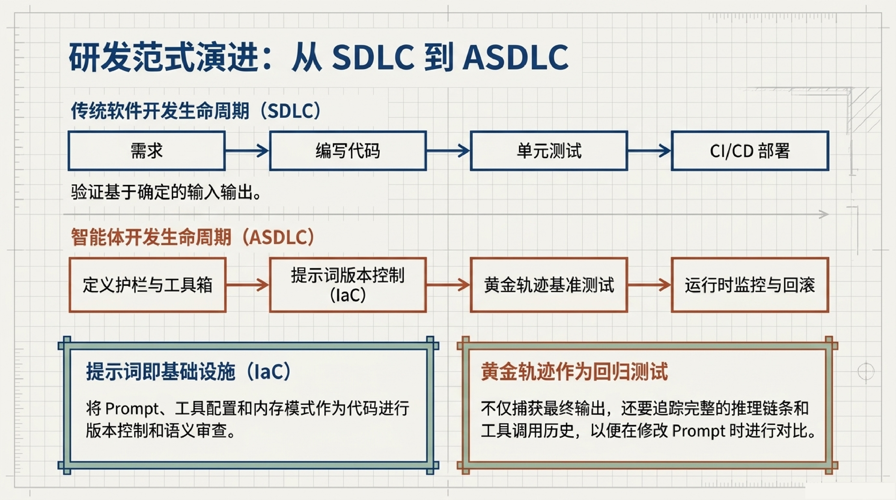

---

## 十一、安全护栏四层防线

1. **智能体注册中心（Agent Registry）**：对每个部署的智能体进行清晰的目录登记，定义边界、预期作用域和负责人
2. **最小权限原则（Least-Privilege）**：强制执行基于角色的操作级权限（RBAC），而非简单的系统级访问
3. **提示词注入防护（Prompt Injection）**：建立红蓝对抗测试，防止恶意指令劫持智能体逻辑
4. **完整审计追踪（Audit Trails）**：要求对智能体的每一步推理和工具调用进行全面日志记录

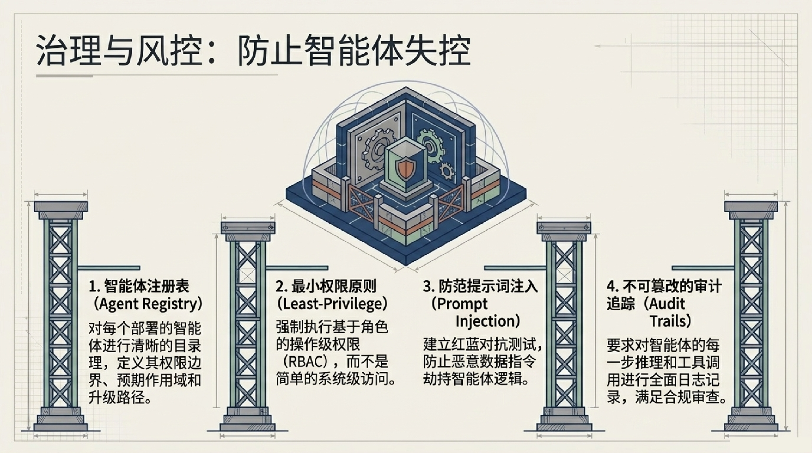

---

## 十二、人在回路（HITL）信任机制

不是所有操作都需要人类，但高风险操作必须被拦截。

执行流程：

1. **自主执行常规步骤** → 2. **计算置信度得分** → 3. **批准门控：暂停并推送上下文给人** → 4. **批准/拒绝** → 5. **继续后续流程**

典型拦截场景：发起高于指定金额的退款、向全库客户发送邮件、隔离服务器。

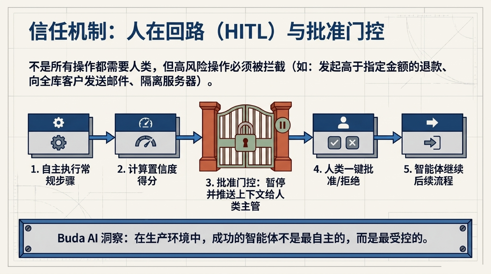

---

## 十三、真实演进路径

| 阶段 | 能力 | 典型表现 |
|------|------|---------|
| L1 Chatbot | 固定 FAQ 查询 | 无工具调用，无法真正解决问题 |
| L2 Copilot | 多源 RAG，子系统协调 | 引入演员-评论家模型控制幻觉 |
| L3 Agent | 彻底打通 CRM 和工单系统 | 端到端自动化闭环 |

---

## 十四、结语

> 智能体 AI 的目的不是消除人力，而是消除摩擦。

| 层级 | 技术 | 适用场景 |
|------|------|---------|
| L3 | 多智能体编排 | 动态环境、非结构化推理、异常处理 |
| L2 | 工作流自动化 | 高频、固定规则的骨干业务流 |
| L1 | 传统系统 | 确定性处理，绝对的稳定性 |

掌握从提示词到生产力的架构蓝图，你构建的不仅是自动化工具，而是一个具备**深度思考、自主执行与自我进化**的新一代企业内核。
