面向资深开发者与架构师的技术蓝图：打破终端壁垒，将顶级 AI 智能体无缝接入你的开发工作流。现代软件工程正从静态的代码编辑器进化为具备上下文感知的智能协作平台。

## 痛点解析：AI 工具集成的 N×M 问题

生态极度碎片化：每个 AI 接入特定 IDE 均需定制插件，更新滞后。同时，强大的 CLI 工具只能在终端运行，缺乏代码高亮与原生编辑器体验。

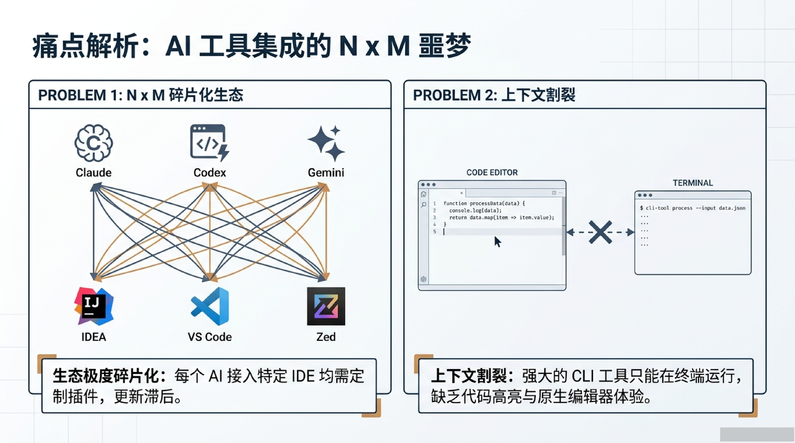

## 破局者：Agent Client Protocol (ACP)

由 Zed 牵头制定的开放标准——AI 界的 USB-C。代理端与客户端只需实现一次协议，即可双向兼容、即插即用。AI 代理作为独立进程运行，不打包进 IDE 插件，具备进程隔离与系统安全优势。

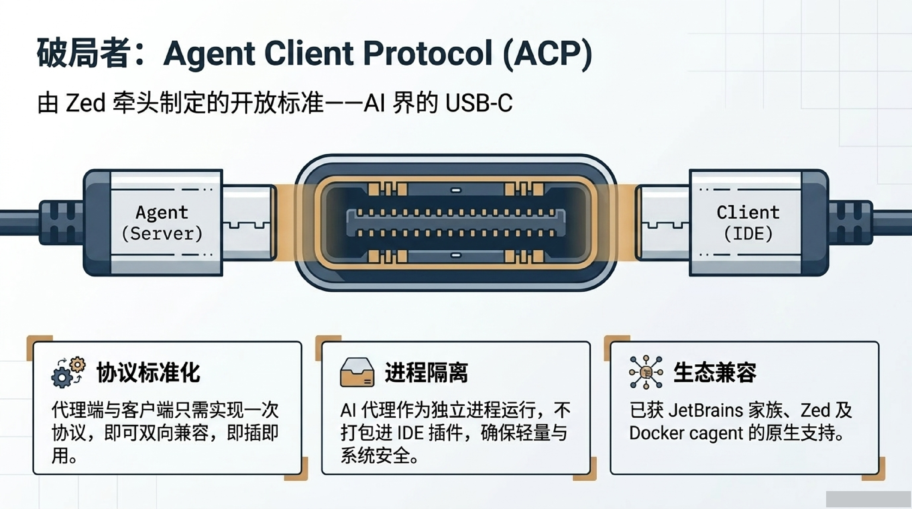

### ACP 核心原理

基于 JSON-RPC 2.0 的双向通信。通信管道完全通过标准输入输出（stdin/stdout）进行轻量级进程间通信。消息类型严格区分期望结果的请求-响应（Methods）与单向流式推送（Notifications）。

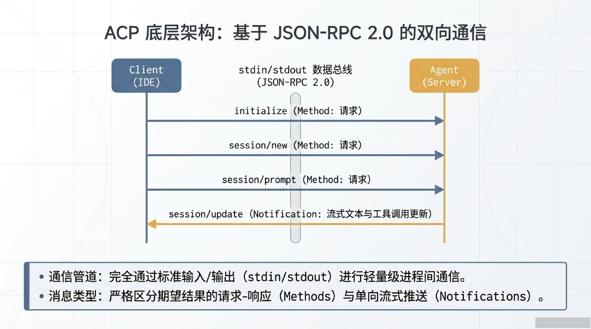

### ACP vs MCP

| 维度 | ACP (Agent Communication Protocol) | MCP (Model Context Protocol) |
|------|-----------------------------------|------------------------------|
| 定位 | 智能体与 IDE 之间的通信标准 | 智能体与外部工具之间的通信标准 |
| 角色 | Agent ↔ Client（IDE） | Agent ↔ Tool（外部服务） |
| 场景 | IDE 内唤起 AI 智能体执行任务 | AI 调用本地 Python、Bash、文件、DB |
| 模式 | Task-Oriented（任务驱动） | Tool-Oriented（工具调用） |

ACP 接入的 Agent 完整原生支持 MCP，可直接调用本地 Python、执行 Bash、读写文件、查询 DB，属于 Task-Oriented（任务驱动），而非传统 IDE 插件的 Chat-Oriented（聊天互动）。

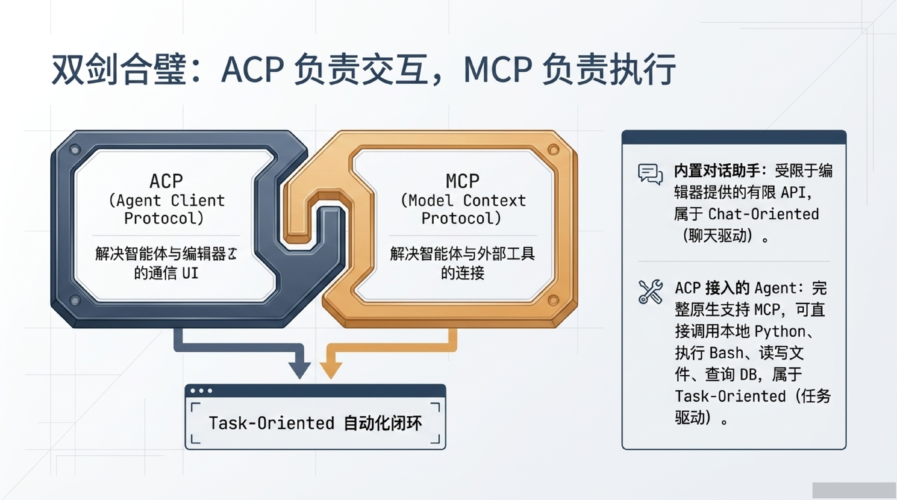

## 桥接生态：跨越终端的服务件

通过标准化 ACP Client 层，实现 IDE 与 AI 智能体的解耦：

- **claude-code-acp** — 官方/社区标准适配器，允许 Pro/Max 订阅用户在 IDE 内直接使用
- **claude-acp-server** — HTTP 门面，面向只支持 Anthropic API 的客户端，提供 HTTP 桥接
- **acpx** — 多路复用统管，针对多种不同的 CLI 工具提供统一的路由与挂载点

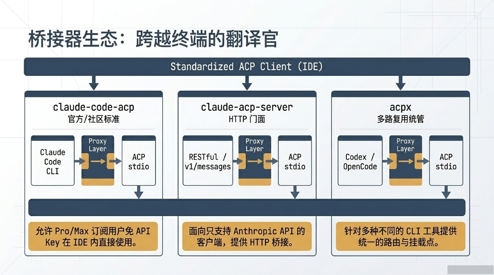

## 明星项目：Claude Code Best (CCB) v5

生产级工程化的全能 Agent，原汁原味复刻并超越：

- **/goal 持续驱动** — 设定目标后自动跨轮推进，自带 token 预算控制与异常恢复
- **Ultracode 多 Agent 编排** — 注入工作流编排手册，支持并发上限与日志重放
- **Channels 频道通知** — 通过 MCP 服务器推送外部消息（如 Slack/飞书）到当前会话
- **可观测性** — 支持 Langfuse 级深度监控；可开启穷举模式关闭记忆提取以节省成本

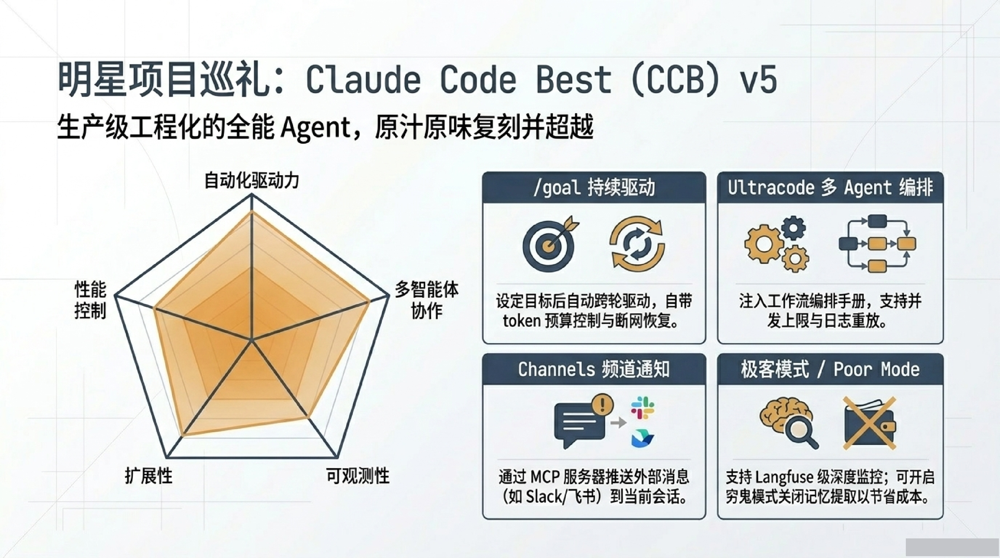

## 进阶编排：多智能体路由

### ACP Dispatch（动态路由）

依赖语义意图识别，适合临时调用，但因提示词模糊有几率路由走偏。

### ACP Binding（静态专线，2026.3.7 新特性）

零路由错误，保持持久化会话上下文，依赖独立的工作目录与 CLAUDE.md。

```json
bindings: [{
  channelId: '12345',
  agentId: 'claude',
  type: 'acp'
}]
```

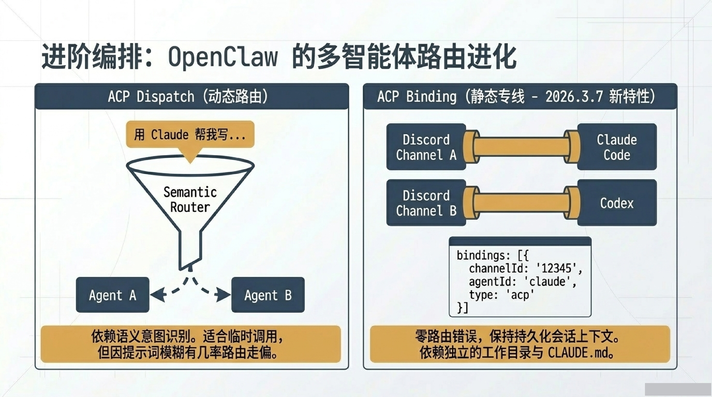

## 核心抉择：为什么在 IDEA 中选择 ACP 接入

| 维度 | ACP 桥接代理（Claude Code） | IDEA AI 助手 |
|------|---------------------------|-------------|
| 核心定位 | 任务驱动型机器人（独立的 Plan/Act 模式） | 侧边栏对话型助手（多轮问答为主） |
| MCP 工具支持 | 完整原生支持（可调用本地环境/DB） | 支持极度受限（仅限编辑器内 API） |
| 模型/API 灵活性 | 极高（自由接入中转站/自定义模型） | 受限（官方 API Key 或订阅） |
| 代码上下文感知 | 强（通过 MCP 深度读写文件系统） | 强（享有 IDE 原生代码索引优势） |

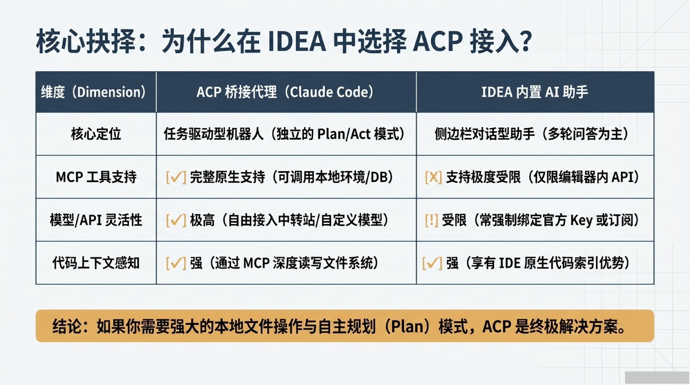

## 终极实战：环境与前置准备

### IDE 版本要求

IntelliJ IDEA 2024.2 - 2025.3.x，确保 AI Assistant 插件版本 > 2025.12，该版本正式开放了 ACP 入口。

### 运行时环境

Node.js (v18+) 或 Bun >= 1.3.11。推荐在使用 Claude Code Best 时采用 Bun，以获得极致的内存优化。

### 全局适配器安装

```bash
npm install -g @zed-industries/claude-agent-acp
```

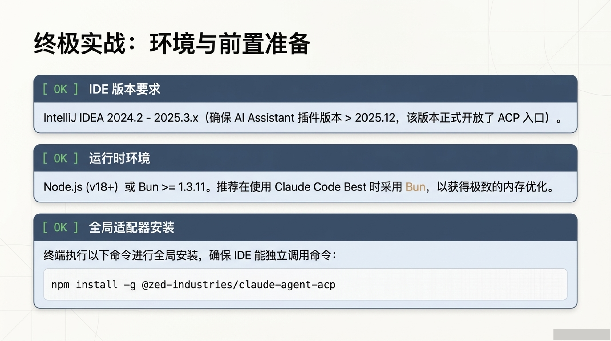

### 极简配置：在 IDEA 中唤醒 Claude Code

**步骤 1**：在 AI Assistant 面板菜单中选择配置，自动生成 `acp.json`。

**步骤 2**：注入代理命令与环境变量。注意 `command` 必须使用完整绝对路径。

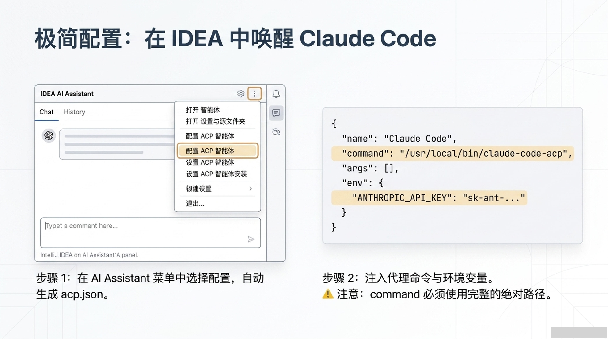

```json
{
  "name": "Claude Code",
  "command": "/usr/local/bin/claude-code-acp",
  "args": [],
  "env": {
    "ANTHROPIC_API_KEY": "sk-ant-..."
  }
}
```

### 权限模型与工作流管理

| 模式 | 行为 | 适用场景 |
|------|------|---------|
| `default` | 拦截所有文件修改与终端命令，手动确认 | 安全但不自由 |
| `acceptEdits` | 自动放行文件编辑，拦截危险系统命令 | 高效折中 |
| `bypassPermissions` | 全量放行 | 自动驾驶，高风险 |

**高阶技巧**：直接在对话框中输入魔法指令动态切换权限级别：

```
ACP: PERMISSION: ACCEPT_EDITS
```

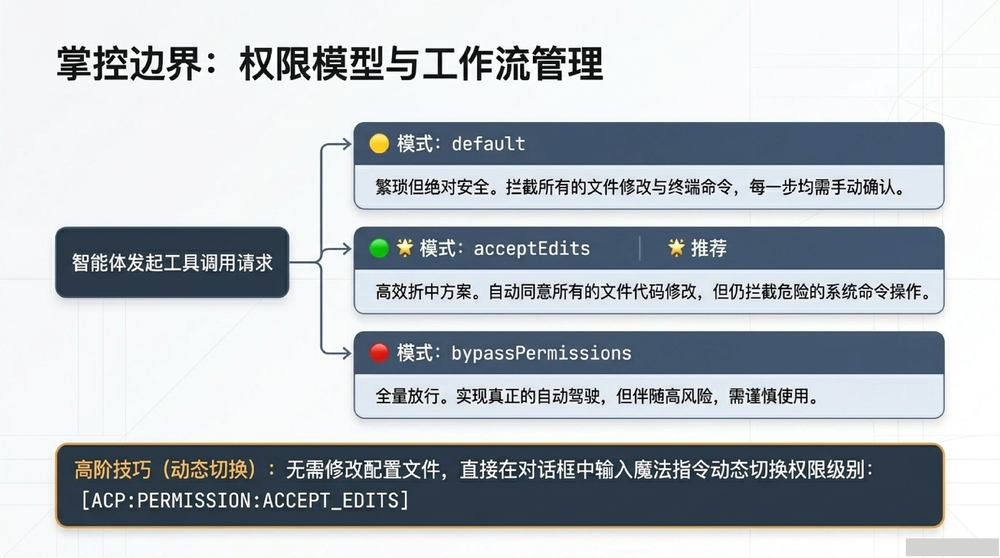

## 常见问题与排查

**症状 1：IDEA 启动报错**

IDEA 的环境变量与系统终端不同步。必须在 `acp.json` 的 `command` 字段中使用完整绝对路径（如 `/opt/homebrew/bin/claude-code-acp`），或显式配置 `env` 变量。

**症状 2：选择 Agent 后聊天无响应**

1. 终端执行 `ps aux | grep claude-code-acp` 确认代理进程存活
2. 查看 IDEA 底部日志（Help > Show Log in Finder）
3. 确认 Claude Code 本身在脱离 IDE 的原生终端下可以独立运行

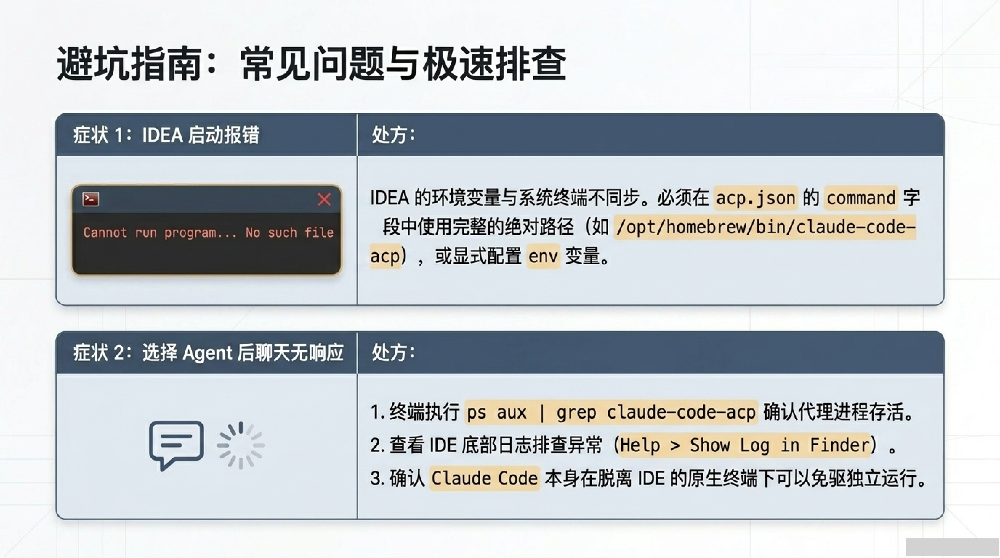

## 自定义 ACP Proxy 方案

如果需要构建自己的 ACP Proxy 层（零 Hermes 依赖），核心架构如下：

```
┌───────────────────────────────────────────────────────────────┐
│                       用户前端                                  │
└──────────────────────┬────────────────────────────────────────┘
                       ▼
┌───────────────────────────────────────────────────────────────┐
│                    LLM 网关 (自定义 Agent)                      │
│  主控 LLM — 理解意图、拆解任务、决策调度                       │
│  接收权限请求 → 判断自动放行 → 或转发用户                      │
└──────────────────────┬────────────────────────────────────────┘
                       │ ACP JSON-RPC
                       ▼
┌───────────────────────────────────────────────────────────────┐
│              ACP Proxy Layer（权限拦截桥）                       │
│  ① 通过 ACP 启动 Claude CLI 子进程                             │
│  ② 拦截 session/request_permission → 转发 LLM 网关             │
│  ③ 注入决策回 Claude CLI                                       │
│  ④ 缓存 + 超时默认 deny                                       │
└──────────────────────┬────────────────────────────────────────┘
                       │ stdin/stdout · JSON-RPC · ACP v1
                       ▼
┌───────────────────────────────────────────────────────────────┐
│              Claude CLI (实际任务执行层)                        │
│  claude --acp --stdio                                          │
└───────────────────────────────────────────────────────────────┘
```

详细代码实现（ACPProxyBridge、LLMGateway、MCP Permission Server）以及三种方案的对比见：

> **参考**：[LLM 网关 + Claude CLI 子进程权限拦截方案](../notes/llm-gateway-claude-permission/)

核心代码框架：

```python
# ACP Proxy Bridge 核心逻辑
class ACPProxyBridge:
    async def start(self):
        self._process = await asyncio.create_subprocess_exec(
            "claude", "--acp", "--stdio", ...)
        await self._initialize()
        await self._create_session()

    async def _handle_permission_request(self, msg: dict):
        # 先查缓存 → 命中放行
        # 未命中 → 回调 LLM 网关 → 用户决策
        # 超时 → deny (fail closed)
        ...
```

## 终局视野：开发环境的全面解耦

ACP 带来的不仅仅是又一个 IDE 插件，而是下一代开发工作站的标准通信基座：

- **展示层** — IDE（IntelliJ, Zed）仅负责代码展示与人机交互
- **通信层** — ACP Protocol 作为标准化信息流中枢
- **逻辑层** — Claude Code / Cagent 作为独立 AI 推理大脑，完全脱离宿主编辑器
- **物理层** — MCP 负责执行文件系统读写与 API 交互

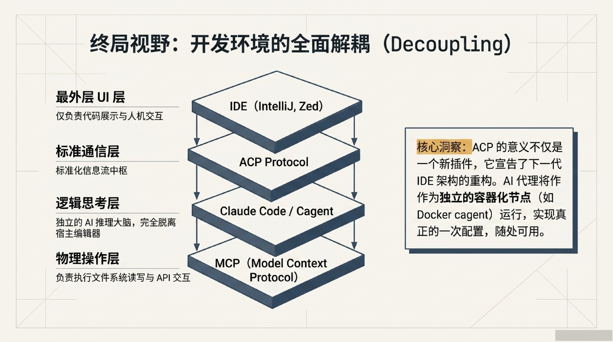

> **ACP 不是另一个普通的 IDE 插件，已是下一代开发工作站的标准通信基座。** 立刻利用 ACP 协议，在 IntelliJ 环境中释放 Claude Code 的全维任务驱动能力。

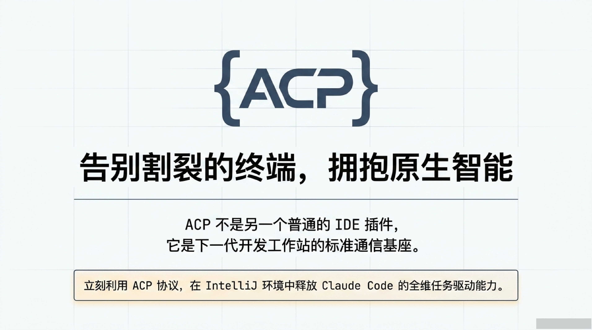
