> 从 RAG 到 GraphRAG，再到 LLMWiki——每一次知识管理范式的跃迁，都在回答同一个问题：如何让每一次对话的洞见，不随聊天窗口关闭而消散？LLMWiki 将 LLM 从一个每次都重来的回答器，升级为一个越用越聪明、越用越值钱的知识运行时。

---

## 一、核心困境：聊天瞬逝（Chat Transience）

对话式 AI 面临一个根本性矛盾：**模型能力在飞速提升，但每一次对话的成果几乎为零积累**。

如果你的精彩技术判断诞生于第 17 次对话，到第 18 次对话时模型已经完全遗忘。聊天记录流就像瀑布，对话中的高价值判断随流水消散。而传统 RAG 每次都在重新发现、查完即散，纯人工维护的成本又极高。

这不是模型的错，而是我们缺少一个把"好答案"强制沉淀为长期资产的制度。

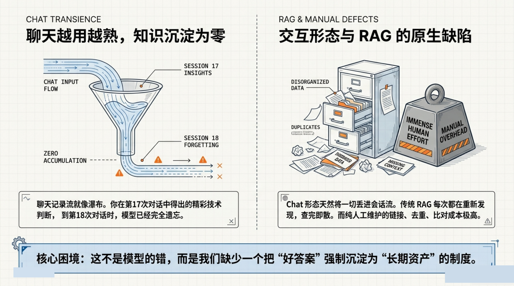

---

## 二、知识检索范式演进

知识检索经历了三次范式跃迁：

| 阶段 | 时间 | 核心机制 | 特点 |
|------|------|---------|------|
| **RAG** | 2020 | 查询时检索（Query-time Retrieval） | 解决外部知识如何接近生成模型 |
| **GraphRAG** | 2024 | 全局关联语义映射 | 提取全局主题与实体关系 |
| **LLMWiki** | Now | 增量编译 + 结构化知识资产 | 资料进入即编译为可导航的中间知识页面 |

LLMWiki 的关键跃迁：你查的不再是原始文档，而是被反复消化过的知识资产。

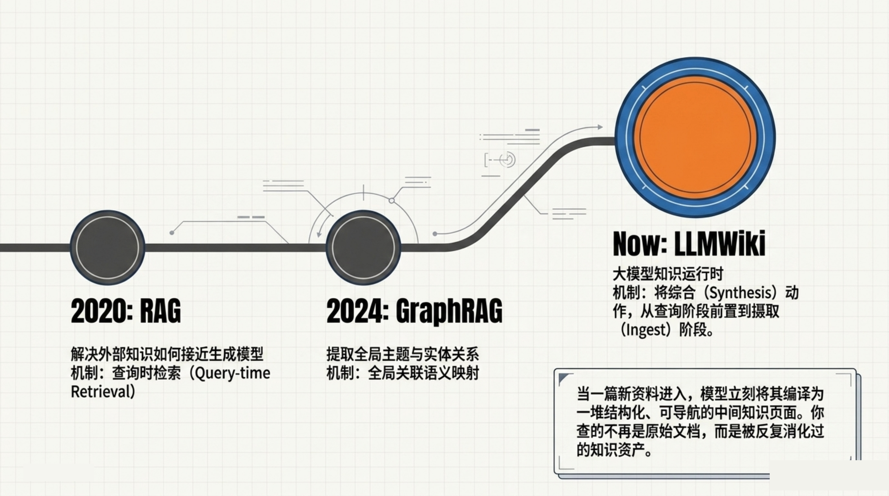

---

## 三、体系对比：RAG vs. LLMWiki

传统 RAG 在查询时进行检索，每次对话都重新遍历原始文档。而 LLMWiki 采用的是**知识工程系统**——资料在进入系统时即被消化、链接、结构化，后续查询直接命中高质量的知识资产。

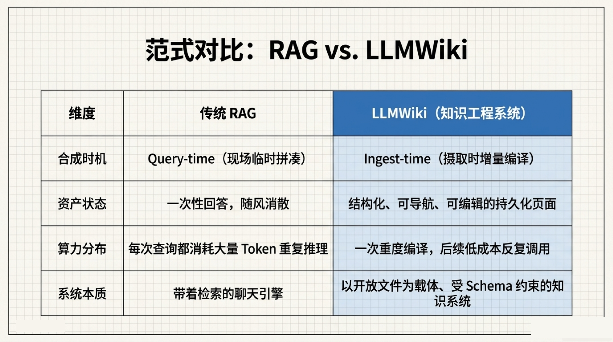

---

## 四、Schema 的力量

有了 Schema，LLM 才是一个真正的知识库维护者；没有 Schema，LLM 只是一个写作者。

LLMWiki 采用三层架构：

- **原始层（RAW）**：包含 PDF、录音、网页、代码——**铁律：不可变、可追溯、可审计**，绝对禁止 LLM 纂改原文
- **Wiki 层**：LLM 消化后的产物（概念、实体、综合页）——动态流转，不断被更新、链接与查询
- **Schema 层**：包含 WSS、HSN、SBM、FE 等结构化定义

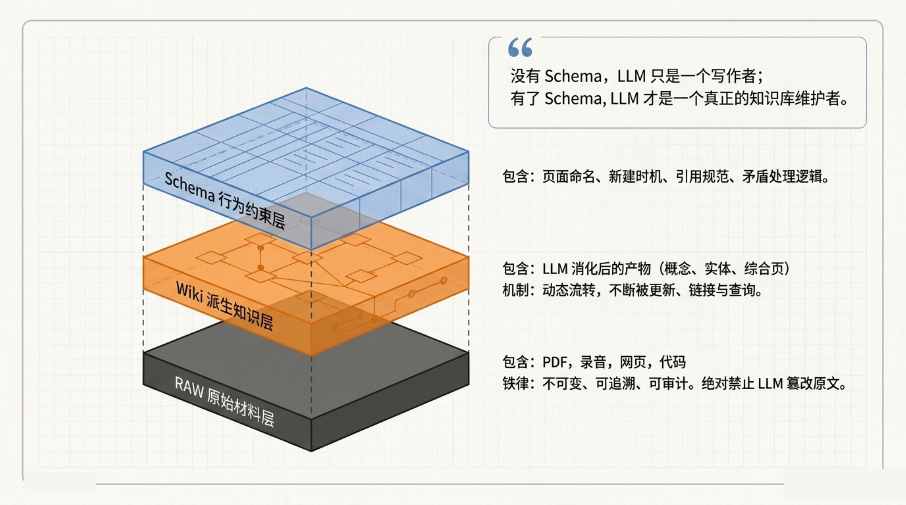

---

## 五、运行控制面板（Operational Control Panel）

LLMWiki 不仅仅拥有一堆页面，它拥有一套精密运作的运行控制面板：

- **GTB**：系统第一导航点
- **ST**：节点状态与关联
- **SDT**：历史与临时存储
- **Log.md**：时间导向，审计轨迹
- **伦理面板**：定义系统目标与伦理边界
- **异常告警**：待确认的异常或高风险项

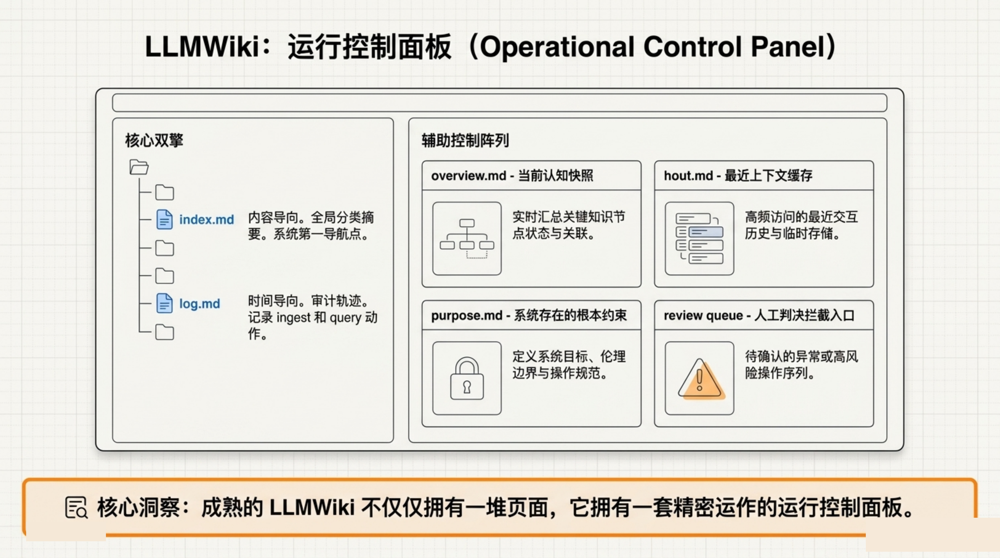

---

## 六、知识元素与硬约束

LLMWiki 定义了一套完整的知识元素体系，每种元素都有明确的作用和约束：

| 知识元素 | 用途 |
|---------|------|
| **Source（来源摘要）** | 记录原始来源的关键信息与摘要 |
| **Entity（实体）** | 识别和定义特定的人物、产品或实体 |
| **Concept（术语/框架）** | 阐释核心概念、术语或方法论 |
| **Comparison（横向对比）** | 对多个选项进行结构化横向比较 |
| **Question（高价值问答）** | 捕捉并回答具有高价值的领域问题 |
| **Synthesis（跨来源结论）** | 综合多个来源得出新结论或见解 |
| **Decision（决策/踩坑）** | 记录重要的决策过程和经验教训 |
| **Gap（已知未覆盖）** | 明确标示知识库中的空白与未知 |

**硬约束**：没有 Front Matter，就无法做图谱导出、过期检测、类型过滤或结构化查询。

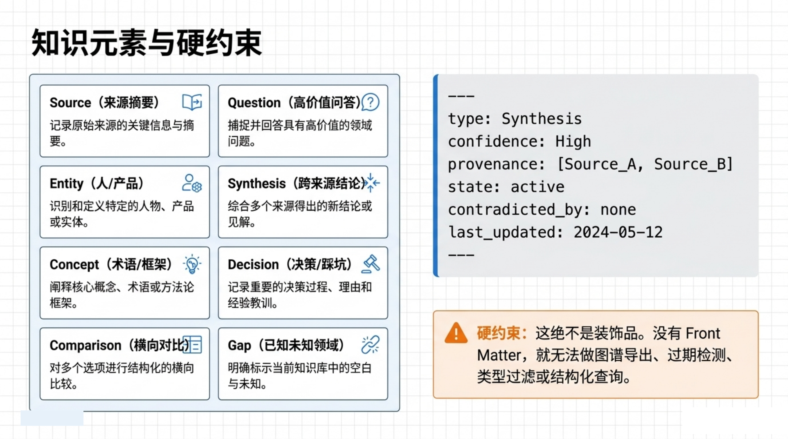

---

## 七、链式反应工作流（Chain Reaction Workflow）

一篇文章往往触达 8-15 个页面（新建、更新、创建冲突），形成"一变多"的链式反应：

```
输入 → 接收 → 规范化 → 读取 Schema → 分析提取
→ 生成页面 → 交叉引用 → 更新控制面板 → 进入 Review 待审队列
```

**核心机制：增量编译（Incremental Compilation）**。利用 SHA Hash 比对，系统只重新编译发生变化的部分——这是将生成动作工程化的杀手锏。

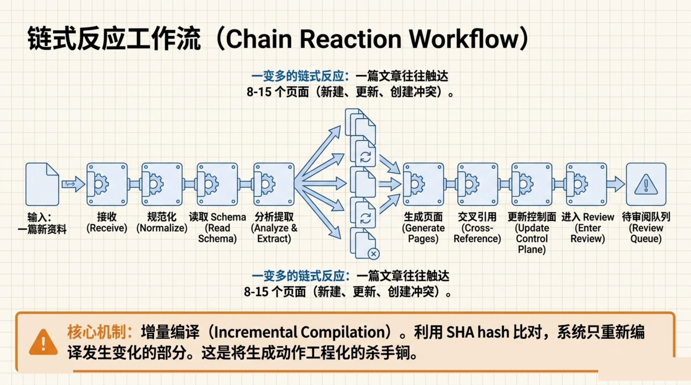

---

## 八、知识库的四大生命支柱

### Query（查询）
通过 `index.md` 混合检索，仅读必要页面，带来源输出。

### Save（结晶）
将对话中产生的高价值综合判断，强制沉淀为新的 Synthesis 页面，防止系统退化为纯聊天。

### Lint（治理）
- **结构性检查（health.py）**：死链、署名检查
- **语义性检查（lint.py）**：陈旧声明、冲突检测

### Research（研究）
Deep Research 机制，主动发现知识缺口，自动派 Agent 搜索网络并回写结果（Self-healing）。

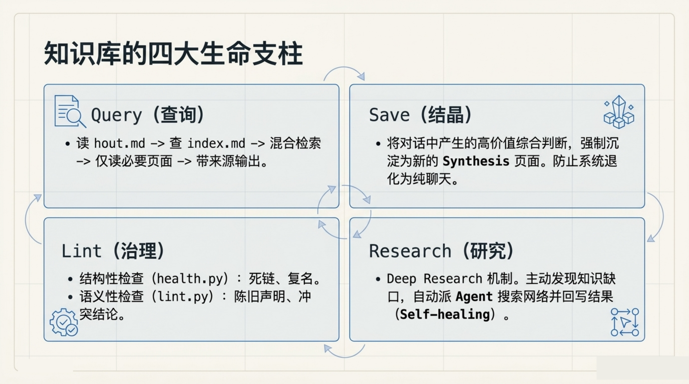

---

## 九、危险：单视角串行摄取

LLM 读一遍写一遍，极易产生**确认偏差**（Confirmation Bias），将可疑声明固化为事实。

LLMWiki 采用多视角裁决机制：

1. 资料进入后，引擎先用 As-is 模式提取原始内容
2. 多 Agent 并行消费，各自产出独立判断
3. 仲裁引擎（Orchestrator）综合各 Agent 输出，生成最终裁决（Verdict）

**高风险结论可靠性**：用高 Token 成本换取裁决而不是简单总结，最大程度减少确认偏差。

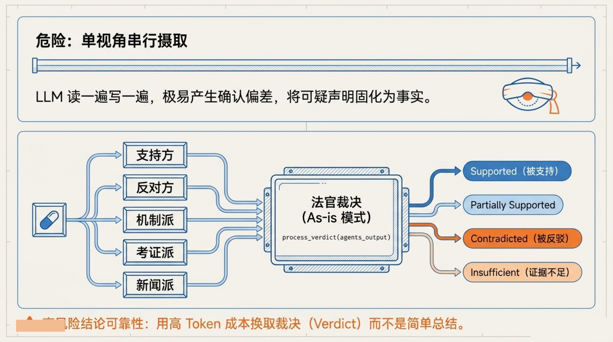

---

## 十、检索路由：Adaptive RAG

RAG、GraphRAG、LLMWiki 三者是**亚加关系**，不是互斥替代。按查询类型路由：

| 查询类型 | 最佳匹配 |
|---------|---------|
| **Single-hop / 单一事实** | 传统 RAG — 精准、简洁、高效 |
| **Multi-hop / 全局关联** | GraphRAG — 全局语义映射 |
| **长期综合 / 深度总结** | LLMWiki — 结构化持久页面查询 |
| **混合检索** | Reciprocal Fusion — BM25（字面）+ Vector（语义）+ Graph（关系）→ 最终答案 |

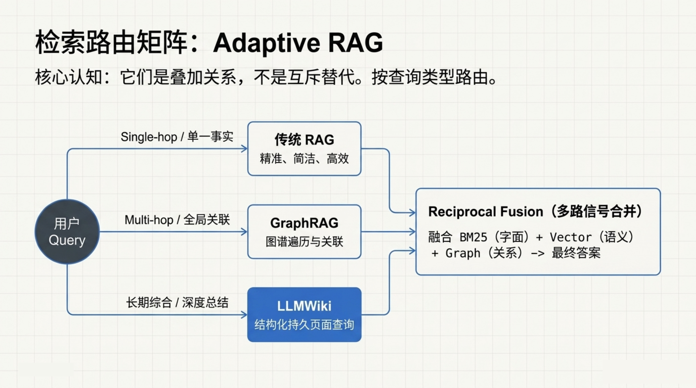

---

## 十一、致命风险

### 风险 1：幻觉的自我强化闭环

LLM 摄取时读取自己编造的 Wiki 当背景知识，错误被交叉引用、摘要，形成自我强化循环。**必须依赖 Review Queue 进行高风险人工阻断。**

### 风险 2：去溯源化（De-provenance）

摘要压扁了细节，找不到原始出处，导致信息不可逆损失。

**工程真相**：维护成本并没有消失，只是从人写笔记转移到了人维护 Schema 和 Review PR（Pull Request）。

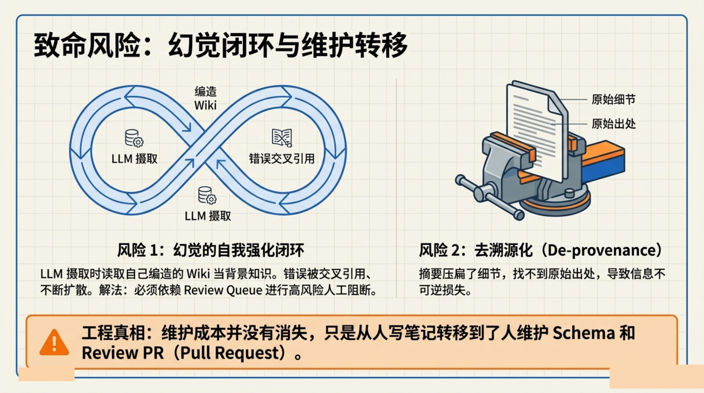

---

## 十二、适用场景雷达

### 极佳场景（Ideal Fit）
- 长期主题研究与论文精读
- 复杂代码库理解
- 竞品情报分析
- 个人第二大脑 / 多 Agent 共享上下文
- **特征**：资料不断涌入，结论需要持续沉淀

### 劝退场景（Do Not Use）
- 一次性问答任务（没必要上整套治理层）
- 低价值语料粗消化（用传统 RAG 即可）
- 实时监控告警（它是知识库，不是观测系统）

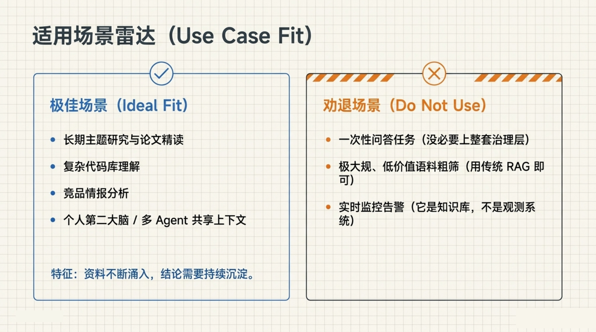

---

## 十三、LLMWiki 的本质

> LLMWiki 的本质，是把 LLM 从一个每次都重来的回答器，彻底升级为一个越用越聪明、越用越值钱的知识运行时。

它不是另一个知识库工具，而是一套完整的**知识资产工程系统**——让每一次人机对话的洞见都能被捕获、沉淀、链接，并在后续的每一次查询中释放更高的价值。

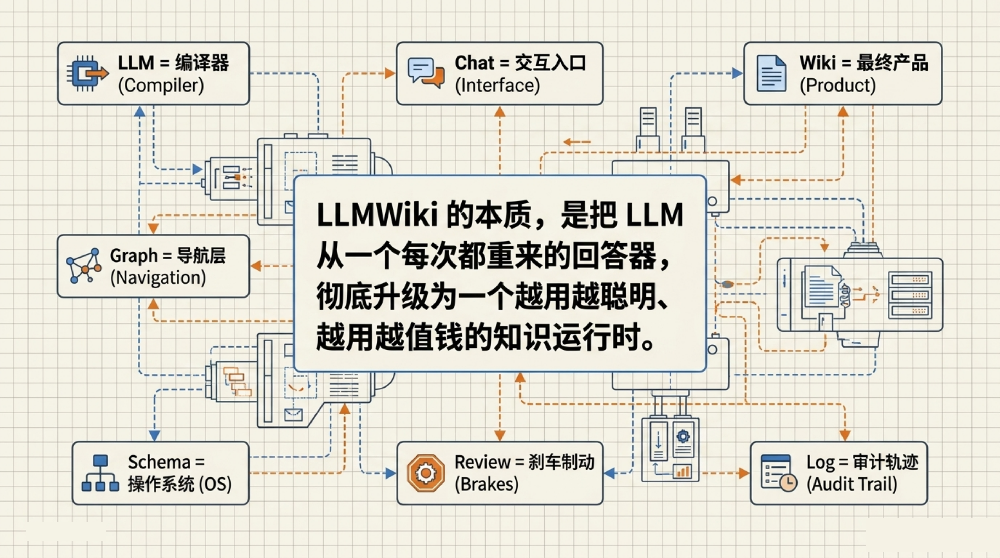

---

## 十四、继续探索

系统化掌握前沿 AI 架构，从 LLMWiki 开始。多模态大模型必修课、前沿 AI 架构解读，构建完整的 AI 知识体系。

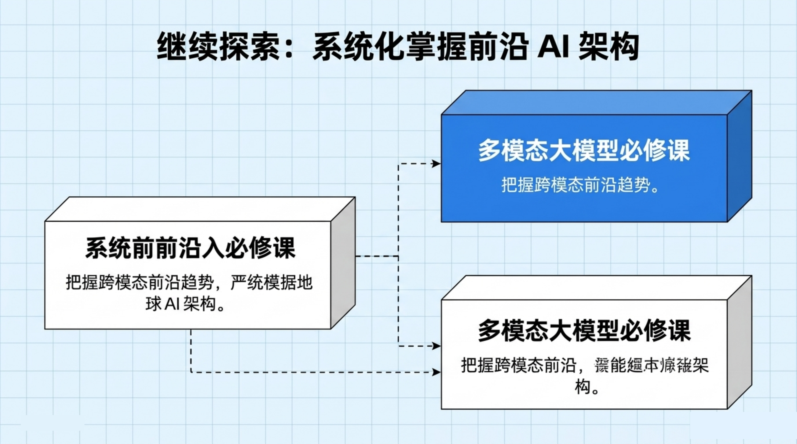
