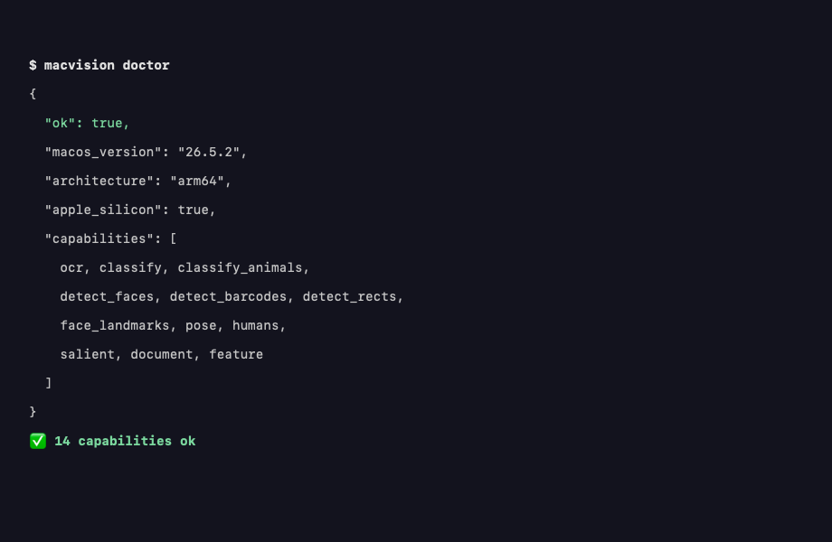

模型看不到图片时，读图通常要借云端 API。macOS 自带 Apple Vision.framework，OCR、场景识别、显著性分析都能在本机完成。o98k-ok/macvision-skill 把这个能力封装成 agent skill，上游是 ljh-sh/macvision（Apache-2.0）。本文记录从安装、自检到实测的完整过程。

## 结构

三层各管一件事：

- Apple Vision.framework：macOS 内置的本地视觉引擎
- ljh-sh/macvision：把框架封装成 CLI，输出 JSON
- o98k-ok/macvision-skill：agent 约定层，规定 JSON 优先、事实与推断分开

skill 不实现识别逻辑，它只包装命令、约定输出格式、提供安装和自检流程。

## 安装

硬性前置是本机二进制 macvision。README 给了三条路：下载 GitHub Release 二进制（推荐）、Homebrew、swift 源码构建。我走第一条，下载 universal 包，解压后装到 `~/.local/bin` 和 `~/bin`：

```bash
curl -fsSL -o /tmp/macvision-darwin-universal.tar.xz \
  https://github.com/ljh-sh/macvision/releases/latest/download/macvision-darwin-universal.tar.xz
tar -xJf /tmp/macvision-darwin-universal.tar.xz -C /tmp/macvision-extract
BIN="$(find /tmp/macvision-extract -type f -name macvision | head -1)"
install -m 755 "$BIN" "$HOME/.local/bin/macvision"
install -m 755 "$BIN" "$HOME/bin/macvision"
```

装完把仓库复制到 skills 目录（我放在 `~/.codex/skills/macvision`），去掉 `.git`，agent 下次启动就能加载这个 skill。

## 自检

`macvision doctor` 是 skill 的启动门槛，必须输出 `"ok": true` 才能开始干活。

实测环境：macOS 26.5.2，arm64 Apple Silicon，macvision 0.1.4。doctor 返回 14 项能力全部可用：



ocr、classify、salient 之外，还有动物识别、人脸、条码、姿态、文档分割、图像指纹等子命令。

## 实测：OCR

生成一张中英混排测试图，交给 ocr：

```bash
macvision ocr /tmp/macvision-test.png --json --lang zh-Hans,en-US
```


返回 JSON，`ok` 为 true，`texts` 里有文字、bbox 和置信度：

```json
{"ok":true,"count":1,"texts":[{"text":"Hello 你好 macOS Vision 2026",
  "bbox":[30,86,576,42],"confidence":0.5}]}
```

bbox 是 `[x, y, w, h]`，原点在左上角。给模型推理时用这个结构化结果，比贴图省 token，也更可控。

## 实测：classify 与 salient

classify 把测试图识别为 document、printed_page、screenshot，各带置信度。

salient 输出注意力热力图。`--overlay-jet` 把热力图叠加回原图：


白色文字区域是视觉焦点，叠加图把它标了出来。salient 还支持 `--crop` 做智能裁切，`--ocr` 只读焦点区域内的文字。

## 一次真实读取

剪贴板里放一张 756x105 的截图，用 `--clipboard` 读取，`zh-Hans,en-US`。识别成功，但有两处低置信度瑕疵：`.git` 被读成 `•git`，`~/.codex` 中间多了空格，两处置信度都是 0.5。最后一行置信度 1.0，识别准确。

低置信度结果要结合上下文修正，不能原样转发。

## 注意事项

- `screencapture` 和 `--clipboard` 首次使用需要屏幕录制权限
- 有视觉能力的模型可以直接看图，但 OCR 的结构化输出（bbox 加置信度）对中英混排截图和自动化流程仍有价值
- 图片不出本机，没有 API 费用

## 出处

- https://github.com/o98k-ok/macvision-skill
- https://github.com/ljh-sh/macvision
- Apple Vision framework 文档：https://developer.apple.com/documentation/vision
