> 需求文档、执行代码与底层数据表严重脱节是 MES 系统变更管理的核心困境——一次变更可能引发难以追溯的连锁故障。本文提出基于 BFO 本体与 D2K 引擎的架构蓝图，在语义层与物理层之间构建精准映射管道，实现从业务动作到每一列物理字段的 100% 全生命周期动态追溯。

---

## 一、认知断层：MES 知识管理的本质困境

制造执行系统（MES）面临一个根本性矛盾：**需求以自然语言编写、业务逻辑以代码实现、数据以 Schema 定义，三者之间没有形式化的关联机制。**

当产线工艺变更时，业务人员修改需求文档、开发人员修改存储过程、DBA 调整表结构——但谁能保证所有改动被正确传递？谁能精确回答"修改 `actual_qty` 字段会影响哪些存储过程和业务规则"？

传统 MES 依赖人工维护的追溯矩阵，但随着系统演进，矩阵与实际代码的偏差越来越大。这不是管理问题，而是**工程断层问题**——语义层（需求）与物理层（代码+数据）之间的映射关系没有被显式建模。

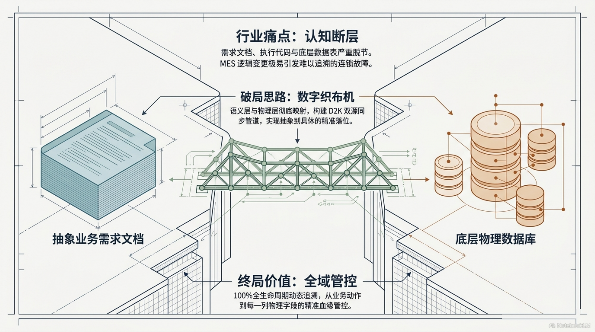

---

## 二、顶层本体模型：BFO × MOMO × ISA-95 三层映射

核心思路是引入形式化本体作为"语义锚点"，将工业知识从隐式（人脑、文档）转化为显式（图谱中的节点与关系）。

架构深度融合三大标准：

- **BFO**（Basic Formal Ontology）：顶层哲学本体，提供实体（Entity）、发生（Occurrence）、延续（Continuant）等最基础的范畴划分
- **MOMO**（Manufacturing Operations Management Ontology）：面向 MES 领域的操作管理本体，定义工单、批次、工艺路线等核心概念
- **ISA-95**：国际工业标准，与 MOMO 协同构建与物理系统的桥接

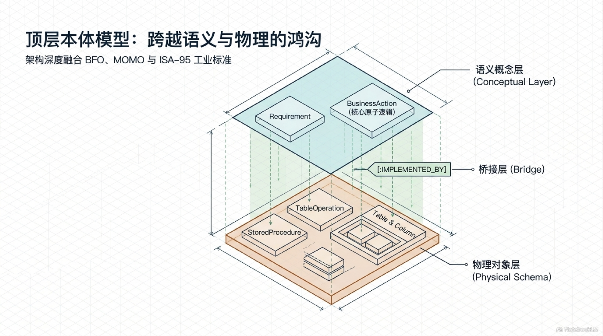

**三层架构设计**：

| 层级 | 内容 | 核心实体 |
|------|------|---------|
| **语义概念层** | 业务语义模型 | `BusinessAction`、`BusinessRelation` |
| **桥接层** | 语义→物理的精确映射 | `ActionMapping`、`FieldMapping` |
| **物理对象层** | 数据库 Schema 与代码 | `TableOperation`、`ColumnSchema`、`StoredProcedure` |

每一条 `BusinessAction` 通过桥接层的映射关系，精确关联到某张表的某个字段、某个存储过程的某行代码。**语义层与物理层之间的鸿沟，被显式的跳接层永久消除。**

---

## 三、四维时空模型：ISO 15926-2 不可篡改审计追踪

工业系统极速变更，但传统物理删除等于抹去历史——变更追踪在此失效。

借鉴 **ISO 15926-2 四维时空模型**，为每一个实体附加时间维度的属性标定：

```
{
  TimeStart:   "2024-06-01T08:00:00Z",   // 生效起始时间
  TimeEnd:     null,                      // 生效结束时间（null = 当前有效）
  is_active:   true,                      // 软失效标记
  confidence:  1.0                        // 置信度
}
```

**核心机制：软失效（Soft Deletion）**。任何数据永不物理删除，仅标记为失效。这构建了不可篡改的数字审计追踪体系——每一次变更都有时间戳、谁在何时修改了什么、旧值是什么，全部可追溯。

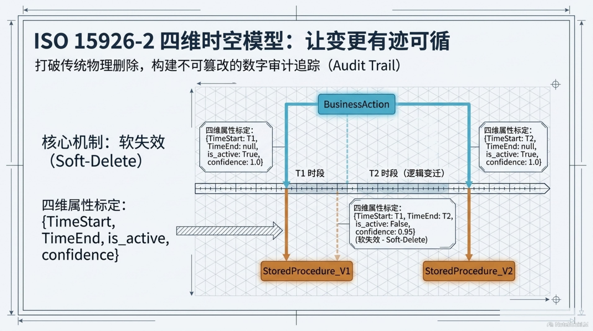

---

## 四、D2K 双源摄取引擎：知识大动脉

存量与增量双源合流，将异构文本与代码转化为标准图谱事实。这是整个架构的知识入口：

- **存量（Batch）**：一次性导入历史需求文档、遗留代码注释、现有数据字典
- **增量（Stream）**：持续监控新的需求变更、代码提交、DDL 变更

双源在标准化管道中汇合，统一转换为四维标定的图谱事实，写入 Neo4j 知识图谱。

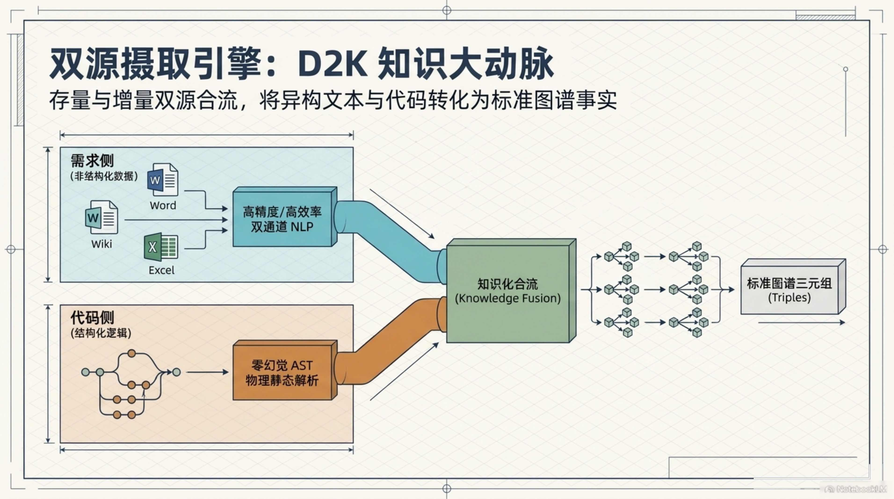

---

## 五、需求侧语义抽取：NLP 双通道管线

工业级 NLP 必须在极致性能与成本之间取得平衡。设计采用双通道架构：

### 通道 A：高精度路线（ALBERT-BiLSTM-Attention-CRF）

面向核心工艺规则与 FMEA（失效模式与影响分析），需要最高的准确率：

- **ALBERT 编码器**：参数共享将词嵌入负担从 O(V×H) 骤降至 O(V×E + E×H)
- **BiLSTM 层**：双向长短期记忆网络，捕获因果链上下文
- **Attention 机制**：聚焦关键语义单元
- **CRF 层**：条件随机场修正非法边界

### 通道 B：高性价比路线（定制 SpaCy）

面向 90% 的大规模存量文本，无需耗费大模型成本：

- 定制 SpaCy 依存句法分析（Dependency Parser）
- 内置被动语态转换、短语合并与代词消解
- **性能表现**：可达大模型效果的 94%，成本降低一个数量级

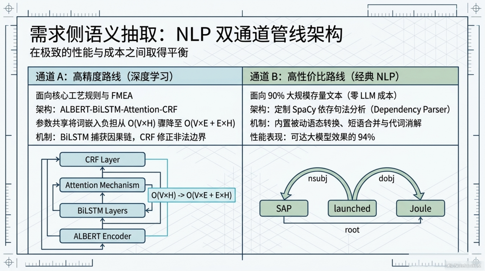

---

## 六、代码侧结构抽取：SQL AST 物理血缘解析

核心原则：**弃用 LLM，改用编译器级 SQL 静态解析，确保绝对物理确定性。**

LLM 在理解 SQL 语义上可能"一本正经地胡说八道"，但编译器的 AST 解析是确定性的。对于工业级 MES 场景，代码侧的血缘关系必须是 100% 精确的：

- `EXEC [dbo].[sp_name]` 级联调用链追踪
- `UPDATE / INSERT` 特定字段写操作识别
- 存储过程之间的调用关系图自动构建
- 触发器和视图的依赖关系推导

每一行 SQL 代码被解析为 AST（抽象语法树），从中提取出：**哪个存储过程操作了哪些表的哪些字段**。这构成了物理血缘的核心骨架。

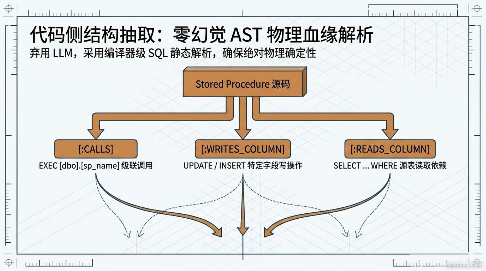

---

## 七、RINK I：语义实体自我清洁

从 NLP 和 AST 管道抽取的原始实体带有大量噪音——拼写错误、同义词、指代歧义。RINK（Resolution of Industrial Knowledge）设计了**三阶段实体消歧**流程，保留 100% 数据世系：

| 阶段 | 相似度范围 | 策略 | 工具 |
|------|-----------|------|------|
| **1. 绝对合并** | Sim ≈ 1 | 笔误级同义词（如"工单"vs"工-"单），直接合并 | 编辑距离 + 业务词典 |
| **2. 符号裁判** | 0.82 < Sim ≤ 0.95 | LLM 结合上下文进行二分类真伪消歧，防止关键逻辑误判 | LLM Judge |
| **3. 全新注册** | Sim ≤ 0.82 | 确认为新实体，创建独立节点 | APOC 增量写入 + 溯源 |

**关键设计**：阶段 2 使用 LLM 但不依赖 LLM——只做高相似度区间的二分类裁决，且裁决结果需要经过上下文验证，将幻觉风险控制在最小。

唯一规范化后的实体以标准化格式写入图谱：`BusinessAction`、`BusinessRelation`、`TableOperation`、`ColumnSchema`。

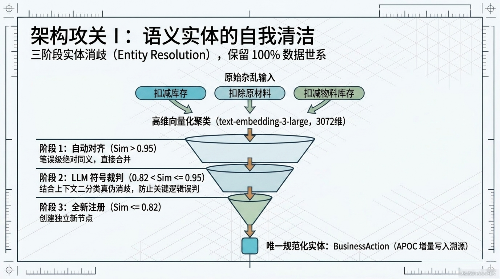

---

## 八、RINK II：超级节点危机与破解

**工业级图谱落地最大挑战：高频交叉读写引发拓扑灾难。**

实际场景中，数百个存储过程高频并发读写同一张核心表，导致：

1. 图谱出入度极度稠密，形成无法解析的关联死结
2. 执行邻居采样截断（Neighbor Sampling）时，随机丢失关键血缘路径

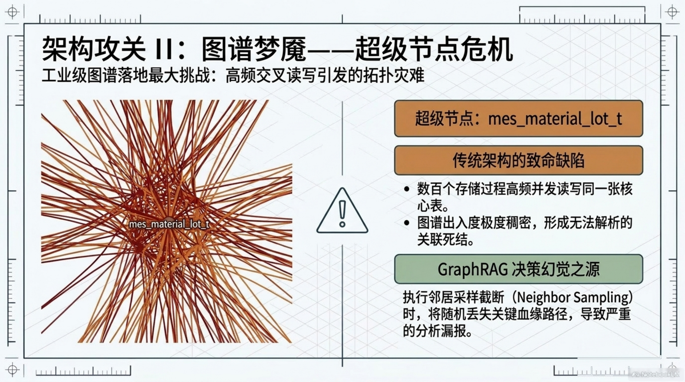

### 破解策略 1：列级切分（Column-Level Sharding）

将表级节点的稠密连接精准稀化至列级节点。例如一张表原本有 500 条连线，经列级切分后，分流至 25 个特定 Column 节点——`actual_qty` 承担 80 条，`lot_status` 承担 30 条，每列的连接数量大幅降低。

### 破解策略 2：事务边界切分（Transaction Boundary Sharding）

实例化每一次读/写操作的事务实体。在图谱搜索时，直接根据切面时序与操作类型过滤掉 90% 的无效连线——只保留与当前查询相关的事务路径。

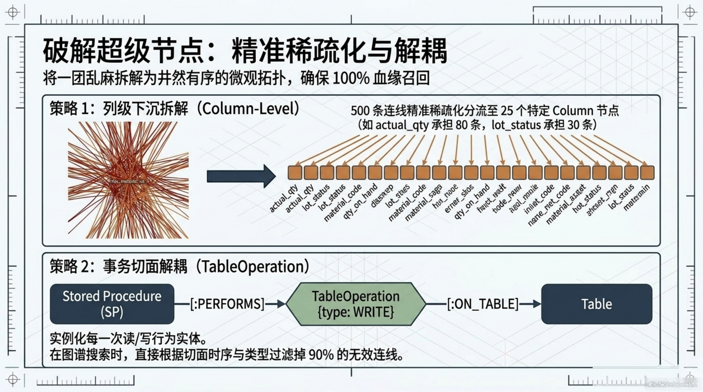

---

## 九、意图路由自适应：告别盲目遍历

传统的图查询需要用户掌握 Cypher 语法，且在全图遍历时性能堪忧。设计引入**基于自然语言意图的检索路径动态重写**：

```
自然语言提问 
    ↓
意图感知路由（Classifier）
   ├── MiG READs + 只读切面检索 → 直接锁定节点
   └── WRITEs 深度穿透分析 → 定位所有受影响的下游节点
    ↓
动态重写 Cypher → 精准查询
```

- **READ 类查询**：识别为只读意图，利用时序切面过滤历史版本，快速定位当前有效节点
- **WRITE 类查询**：识别为变更影响分析，穿透追踪所有下游依赖节点

**效果**：查询复杂度从 O(N²) 降至 O(log N)，且在工业级规模的图谱上保持毫秒级响应。

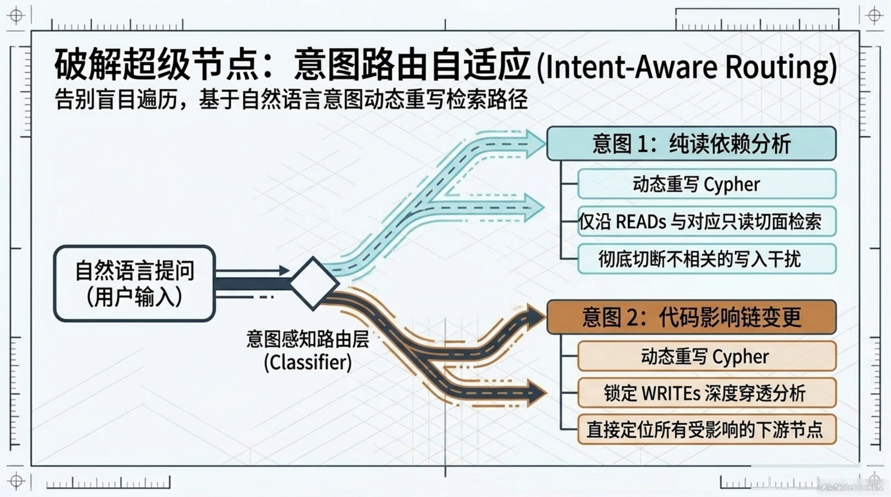

---

## 十、现场级 CDC 同步闭环：边缘到中心的 30ms 流转

MES 是现场级系统，数据库变更必须以极低延迟反映到知识图谱中。设计采用**流式 CDC（Change Data Capture）闭环**：

### 步骤 1：捕获（Capture）
**Streamkap** 静默监听底层数据库 WAL（Write-Ahead Log）日志，DDL/DML 变更实时提取。对数据库零侵入。

### 步骤 2：流化（Stream）
变更事件转换为结构化 JSON 格式，推送至 **Apache Kafka** 消息队列。

### 步骤 3：计算与注入（Consume）
**Apache Flink** 实时增量计算，解析变更内容后，以毫秒级延迟注入 **Neo4j** 知识图谱。

**端到端延迟**：< 30ms，完美兼顾业务连续性与图谱同步实时性。

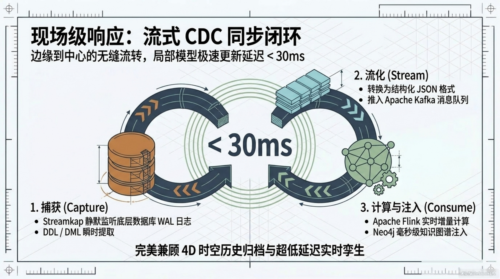

---

## 十一、图谱护栏：消除 LLM 幻觉的刚性格栅

大模型在工业级场景下必须被底层规则严格约束。设计引入**图谱 Schema-索引-检索引擎架构**作为 LLM 的防线：

- **Integration Server（防线网关）**：定时调用 `apoc.meta.schema` 拉取最新物理架构
- **系统级强制约束**：将真实 Schema 作为刚性词典注入 System Prompt，杜绝 LLM 捏造字段名、表名或关系方向
- **效果**：Cypher 一次性生成通过率 > 95%

**核心原则**：LLM 只能做"选择题"（从真实 Schema 中选字段），不能做"填空题"（凭空造字段）。这是工业级应用的底线。

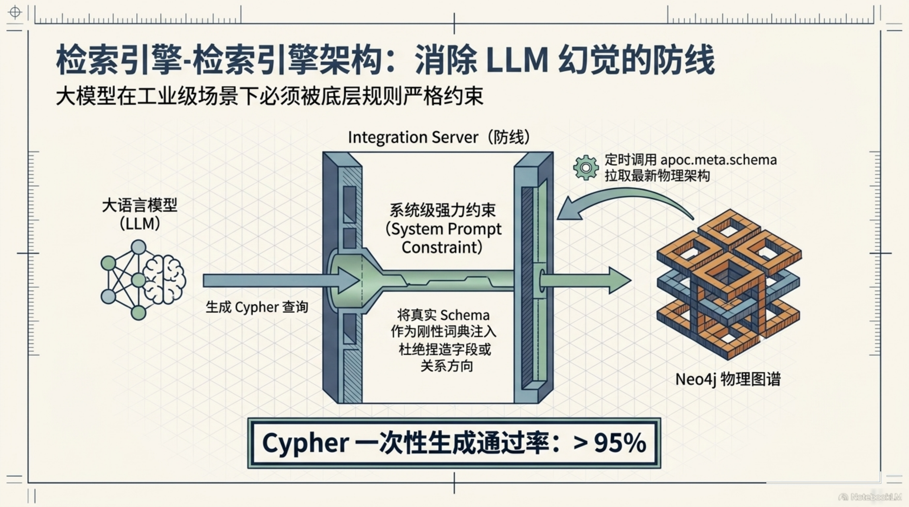

---

## 十二、RRF 混合检索：文本语义与拓扑关联融合

单一检索模式无法满足工业级知识追溯需求。设计采用 **RRF（Reciprocal Rank Fusion）双路融合算法**：

```
RRF_Score = Σ 1 / (60 + r(d))
```

### 通道 1：高召回文本检索
- **Milvus** 向量数据库进行语义相似度匹配
- 提取源文档的 Text Chunks
- 适用于模糊描述类查询（"那个关于批次追溯的逻辑"）

### 通道 2：1-Hop 强拓扑遍历
- **iGraph** 广度优先探索
- 提取纯图谱血缘三元组
- 适用于精确血缘类查询（"修改 lot_status 会影响什么"）

两路结果经 RRF 排序融合，输出高质量事实基准报告——既有语义理解的广度，又有拓扑关系的精度。

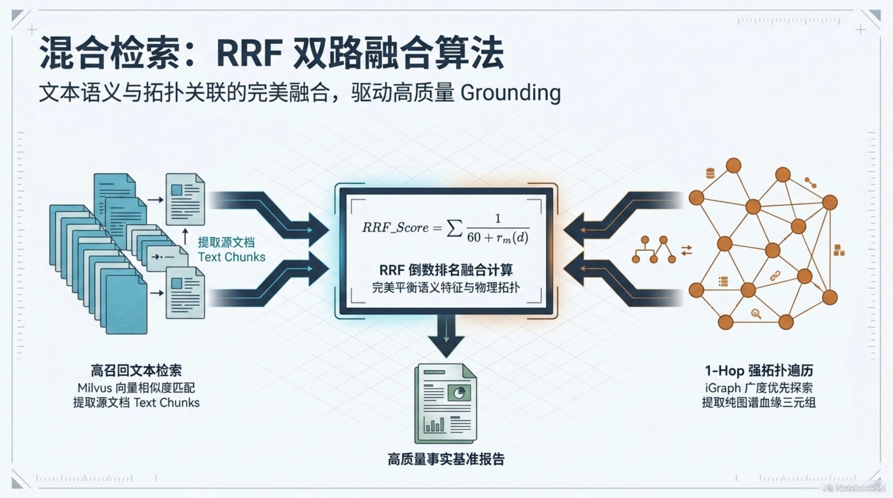

---

## 十三、终局：活态数字神经元

整套架构追求的并非一个静态知识库，而是一个**能随产线秒级演进的活态数字神经元**：

| 维度 | 能力 |
|------|------|
| **本体标准** | 坚守 MOMO 本体标准，ISA-95 桥接语义与物理 |
| **摄取管道** | AST 静态解析 + CDC 流式捕获，双源合流 |
| **拓扑治理** | 独创列级切分与事务边界分解，突破海量连接性能瓶颈 |
| **审计追溯** | ISO 15926-2 四维模型，不可篡改的数字审计追踪体系 |
| **查询智能** | 意图路由自适应 + RRF 混合检索，自然语言直达物理字段 |
| **LLM 护栏** | 真实 Schema 刚性约束，工业级防幻觉防线 |

> **MES 数字神经元的终极价值不在于它存储了什么，而在于它让每一行代码与每一条数据都永远知道自己"从哪来、到哪去、被谁用"——在工业智能化的道路上，这是比任何算法突破都更重要的工程基石。**

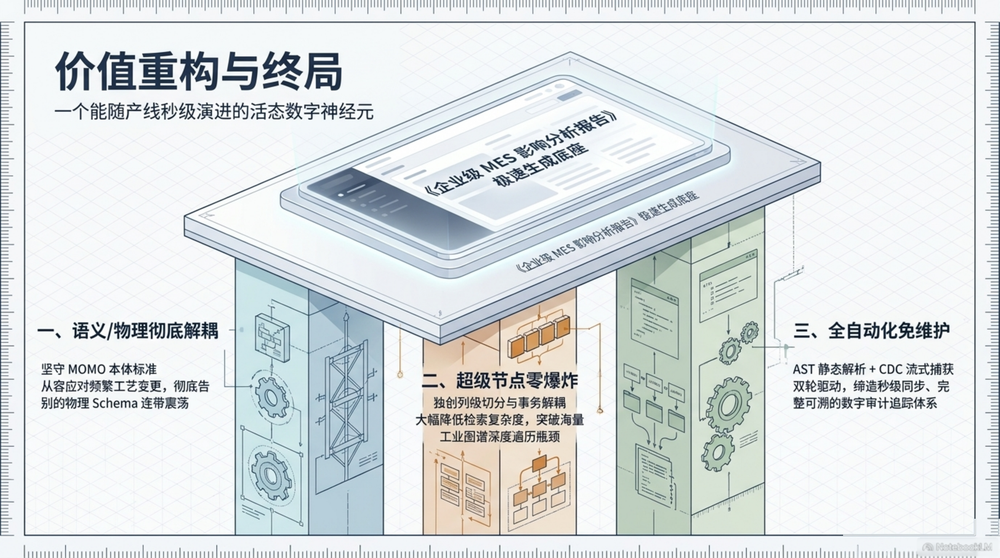
