> 从被动搜索到主动认知，从零散文件夹到神经中枢。NotebookLM 重新定义了"知识工作"：它不只是另一个 AI 笔记工具，而是一个以你上传的专属语料库为核心、100% 忠于原始资料、具备完整知识转化飞轮的数字智能体。本文深入拆解这套从输入到创造的自动化引擎。

---

## 一、专属 AI 研究助理：通用大模型 vs 专属知识引擎

NotebookLM 的核心定位并非通用聊天机器人，而是**专属知识引擎**。它与通用大语言模型存在根本性差异：

| 维度 | 通用大语言模型 | NotebookLM 专属引擎 |
|------|---------------|-------------------|
| **数据源** | 依赖公开训练数据 | 100% 忠于你上传的专属语料库 |
| **幻觉风险** | 存在"一本正经地胡说八道"风险 | 基于事实回答，无数据即不作答 |
| **溯源能力** | 缺乏信息溯源能力 | 精准提供每一段回答的原始出处 |
| **隐私保障** | 对话可能被用于模型训练 | 用户数据绝不用于训练底层 AI 模型 |

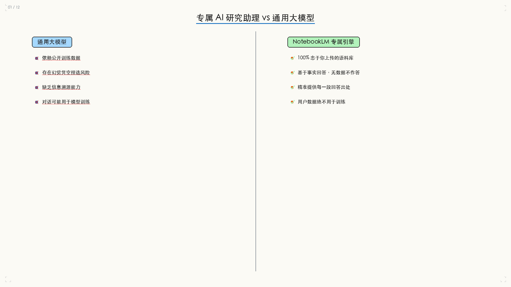

---

## 二、信任的三大基石

NotebookLM 构建了可验证 AI 的三条核心原则：

### 有所本（Grounded）
AI 的分析与回答，严格局限于你上传的文件与资料，绝不天马行空。每一个回答都是基于确凿来源的事实判断。

### 透明化（Transparent）
每段回答旁自动生成引文编号。鼠标悬停即可一键跳转至原始文件段落，随时查证真伪。**所见即所得，所得必可查。**

### 隐私保护（Privacy）
Google 官方承诺：用户上传的任何私人数据，绝对**不会被用于训练**其底层 AI 模型。你的知识库只为你服务。

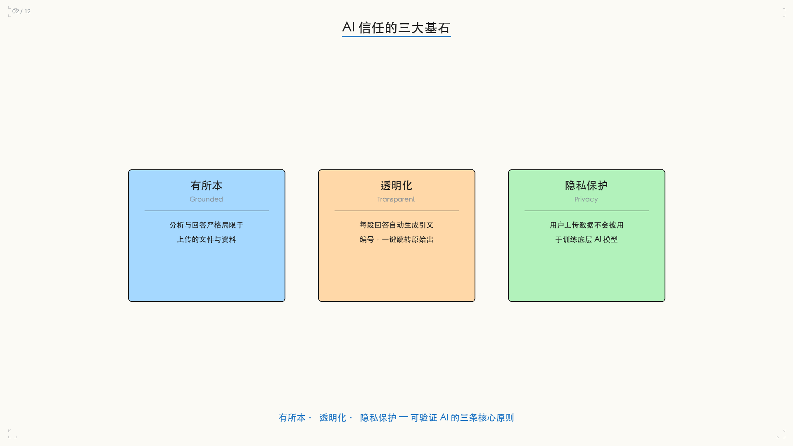

---

## 三、知识转化飞轮：现代信息处理的生命周期

NotebookLM 将知识管理抽象为三个连续的阶段，形成完整的自动化飞轮：

```
Phase 1: 构建 (Import)    →   Phase 2: 消化 (Understand)   →   Phase 3: 创造 (Create)
      ↓                              ↓                              ↓
  汇入多元格式来源              对话式知识检索               播客 / 视频 / 简报
  搭建智能个人图书馆            生成式视觉图表               反哺灵感形成知识迭代
                                引文溯源
```

这是一个**自我强化的闭环**：输入驱动理解，理解产生创造，创造的结果反哺为新的知识来源。

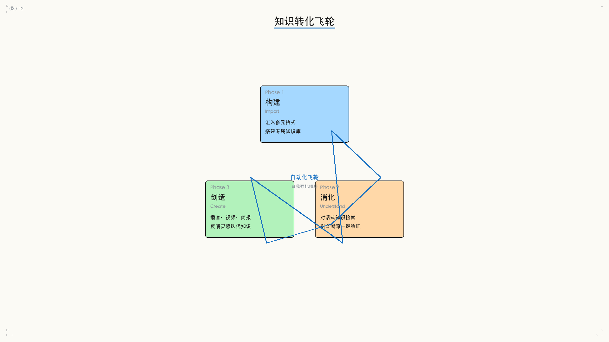

---

## 四、阶段一：构建你的智能图书馆

NotebookLM 支持多元信息源汇入，搭建个人专属的知识中枢：

| 来源类型 | 说明 |
|---------|------|
| **Google Docs / 本地文稿** | 直接关联或上传已有文档 |
| **PDF 与 TXT 文本** | 支持标准文档格式 |
| **音频文件 (Audio)** | 上传录音或讲座音频 |
| **网页链接 (Web URLs)** | 直接抓取在线文章 |
| **YouTube 视频链接** | 转录视频内容纳入知识库 |
| **相机扫描（移动端）** | 拍摄实体书本或文件 |

**容量参考：**
- 免费标准版：单个笔记本支持 50 个资料来源
- Pro 专业版：跃升至单本 300 个来源，打造巨型智库

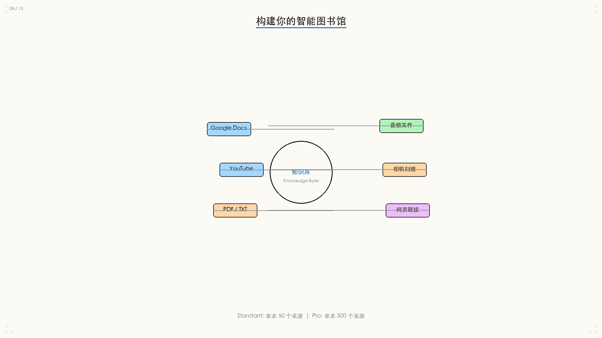

### 两种研究模式

NotebookLM 提供两种互补的研究模式：

| 维度 | Fast Research（快速研究） | Deep Research（深度研究） |
|------|------------------------|------------------------|
| **定位** | 精准的"内部搜索引擎" | 专属"AI 分析员" |
| **功能** | 瞬间定位云端或网盘内的既有资料 | 自动检索多个关联网站并评估内容 |
| **响应时间** | 毫秒级即时响应 | 数分钟内完成海量运算 |
| **交付物** | 精简准确的单点答案与资料定位 | 结构完整、详尽的多页深度分析报告 |

---

## 五、阶段二：消化与理解——与你的专属专家对话

这是 NotebookLM 最核心的能力：**对话式知识检索**。相比传统的关键词搜索，NotebookLM 实现了三重飞跃：

### 动态引文溯源
AI 整合资料后，不仅提供全面回答，更在每段回答旁标注来源编号。点击编号即刻跳转至原始文档，所见即所得。

### 一键验证
无需在数十个文档之间来回切换。引文编号 + 即时跳转，将验证时间从数分钟压缩至数秒。

### 精准聚焦模式
可手动勾选特定档案，强制 AI 仅根据选定范围作答，进一步排除杂音、提升精确度。

### 心智图生成
面对庞杂资料毫无头绪？一键生成心智图，自动拆解概念框架、理清各信息节点之间的逻辑关联，将枯燥的数据与长篇流程浓缩为一目了然的视觉摘要。

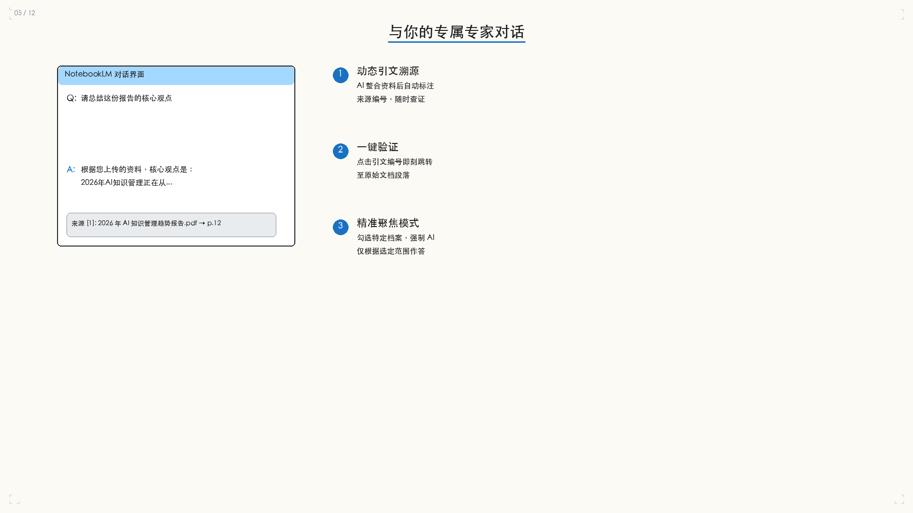

---

## 六、高阶心法：知识闭环

NotebookLM 的高阶用法并非单向问答，而是构建**知识自我迭代的完美循环**：

### 步骤一：捕捉灵感 (Save)
在与 AI 对话中遇到绝佳观点，一键"保存至记事"。

### 步骤二：身份转换 (Convert)
将手写笔记或保存的灵感，一键转换为"新的来源资料"。

### 步骤三：反哺智库 (Synthesize)
指示 AI 重新分析加入笔记后的完整数据库，获得更高层次的综合见解。

这并非单纯的记录，而是一个**知识不断深化、自我迭代的循环**，让工具真正成为你大脑的延伸。

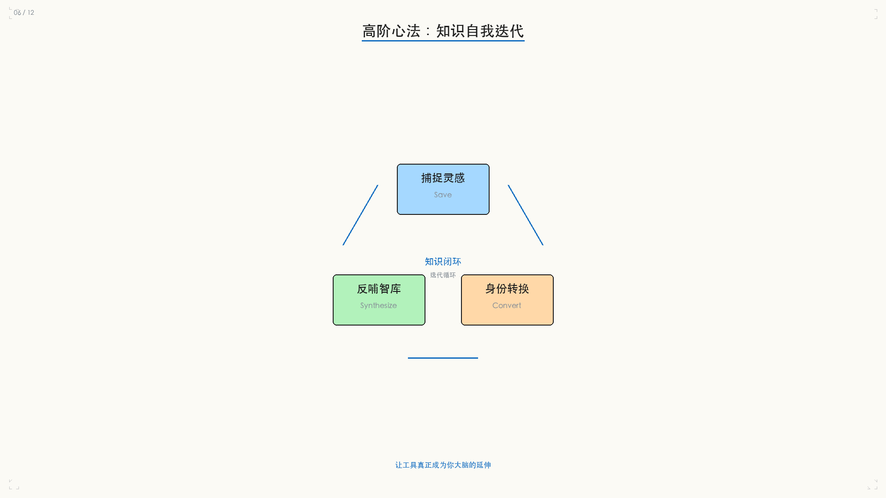

---

## 七、阶段三：创造（一）—— AI 音频内容生成

NotebookLM 的音频功能不仅可以被动检索，还能主动创造：

### 语音摘要（Audio Overviews）
自动生成两位 AI 主持人深度对谈的专属 Podcast。支持多种模式：

| 模式 | 说明 |
|------|------|
| **深入探索 (Deep Dive)** | 按需挖掘细节，构建深度讨论 |
| **快速摘要 (Quick Summary)** | 提炼核心观点，快速抓住重点 |
| **提出评论 (Critique)** | 批判性视角，发现潜在问题 |
| **正反方辩论 (Debate)** | 激荡对立观点，探索多重立场 |

### 互动模式（仅限英文）
用户可随时"举手"打断，提出问题后 AI 主持人将根据资料即时回应并延续讨论，如同真实参与专家圆桌会议。

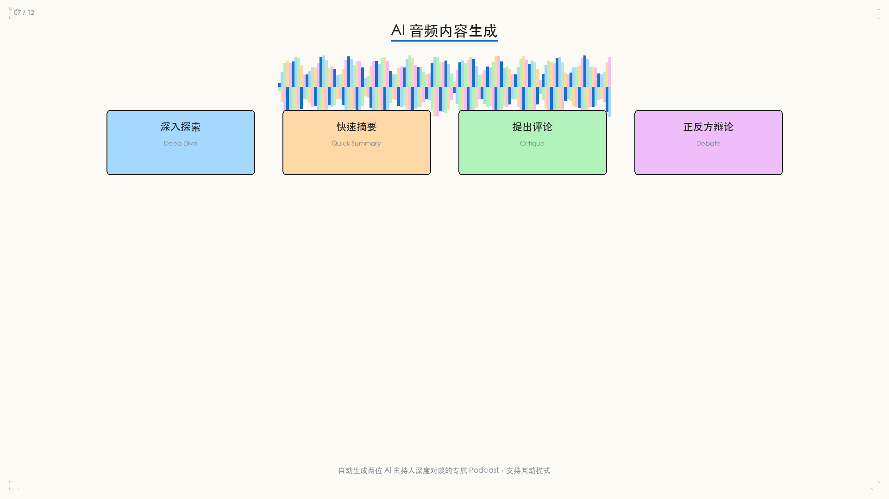

---

## 八、阶段三：创造（二）—— 视频与简报自动化

### AI 旁白解说影片
- 自动提取资料中的关联图片与图表
- 支持长篇详尽解说或短篇精华摘要
- 自由切换多视觉风格：

| 风格 | 适用场景 |
|------|---------|
| **白板风 (Whiteboard)** | 教学演示、概念讲解 |
| **动漫风 (Anime)** | 轻量化内容、创意表达 |
| **复古风 (Retro)** | 深度分析、文档式呈现 |

### 自动生成简报
- 一键从资料库输出架构完整、排版精美的 PPT
- 两种模式：供阅读的"详尽版" / 供上台报告的"重点提纲版"
- 支持全屏播放与 PDF 导出，实现一条龙交付

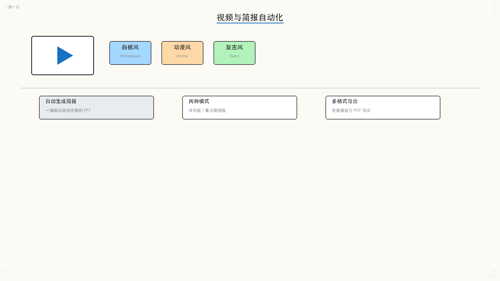

---

## 九、移动端延伸：随身携带的智能外脑

NotebookLM 移动端重点解决"输入"与"收听"两大场景：

- **相机扫描**：直接拍摄实体书本或文件，瞬间转化为智库来源
- **语音输入**：边走边想，语音记录灵感
- **网页剪藏**：移动端浏览时，快速将优质网页存入知识库

> **极客提示：** 移动端专注于"输入"与"收听"，心智图生成等高算力与复杂视觉操作目前需在桌面端进行。

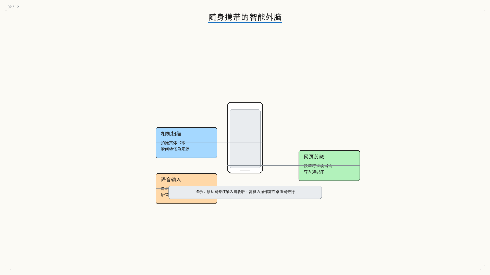

---

## 十、同心圆协作模型：安全可控的知识共享

NotebookLM 采用三层同心圆的协作模型，实现安全可控的知识共享：

| 权限层级 | 能力 | 适用场景 |
|---------|------|---------|
| **仅对话 (Chat Only)** | 访客只能向你的知识库提问，无法查看底层源文件 | 对外分享、客户支持 |
| **查看完整内容 (View All)** | 访客可浏览完整的资料来源与笔记本内容 | 团队参考、知识传递 |
| **共同编辑 (Co-edit)** | 私人邀请成员，共同添加资料、撰写笔记 | 项目协作、团队共创 |

核心原则：**核心资料的私密性与团队协作的便捷性之间，可以兼得。**

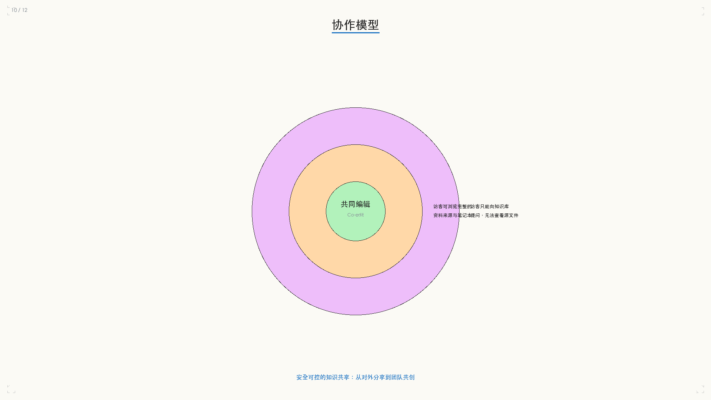

---

## 十一、版本与权益决策矩阵

| 维度 | Standard（免费标准版） | Pro（专业版） |
|------|---------------------|-------------|
| **容量** | 最多 100 个笔记本 / 单本 50 个资料来源 | 提升至 500 个笔记本 / 单本 300 个资料来源 |
| **算力** | 标准版 | 音频摘要等生成式功能额度激增 5 倍以上 |
| **进阶权益** | 基础功能 | 专属数据分析能力 + 自定义对话格式设定 |
| **适用场景** | 个人轻量化研究、日常信息整理 | 专业研究员、重度创作者、企业级知识管理 |

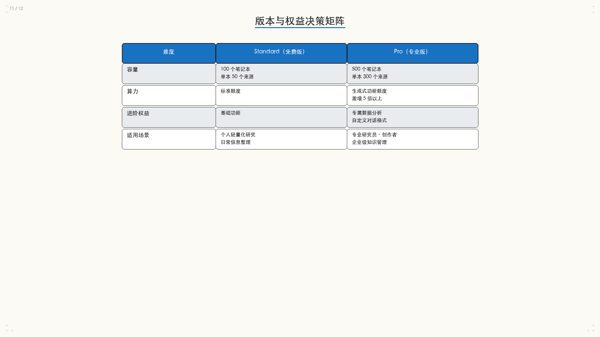

---

## 十二、结语：不仅是工具，更是大脑思考的延伸

回顾 NotebookLM 的三阶段知识转化飞轮：

```
构建 (Import)    →    消化 (Understand)    →    创造 (Create)
你的专属数据源          海量信息重塑逻辑          播客、视频与简报
消除 AI 幻觉            图表与对话式检索          高价值输出
```

> **NotebookLM 的真正价值不在于它"知道什么"，而在于它完全忠于你给它的"边界"——在这个边界内，它比任何通用模型都更懂你、更可靠。**

通过持续的信息输入与笔记反哺，NotebookLM 将演化为一个**不断成长、自我迭代的数字智能体**，彻底颠覆现代知识工作流——从零散信息到数字神经元，每一次对话都在编织你的专属知识网络。

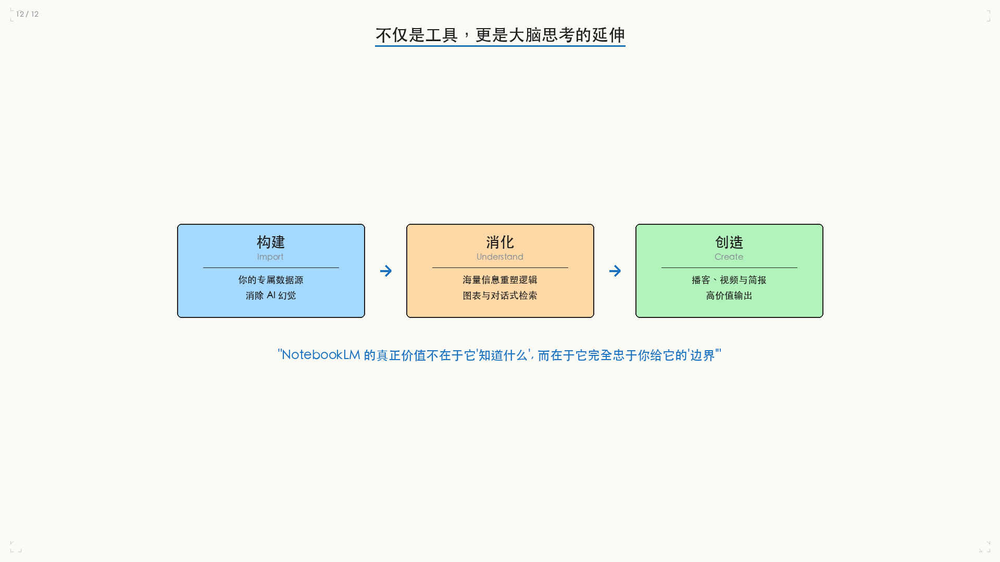
