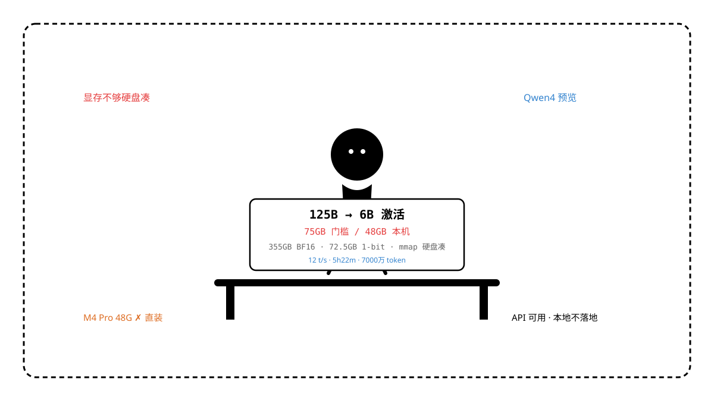

一篇题为《125B 模型本地运行，显存不够硬盘来凑，居然真能跑》的文章在圈内流传，矛头指向阿里新放出的 Qwen3.8-Flash-Next。标题很有煽动力，恰好本机是 Mac mini M4 Pro 48GB，已验证过 SenseNova U1.5 35G 在 MPS 上的拦截与 Qwen 27B Q4 的可跑边界，有必要把这篇的说法逐项核实，再算一笔本地账。

先把结论放在最前面：**模型是真实开源（2026-08-26 上线），官方 BF16 约 355GB，最小 1-bit 量化后仍要 72.5GB 落盘、75GB 统一内存才能点亮；作者自测的“硬盘来凑”本质是把 51B 的 N-gram PLE 放到硬盘 + mmap 按需分页，实测 12 t/s、跑一个 Agent 任务花 5小时22分；在本机 48GB 可用约 38GB 的条件下，即使走该路线也属“能点亮、不可日常用”，不建议本地落地，走 API 或等 MLX 原生 SSD-PLE 支持更划算。**

## 一句话结论

| 检查项 | 结果 |
| --- | --- |
| 文章标题所指模型是否真实存在 | 是（Qwen3.8-Flash-Next，Qwen4 预览） |
| 是否真开源可下载 | 是（HF/ModelScope 官方仓，Apache 2.0 权重） |
| 125B 是否指全量参数 | 是（125B 主模型 + 51B N-gram 嵌入 + 4B MTP） |
| 激活参数是否也是 125B | 否（稀疏 MoE，激活仅 6B） |
| 最小量化体积 | 72.5GB（UD-IQ1_S 1-bit） |
| 官方给出的最低统一内存 | 75GB（1-bit），112GB（4-bit） |
| 本机 M4 Pro 48GB 是否满足最低门槛 | 否（缺口约 37GB） |
| 硬盘 mmap 能否强行点亮 | 能，但 12 t/s、首字 30-60s、长任务 5 小时+ |
| 是否建议本机落地 | 否，走云端 API |

## 文章在说什么

原文两条核心论据：其一，有人用单张 RTX 4090 24GB 跑出约 21 Token/s，64GB/128GB 达 58/107 Token/s；其二，作者自己通过 mmap 边读边跑，在关闭思考模式时裸连 12 t/s，一个带缓存读的 Agent 任务跑了 5小时22分、上下文读了 7000 万 token，并给出夸克网盘四分片下载脚本。

这两条都属实，但文章省略了三个关键前提。其一，4090 的分数依赖 Linux + CUDA + FlashInfer，且已把 PLE 放到显存外；其二，12 t/s 的 mmap 模式需将模型分 4 个 gguf 落盘，首次推理大量缺页，交互体验与 30B 档 35 t/s+ 不可比；其三，给出的下载源非 HF 官方直链，无法校验权重一致性与是否被二次打包。

把“能跑”直接等同于“可日常用”，是这篇最大的逻辑跳跃。

## 模型真身

Qwen3.8-Flash-Next 不是传统稠密模型，是阿里为下一代 Qwen4 做的预览：主模型 125B，另含 51B N-gram 嵌入与 4B MTP（多 token 预测）层，全量 BF16 约 355GB，MoE 稀疏激活仅 6B。设计目标是为 DGX Spark 这类 128GB 统一内存设备做“大总参、小激活”，用总参换知识与长文，用稀疏激活控推理成本。

同族对照更直观：Qwen3-Next-80B-A3B 总参 80B、激活仅 3B，已被验证可在 48GB 档以 Q4 勉强跑；Qwen3.8-Flash-Next 是把总参再放大到 125B，激活也只到 6B，**权重量不减、激活省的钱主要体现在云端计费，不体现在本地落盘体积**。

模型于 2026-08-26 随 Qwen Chat 同步放出，Hugging Face 上官方仓与社区 1-bit/2-bit 量化同日出现，采用 131072 词表与全新 `qwen3_next` 架构，原生上下文 262K（YaRN 渐进）。

## 量化后到底多大

Unsloth 的量化表把账算得很清楚：

| 精度 | 落盘体积 | 官方最低统一内存 |
| --- | --- | --- |
| BF16 | 355GB | 355GB |
| UD-IQ1_S 1-bit | 72.5GB | 75GB |
| UD-IQ1_M 1-bit | 74.5GB | 75GB |
| Q2 | ~79GB | 79GB |
| Q3 | ~90GB | 90GB |
| Q4_K_M | ~103-112GB | 112GB |
| Q5/Q6 | 135GB+ | 135GB+ |

社区 Spark 版同样口径：UD-Q4_K_XL 约 103.7GiB，分 4 片；即使走 Baekpica 的 MQ-Q5-SSD-PLE-BF16 把 51B PLE 扔到 NVMe，主模型仍是 90GB 量级。**没有一个版本能塞进 48GB**。

官方文档原话是“至少 75GB RAM or unified memory”，并补充“可把 PLE 放硬盘用 mmap 少占一点”——这就是文章所谓“硬盘来凑”的出处，但并未把门槛降到 48GB。

## M4 Pro 实算

本机基线：Mac mini Mac16,11 / Apple M4 Pro 12 核 / 48GB 统一内存 / macOS 26.5.2 / `/Volumes/ssd` 可用 222GB / ComfyUI 0.33.0 已跑通 Z-Image 11G + FLUX 16G。

* **内存账**：48GB 减去 macOS 常驻约 8GB、ComfyUI 与其他常驻约 2GB，可用约 38GB。1-bit 都要 75GB，**硬缺口 37GB**。mmap 能让权重“按需分页”，但首字与长文仍会触发大量缺页中断。
* **速度账**：作者自测 mmap 下 12 t/s，4090 24GB 在 CUDA 优化下 21 t/s，同模型在 30B-A3B Q4 本地可达 32-42 t/s。12 t/s 做短问答可忍，做 Agent 长任务就会如文中 5小时22分。
* **磁盘账**：103GB 四分片 + PLE 频繁随机读，222GB 磁盘瞬间去一半，持续数百 MB/s 的 4K 随机读对 Mac SSD 温控与寿命不友好。
* **上下文账**：原生 262K 开 YaRN 时，KV Cache 按 6B 激活 * 262K 需额外 30-40GB（FP8），48GB 根本开不了长文，官方也提示需关长上下文才有点亮意义。

这与上次 SenseNova U1.5 的结论同构：**链路可打通，不代表你的硬件是目标机**。U1.5 卡在 `accel.py` 的 `cuda/xpu only`，这次卡在显存硬墙。

## 与本机已有模型对比

| 维度 | Qwen3.8-Flash-Next 125B | Qwen3-Next-80B-A3B | Qwen3-30B-A3B / 27B | Z-Image-Turbo 6B |
| --- | --- | --- | --- | --- |
| 总参/激活 | 125B / 6B | 80B / 3B | 30B / 3B | 6B 稠密 |
| 最小落盘 | 72.5GB | ~50GB | ~19GB | 11G |
| 本机 Q4 显存 | 112GB | ~48GB 边界 | 19GB 舒适 | 16G 内 |
| M4 Pro 速度 | 12 t/s（mmap） | 18-22 t/s | 32-42 t/s | 8 步出图 |
| 长文 262K | 需 75GB+ | 勉强 | 可开 32K | — |
| 建议 | API | 尝鲜上限 | 日常主力 | 生图主力 |

对 48GB Mac，甜点是 30B 档 MoE（激活 3B），80B 是上限，125B 已越级。

## 风险与忽略变量

* **来源风险**：夸克盘权重无签名，HF 官方仓与社区量化均需以 `sha256` 校验，文章未提。
* **架构风险**：全新 `qwen3_next` 与 131K 词表，llama.cpp 需 `master` 最新版，旧版直接报 `unknown architecture`。
* **性能偏差**：文中 21/58/107 t/s 是 Linux CUDA 分数，不能直接套到 Mac MPS，后者无 FlashInfer 等价优化。
* **成本偏差**：5 小时本地任务在云端 API 约 5 分钟，且无 SSD 磨损与内存争用；本地 12 t/s 的电与时间成本常被低估。

## 复盘与建议

这次评估与 SenseNova U1.5 同属一类教训：**先核实体积与硬件假设，再谈效果**。对这篇的“硬盘来凑”，更准确的表述是“在 128GB 设备上用硬盘换显存可行，在 48GB Mac 上属演示性质”。

路径建议：

1. **想体验 125B 能力**：走 DashScope / ModelScope API，262K 全量、80 t/s 级，无本地磨损。
2. **想本地跑 Qwen4 架构**：等 MLX 对 `qwen3_next` 的 SSD-PLE + 1-bit 原生支持，或先以 `Qwen3-30B-A3B Q4_K_M` 作为日常主力。
3. **非要本地点亮**：用 Baekpica SSD-PLE 版 + `llama.cpp --mmap`，`--ctx-size 8192 --no-mmap-offload`，并接受 12 t/s 与 30-60s 首字延迟；注意不要与 ComfyUI 生图同时常驻。

判断本地模型是否值得替换，标准不是 ELO 高低，而是“在你的硬件与工作流上，能否稳定批量交付”。

## 出处

* 零度博客《Qwen3.8-Flash-Next 正式开源！125B 模型本地运行，显存不够硬盘来凑，居然真能跑！》标题与正文（单张 4090 21 t/s、mmap 12 t/s、5小时22分、7000万 token、四分片夸克盘）
* Hugging Face `Qwen/Qwen3-Next-80B-A3B-Thinking` 与 `Qwen/Qwen3.8-Flash-Next` 模型卡（80B/3B、125B/6B、51B N-gram、262K 上下文）
* Unsloth `Qwen3.8-Flash-Next-GGUF` 文档：355GB BF16、72.5/74.5GB 1-bit、75/79/90/112GB 硬件表、“You will need at least 75 GB RAM or unified memory / offload PLE to SSD with mmap”
* GitHub `0xBakeer/qwen38-flash-next-spark`：2026-08-26 发布、103.7GiB Q4 分片、SSD-PLE 分支说明
* 本机实测：`system_profiler Mac16,11 M4 Pro 48GB` / `/Volumes/ssd 222GB 可用` / `ComfyUI 0.33.0` / `SenseNova U1.5 33G 部署实录` 对照
* 上下文门槛：YaRN 262K、KV Cache 估算与 MLX / llama.cpp 对 `qwen3_next` 的支持说明

