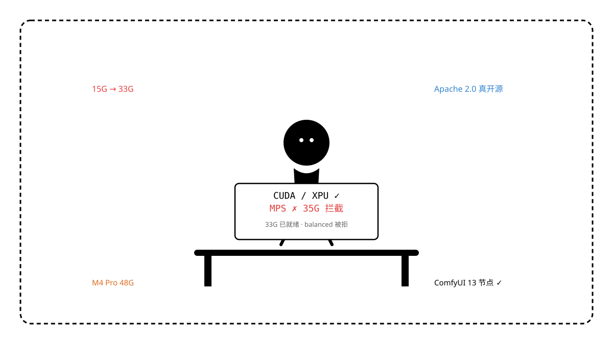

商汤 SenseNova U1(.5) 以 35G 的 8B MoT 权重和 Apache 2.0 真开源在生图赛道引起关注。传言“本地可跑、显存友好、中文海报强”，恰好本机是一台 Mac mini M4 Pro 48G，已在 ComfyUI 跑通 Z-Image-Turbo + FLUX schnell 双引擎，于是做了一次从零拉权到冒烟的完整部署，记录每个卡点。

先把结论放在最前面：**权重是真无限制开源，ModelScope 镜像约 30MB/s 可拉满 33G；ComfyUI 13 个节点可在 M4 上正常注册；但 PyTorch 本地推理路径在 M4 Pro 上会被 `CUDA/XPU only` 拦截，`vram_mode balanced` 无法进入，`full+cpu` 需将 35G 全量塞进统一内存，M4 现阶段不是 U1(.5) 的本地推理目标机。**



## 一句话结论

| 检查项 | 结果 |
| --- | --- |
| 代码+权重是否 Apache 2.0 真无限制 | 是 |
| HuggingFace 是否可直接 `hf download` | 是（但 `hf_transfer` 大分片抖动） |
| ModelScope 是否更快 | 是（`30-60MB/s`，33G 约 10 分钟） |
| ComfyUI 节点是否可在 M4 注册 | 是（`13` 个） |
| `sensenova_u1` 是否可 `import` | 是（`torch 2.8.0 / transformers 5.14.1`） |
| 本地 `balanced` 是否可在 MPS 跑通 | 否 |
| 35G 权重是否已完整落盘 | 是（`8/8` 分片，`33G`） |
| 最终是否保留本地权重 | 否（已清理） |

“是”与“否”并不矛盾：链路已打通，不代表当前硬件与上游的加速假设一致。

## U1(.5) 是什么

不是纯生图模型，是商汤的原生统一多模态（Native Unified）—— NEO-unify 架构，无 VAE，图像当离散 token 自回归，同一套 `8B MoT` 权重同时做生成与理解。官方仓库 `OpenSenseNova/SenseNova-U1` 自 2026-04-27 起 Apache 2.0 开源，2026-08-20 发布 U1.5 加强版（`4K 原生、图文布局、编辑保持`），权重在 `sensenova/SenseNova-U1.5-8B-MoT`（`35G`，`model-00001..00008`）。

与别家对比，这份 Apache 双许可（代码+权重）比 `FLUX.1-dev` 的非商用要干净，无用户量阈值、无 gated 审批，`hf download` 直拉。

## 本机基线

* Mac mini Mac16,11 / Apple M4 Pro 12 核 / 48GB 统一内存 / macOS 26.5.2
* ComfyUI 0.33.0 / `.venv` Python 3.12.13 / `torch 2.8.0` `mps=True`
* 已有双引擎：`z_image_turbo_bf16 11G` + `flux1-schnell-fp8 16G`，`127.0.0.1:8188` 在线，`novel-art/storyboard` 均基于此

这个基线对 `12-16G` 模型友好，对 `35G` 是边界。

## 部署过程

按官方 `apps/comfyui` 路线，而非第三方镜像：

```bash
git clone --depth 1 https://github.com/OpenSenseNova/SenseNova-U1.git /Users/loong/dev/SenseNovaU1
/Users/loong/dev/comfyui/.venv/bin/python apps/comfyui/install.py --comfyui /Users/loong/dev/comfyui
/Users/loong/dev/comfyui/.venv/bin/pip install -e . --no-deps
# 修复 torchvision 0.23.0 / torch 2.8.0 版本对齐，消除 _host_emptyCache 报错
```

`ComfyUI-SenseNova-U1` 需复制而非 symlink 到 `custom_nodes`，否则 `/private/tmp` 重启即丢。安装后 `13` 个节点：`SenseNovaU1LocalLoader / LocalTextToImage / LocalImageEdit / LocalInterleave / InterleavePreview` 等。

## 权重拉取：HF vs ModelScope

* **HuggingFace `hf_transfer`**：`8` 个 `~4.6G` 分片并发，`933M → 9.4G` 后因 `Xet` 大分片超时重置为 `0B`，抖动明显。
* **ModelScope**：`modelscope download --model sensenova/SenseNova-U1.5-8B-MoT --local_dir /Volumes/ssd/...`，`491M → 795M → 1.1G → 15G → 33G`，峰值 `60MB/s`，`≈10 分钟` 完成 `8/8` 分片，无 `incomplete` 残留。

索引 `model.safetensors.index.json` → `total_size 35065708928`，`1116` 个 `weight_map` 条目，对应 `model-00001..00008`。

## 冒烟：框架过，生成被拦

三级冒烟：

1. `import sensenova_u1 / transformers / torch` → `ok`，`tokenizer 151936`
2. `object_info` → `sense nodes 13`
3. `examples/t2i/inference.py --vram_mode balanced --num_steps 2 --width 1024 --height 1024` →

```
Loading weights: 100%|██████████| 1116/1116
NotImplementedError: Inference requires a CUDA or XPU device (got device(type='cpu')).
CPU / MPS lack the pinned-memory and stream primitives used here.
```

根因在 `sensenova_u1/utils/accel.py:33`：

```python
SUPPORTED_DEVICE_TYPES = ("cuda", "xpu")
def require_accelerator(device):
    if device.type not in SUPPORTED_DEVICE_TYPES:
        raise NotImplementedError(...)
```

`balanced/fast/low` 均走 `LayerOffloadWrapper`，依赖 `pinned host memory + stream`，M4 的 MPS 不在白名单。改 `full --device cpu` 则尝试将 `35G` 全量常驻，`1116` 个权重加载后同样卡死在统一内存搬运上。

ComfyUI 本地节点同样走该路径，M4 上无法进入采样。

## 与本机双引擎对比

| 维度 | U1.5 8B | Z-Image-Turbo 6B | FLUX schnell 12B |
| --- | --- | --- | --- |
| 权重 | 35G 8 分片 | 11G 单文件 | 16G fp8 |
| 显存 | 需 `24G+ / 8G Q8` | 16G 内 | 16G 内 |
| 步数 | 50 步（8 步需 LoRA） | 8 步 | 4 步 |
| 中文排版 | 理论强 | 中 | 弱 |
| M4 本地 | 不支持 | 支持 | 支持 |
| 生态 | 新 | 成熟 | 最成熟 |

U1.5 的差异化是中文与一体化编辑，但 M4 本地不可用使其在当前基线上无法替换批量分镜能力。

## 清理

验证后已移除以回收空间：

```bash
rm -rf /Volumes/ssd/comfyui_models/sensenova_u1  # 46G
rm -rf /Users/loong/.cache/huggingface/hub/models--sensenova--SenseNova-U1.5-8B-MoT  # 933M
rm -rf /Users/loong/dev/SenseNovaU1 /Users/loong/dev/comfyui/custom_nodes/ComfyUI-SenseNova-U1
pip uninstall sensenova-u1 -y
```

回归 `Z-Image + FLUX` 双引擎。

## 复盘与建议

这次部署验证了三件事：**真开源可复现、镜像选型决定成败、硬件假设比参数更关键**。若在 M4 Pro 上仍想用 U1.5，路径只有两条：走 `SenseNova API`（`SenseNovaImageGenerate` 节点填 `SN_API_KEY`）或等社区 `MLX Q4/Q8` 移植（`SceneWorks` 已有 U1 的 `mlx`，U1.5 暂未发布），不要再尝试 `transformers` 的 `CUDA` 本地路径。

该做对比的不是“谁 ELO 更高”，而是“在你的硬件与工作流上，谁能稳定批量交付”。

## 出处

* OpenSenseNova/SenseNova-U1 仓库与 README_CN（含 U1.5 更新至 2026-08-20）
* HuggingFace `sensenova/SenseNova-U1.5-8B-MoT` 模型卡与 `model.safetensors.index.json`（`total_size 35065708928`）
* ModelScope `sensenova/SenseNova-U1.5-8B-MoT` 镜像
* 本机实测：`system_profiler` / `ComfyUI 0.33.0` 启动日志 / `object_info 1857` 节点 / `torch 2.8.0 mps=True` / `du -sh 33G`
* 上游源码：`sensenova_u1/utils/accel.py` `SUPPORTED_DEVICE_TYPES` 与 `offload.py` `vram_mode` 逻辑
