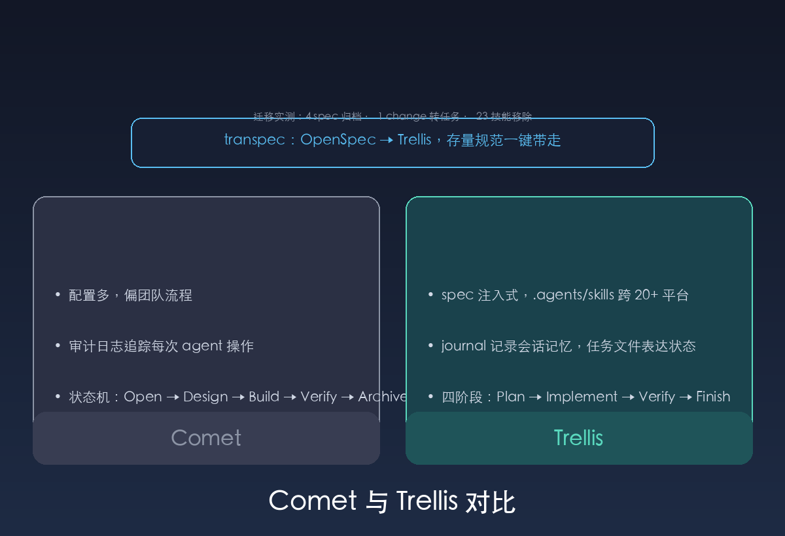

Comet 0.3.9 在我的博客项目里跑一套状态机工作流：Open、Design、Build、Verify、Archive 五个阶段，靠注入式技能驱动，每次操作写审计日志。这个项目只有我一个人维护，多数任务是写一篇笔记、跑构建、推送。状态机、子代理调度、审计追踪用不上，配置和上下文开销却一直背着。

我选替代方案时定了三条标准：单人能跑起来；规范沉淀在仓库里，agent 每次会话自动读取；安装配置越少越好。研究一圈后选中 Trellis。

## Trellis 怎么组织工作

Trellis 的核心是三个目录。`.trellis/spec/` 存项目规范，按层组织，agent 动手前自动注入。`.trellis/tasks/` 存任务，每个任务一个 PRD，做完归档。`.trellis/workspace/` 是开发者个人工作区，journal 记录每次会话。

工作流是四阶段循环：Plan 阶段 brainstorm 写 PRD，Implement 阶段按 spec 写代码，Verify 阶段对照 spec 跑 lint、类型检查和测试，Finish 阶段归档任务、更新 journal。Comet 靠脚本迁移状态机的阶段，Trellis 把状态放在任务目录的文件里，谁在看任务，状态就在哪。

平台支持差得最明显。Trellis 把技能写进 `.agents/skills/` 标准目录，Codex、Claude Code、Cursor、Gemini CLI 等二十多个平台读同一套文件。Comet 主要面向 Claude Code，换平台等于重配一套。Trellis 按平台生成对应目录：`--codex` 生成 `.codex/`，`--claude` 生成 `.claude/`，核心的 `.trellis/` 只有一份。

| 维度 | Comet | Trellis |
|------|-------|---------|
| 工作流 | Open → Design → Build → Verify → Archive 状态机 | Plan → Implement → Verify → Finish 循环 |
| 记忆 | 审计日志 | workspace journal |
| 规范 | .comet 配置 + 注入技能 | .trellis/spec 仓库内文件 |
| 平台 | 主要 Claude Code | 20+ 平台共享 .agents/skills |
| 团队 | 偏团队流程 | 单人够用，团队可扩展 |

## 实测迁移

迁移分四步，全部跑通。

第一步安装：`npm install -g @mindfoldhq/trellis@latest` 和 `@magicdian/transpec`。

第二步初始化：`trellis init -u loong --codex --claude`。生成 `.trellis/`、`.codex/`、`.claude/` 的配置和根 `AGENTS.md`，共 87 个模板文件，`.agents/skills/` 下多出 13 个 trellis 技能。

第三步转换：项目里原有 4 个 OpenSpec spec 和 1 个已归档 change。transpec 把它们转成 Trellis 形态，spec 原样归档到 `.trellis/legacy/specs/`，change 变成归档任务，带 implement.jsonl、check.jsonl、debug.jsonl 上下文清单。

第四步卸载：`comet uninstall` 移除 23 个技能、1 条规则、1 个 hook 和 `.comet/config.yaml`，再删全局 CLI `@rpamis/comet`，共 27 个包。

转换后我按真实代码库补了三份 spec：内容集合（notes schema、pinyin slug、draft 处理）、组件与页面（GLightbox、Giscus、图片管线）、部署与发布（GitHub Actions、base path、SEO）。transpec 自动生成的一份 backend spec 把主语言误判成 Python，我改成 TypeScript/Astro，Python 只出现在 `scripts/xiaohei_gen.py`。

## 跑一轮完整流程

我按四阶段建了一个任务验证闭环。Plan 阶段 `task.py create` 建任务，写 PRD，把相关 spec 加进 implement.jsonl 上下文清单。Implement 阶段补 spec 文件。Verify 阶段 `npm test` 31 个用例通过，`npm run build` 22 页通过，transpec validate 对转换实体零错误。Finish 阶段 `task.py archive` 归档，`add_session.py` 写 journal-1.md。

这一轮产生四个本地提交：迁移、归档、journal、Comet 移除，全部用固定身份提交，我已经把它们推到 GitHub。

## 遇到的坑

第一个坑是 Codex hooks。config.toml 加上 `[features] hooks = true` 之后，还得在 Codex 里跑一次 `/hooks` 批准 Trellis 的 UserPromptSubmit hook，不批准 hooks 不生效。好在 AGENTS.md 兜底，AI 仍能读到 Trellis 上下文。

第二个坑是 transpec validate 会对原生任务报错。它要求转换任务带 sourceFramework、sourcePath 这类元数据，新建的原生任务没有这些字段，bootstrap 占位任务和新建任务都会报错。转换实体本身是干净的，归档任务和 legacy spec 零错误。

第三个是初始化会生成 `00-bootstrap-guidelines` 占位任务，需要手动填充或归档，不影响其他任务。

## 结论

Trellis 适合一个人维护、规范想留在仓库里、agent 会在多个平台跑的项目。它把 Comet 的状态机换成任务文件加 journal，配置量少一个量级，transpec 能把 OpenSpec 存量直接带走。Comet 的审计日志和团队流程是真功能，用得上的团队换过来会损失，个人项目省下的配置成本更值。

## 参考资料

- [Trellis GitHub](https://github.com/mindfold-ai/Trellis)
- [Trellis Docs](https://docs.trytrellis.app/)
- [Comet GitHub](https://github.com/rpamis/comet)
- [transpec：OpenSpec 到 Trellis 转换器](https://www.npmjs.com/package/@magicdian/transpec)
