> 这篇笔记的素材有三份：一份 14 页的 WeKnora 产品 PPT、一条 2026-09-15 出自 @shao__meng 的 X 推文，以及我在 2026-09-16 从 [Tencent/WeKnora](https://github.com/Tencent/WeKnora) 仓库拉下来的 GitHub API 快照。我的处理方式是：PPT 看它想讲的产品叙事，推文看它对外传播的卖点，仓库则当成判断“哪些说法当下成立”的底稿。下面把三者并排着看，凡是 PPT 或推文里的宣传口径、以及跟 README 对不上的数字，我都会单独标出来，不替它圆场。

## 一、它解决什么问题

企业知识资产最常见的状态是碎片化：规划文档在 GitLab，会议纪要散落在飞书和钉钉，历史结论封存在本地 PDF，RSS 里的行业情报又没人整理。传统 RAG 能把这些文件变成“可被搜索”，但搜完就结束，内容不会因为被使用而更新，知识库随时间老化。

WeKnora 的产品主张是给同一批原始文档同时长出三种资产：

1. 可问答的 **RAG 知识库**，回答时带引用溯源；
2. 可自主推理的 **ReAct Agent**，把检索、工具调用和沙盒执行串成完整任务闭环；
3. 可持续演化的 **Auto-Wiki**，由 Agent 把碎片文档提炼成互链 Markdown，人工可改、可回滚。

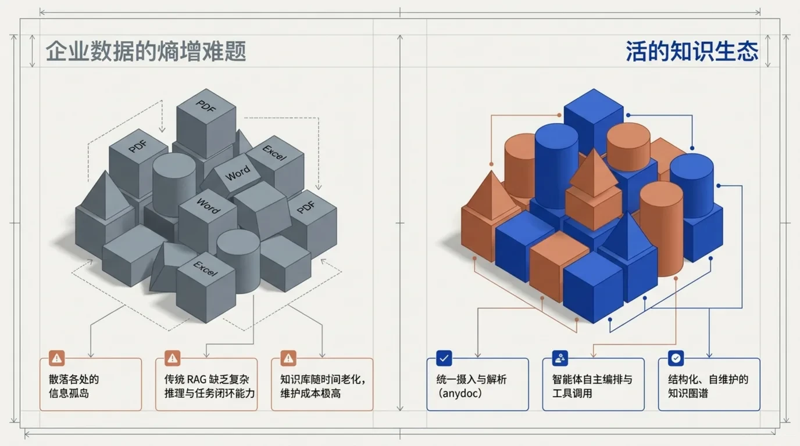

## 二、三位一体：RAG、ReAct Agent、Auto-Wiki

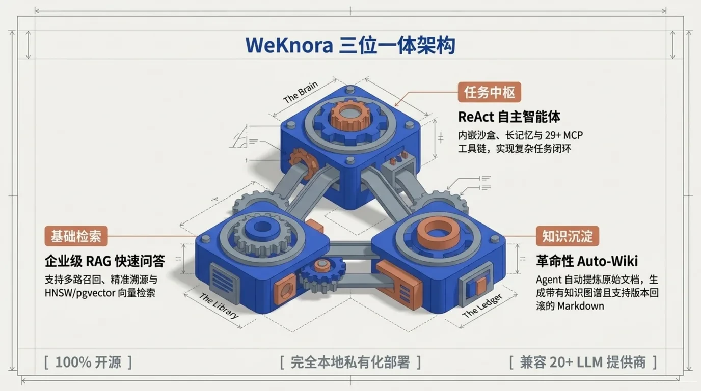

### 1. 企业级 RAG 快速问答

PPT 展示的 RAG 管道是：BM25 稀疏检索 + 父子块分块 + 1024 维 pgvector + rerank + 精准引用溯源。README 里对应的是更完整的检索策略表：BM25 稀疏检索、稠密向量、GraphRAG、父子块分块、HNSW 加速的 pgvector（1024 维）、多维度索引。

仓库当前列出了 8 种向量库后端：pgvector、Elasticsearch、OpenSearch、Milvus、Weaviate、Qdrant、Apache Doris、腾讯云 VectorDB。评测方面，README 提到 E2E 全链路可视化，包含召回命中率、BLEU 与 ROUGE 指标。

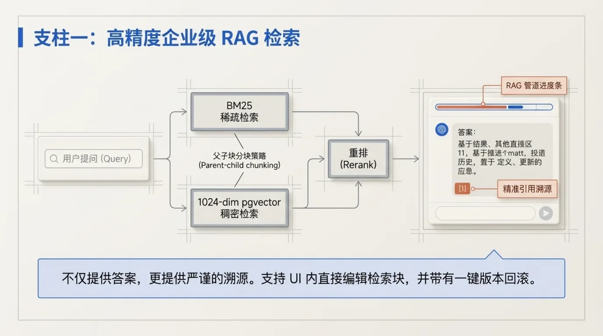

### 2. ReAct 自主智能体

PPT 强调四件事：29 种官方 MCP 工具、会话中途 OAuth2 授权、Exa/Metaso/DuckDuckGo 等多源实时搜索、跨会话长期记忆。

README 的核实结果：

- 官方 MCP Server 包为 `tencent-weknora-mcp`，当前共 **29 个工具**，支持 stdio / SSE / HTTP 三种传输；
- 技能目录可从 ClawHub、SkillHub、git、zip 安装，v0.8 起沙盒后端为会话级 Docker / E2B / Cube，并移除了本地宿主进程后端；
- 网页搜索列出的具体提供商有 11 家：DuckDuckGo、Bing、Google、Tavily、Baidu、Ollama、SearXNG、Keenable、智谱 AI、Exa、Metaso；
- 长期记忆分为 profile、preference、fact、task、interest 五类，支持自动提取、用户确认和 `search_memory` 检索。

PPT 只写了 Docker/E2B 两种沙盒，README 当前是 Docker/E2B/Cube 三种；PPT 写“29+ MCP”，README 目前的准确数字是 29。

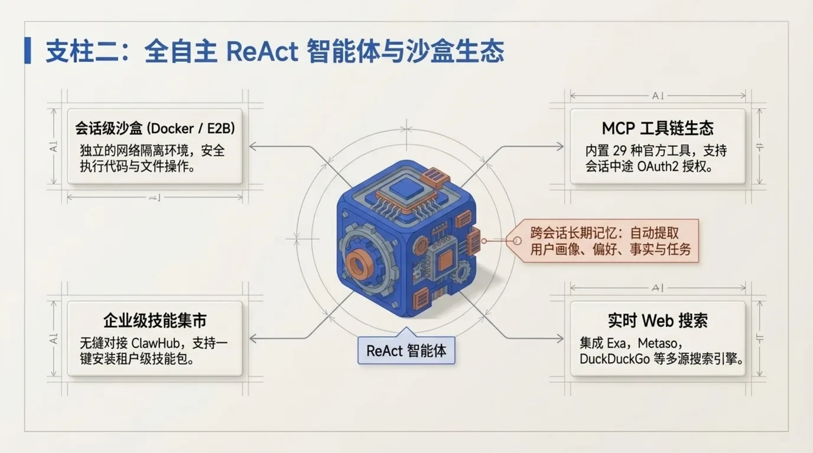

### 3. Auto-Wiki：知识自演化

Auto-Wiki 是 WeKnora 与普通 RAG 工具拉开差异的部分。Agent 把原始文档提炼成相互关联的 Markdown 知识树，生成知识图谱，同时保留人机协同编辑、Diff 对比、快照历史和一键回滚。

README 能对应上：Wiki Mode 会生成结构化、互链的 Markdown 页面，支持浏览器内手工编辑、页面修订历史、行级 Diff、一键回滚；知识库分块也支持编辑、版本快照和重新索引。v0.5.2 changelog 还写明“Wiki ingest scales to 40k-document KBs”，即官方声称 Wiki 摄取可扩展到 4 万文档级知识库。

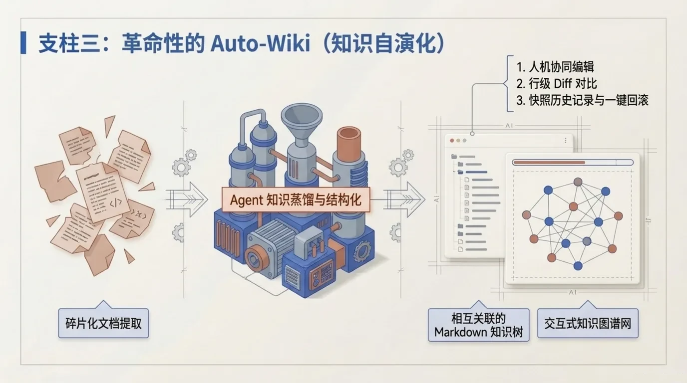

## 三、与传统知识库的对比

PPT 第 7 页给了一张四维对比表。前两列是宣传性的对比框架，不是第三方评测，但用来理解产品定位是准确的：

| 维度 | 传统知识库 | WeKnora 宣传口径 |
|------|-----------|-----------------|
| 知识演化 | 静态检索，内容随时间老化 | Auto-Wiki 智能重组，知识图谱自维护 |
| 执行环境 | 仅限文本问答 | 租户级隔离的 Docker / E2B / Cube 沙盒 |
| 会话上下文 | 单次会话，无长期上下文 | 跨会话长期记忆，提取偏好、事实与任务 |
| 生态兼容 | 深度绑定单一模型或存储 | 模块化架构，多 LLM 与多种向量库、对象存储 |
| 引用与评测 | 引用能力参差 | 引用溯源，RAG 管线可视化与 BLEU/ROUGE 评测 |

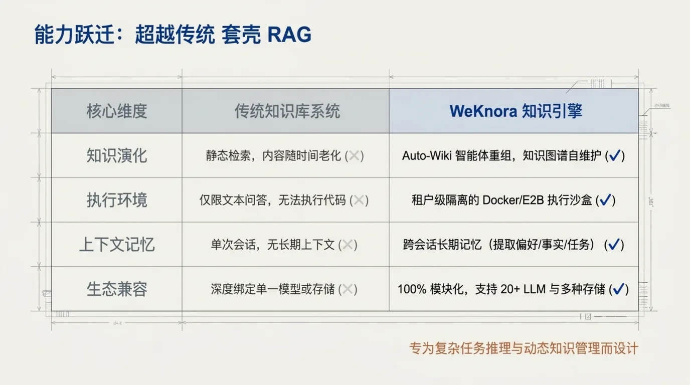

## 四、数据摄入：anydoc 与多格式解析

PPT 展示的数据源包括 GitLab、Notion、钉钉文档、RSS、本地文件，并由 anydoc 进程内解析引擎处理。README 当前列出的数据源更多：飞书 Wiki、飞书云盘、Lark、GitLab、腾讯 IMA、Notion、语雀、钉钉文档、RSS。

文档格式方面，PPT 说“原生支持 10+ 格式”，README 目前明确列出 13 种：PDF、Word、Txt、Markdown、HTML、EPUB、MHTML、图片、CSV、Excel、PPT、JSON、XMind。README 还确认 Office 文件由 anydoc 在进程内解析，“无 Office 依赖”是 PPT 口径，仓库侧的证据是 in-process anydoc parser。

另一个容易被忽略的细节是目录结构：上传路径作为一等数据资产保留，支持文件夹树浏览、重命名、移动文档，以及增量与全量同步。

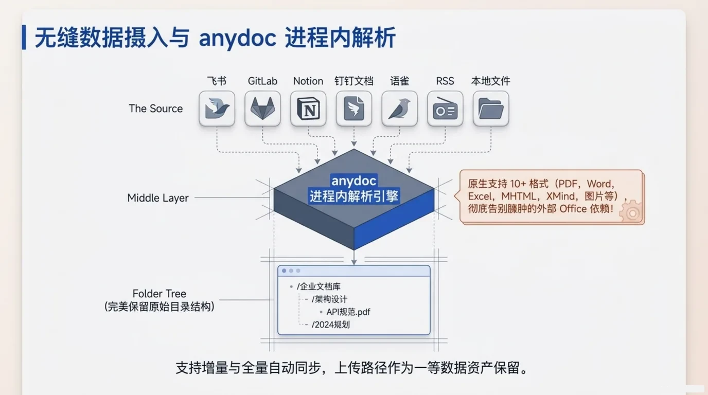

## 五、模块化架构与部署体验

WeKnora 的底层不是单一单体服务，而是渠道层、模型层、存储层、任务队列的组合：

- 渠道与 API：RESTful API、MCP Server、企业 IM；
- 模型层：兼容 OpenAI、DeepSeek、Qwen、智谱、混元、Doubao、Gemini、MiniMax、NVIDIA、LiteLLM、Ollama 等；
- 存储层：pgvector、Qdrant 等多种向量库，AWS S3、阿里云 OSS、华为 OBS 等对象存储；
- 任务层：MQ 异步任务队列与多阶段 Worker 池，按模型做并发限制，失败任务可审查和手动重试。

PPT 说的“100% 模块化”是产品口号，仓库侧可核实的是“fully modular pipeline，every component is swappable and extensible”。

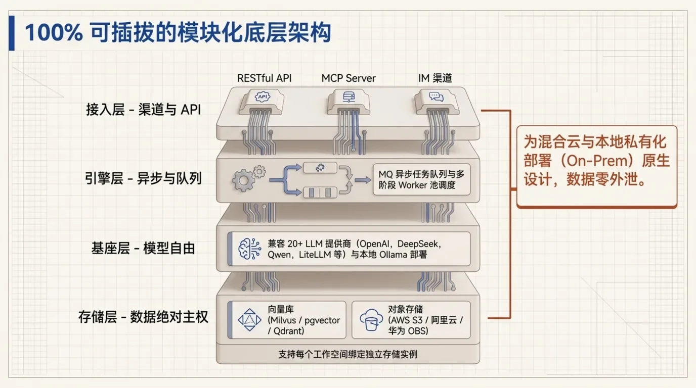

官方快速启动只有四步：

```bash
git clone https://github.com/Tencent/WeKnora.git
cd WeKnora
cp .env.example .env
docker compose pull && docker compose up -d
```

启动后访问 `http://localhost`。README 还提供 Kubernetes Helm、`make dev-app` 的 Air 热更新，以及 Agent-First CLI：

```bash
weknora doc upload notes.md
weknora chat "summarise the design doc"
```

CLI 默认输出稳定 JSON，支持 `--format text` 给人阅读，也可以直接用 `WEKNORA_API_KEY` 和 `WEKNORA_HOST` 做无登录的 CI 集成。

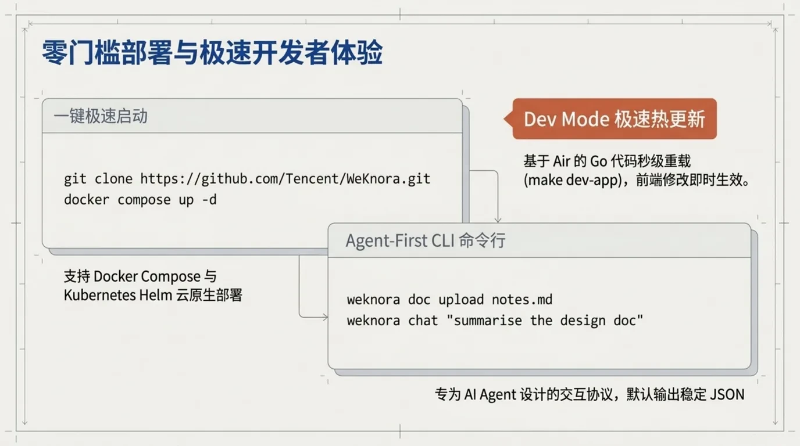

## 六、企业级安全与可观测性

PPT 的安全页面列出了四级 RBAC（Owner / Admin / Contributor / Viewer）、工作空间与知识库双重控制、Scoped API Keys、AES-256-GCM 凭据加密、OIDC ID-Token JWKS、审计日志。这些在 README 里都有对应：

- 四级角色矩阵 + 知识库资源所有权 + 工作空间级审计日志；
- 细粒度 API Key：按能力授权、按知识库限制、记录最近使用；
- AES-256-GCM 加密 API Key 与数据源凭据，支持密钥轮换；
- OIDC ID-Token JWKS 校验、SSRF 防护、gRPC/Redis TLS、响应敏感信息脱敏。

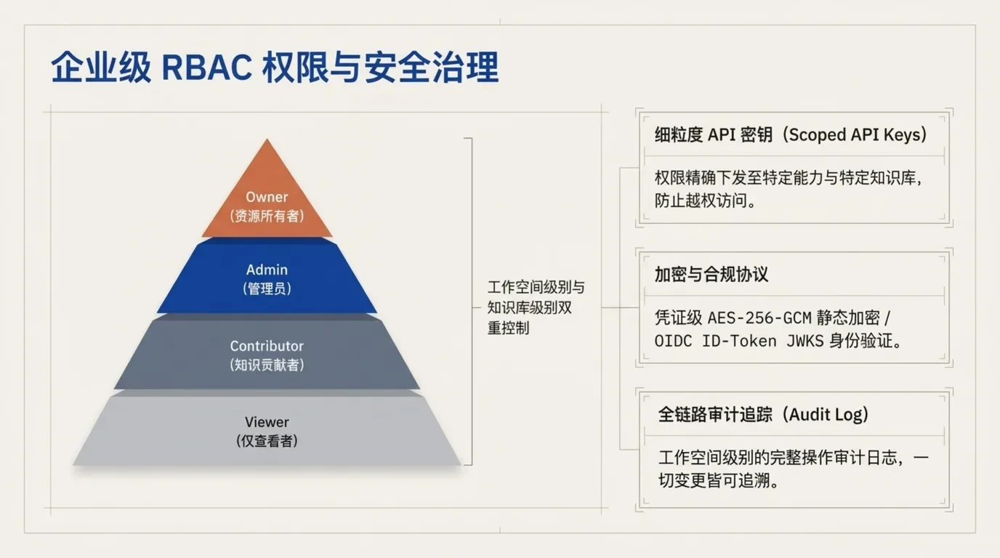

可观测性方面，README 确认 Langfuse 是当前唯一的链路追踪后端，覆盖 ReAct Loop、Tool Call、RAG Pipeline，并支持 W3C traceparent 传播。PPT 第 11 页画了一张 Worker 池示意图：Core 350、Post-process 120、Maintenance 80、Wiki 50。这里要特别说明：这些数字是 PPT 的示例部署示意，README 只描述池类型（core / post-process / enrichment / maintenance + 弹性共享池 + 独立 Wiki 池），没有承诺固定容量，实际数量取决于你的部署规模。

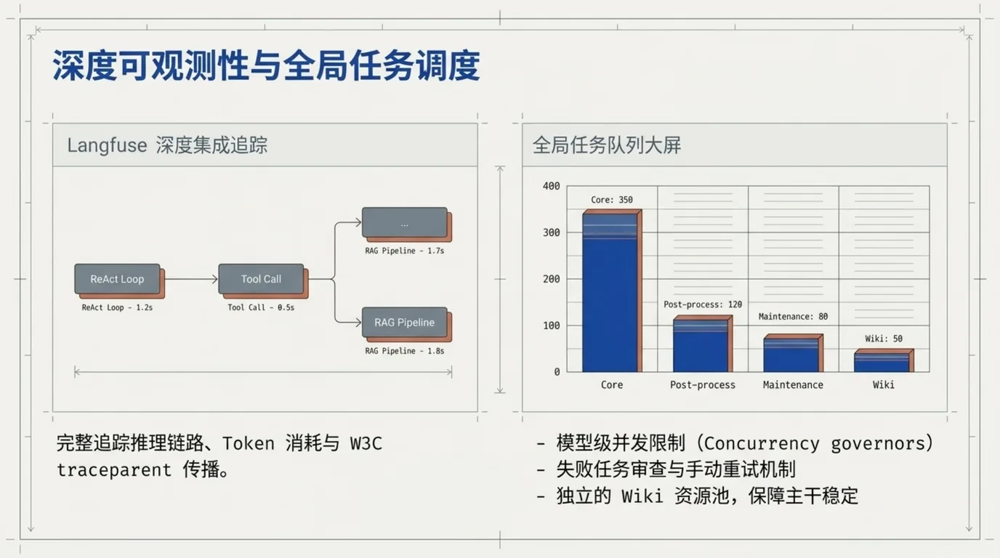

## 七、终端接入

WeKnora 不只提供 Web UI，README 列出的 IM 渠道包括企微、飞书、Lark、QQBot、Slack、Telegram、钉钉、Mattermost、微信、云之家；另有网页 Embed Widget（域名白名单 + 限流 + secure-mode token exchange）、微信小程序和 Chrome 扩展。Chrome 扩展可以选中网页文本、图片或整页直接沉淀到知识库。

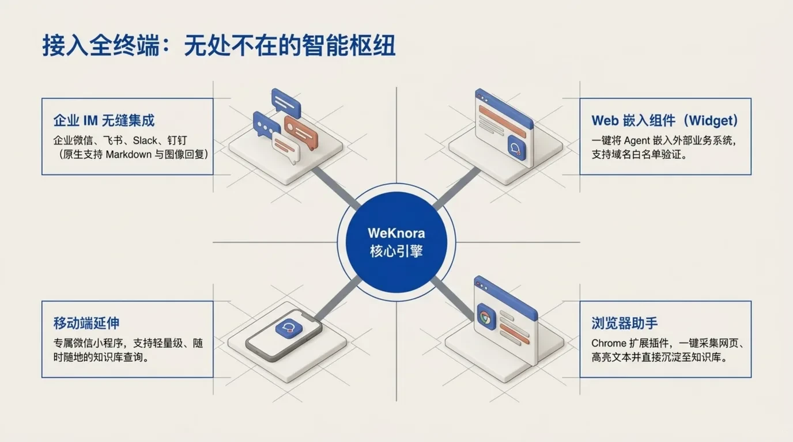

## 八、核实清单：PPT、推文与仓库的差距

| 说法 | 来源 | 我的核对结果 |
|------|------|-------------|
| GitHub Stars 24.3k / 24.5k 左右 | PPT 页脚 | 2026-09-16 API 为 **24,384**，基本一致 |
| GitHub Forks 明显高于当前值 | PPT 页脚（OCR 约 5.4k） | API 为 **3,398**，差异明显，不建议引用 PPT 数字 |
| 微信对话开放平台核心框架 | X 推文 | README 原文确有此表述：WeKnora serves as the core technology framework for the WeChat Dialog Open Platform |
| “真实生产背书” | X 推文 | 仓库没有给出可独立核实的生产部署规模或客户案例，建议当作宣传口径 |
| 20+ LLM 提供商 | PPT | README 能力表当前列出 **17 个具体 LLM provider**；通过 LiteLLM / OpenAI-compatible 可以继续扩展，但“20+”不是当前清单的直接数字 |
| 29 种 MCP 工具 | PPT、推文 | README 确认为 **29 tools total** |
| Wiki 支持 4 万文档级 | PPT、推文 | v0.5.2 changelog 确有 “Wiki ingest scales to 40k-document KBs” |
| Worker 池 350 / 120 / 80 / 50 | PPT | README 只描述池类型，无固定容量，这是示例配置 |
| License 为 MIT | README | README 与 badge 标 MIT；GitHub API 的 license 字段是 Other/NOASSERTION，本次环境网络受限未能直接读取 LICENSE 原文，正式使用前建议以仓库 LICENSE 文件为准 |

## 九、适合谁、不适合谁、成本提醒

**适合考虑 WeKnora 的场景：**

- 企业已经有大量分散文档，需要私域 RAG 问答，而不只是给个人知识库找个工具；
- 需要多工作区、多知识库的权限隔离，以及 API Key 级别的程序化接入；
- 需要 Agent 不只是“回答问题”，还要调用 MCP、搜索网页、在沙盒里执行任务；
- 对 Auto-Wiki 这种“让知识库自己更新”的形态有明确需求，且接受 Agent 产物需要人工审核；
- 团队在微信、企微、飞书等 IM 生态里，希望问答直接落到现有工作流。

**不太适合的场景：**

- 只想做一次性问答或简单文档检索，整套 Worker 池、RBAC、沙盒会明显过重；
- 需要权威的检索准确率榜单、SOC2/等保等合规结论，仓库当前没有公开这类材料；
- 没有 Docker/Kubernetes 或云基础设施能力，只想零维护使用，应该先看 WeKnora Cloud 而不是自建；
- 对 AI 生成的 Wiki 内容质量要求极高且没有人工审核流程，Auto-Wiki 的幻觉风险不会因为工具变强而消失。

**成本与变量：**

- 基础设施成本：Postgres/pgvector、向量库、对象存储、MQ 与多阶段 Worker 池；Neo4j、MinIO、Langfuse 等属于可选 profile，按需开启；
- 模型成本：embedding、rerank、LLM 分开配置，规模大后 Token 成本通常超过软件本身；也可以接 Ollama 本地模型，但需要算力；
- 维护成本：项目很活跃，v0.8.0 于 2026-09-03 发布，仓库当前有 640 个 open issues，升级和迁移不能忽视；
- 数据主权是有条件的：“数据零出境”只在你自建全部组件时才成立。如果 LLM、embedding、rerank、E2B/Cube 沙盒用的是云服务，对应数据会进入这些提供商的处理链路；
- 安全边界：v0.8 移除了本地宿主进程沙盒，Docker 沙盒仍标注为 opt-in，E2B/Cube 是远程沙盒，部署前需要明确网络策略和数据流向。

## 十、参考资料

- [Tencent/WeKnora](https://github.com/Tencent/WeKnora)
- [WeKnora README](https://github.com/Tencent/WeKnora/blob/main/README.md)
- [WeKnora Releases](https://github.com/Tencent/WeKnora/releases)
- [WeKnora 官方站](https://weknora.weixin.qq.com)
- [X 推文 @shao__meng](https://x.com/shao__meng/status/2099722829365395895)

数据说明：GitHub 数字来自 2026-09-16 API 快照；PPT 为中文产品介绍，页脚小字和图表数字经过 OCR 转写，可能存在个别误差，正文中以仓库 README 与 release 为准。
