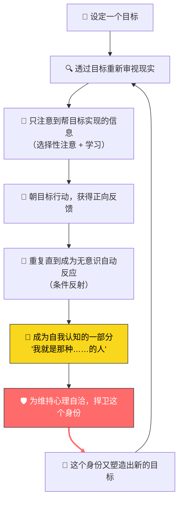
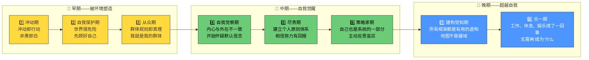
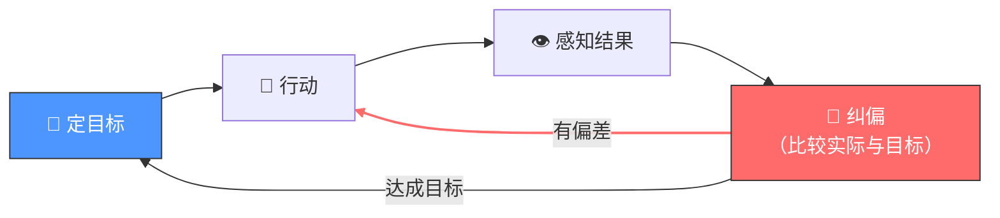
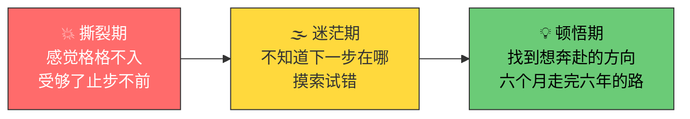
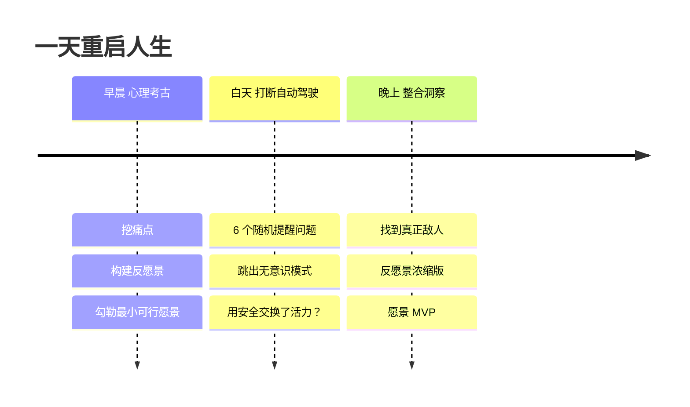
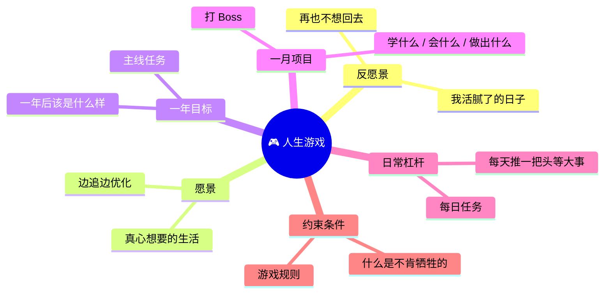

新年 flag 这东西，立过的人都知道——绝大多数改变人生的路子，从根上就是错的。立的时候无非随大流，在朋友圈博个存在感，可这些决心压根儿过不了真刀真枪的坎儿。

这篇文章讲的不是那种过目就忘的鸡汤。它是一套完整的心智重编程方法论，分三个阶段、七个章节，需要一整天来完成，但效果能管很久。

---

## 你不在想去的地方，是因为你还没成为该在那种地方的人

多数人定目标的方式，天然就带着一个缺陷：只盯着成功需要的两个条件之一。

改变行为来推进目标——这是次要的，治标不治本。改变自己这个人，让行为自然跟上——这才是主要的，治本的。

多数人定个浮于表面的目标，头几周鸡血上头逼自己自律，然后没挣扎几下就回到老样子。想在腐烂的地基上盖高楼，塌是注定的。

什么区别？拿一个健身有素的人来说，外人看他是"咬牙坚持"吃健康餐。但真相是，他无法想象自己还能有别的活法——吃不健康的东西对他来说才是煎熬。

**想要人生有一个特定的结果，你必须在抵达之前就过上能创造这个结果的生活方式。**

当一个人真正改变了，所有对目标没帮助的习惯都会变得让人厌恶——因为你刻骨铭心地知道，这些行为会把你的人生带向何方。你之所以还能忍受现在的标准，是因为你根本没看清它们是什么、会导向什么。

---

## 你不在想去的地方，只因你没那么想去

> 只信行动。生命发生在事件的层面，而非言语的层面。——阿尔弗雷德·阿德勒

所有行为都冲着目标去。这叫目的论。

一个人说想辞掉那份一眼望到头的工作，却又没理由地赖着不走。于是开始觉得自己缺勇气，或天生不是"敢闯的人"。但真相是，他在追求安全感、确定性，以及一个借口——让他不会在那些视"稳定工作"为成功的人面前，像个失败者。

**真想改变，就得改目标。** 这里的目标不是表面那些——设定表面目标这个动作本身，可能就在为某个害人的无意识目标服务。

目标本质上就是视角。它是对未来的投射，是一副感知滤镜，让你只能看到、想到、找到那些帮它成真的信息、点子、资源。

---

## 你之所以不在你想去的地方，是因为你害怕抵达那里

想法从何而来，并不重要。但如果一个人接受了一个想法——不管它来自自己、老师、父母、朋友、广告——并且坚信不疑，那么它对他的掌控力，就和催眠师对催眠对象的命令一样强大。

这个循环一旦形成，就会自动运转：

**必须在第 6 步（身份认同）和第 7 步（身份捍卫）之间打破循环。** 因为一旦你开始捍卫一个身份，你就被它绑架了——你不再问这个身份对你有没有利，你只知道不能让人挑战它。

如果这个身份对人生不利，麻烦就大了。

**残酷的现实是：必须在第 6 步和第 7 步之间打破循环。** 而这个循环，从童年时就已经启动。

人的首要目标是生存。多数人的教育方式无非是赏与罚——除非接受某些信念和价值观，否则就会受到惩罚。而父母同样经历过这样的塑造过程，终其一生。他们带着祖祖辈辈传下来的印记。

再往深了说，一旦满足了基本的生存需求，人就开始在观念层面"求生存"。肉体受到威胁时会进入战斗或逃跑状态。身份受到威胁时，反应完全相同。

---

## 你想要的生活，藏在某个特定的心智层级里

心智的成长有迹可循。人刚出生时是一块求生海绵，拼命吸收周遭一切信念。可要是不当心，这颗脑袋会渐渐僵化成石头。

这套发展轨迹被多个理论模型反复印证：马斯洛需求层次、ego 发展阶段、螺旋动力学、整合理论。以下是 ego 发展的八个阶段精华版：

大多数人会在第 4 到第 8 阶段之间徘徊。靠近第 8 阶段的人读这些要么为了学点新东西，要么打发时间。靠近第 4 阶段的人是真的想改变。

好在无论在哪一阶段，突破路径是一样的。

---

## 聪明，就是能过上自己真正想要的生活

> 检验智力的唯一标准，是看你最终是否活成了自己想要的模样。——Naval Ravikant

成功有三个要素：行动力、机遇、智力。

机遇常被误叫成"特权"，但缺了其余两样，空有它也没用。单有行动力而无机遇，再折腾也是白搭。机遇再好，人不够聪明，照样抓不住。

这里所说的"智力"不是传统意义上的智商，而是控制论（Cybernetics）所说的"驾驭的艺术"。控制论讲的是一套智能系统的运行方式：

船偏了航向要扳回来；屋里热了恒温器自动调温。看一个系统会不会试错、能不能坚持，就知道它有多聪明。

笨人遇到问题就卡住，聪明人遇到问题会解决。真正的聪明，是明白只要时间够长，什么问题都能解决。要变聪明，你需要：
- 抛弃老路
- 闯入未知
- 设更高目标，拓展心智边界
- 拥抱混乱，允许生长
- 研究自然的普适规律
- 成为通才

---

## 如何在一天之内重启人生

人生最好的阶段，总出现在忍无可忍之后。

观察那些成功脱胎换骨的人，会发现他们的改变总在张力积蓄后迅速发生，经历三个阶段：

整套方法论分三段，需要一整天完成：

### 第一部分：早晨——心理考古

花 15-30 分钟回答这些问题，用手写，别用 AI：

**挖痛点：**
- 那种钝感而持久的不满是什么？不是撕心裂肺的痛苦，而是你学会了忍受的
- 那些反复抱怨却从未改变的事——写下过去一年里最常挂在嘴边的三件抱怨
- 如果有人只观察你的行为而非听你的言语，他会得出你其实想要什么？
- 关于当下的生活，哪种真相会让你在敬重的人面前无地自容？

**构建反愿景（对不想要的生活的清醒认知）：**
- 如果接下来五年毫无改变，描述一个普通的星期二
- 把时长拉到十年——错过了什么？谁对你死了心？
- 生命尽头，你从未让自己体验、尝试或成为的是什么？
- 谁正在过你刚才描述的那种未来？想到自己变成他，什么感受？
- 你得放弃哪种身份才能真正改变？

**勾勒愿景（最小可行愿景）：**
- 如果打个响指就能在三年后过上另一种生活，你到底想要什么？
- 要对自己有什么样的信念，才能让那种生活显得自然而非强求？
- 如果你已经是那种人，这星期会先做哪一件事？

### 第二部分：白天——打断自动驾驶

一整天在手机里设随机提醒，强迫自己跳出无意识模式：

| 时间 | 问题 |
|------|------|
| 上午 11:00 | 我现在做的这件事，到底在逃避什么？ |
| 下午 1:30 | 要是有人把我过去两小时拍下来，会觉得我想要的人生是什么？ |
| 下午 3:15 | 我正走向自己讨厌的人生，还是想要的人生？ |
| 下午 5:00 | 最重要的事，我在假装它不重要？ |
| 晚上 7:30 | 今天做的哪件事是为了维护身份，而非真心想做？ |
| 晚上 9:00 | 今天什么时候最有活着的感觉？什么时候最麻木？ |

附加思考：如果不再需要别人把我看作某个身份，什么会改变？我在哪些地方用安全交换了活力？想成为的那个人，明天最小可以做到什么样？

### 第三部分：晚上——整合洞察

把白天的洞察显性化：

- 关于自己为何被困，最真相的是什么？
- 真正的敌人是什么？是哪个内在模式或信念在操控一切？
- 用一句话写出你绝不允许自己的人生变成什么样（反愿景浓缩版）
- 用一句话写出你在构建什么样的未来（愿景 MVP）

---

## 把人生调成"游戏模式"

最后一步是把所有感悟拢到一起，拼成一张完整的操作图。

拿出新纸，写下六层结构：

**1. 反愿景**——我活腻了的、再也不想回去的日子是什么样？

**2. 愿景**——我真心想要的、边追边优化的理想生活是什么样？

**3. 一年目标**——一年后我的生活该是什么样？是不是离想要的更近？

**4. 一月项目**——得学什么、会什么、做出什么，才能靠近那个一年目标？

**5. 日常杠杆**——哪几件头等大事，每天推一把就能把项目往前挪？

**6. 约束条件**——从白手起家到实现愿景，有什么是不肯牺牲的？

这套结构硬生生给造了一个小世界——就像电子游戏：

- **愿景** = 通关方式
- **反愿景** = 输掉的代价
- **一年目标** = 主线任务
- **一月项目** = 打 Boss，涨经验
- **日常杠杆** = 日常任务，每天刷
- **约束条件** = 游戏规则，限制逼着动脑子

> 意识里的秩序感，是内心体验最好的状态。什么时候会有这种秩序感？当你把精力投在现实的目标上，当你的本事配得上眼前的机会。——米哈里·契克森米哈伊

六层东西像六个同心圆，罩着脑子，把乱七八糟的诱惑挡在外头。越玩这场游戏，这个圈越牢，到最后就成了你本人。
