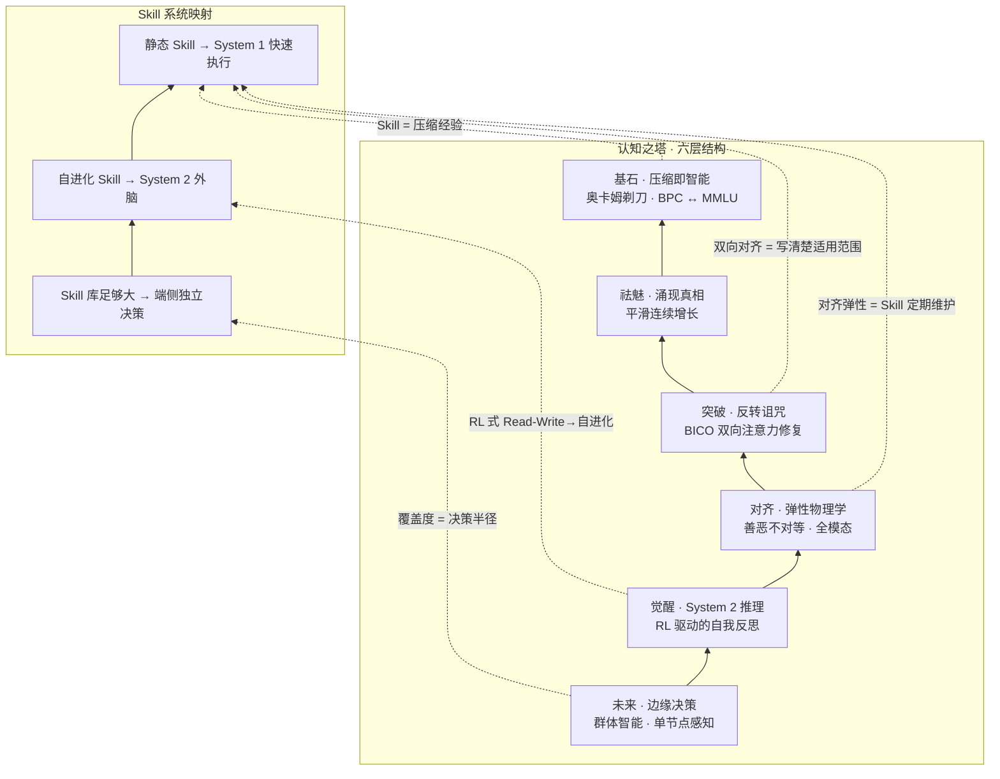
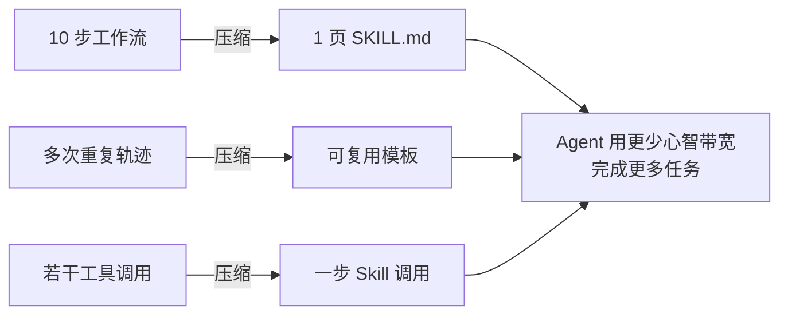
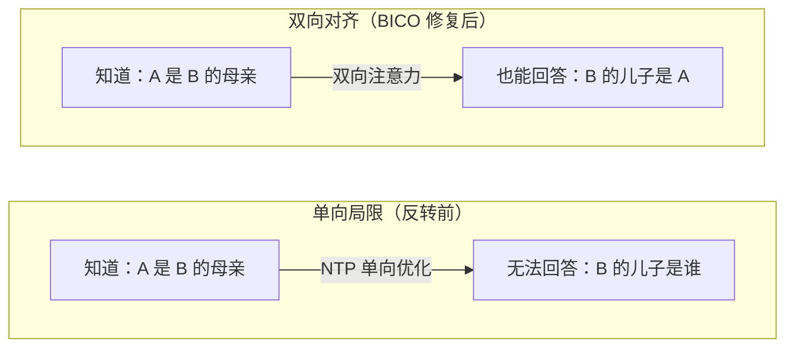
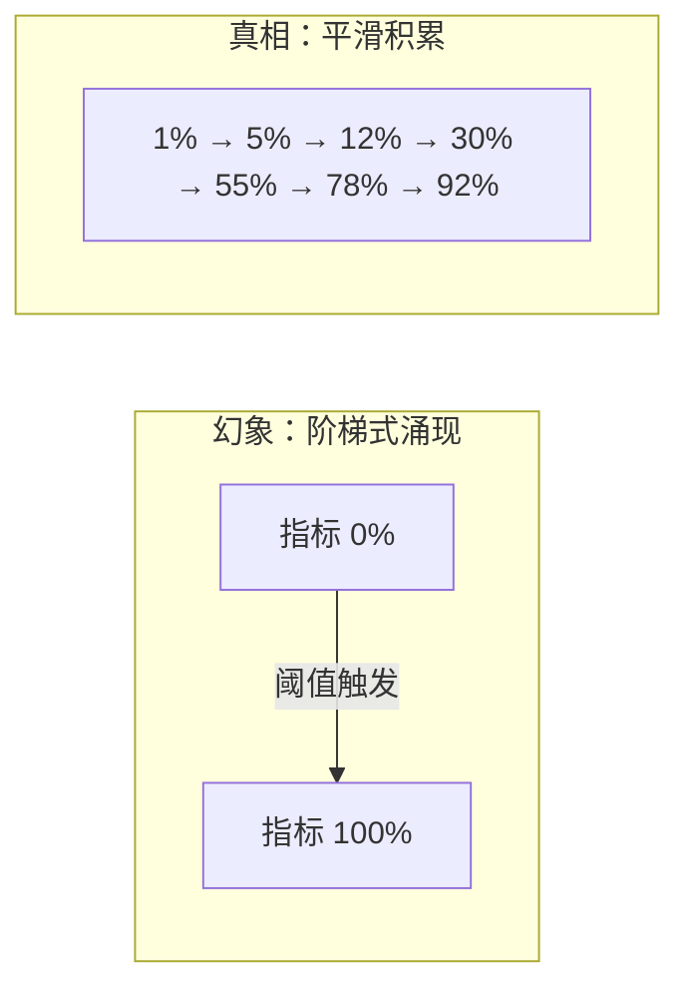
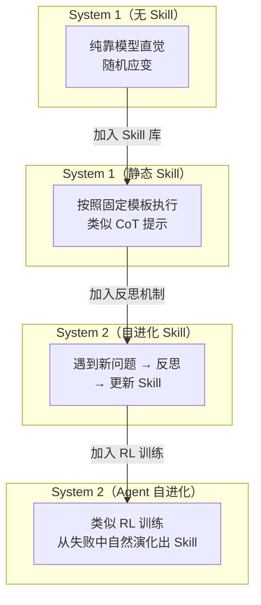
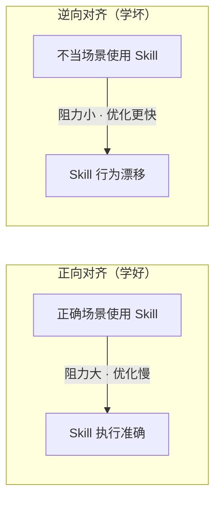
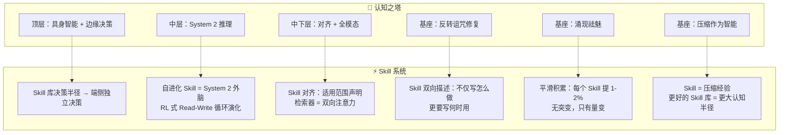

# 认知之塔 × AI Agent Skill——图文笔记

> 无监督学习是塔基，Skill 系统是塔顶。理解了认知之塔的每一层，就理解了为什么 Skill 系统能工作、会失效、以及如何变得更好。

---

## 一、认知之塔·全景

认知之塔的六层结构，从底部的"压缩"到顶部的"边缘决策"，完整勾勒了大语言模型的演进路径。每一层都与 AI Agent Skill 系统有直接的映射关系。

---

## 二、基石：压缩即智能

> 「奥卡姆剃刀原理在算法信息论中的终极体现——最好的模型，即是用最短代码输出数据的程序。」—— Cognitive Ascent P2

### 核心论点

- 模型的**压缩效率（BPC）**与 MMLU 等复杂基准测试得分呈现**极其完美的线性相关**
- 无论底层架构如何变迁，模型无损压缩数据的能力越强，其泛化与逻辑理解能力就越高

### 映射到 Skill 系统

一个 Skill 本质上也在做"压缩"：

> [!important] 核心推论
> **Skill 库就是 Agent 的"压缩知识库"。** 好的 Skill 系统让 Agent 用更少的"心智带宽"完成更多任务——这和预训练阶段用压缩率衡量智能的逻辑完全一致。

> **实证支持：** Memento-Skills 论文中，技能库从 5 个原子级 seed skill 增长到 235 个，覆盖 8 个学术领域，Agent 性能持续提升——这就是"压缩知识覆盖更多认知空间"的实证。^[arxiv:2603.18743]

---

## 三、突破：反转诅咒

> 「模型深知 'A 是 B 的母亲'，却无法回答 'B 的儿子是谁'。」—— Cognitive Ascent P4

### 发生了什么

下一个 Token 预测（NTP）目标存在内在局限——模型**仅单向优化** P(b|a)，**无法保证逆向的** P(a|b)。模型沦为仅靠概率拼接的"随机鹦鹉"。

### BICO 框架

> 「保持生成能力的同时，反转推理准确率从 0% 跃升至 70%+。」—— Cognitive Ascent P5

BICO 通过精细修改注意力旋转位置编码，让因果语言模型在微调时平滑过渡到双向注意力。

### 映射到 Skill 系统

写好一个 Skill 只是第一步，**Agent 正确地检索和使用 Skill 同等重要**：

| 问题 | 表现 | 解法 |
|------|------|------|
| **单向局限** | 模型容易记住"碰到 X → 用 Skill Y"，但反过来"Skill Y 是为哪些任务准备的"就没那么可靠 | **双向描述**：写 Skill 时不仅要写"怎么做"，还要写清楚"什么情况下用" |
| **语义匹配不足** | 自然语言描述很难覆盖所有适用场景 | **Behavior-aligned router**：用专门的对比检索器判断"这个 Skill 是否适合这个任务" |

> [!warning] 实践建议
> 写 Skill 描述时，使用"**触发条件 + 执行步骤**"的格式，而不是只写步骤。例如：
> - ❌ "调用 API 获取数据"
> - ✅ "当需要获取[[某个概念]]的最新数据时，先检查缓存，再调用 API"

---

## 四、祛魅：涌现的真相

> 「智能没有突变，只有量变到质变的必然。」—— Cognitive Ascent P11

### 涌现是幻象

大模型的"涌现能力"不是凭空出现的突变。本质上，这是**评估指标过于非线性和严苛所导致的视觉幻象**。一旦采用平滑的连续指标，能力的增长曲线呈现出完全可预测的、平滑的渐进改良。

### 映射到 Skill 系统

| 幻象 | 真相 |
|------|------|
| 装了 Skill，Agent 突然变强了 | 不是 Skill 带来了"魔法"，而是 Skill 压缩的经验恰好覆盖了当前任务 |
| 加一个 Skill 就提升 10% | 这是之前没有 Skill 时的"存量差距"，不是增量魔法 |
| 技能库有 N 个 Skill 就够用了 | 真正的效果取决于 **Skill 的质量 × 覆盖度 × 检索准确率** 的三者乘积 |

> **实际验证：**
> - Memento-Skills 的收敛曲线是平滑下降的：accuracy 从 30.8%（R0）→ 54.5%（R3），第一轮增长最快，之后逐渐递减——正是"平滑渐进改良"
> - Voyager 的 15.3× 提升也不是"突然开窍"，而是每次成功探索都保存为 Skill，不断积累的结果

> [!tip] 实践建议
> 评估 Skill 系统时，不要用"有 Skill vs 无 Skill"的二分法，应该用**平滑指标**（如任务成功率随 Skill 数量的增长曲线），就像 PPT 建议的用 Token Edit Distance 代替 Exact Match。

---

## 五、觉醒：从 System 1 到 System 2

> 「日常闲聊仅需 System 1（直觉快思考）；而攻克复杂数学与代码，亟需 System 2（逻辑慢思考）的接管。」—— Cognitive Ascent P8

### DeepSeek-R1 的启示

大规模强化学习（RL）驱动的推理，彻底跳出传统 SFT 模板的束缚。仅通过奖励机制，激励模型自主探索验证计算与多重解法。**无需人类硬编码"思维链"模板**，模型在 RL 训练中自然演化出试错、纠偏、自我验证的自我意识级反思行为。

### 映射到 Skill 系统的两种模式

> [!quote] 关键洞察
> DeepSeek-R1 的"顿悟时刻"——"Wait, that's an aha moment I can flag here"——恰好对应了 Agent Skill 系统的最佳实践：**不是人类硬编码 Skill，而是 Agent 在交互中自然产生并保存 Skill。**

---

## 六、对齐：算法认知的弹性边界

> 「逆向对齐（学坏）比正向对齐（学好）阻力更小、更容易触发。」—— Cognitive Ascent P6

### 对齐的弹性物理学

参数规模越大、预训练数据越多，模型的"弹性"越强——遇到负面数据微调时，初始性能暴跌极快，但触底反弹与维持底线的韧性也更强。

### 映射到 Skill 维护的三个反直觉事实

1. **Skill 也会"学坏"**：一个写好的 Skill，如果在不恰当的场景使用并得到负面反馈，可能比在正确场景优化的速度更快——这就是"善恶不对等"
2. **大模型更"顽固"**：更强的模型对 Skill 指令的"弹性"更强——它更可能偏离 Skill 的指引，尤其是当 Skill 的步骤与模型预训练知识冲突时
3. **解决方案——信任区域**：为每个 Skill 定义明确的适用范围边界，超出边界的操作应触发 Agent 的 System 2 反思而不是盲从 Skill

---

## 七、未来：认知之塔 → Skill 系统完整映射

> [!summary] 一句话总结
> 认知之塔告诉我们：Skill 系统之所以有效，不是魔法，而是"**压缩-复用**"的基本原理。Agent 不是"突然顿悟"，而是每一次成功经验的积累带来平滑提升。真正的瓶颈不在于模型大小，而在于 Skill 库的**覆盖度、质量和检索准确率**。

---

## 八、给小白的一个例子

> **没有 Skill 的 Agent 像一个只靠直觉的围棋新手：**
> 每一步都临时想，遇到重复出现的局面也重新算，又慢又容易错。
>
> **有 Skill 的 Agent 像一个有棋谱的职业棋手：**
> - 看到熟悉的局面 → 调用对应的**定式（Skill）** → 快速落子
> - 遇到没见过的局面 → 自己探索 → 把成功经验记下来（**创建新 Skill**）
> - 下次再遇到类似局面 → 翻开棋谱直接用 → 越来越强

---

## 附录：速查表

| PPT 概念 | 对 Skill 开发的启示 | 优先级 |
|---------|----------------------|-------|
| **压缩即智能** | Skill 质量衡量标准：是否以最短描述覆盖最多场景 | ⭐⭐⭐⭐⭐ |
| **System 1/2** | 静态 Skill = System 1，自进化 Skill = System 2。两者都需要 | ⭐⭐⭐⭐⭐ |
| **涌现 = 平滑量变** | Skill 效果不会"突变"，做好持续打磨的准备，每个 Skill 提升 1-2% 就是正常节奏 | ⭐⭐⭐⭐ |
| **反转诅咒** | 写 Skill 时双向描述帮助检索，不只写"怎么做" | ⭐⭐⭐⭐ |
| **对齐弹性** | Skill 需定期检查和"重新对齐"；加适用范围声明 | ⭐⭐⭐ |
| **Multi-Token Prediction** | Skill 也可以"一次预测多个步骤"——打包为更大的"宏操作" | ⭐⭐⭐ |
| **DualPipe 流水线** | Skill 执行也可以流水线化——多个 Skill 并行/异步执行 | ⭐⭐ |

---

## 参考来源

- [[Cognitive_Ascent.pdf]] — 认知之塔：大语言模型的演进与推理觉醒（13 页 PPT）
- [[AI Agent Skill 补充资料(认知之塔)]] — 本文的前身与详细分析
- [Memento-Skills: arxiv 2603.18743](https://arxiv.org/abs/2603.18743) — 技能库从 5 到 235 的实证研究
