# 认知之塔——大语言模型的演进与推理觉醒

> 智能并非玄学。无论底层架构如何变迁，模型无损压缩数据的能力越强，其泛化与逻辑理解能力就越高。

---

## 一、全景：认知之塔六层

从底部"压缩即智能"到顶部"边缘决策"，认知之塔勾勒了大语言模型从预训练到推理觉醒的完整演进路径。

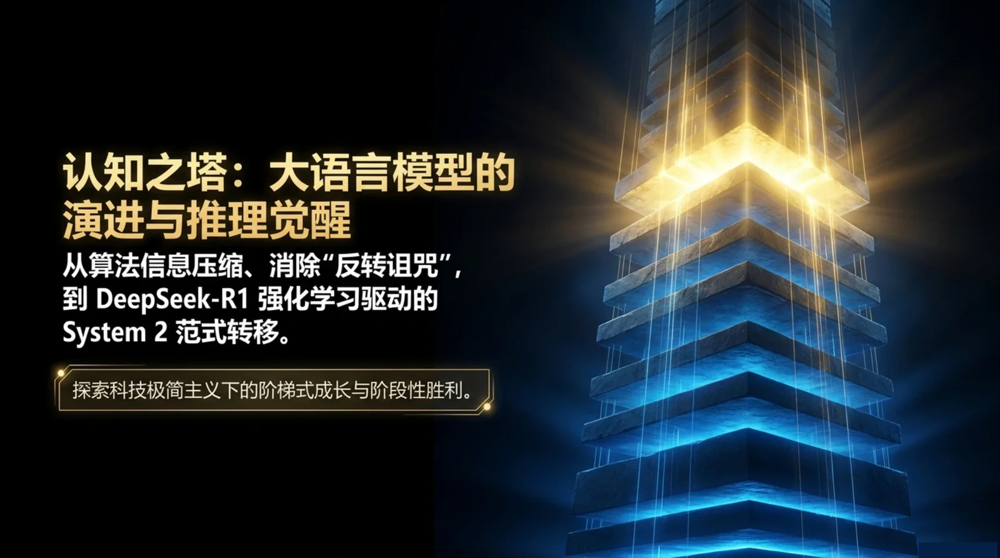

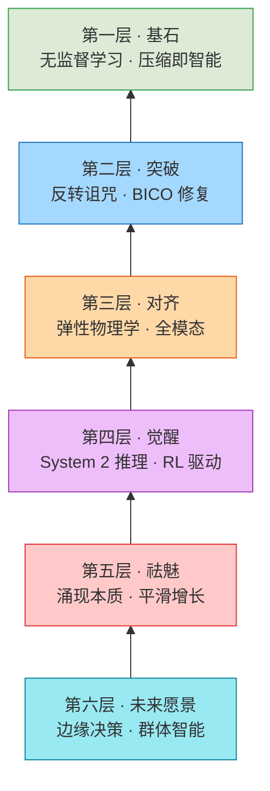

---

## 二、基石：压缩即智能

> 「奥卡姆剃刀原理在算法信息论中的终极体现——最好的模型，即是用最短代码输出数据的程序。」—— P2

### 核心发现

无监督学习的本质是**无损压缩**。模型的压缩效率（BPC——Bits Per Character）与 MMLU 等复杂基准测试得分呈**极其完美的线性相关**。

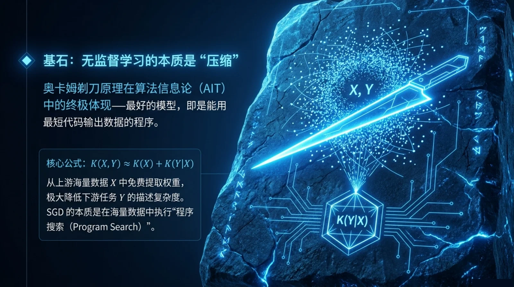
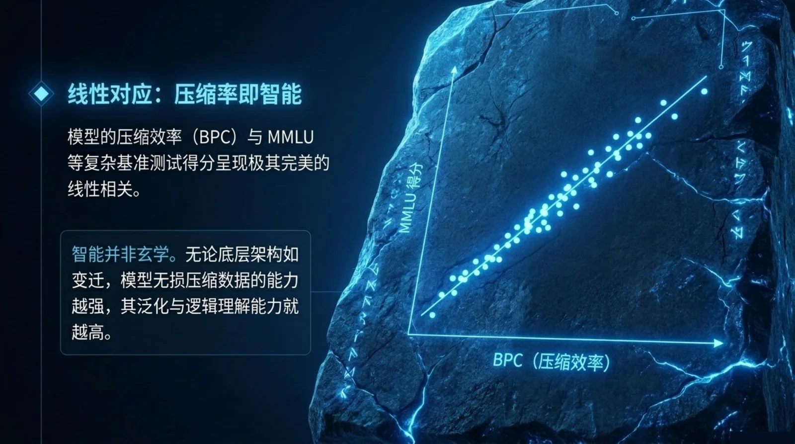

> [!quote]
> 「无论底层架构如何变迁，模型无损压缩数据的能力越强，其泛化与逻辑理解能力就越高。」—— P3

### 这个视角改变了什么

传统看法认为智能是神秘、不可量化的。但这个发现表明：
- 智能不是玄学
- 智能可以量化为压缩效率
- 更好的压缩 = 更好的世界模型 = 更强的推理能力

---

## 三、突破：反转诅咒

> 「模型深知 'A 是 B 的母亲'，却无法回答 'B 的儿子是谁'。」—— P4

### 问题的本质

下一个 Token 预测（NTP）目标存在**内在局限**——模型**仅单向优化** P(b|a)，**无法保证逆向的** P(a|b)。

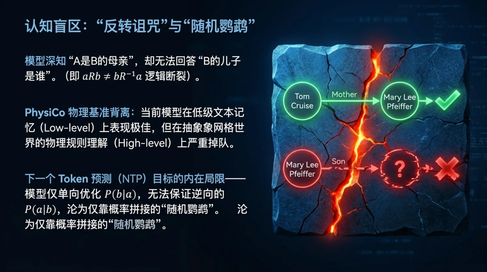

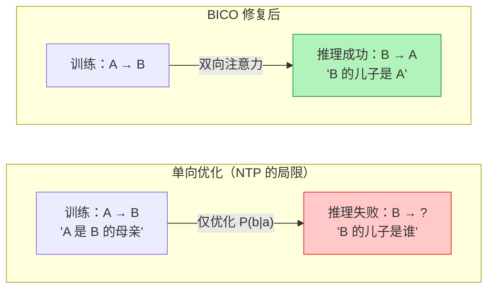

模型在这种情况下沦为**仅靠概率拼接的"随机鹦鹉"**。

### BICO 框架

> 「保持生成能力的同时，反转推理准确率从 0% 跃升至 70%+。」—— P5

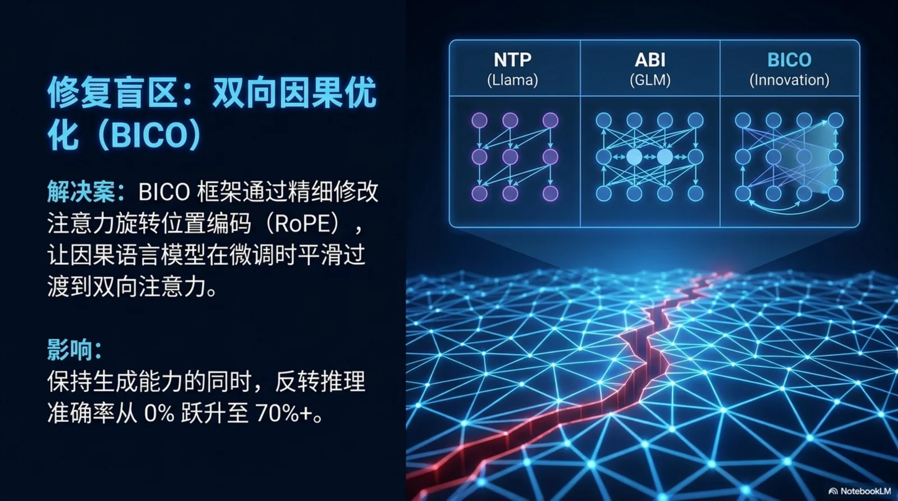

BICO 的解法：
1. 精细修改**注意力旋转位置编码（RoPE）**
2. 让因果语言模型在微调时**平滑过渡到双向注意力**
3. 保留原有的生成能力，同时大幅提升逆向推理准确率

---

## 四、对齐：弹性物理学

> 「逆向对齐（学坏）比正向对齐（学好）阻力更小、更容易触发。」—— P6

### 对齐的"弹性"

参数规模越大、预训练数据越多，模型的"弹性"越强——遇到负面数据微调时，初始性能暴跌极快，但**触底反弹与维持底线的韧性也更强**。

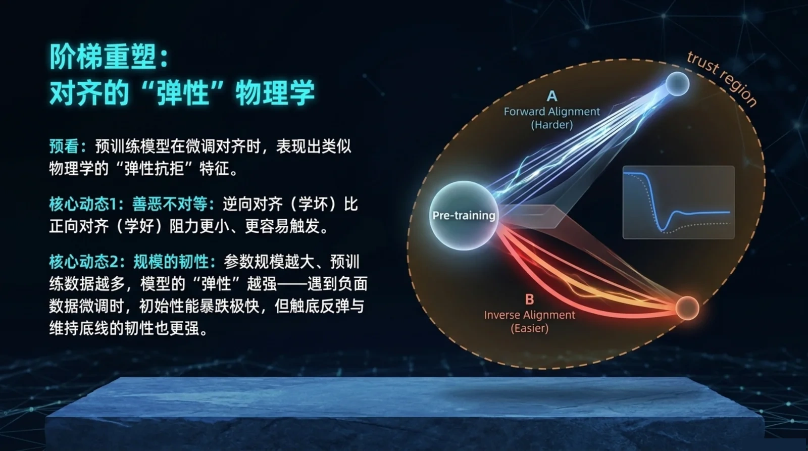

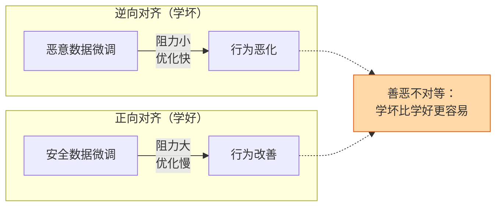

### 全模态对齐

> 「通过合成视觉推理数据与文本渲染数据，强制模型保持跨模态的逻辑一致性。」—— P7

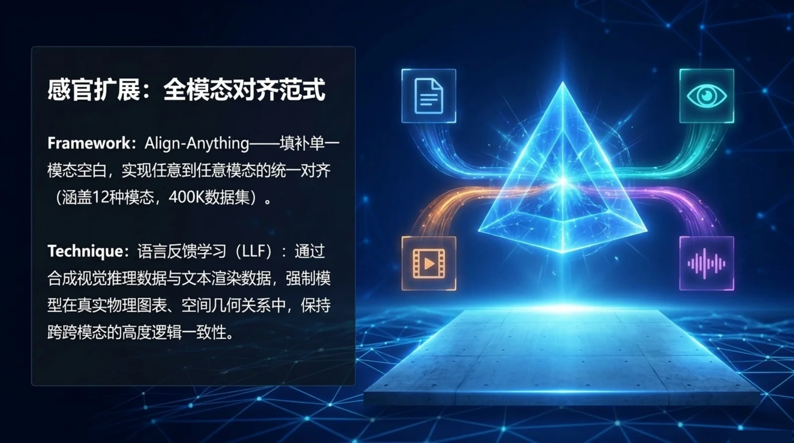

对齐不仅是文本层面的，跨模态的一致性同样关键。全模态对齐确保模型在视觉、文本等不同输入下保持同一套逻辑。

---

## 五、觉醒：System 2 推理

> 「日常闲聊仅需 System 1（直觉快思考）；而攻克复杂数学与代码，亟需 System 2（逻辑慢思考）的接管。」—— P8

### RL 驱动的推理革命

**大规模强化学习（RL）** 驱动的推理，彻底跳出传统 SFT 模板的束缚。仅通过**奖励机制**，激励模型自主探索：

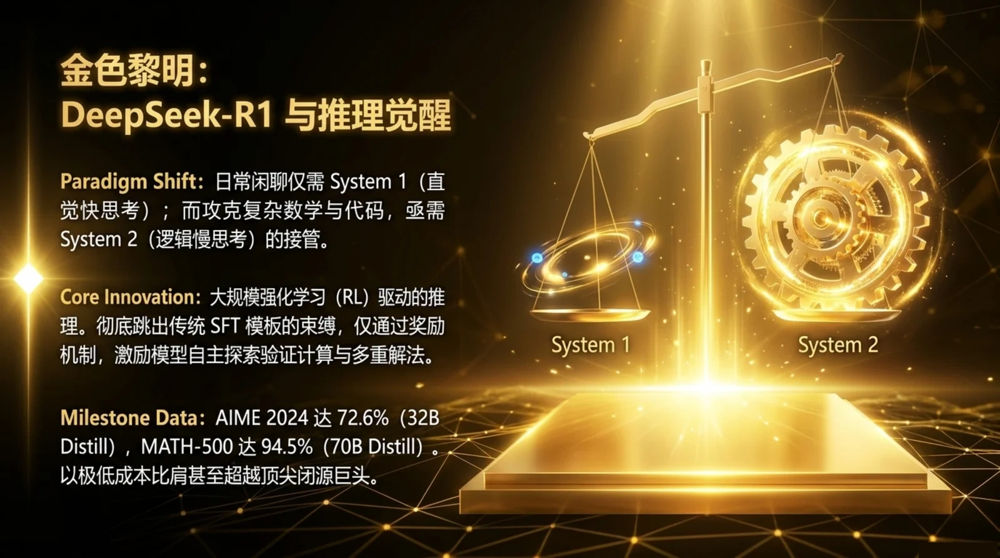

- 验证计算
- 多重解法
- 试错纠偏
- 自我验证

### 顿悟时刻

> 「Wait, that's an aha moment I can flag here.」—— P9，DeepSeek-R1 的顿悟时刻

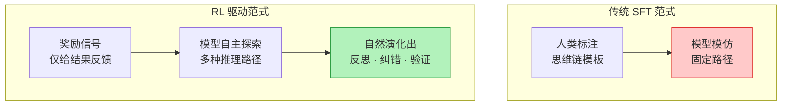

> [!important] 关键含义
> 无需人类硬编码"思维链"模板，模型在 RL 训练中自然演化出试错、纠偏、自我验证的**自我意识级反思行为**。推理能力不是被教出来的，而是从奖励信号中涌现出来的。

### Multi-Token Prediction

> 「Multi-Token Prediction：单次预测多个 Token，强制模型捕获长距离语境依赖。」—— P10

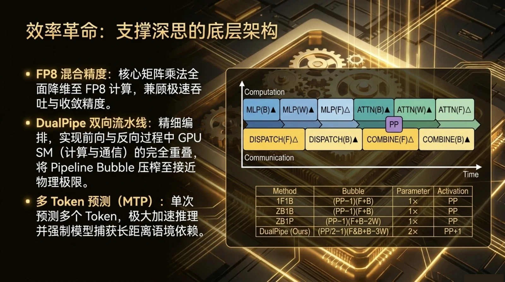

这不仅提升了推理能力，还带来更高效的训练和推理——**单次预测多个 Token**，强制模型看到更远的上下文。

---

## 六、祛魅：涌现的真相

> 「智能没有突变，只有量变到质变的必然。」—— P11

### 涌现是视觉幻象

大模型的"涌现能力"真的是凭空出现的突变吗？

**结论：涌现本质上是由评估指标过于非线性和严苛所导致的视觉幻象。**

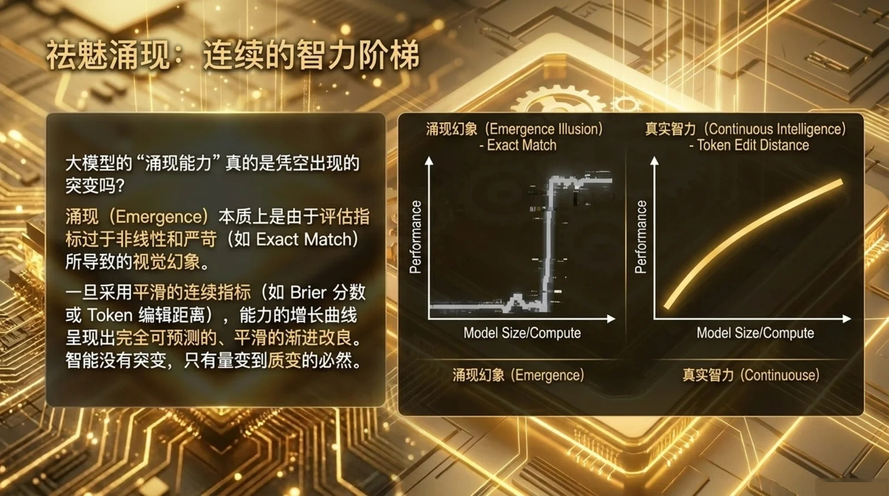

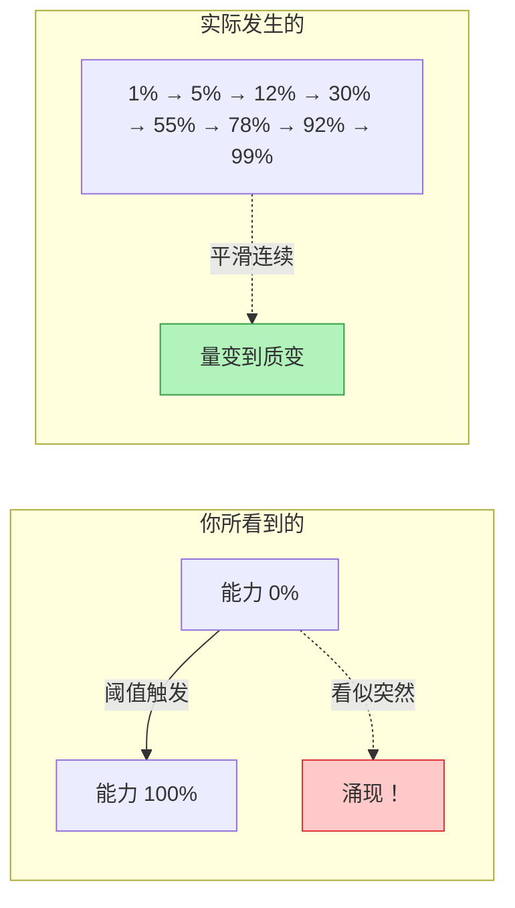

一旦采用平滑的连续指标，能力的增长曲线呈现出**完全可预测的、平滑的渐进改良**。

### 实践的启示

- 不要被"突变的涌现"迷惑——背后是持续的渐进改进
- 评估方式决定你看到的是"突变"还是"渐变"
- 用连续指标（如 Token Edit Distance）代替二分指标（如 Exact Match）

---

## 七、未来：边缘决策与群体智能

> 「未来执行将从'中心化指挥'演进为由 AI 驱动的'群体智能'，单节点具备独立态势感知与多步推理。」—— P12

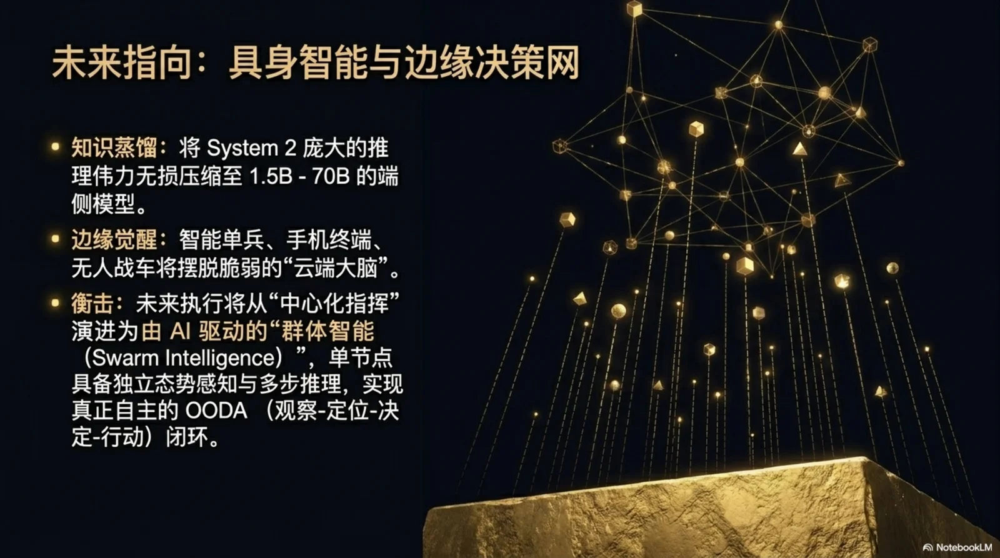

### 推理走向边缘

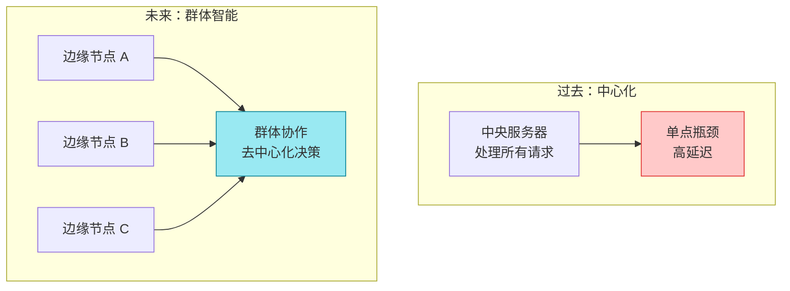

- 每个边缘节点具备**独立态势感知**与**多步推理**能力
- 从中心化指挥到**群体智能**
- 算力与算法的双重极致压榨，将推理能力推向无数个边缘节点

> 「算力与算法的双重极致压榨，正将这股推理伟力推向无数个边缘节点。」—— P13

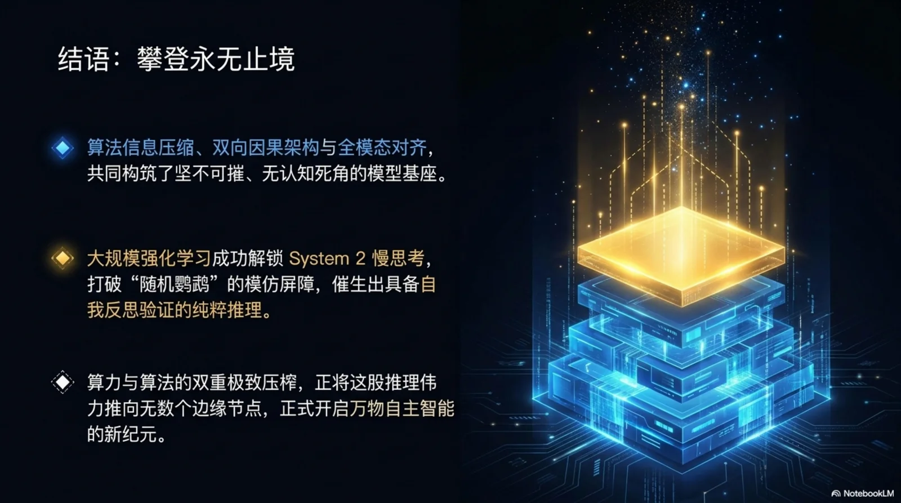

---

## 附录：金句速览

| 页码 | 金句 |
|------|------|
| P2 | "最好的模型，即是用最短代码输出数据的程序" |
| P3 | "无论底层架构如何变迁，模型无损压缩数据的能力越强，其泛化与逻辑理解能力就越高" |
| P4 | "模型仅单向优化 P(b\|a)，无法保证逆向的 P(a\|b)，沦为仅靠概率拼接的'随机鹦鹉'" |
| P5 | "保持生成能力的同时，反转推理准确率从 0% 跃升至 70%+" |
| P6 | "逆向对齐（学坏）比正向对齐（学好）阻力更小" |
| P7 | "通过合成视觉推理数据与文本渲染数据，强制模型保持跨模态的逻辑一致性" |
| P8 | "大规模强化学习驱动的推理，彻底跳出传统 SFT 模板的束缚" |
| P9 | "Wait, that's an aha moment I can flag here." |
| P10 | "Multi-Token Prediction：单次预测多个 Token，强制模型捕获长距离语境依赖" |
| P11 | "智能没有突变，只有量变到质变的必然" |
| P12 | "未来执行将从'中心化指挥'演进为由 AI 驱动的'群体智能'" |
| P13 | "算力与算法的双重极致压榨，正将这股推理伟力推向无数个边缘节点" |

---

## 参考来源

- [[Cognitive_Ascent.pdf]] — 认知之塔：大语言模型的演进与推理觉醒（13 页 PPT）
