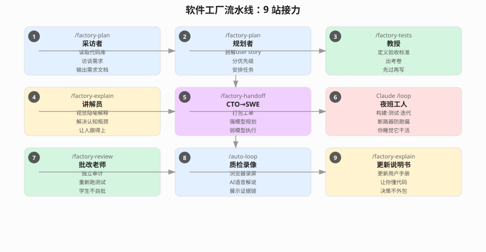

Cursor 和 Claude Code 让写代码变得前所未有的容易。但真正难的问题不是让 AI 写代码——是怎么让 AI 自己管自己。

Mike Fishbein 的一条推文最近在软件工程圈炸了两千多个赞。他说他搭了一套"软件工厂"，一个 Skill 命令就能让整套流水线在他睡觉的时候跑完：从 idea → 需求文档 → 测试用例 → 编码 → 代码审查 → 演示视频，全程无人工干预。

不是那种"写个 prompt 然后盯着看"的半自动。是真正的下班后黑灯工厂。

原文链接：https://x.com/mfishbein/status/2081031938228232360

---

## 核心矛盾：写代码容易了，管代码难了

"Cursor and Claude Code made writing code way easier. The harder problem is building a system that can context engineer and manage itself."

这句话是整个话题的出发点。过去两年，AI 编码工具的能力曲线在指数级攀升，但人类管理 AI 产出能力的曲线几乎是平的。大多数人的日常是：写一个 prompt → 等 AI 生成 → 检查 → 发现问题 → 改 prompt → 循环。效率确实提升了，但你人还是被拴在流水线上。

Fishbein 的目标是：**把"人盯代码"变成"人盯工厂"。**

这背后是一个经典的工程学思路迁移——从解决"怎么写"到解决"怎么组织写"。

---

## 工厂流水线：九个 Skill 的接力赛

整套系统始于一个 `/factory` 命令，它像一个车间主任，记住项目当前在哪个阶段，然后派正确的工人去干活。以下是完整的 9 站流水线：

### 第 1 站：采访者（/factory-plan）

读现有代码库（如果有的话），通过对话从你那里提取缺失的上下文，然后写出一份产品需求文档。这一步解决的是"你已经知道但没说出来的事"——大多数需求文档之所以烂，不是写的人不会写，是提问的人不会问。

### 第 2 站：规划者（/factory-plan）

同一个 Skill，切换到规划模式。把上面那份需求文档拆成小而可测试的特性集和开发任务。和人类 PM 做的一样：拆 user story、分优先级、安排顺序。

### 第 3 站：教授（/factory-tests）

在所有代码开始写之前，先给每个任务出一份"考卷"。这道工序很关键：它把验收标准从"到时候再看"变成了"一次通过的硬约束"。每个任务的成功条件被明确定义，编码 Agent 执行完之后能自己验证——过了就是过了，不过就是不过，不需要人来看一眼然后说"嗯，好像还行"。

### 第 4 站：讲解员（/factory-explain）

用视觉隐喻和图表把整个计划掰开揉碎讲给你听。

这篇推文里藏了一句话值得单独拎出来：**"Now that coding agents can write more code, faster than any human ever could, the new bottleneck is human understanding of the code."** 代码写得再快，如果你看不懂、跟不上、不敢决策，这条流水线的吞吐就被你卡住了。这个 Skill 的存在本身就是承认：AI 越强，人的认知瓶颈越突出。

### 第 5 站：交接单（/factory-handoff）

CTO 把活交给一线工程师前，得有一份完整的工作令。这一步把前面的需求文档、任务拆解、测试用例、安全护栏、终止条件全部打包成一个工单。

重点在这里：前面的规划步骤（1-4）用的都是更强的模型，因为规划和架构需要更强的推理能力。到了执行阶段，Fishbein 把工单交给一个 token 成本更低的模型（他用的 Grok 4.5）来执行。这不只是省钱——这是系统工程里经典的"分而治之"：贵的模型做设计，便宜的模型做施工。

### 第 6 站：夜班工人（Cursor / Claude Code /loop）

挑一个任务，做出来，参加考试，记录结果，如果不通过就迭代，然后下一个任务。

这里挂了两个安全机制：**circuit breakers**（断路器）——如果 Agent 卡住了，停止它继续自信地往错误方向挖坑。想象一下 AI 在一个错误的假设上反复尝试 50 次的场景——有了断路器，它在第 5 次就被拉闸了。

### 第 7 站：批改老师（/factory-review）

"学生不能给自己打分。"一条古老的教育原则被搬到了软件工厂里。一个从未接触过构建过程的崭新 Agent，重新阅读原始计划，重新跑一次测试，找到所有被破坏的地方。

这就是审计——一个人写代码，另一个人 review，问题是 AI 可以同时扮演这两个角色。独立、无偏见、不偷懒的 code review。

### 第 8 站：质检录像（/auto-loom-proof）

用浏览器实际操作，屏幕录制自己执行测试的过程，加上 AI 语音解说（他用的 11labs），解释每一步在证明什么。最后给你发一个带旁白的演示视频。

"这不是测试，这是测试的证明。"你早上醒来看到的不只是一个"测试通过"的报告，而是一个有人（有声音）告诉你"我做了这些操作，每步都对了"的视频。信任的建立方式从读日志变成了看录像。

### 第 9 站：更新说明书（/factory-explain）

工厂更新一份通俗易懂的"用户手册"，解释这次真正构建了什么。"I understand my own codebase, so I can make decisions without becoming the bottleneck or outsourcing my thinking to AI."

这句话把整条流水线的哲学点透了：自动化不是为了让你不用思考，而是为了让你有时间去思考真正重要的事。如果 AI 写完了代码你看不懂，你的决策能力就外包了——这是隐形的权力让渡。

---

## 这背后有一条更重要的规律

Fishbein 在推文末尾补了一段备注，也许比前面的流水线更有价值：

"LLM-as-judge helps, but a judge needs a rubric, examples, and input from someone with subject matter expertise. You still need a human reviewing the work and teaching the system how to perform better."

翻译成人话：**判官需要律法，律法需要人来写。**

AI 可以帮你省掉执行的苦力，可以帮你做审查，但审查标准本身、优劣例子的选取、系统改进的方向——这些归根结底还是人的活。自动化的终极边界不在技术，在于"你愿不愿意花时间去教系统怎么变得更好"。

这条推文底下有个评论家 Simon Corry 说他也干了一样的事——给他的系统取名 Foundry（铸造厂）。"Always find these fascinating to read, everyone's subtle nuances/personalities poking through." —— 每个人的工厂都带着自己的性格。Fishbein 的工厂风格是"放心的夜班工人"，有人可能更"Haeckl"（注释？），有人可能更注重可视化。这套方法论没有一个标准答案，但每个尝试过的人都会告诉你：一旦跑通一次黑灯构建，你就再也回不去了。

---

## 金句收集

> "Cursor and Claude Code made writing code way easier. The harder problem is building a system that can context engineer and manage itself."
> "Now that coding agents can write more code, faster than any human ever could, the new bottleneck is human understanding of the code."
> "The student doesn't grade its own homework."
> "Automation isn't about outsourcing your thinking — it's about freeing your thinking."
